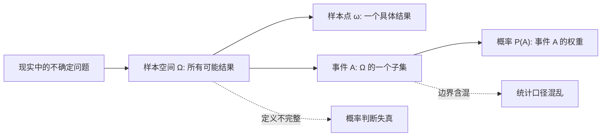
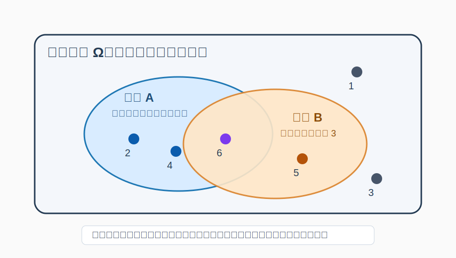
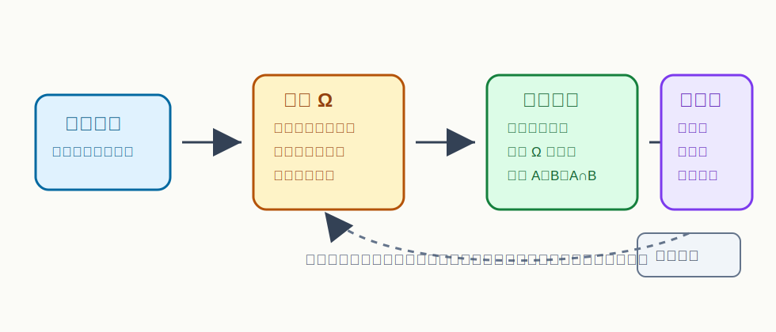

## 数学思维筑基课: 集合、事件、样本空间: 概率思维的三块地基

### 作者
digoal

### 日期
2026-06-02

### 标签
数学思维筑基 , 集合 , 事件 , 样本空间 , 概率思维的三块地基

----

## 背景
   
  
> 面向对象: 大学生及有一定社会阅历的成年人  
> 核心问题: 为什么学概率论前必须先学会把世界拆成“集合、样本空间、事件”？  
> 先说结论: 概率论不是先问“概率是多少”，而是先问“所有可能结果是什么、我关心的是哪一类结果、这些结果的边界是否清楚”。集合提供语言，样本空间规定宇宙，事件把问题变成可计算对象。

## 一张图先看懂







## 求真讲法

### 它到底说了什么

集合是一堆对象组成的整体。概率论里，这些对象通常是“可能发生的结果”。  

样本空间，通常记作 Ω，是一次随机试验中所有可能结果的集合。比如掷一枚普通骰子一次，样本空间可以写成：

```text
Ω = {1, 2, 3, 4, 5, 6}
```

样本点是样本空间里的一个具体结果，比如 `4`。事件是样本空间的一个子集，比如“掷出偶数”这个事件可以写成：

```text
A = {2, 4, 6}
```

所以这三者的关系很简单：

| 名称 | 数学表达 | 直观含义 | 骰子例子 |
|---|---|---|---|
| 样本空间 | Ω | 所有可能结果 | `{1,2,3,4,5,6}` |
| 样本点 | ω ∈ Ω | 一个具体结果 | `4` |
| 事件 | A ⊆ Ω | 一类结果 | `{2,4,6}` |
| 概率 | P(A) | 事件发生的权重 | `P(A)=3/6` |

这不是形式主义。它是在强迫你先把问题边界说清楚。没有样本空间，就没有“全部可能”；没有事件，就没有“我到底在问什么”；没有集合语言，就没有稳定的计算对象。

### 它是怎么来的

现实世界的不确定性很混乱：明天股票涨不涨、项目能不能按期交付、一次体检指标是否异常、一个客户会不会续约。概率论要处理这些问题，第一步不是给一个数字，而是把现实问题翻译成数学对象。

这个翻译过程有三步：

1. 定义一次“试验”或一次观察。
2. 列出这次试验的所有可能结果，形成样本空间 Ω。
3. 把你关心的问题定义成 Ω 里的一个子集，也就是事件。

例如，“这个候选人是否适合岗位”太宽。你需要先定义观察窗口和结果粒度：

```text
Ω = {入职 6 个月后绩效达标, 入职 6 个月后绩效不达标, 未入职}
```

如果你关心“招聘成功”，事件 A 可以定义为：

```text
A = {入职 6 个月后绩效达标}
```

这时你才有资格讨论 `P(A)`。否则所谓“成功率 70%”只是一个没有口径的数字。

### 它依赖哪些假设

集合、事件、样本空间能成立，依赖几个前提：

| 假设 | 含义 | 如果不成立 |
|---|---|---|
| 结果可区分 | 每个结果能被清楚识别 | 事件边界会混乱 |
| 样本空间相对完整 | 重要可能性没有被漏掉 | 概率会被系统性高估或低估 |
| 粒度一致 | 结果不能一半粗一半细 | 计算会重复或遗漏 |
| 观察规则稳定 | 同一类结果按同一标准记录 | 数据无法比较 |
| 事件是 Ω 的子集 | 关心的问题必须落在已定义结果内 | 问题无法计算 |

最容易出错的是“粒度一致”。比如把销售结果写成：

```text
Ω = {成交, 未成交, 大客户成交}
```

这里“大客户成交”其实已经包含在“成交”里，结果之间不是互斥的。后续如果直接相加，就会重复计算。更好的定义是：

```text
Ω = {大客户成交, 小客户成交, 未成交}
```

### 常见误解

第一种误解：事件就是单个结果。  
不一定。单个结果是样本点；事件可以包含一个、多个，甚至零个样本点。“掷出 4”是事件，也是单点事件；“掷出偶数”是包含 3 个样本点的事件。

第二种误解：样本空间是客观唯一的。  
不是。样本空间取决于你要解决的问题。同样是抛硬币，你可以把 Ω 定义为 `{正面, 反面}`，也可以在检查硬币是否立起来时定义为 `{正面, 反面, 立起, 掉出桌外无法观察}`。问题不同，样本空间不同。

第三种误解：先有概率数字，再解释事件。  
顺序反了。严肃的概率判断必须先定义事件。否则“转化率提升了”这种说法可能只是换了分母、筛掉了低质量流量，或者把观察窗口改短了。

## 求存讲法

### 它有什么用

集合、事件、样本空间的真正价值，是让你在不确定世界里先建立“口径纪律”。

在概率论里，它们决定概率能不能被计算。  
在统计学里，它们决定样本来自哪个总体。  
在商业分析里，它们决定指标有没有被偷换。  
在个人决策里，它们决定你有没有把关键失败路径纳入考虑。

很多统计骗局并不发生在公式里，而发生在样本空间和事件定义里。只要口径被动过，后面的平均值、增长率、显著性检验都可能看起来很精确，但精确地错了。

### 它怎么迁移到熟悉领域

看一个投资判断：

```text
“这家公司过去 5 年收入一直增长，所以未来大概率也会增长。”
```

用样本空间思维拆一下：

| 问题 | 应该追问 |
|---|---|
| 试验是什么 | 预测未来一年收入变化，还是未来五年市值变化？ |
| 样本空间是什么 | `{增长, 持平, 下滑}`，还是按增长率区间划分？ |
| 事件是什么 | “增长”是收入增长、利润增长，还是自由现金流增长？ |
| 漏掉了什么 | 增收不增利、政策变化、行业周期、一次性收入 |

这时你会发现，原句里的“增长”不是一个严格事件，而是一个情绪化标签。只有把它改写成“未来 12 个月营业收入同比增长超过 10%”，它才接近一个可讨论的事件。

### 它的适用范围和边界

这套方法适合处理“结果可以枚举或至少可以分类”的问题。掷骰子、用户转化、违约、疾病检测、项目交付、考试通过、客户流失，都可以用这套语言建模。

它的边界在于：现实问题常常不是一次封闭试验。人的行为会反馈，环境会变化，定义会被操纵，样本空间也可能在过程中扩张。比如创业项目的结果不是简单的 `{成功, 失败}`，中间可能有转型、并购、长期存活但低增长、账面成功但创始人出局等状态。

所以成年人使用概率思维时，不是追求一次性定义完美，而是先定义一个足够清楚的 Ω，再持续检查它是否漏掉了关键状态。

### 正例: 怎么用它提升能力

假设你要判断“是否接受一个新岗位”。不要只问“这个机会好不好”，先定义样本空间：

```text
Ω = {
  薪资提升且能力成长,
  薪资提升但能力停滞,
  薪资下降但能力成长,
  薪资下降且能力停滞,
  试用期失败,
  岗位或公司发生重大变化
}
```

然后定义你真正关心的事件：

```text
A = {薪资提升且能力成长, 薪资下降但能力成长}
```

如果你当前阶段最重视长期能力，事件 A 才是“值得接受”的核心。这个定义会逼你寻找证据：直属上级是谁、业务是否增长、团队是否有高手、岗位是否接近核心价值链。你的判断从“感觉不错”变成了“某个事件发生概率是否足够高”。

### 反例: 前提不成立会怎样

一个公司宣称：“我们的培训让学员就业率达到 95%。”

如果样本空间没有定义清楚，这句话可能完全误导：

| 被隐藏的口径 | 可能的问题 |
|---|---|
| 总体是谁 | 是所有报名者，还是完成课程并提交就业信息的人？ |
| 就业事件是什么 | 全职工作、兼职、实习、外包、临时合同是否都算？ |
| 观察窗口多长 | 毕业后 1 个月、3 个月还是 1 年？ |
| 未反馈者如何处理 | 被排除、算未就业，还是默认就业？ |

这里失败的不是计算能力，而是样本空间和事件定义不透明。前提“结果可区分、样本空间完整、事件边界清楚”不成立，所以 `95%` 这个数字不能直接用于决策。

## 思考

概率思维的第一课，其实不是计算，而是命名。你要把混乱的现实切成可讨论的对象。

一个有用的练习是：以后看到任何百分比，都先不要急着信或反驳，而是问三句话：

1. 分母是谁，也就是样本空间或总体是什么？
2. 分子是什么，也就是事件如何定义？
3. 有没有被漏掉、合并、重复计算或排除的结果？

这三问比很多复杂公式更能保护你。因为大部分现实决策中，真正危险的不是不会算概率，而是把一个没定义清楚的问题算得很认真。

## 最后记住

- 集合是概率论的语言；样本空间 Ω 是所有可能结果；事件是 Ω 的子集。
- 概率判断必须先定义事件，再讨论数字。
- 同一个现实问题可以有不同样本空间，关键是服务于你的决策问题。
- 统计骗局常从口径开始：换分母、改事件、漏掉状态、混合粒度。
- 好的概率思维先问边界，再算概率。

## 参考资料

- Andrey Kolmogorov, *Foundations of the Theory of Probability*, 1933。概率公理化体系的经典来源。
- Sheldon Ross, *A First Course in Probability*。关于样本空间、事件和概率模型的标准教材讲法。
- Harvard Stat 110: Introduction to Probability。常用样本空间、事件、条件概率教学框架。
- 本文基于通用概率论教材体系整理，未联网核验具体版本页码。
  
#### [PostgreSQL 解决方案集合](../201706/20170601_02.md "40cff096e9ed7122c512b35d8561d9c8")
  
  
#### [德哥 / digoal's Github - 公益是一辈子的事.](https://github.com/digoal/blog/blob/master/README.md "22709685feb7cab07d30f30387f0a9ae")
  
  
#### [About 德哥](https://github.com/digoal/blog/blob/master/me/readme.md "a37735981e7704886ffd590565582dd0")
  
  

  
