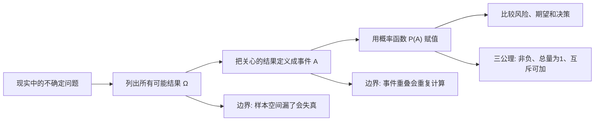
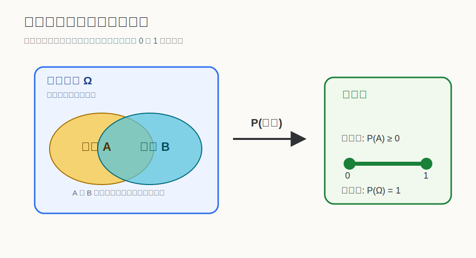
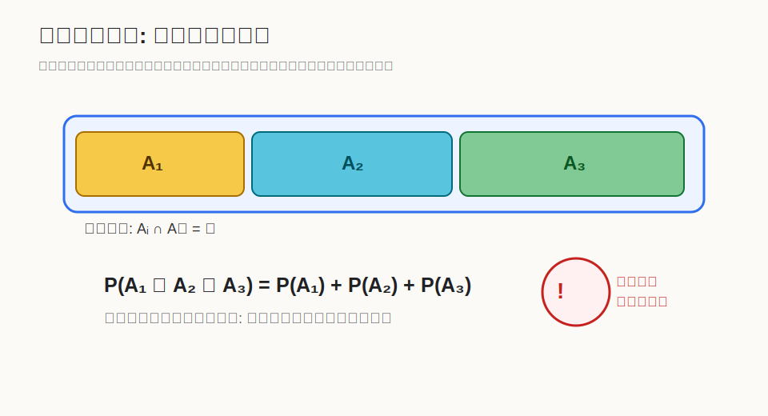

## 数学思维筑基课: 概率三公理: 把不确定性写成一套不会乱账的语言

### 作者
digoal

### 日期
2026-06-02

### 标签
数学思维筑基 , 概率三公理

----

## 背景
   

> 面向对象: 大学生及有一定社会阅历的成年人  
> 核心问题: 为什么概率可以像账本一样精确管理不确定性，而不是停留在“我感觉可能”的模糊判断？  
> 先说结论: 概率三公理不是证明出来的定理，而是 Kolmogorov 概率论选择的地基。它把“事件”变成集合，把“可能性”变成 0 到 1 之间的数，并规定只有互斥事件才能直接相加。

## 写作控制表

| Item | Required content |
|---|---|
| Input type | 公理体系 |
| Chosen version | Kolmogorov 概率论的标准教材版本: 非负性、归一性、可数可加性 |
| Central question | 为什么概率可以成为管理不确定性的精确语言？ |
| Assumptions and boundaries | 样本空间可定义；事件属于同一事件域；总概率可归一；直接相加前必须互斥；概率模型是抽象而不是现实本身 |
| Evidence or derivation route | 公理讲法: 动机 -> 模型解释 -> 边界 -> 替换后会出什么问题 |
| Visual plan | Mermaid 展示从现实问题到概率模型；SVG 展示样本空间到数值映射；第二个 SVG 展示可加性边界；表格展示前提成立与失效 |

## 一张图先看懂

## 求真讲法

### 它到底说了什么

概率三公理的对象不是一句“明天可能下雨”，而是一个概率空间。它通常写成三件东西: 样本空间 Ω、事件集合 F、概率函数 P。

- Ω 是所有可能结果的集合。
- F 是我们允许讨论的事件集合。
- P 是把每个事件 A 映射成一个数字 P(A) 的函数。

Kolmogorov 概率三公理的标准表述是:

1. 非负性: 对任何事件 A，P(A) ≥ 0。
2. 归一性: P(Ω) = 1。
3. 可数可加性: 如果 A₁, A₂, A₃... 两两互斥，那么 P(A₁ ∪ A₂ ∪ A₃ ∪ ...) = P(A₁) + P(A₂) + P(A₃) + ...

这三句话看起来很朴素，但它们把“可能性”从心理感觉改造成了可以计算、可以比较、可以复核的数学对象。

### 它是怎么来的

公理不是从更基础的概率定理里证明出来的。它们更像一套建模契约: 如果我们想让概率这门语言既能描述硬币、骰子、抽样，又能服务保险、金融、医学检测、A/B 测试和机器学习，那么概率至少要满足这些约束。

非负性解决的是“概率不能倒贴”的问题。一个事件的可能性不能是 -0.2，否则比较风险会失去意义。

归一性解决的是“总账必须封顶”的问题。Ω 代表所有可能结果，所以它的概率必须是 1。否则你就不知道一个事件的 0.3 到底是在什么总量下的 0.3。

可数可加性解决的是“拆分后还能对账”的问题。如果三个事故类型互不重叠，那么总事故概率应该等于三个类型概率相加。这个公理让我们能把复杂问题拆成小块，再重新合并。

### 它依赖哪些假设

| 前提 | 成立时 | 不成立时 |
|---|---|---|
| 样本空间可定义 | 可以明确“所有可能结果”是什么 | 漏掉结果会让总概率和后续判断失真 |
| 事件属于同一事件域 | 不同事件可以放在同一个模型里比较 | 把不同口径数据硬放一起，会出现伪精确 |
| 总概率可归一 | P(Ω)=1，概率有统一尺度 | “30%风险”没有清楚分母，无法解释 |
| 直接相加前必须互斥 | 分块统计可以安全合并 | 重叠事件相加会重复计算 |
| 模型是现实的抽象 | 概率能帮助决策，但仍需更新 | 把模型当现实，会忽视新信息和结构变化 |

### 常见误解

第一，把概率当成“主观信心强弱”。主观信念可以用概率表达，但一旦进入概率论，就要接受三公理的约束。否则“我有 120% 把握”只是修辞，不是概率。

第二，以为所有事件都能直接相加。只有互斥事件才能直接相加。一个人“高收入”和“高学历”可能同时发生，把两者概率直接相加会重复计算交集。

第三，以为概率三公理能告诉你真实概率是多少。三公理只规定合法概率模型应该长什么样，不自动给出参数。硬币正面概率是不是 0.5，需要物理假设、数据估计或建模选择。

第四，把“概率很小”理解成“不可能”。三公理允许小概率事件存在。风险管理关心的不是小概率本身，而是小概率乘以巨大损失后的期望后果。

## 求存讲法

### 它有什么用

概率三公理给现代决策一个底层习惯: 先定义问题空间，再定义事件，再给概率，再看能不能相加。

这对现实很重要。很多统计骗局不是公式错，而是账本错: 样本空间换了、事件口径变了、重叠事件被重复相加、把条件概率偷换成无条件概率。

### 它怎么迁移到熟悉领域

在工作里，管理者评估项目延期风险时，不能只说“技术风险 30%、需求风险 40%、人员风险 30%，所以总风险 100%”。这些风险可能重叠: 需求反复会导致技术返工，人员变动也会放大需求沟通成本。三公理提醒你: 先判断是否互斥，再决定能不能加。

在投资里，组合风险也不是把每个资产的风险简单相加。不同资产可能同涨同跌，相关性让事件不再互斥。三公理本身不解决相关性，但它会逼你先问: 我加的到底是互斥损失场景，还是重叠暴露？

在健康检测里，一个阳性结果不是“我一定得病”。你还要知道样本空间、基础患病率、检测灵敏度和误报率。概率三公理是贝叶斯推理的地基，后者才负责把新证据更新进判断。

### 它的适用范围和边界

概率三公理适合处理可以被定义成事件集合的不确定性。它不要求你知道真实概率，但要求你的表达别自相矛盾。

它的边界也清楚: 如果样本空间无法稳定定义，事件口径不断变化，或者你故意把重叠事件当互斥事件处理，那么模型会看起来数学化，实际却是乱账。

### 正例: 怎么用它提升能力

假设你要判断一个新产品本季度能否上线。先定义 Ω: 本季度所有可能结局。再定义互斥事件:

- A: 按时上线。
- B: 延期但核心功能完成。
- C: 延期且核心功能未完成。
- D: 项目取消。

这四类如果定义清楚且互斥，就可以要求团队分别估计概率，并检查 P(A)+P(B)+P(C)+P(D)=1。这个正例成立，是因为它满足“样本空间可定义”“总概率可归一”“直接相加前必须互斥”三个前提。

### 反例: 前提不成立会怎样

某团队汇报项目风险: “技术风险 40%、需求风险 35%、人员风险 30%，总风险 105%，所以项目非常危险。”这个结论可能有直觉价值，但不是一个合法的概率合并。

失败点在于“直接相加前必须互斥”不成立。技术风险、需求风险、人员风险可能同时发生，而且互相诱发。正确做法是把风险场景改写成互斥结果，例如“按时上线、轻微延期、严重延期、取消”，或者明确使用联合概率和条件概率，而不是把重叠标签直接相加。

## 思考

概率三公理最深的价值，不是让人背公式，而是训练一种决策洁癖: 你说的概率，分母是什么？你定义的事件，边界在哪里？你相加的东西，是否互斥？你看到的数字，是现实的测量，还是模型的假设？

一个人成熟的概率思维，往往不是更敢预测，而是更会拆账。他会把“可能成功”改写成样本空间，把“风险很大”改写成损失场景，把“我觉得”改写成可被更新的概率。

反过来，如果一个判断拒绝说明样本空间、事件口径和相加规则，它即使披着数据外衣，也仍然只是情绪表达。

## 最后记住

1. 概率三公理是概率论的地基，不是从概率论内部证明出来的定理。
2. 非负性规定概率不能小于 0，归一性规定全集概率等于 1。
3. 可数可加性只允许互斥事件直接相加。
4. 现实决策中最常见的错误，是样本空间不清、事件重叠、条件偷换。
5. 概率思维的第一步不是算公式，而是把问题定义成一套不会乱账的事件系统。

## 参考资料

- Kolmogorov, A. N. *Foundations of the Theory of Probability*. 1933/1956 English translation. 本文使用其概率公理化思想的标准教材版本，未联网核验原文页码。
- William Feller, *An Introduction to Probability Theory and Its Applications*. 标准概率论教材体系。
- Sheldon Ross, *A First Course in Probability*. 标准概率论教材体系。
- 本文未使用名人轶事或未经核验的概率名言作为证据。
  
#### [PostgreSQL 解决方案集合](../201706/20170601_02.md "40cff096e9ed7122c512b35d8561d9c8")
  
  
#### [德哥 / digoal's Github - 公益是一辈子的事.](https://github.com/digoal/blog/blob/master/README.md "22709685feb7cab07d30f30387f0a9ae")
  
  
#### [About 德哥](https://github.com/digoal/blog/blob/master/me/readme.md "a37735981e7704886ffd590565582dd0")
  
  

  
