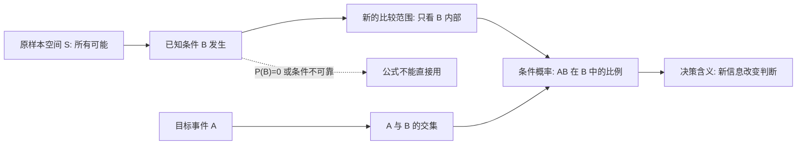
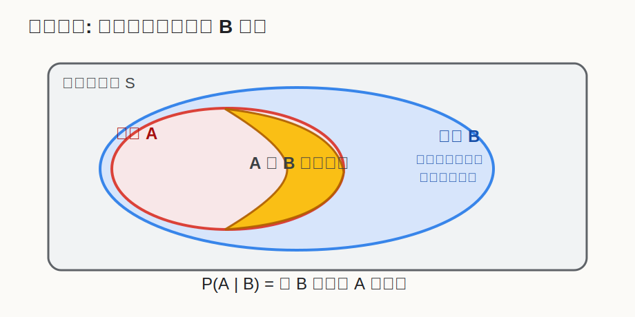
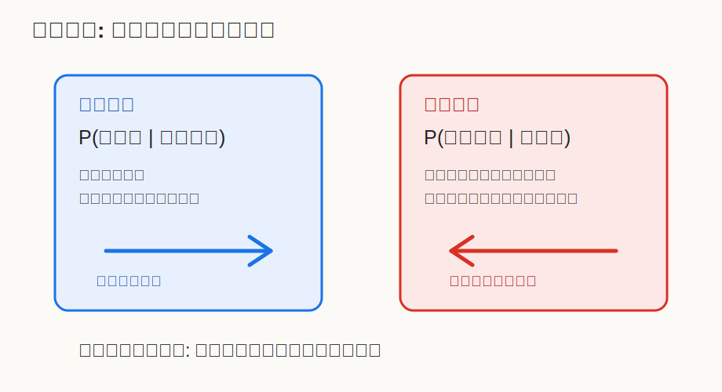

## 数学思维筑基课: 条件概率: 新信息来了, 世界就变小了

### 作者
digoal

### 日期
2026-06-02

### 标签
数学思维筑基 , 条件概率 , 新信息 , 概率变化  

----

## 背景
  

> 面向对象: 大学生及有一定社会阅历的成年人  
> 核心问题: 为什么同一个事件, 在知道不同信息后, 概率必须重新计算?  
> 先说结论: 条件概率不是玄学, 而是把样本空间从“全部可能”缩小到“条件已经发生的那些可能”, 再看目标事件在这个新范围里占多大比例。

## 写作控制表

| Item | Required content |
|---|---|
| Input type | theorem/proposition: 条件概率的标准教材定义 |
| Chosen version | 标准教材版本: 若 P(B) 大于 0, 则 P(A\|B)=P(A 与 B 同时发生)/P(B) |
| Central question | 新证据 B 已经发生时, 我们应该怎样重新判断 A 的可能性? |
| Assumptions and boundaries | 样本空间可定义; 条件 B 的概率大于 0; A 与 B 的含义稳定; 已知条件真实且进入同一模型; 数据频率能代表目标场景 |
| Evidence or derivation route | 样本空间 -> 事件 B 内部的比例 -> A 与 B 的交集 -> 条件概率公式 |
| Visual plan | Mermaid 展示推导路径; SVG 展示样本空间缩小; 第二个 SVG 展示基率误用 |

## 一张图先看懂







## 求真讲法

### 它到底说了什么

条件概率回答的问题是: “在 B 已经发生的前提下, A 发生的概率是多少?”

公式是:

```text
P(A | B) = P(A 与 B 同时发生) / P(B), 其中 P(B) > 0
```

这句话的重点不在公式长什么样, 而在“比较范围变了”。没有条件时, 你在整个样本空间里看 A; 知道 B 发生后, 你不再看所有可能, 只看 B 里面的那些可能。A 在 B 里面占多大, 就是 P(A | B)。

一个职场例子: “某候选人能胜任岗位”的概率, 在你只知道简历时是一种判断; 在你又知道他做过同类项目、通过试用任务、前同事评价稳定之后, 判断范围已经变了。你不是在所有候选人里比较, 而是在“满足这些条件的候选人”里比较。

### 它是怎么来的

条件概率来自一个很朴素的比例想法。

假设一家公司统计过 1000 个销售线索。其中 200 个来自老客户转介绍, 80 个最终成交。如果我们问“一个线索成交的概率”, 是 80/1000。如果我们已经知道“这个线索来自老客户转介绍”, 那比较范围就不能再是 1000 个全部线索, 而是那 200 个转介绍线索。

如果这 200 个转介绍线索里有 50 个成交, 那么:

```text
P(成交 | 老客户转介绍) = 50 / 200 = 25%
```

这里的 50 同时属于“成交”和“老客户转介绍”, 就是 A 与 B 的交集; 200 是条件 B 的总数。于是得到公式:

```text
P(A | B) = P(A 与 B 同时发生) / P(B)
```

它不是另起炉灶的新概率, 而是在 B 内部重新归一化。原来整个世界的概率总和是 1; 条件 B 发生后, B 内部被当作新的“全部世界”, 其内部概率重新加起来等于 1。

### 它依赖哪些假设

| 假设或边界 | 成立时 | 不成立时 |
|---|---|---|
| 样本空间清楚 | 能说清楚所有可能结果和事件 A、B | 讨论会变成口号, 公式没有对象 |
| P(B) 大于 0 | 可以把 B 当成新的比较范围 | 分母为 0, 条件概率无定义 |
| A 和 B 的定义稳定 | “成交”“转介绍”“阳性”等事件可被一致记录 | 指标口径变化会制造假规律 |
| 条件信息真实可靠 | B 的发生能进入判断模型 | 错误条件会把人带进错误样本空间 |
| 样本能代表目标场景 | 频率估计有现实意义 | 老数据、偏样本会让结果失真 |

### 常见误解

第一种误解: 把 P(A | B) 和 P(B | A) 当成一回事。

“有病时检测阳性”和“检测阳性时真的有病”不是同一个问题。前者描述检测工具的灵敏度, 后者描述你拿到检测结果后的真实风险。二者中间隔着一个关键变量: 基率, 也就是这个问题本来有多常见。

第二种误解: 看到一个条件就以为判断一定更准。

条件只有在真实、相关、口径稳定时才有价值。比如招聘时知道一个人“来自名校”可能有信息量, 但如果岗位真正需要的是特定工程经验, 名校条件可能只是弱信号。把弱信号当强条件, 会让判断看起来更数学, 实际更偏。

第三种误解: 用单次结果否定长期条件概率。

条件概率说的是一类情境下的比例, 不是保证某一次一定发生。P(成交 | 老客户转介绍)=25%, 不代表下一个转介绍客户必然成交, 也不代表连续 5 个没成交时这个规律立刻失效。

## 求存讲法

### 它有什么用

条件概率是现代决策的基础动作: 把“我感觉可能”改写成“在什么条件下可能”。它逼迫你把判断拆成三件事:

1. 目标事件是什么?
2. 已知条件是什么?
3. 这个条件如何改变比较范围?

在医学检测、风控、投资、招聘、产品增长、推荐系统、司法证据和日常判断中, 真正有用的不是一句“概率高不高”, 而是“在当前证据下概率高不高”。

### 它怎么迁移到熟悉领域

在学习中, 条件概率提醒你不要问“我能不能学会”, 而要问“在每天有效练习 90 分钟、有人反馈、持续 12 周的条件下, 我学会的概率是多少”。

在投资中, 不要问“这家公司会不会涨”, 而要问“在盈利增长、估值不贵、行业景气、资产负债表健康这些条件同时成立时, 未来收益分布是什么”。

在管理中, 不要问“这个员工靠谱不靠谱”, 而要问“在目标清楚、资源足够、反馈及时、激励一致的条件下, 他稳定交付的概率是多少”。这能防止你把系统问题误判成人的问题。

### 它的适用范围和边界

条件概率适用于条件明确、事件可定义、样本或模型可比较的场景。它不适合被用来包装无法定义的判断, 也不能替代因果分析。

条件概率能告诉你“B 发生时 A 更常见”, 但不能自动证明“B 导致 A”。比如“加班多的团队离职率高”可能成立, 但原因可能是项目混乱、管理差、薪酬不匹配, 不一定是加班本身单独导致离职。条件概率是因果分析的入口, 不是终点。

### 正例: 怎么用它提升能力

正例: 用条件概率改进职业选择。

假设你的目标事件 A 是“三年内收入和能力都明显提升”。你比较两个选择: 一个岗位 title 好听, 但没有强导师、没有真实业务闭环; 另一个岗位 title 普通, 但有高密度项目、强反馈、可复用技能。

条件概率的问法不是“哪个看起来更体面”, 而是:

```text
P(三年后能力跃迁 | 高密度项目 + 强反馈 + 可复用技能)
```

这个正例依赖的假设是: “条件信息真实可靠”和“样本能代表目标场景”。如果你确认这些条件确实存在, 它们会显著缩小比较范围, 让选择从情绪判断变成条件判断。

### 反例: 前提不成立会怎样

反例: 把“成功人士都早起”理解成“早起会让我成功”。

这里偷换了条件方向。你看到的可能是:

```text
P(早起 | 成功人士) 较高
```

但你真正需要的是:

```text
P(成功 | 早起)
```

这两个概率完全不同。反例失败的原因不是“不够努力”, 而是“目标事件和条件事件被反向使用”, 同时“样本空间不清楚”。成功人士早起可能来自工作性质、年龄、健康习惯、组织资源, 甚至只是媒体偏好选择的样本。把它直接迁移到自己身上, 就是在错误条件下做决策。

## 思考

条件概率最深的价值, 是训练一种反本能的思维: 不要急着判断真假, 先问条件。

看到一条新闻说“某类人更容易成功”, 你可以问: 在什么样本里? 成功怎么定义? 条件是不是反过来了? 基率是多少?

看到一个产品数据说“使用某功能的用户留存更高”, 你可以问: 是功能提高了留存, 还是本来更活跃的用户更可能使用该功能?

看到一个人说“我身边很多人都这样”, 你可以问: 你的身边是不是已经是一个被筛选过的条件集合?

条件概率让人谦逊: 我们不是在全知视角下判断世界, 而是在有限条件下更新判断。成熟的概率思维, 不是把话说得更绝对, 而是把条件说得更清楚。

## 最后记住

1. 条件概率的本质是“缩小样本空间后重新计算比例”。
2. P(A | B) 和 P(B | A) 不是一回事, 不能随便倒过来。
3. 条件有用的前提是: 条件真实、相关、定义稳定、样本代表目标场景。
4. 条件概率描述相关结构, 但不能单独证明因果。
5. 好决策不是问“概率是多少”, 而是问“在这些条件成立时, 概率是多少”。

## 参考资料

- 基于通用教材体系整理, 未联网核验具体页码。
- Andrey Kolmogorov, *Foundations of the Theory of Probability*.
- William Feller, *An Introduction to Probability Theory and Its Applications*.
- Sheldon Ross, *A First Course in Probability*.
- David Freedman, Robert Pisani, Roger Purves, *Statistics*.
  
#### [PostgreSQL 解决方案集合](../201706/20170601_02.md "40cff096e9ed7122c512b35d8561d9c8")
  
  
#### [德哥 / digoal's Github - 公益是一辈子的事.](https://github.com/digoal/blog/blob/master/README.md "22709685feb7cab07d30f30387f0a9ae")
  
  
#### [About 德哥](https://github.com/digoal/blog/blob/master/me/readme.md "a37735981e7704886ffd590565582dd0")
  
  

  
