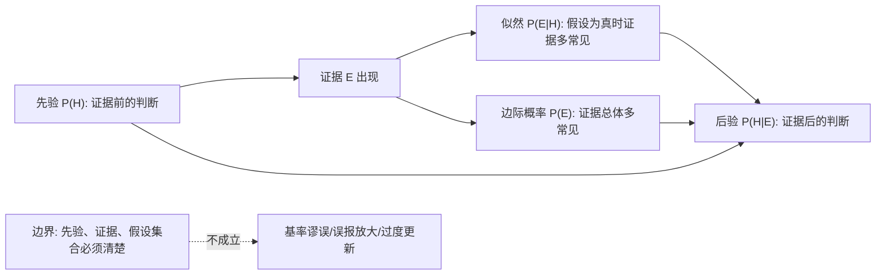
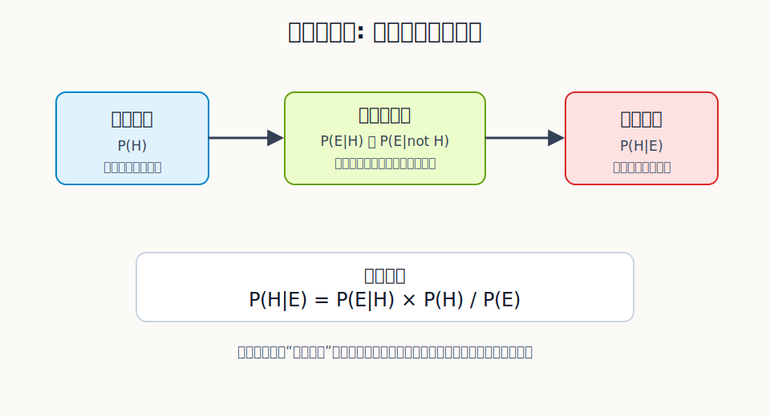
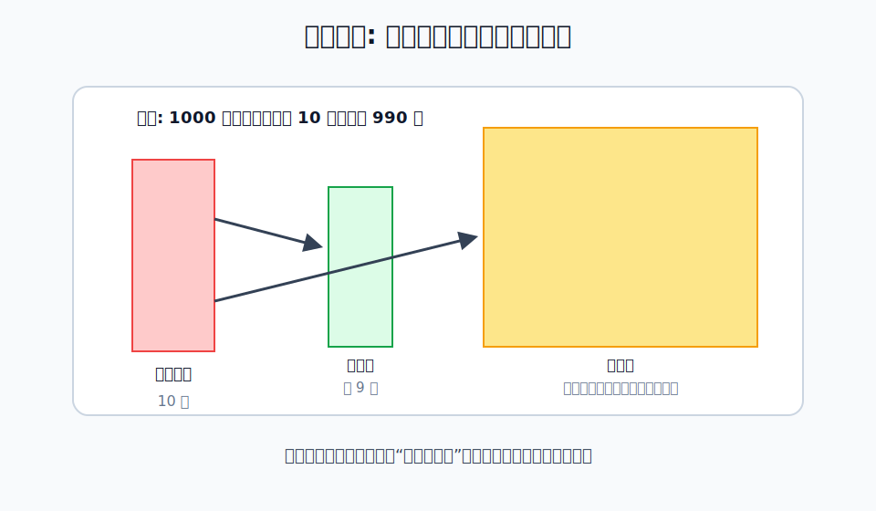

## 数学思维筑基课: 贝叶斯定理

### 作者
digoal

### 日期
2026-06-02

### 标签
数学思维筑基 , 贝叶斯定理  

----

## 背景
  

> 面向对象: 大学生及有一定社会阅历的成年人  
> 核心问题: 新证据出现后，如何理性更新判断，而不是被直觉、新闻标题或单个指标带着走？  
> 先说结论: 贝叶斯定理说的是：一个假设在证据出现后的可信度，等于它原本的可信度，乘上这个证据对它的支持力度，再除以证据本身出现的总体概率。

## 写作控制表

| Item | Required content |
|---|---|
| Input type | 定理/命题 |
| Chosen version | 标准教材版本：对事件或假设 `H` 与证据 `E`，在 `P(E)>0` 时，`P(H|E)=P(E|H)P(H)/P(E)` |
| Central question | 看到新证据后，我应该把原来的判断改到什么程度？ |
| Assumptions and boundaries | 先验可定义、条件概率可估计、证据质量足够、假设集合清楚、模型在观察期内相对稳定 |
| Evidence or derivation route | 条件概率定义 -> 乘法公式 -> 同一联合概率的两种写法 -> 贝叶斯公式 |
| Visual plan | Mermaid 展示推导链；SVG 展示更新机制；第二张 SVG 展示基率忽略造成的误判 |

## 一张图先看懂







## 求真讲法

### 它到底说了什么

贝叶斯定理的标准形式是：

```text
P(H|E) = P(E|H) × P(H) / P(E)
```

这里 `H` 可以理解为一个假设，例如“这个人真的有病”“这个项目会成功”“这家公司财务健康”。`E` 是你观察到的新证据，例如“检测结果阳性”“用户留存上升”“现金流突然恶化”。

四个量分别是：

| 符号 | 中文名 | 直观意思 |
|---|---|---|
| `P(H)` | 先验概率 | 证据出现前，假设本来有多可信 |
| `P(E|H)` | 似然 | 如果假设是真的，这个证据有多容易出现 |
| `P(E)` | 证据的边际概率 | 不管哪个假设真，这个证据总体上有多常见 |
| `P(H|E)` | 后验概率 | 证据出现后，假设现在有多可信 |

它最反直觉的地方是：证据本身不能直接决定结论。你必须同时看“这个证据在假设为真时多常见”和“这个证据在整体世界里多常见”。一个信号如果到处都会出现，就算它看起来很醒目，也未必有很强的判断力。

### 它是怎么来的

贝叶斯定理不是凭空来的，它来自条件概率定义。

条件概率定义：

```text
P(H|E) = P(H and E) / P(E)
P(E|H) = P(H and E) / P(H)
```

第二个式子移项：

```text
P(H and E) = P(E|H) × P(H)
```

代回第一个式子：

```text
P(H|E) = P(E|H) × P(H) / P(E)
```

所以贝叶斯定理的逻辑骨架很朴素：同一件事“假设 H 和证据 E 同时发生”，可以从两个方向描述。一个方向是“先看到证据，再问假设”；另一个方向是“先假设为真，再问证据”。贝叶斯定理把这两个方向接起来。

### 它依赖哪些假设

| 假设/边界 | 成立时 | 不成立时 |
|---|---|---|
| 先验可定义 | 你能把过去经验、基础比例或行业常识放进判断 | 容易把罕见事件看得过高，形成基率谬误 |
| 条件概率可估计 | 你能比较“假设真时证据多常见”和“假设假时证据多常见” | 证据只是情绪刺激，不能稳定更新判断 |
| 证据质量足够 | 新信息能区分不同假设 | 噪声、传闻、选择性样本会导致过度更新 |
| 假设集合清楚 | 你知道自己在比较哪些可能解释 | 漏掉关键假设时，后验概率会被错误归一化 |
| 模型相对稳定 | 过去规律在当前环境仍有参考价值 | 环境突变时，旧先验会拖累判断 |

### 常见误解

第一，贝叶斯定理不是“相信直觉”。先验不是拍脑袋，而是把基础比例、历史数据、机制理解和已知约束显式摆出来。坏先验会带来坏后验。

第二，贝叶斯定理不是“看到证据就大幅改观”。如果一个证据在各种假设下都容易出现，它的信息量很低。例如“某创业公司创始人很努力”并不能显著提高成功概率，因为失败公司里也有大量努力的人。

第三，贝叶斯定理不是“主观主义万能钥匙”。它要求你明确事件、证据、条件概率和比较对象。只说“我感觉概率变高了”，不是贝叶斯更新。

## 求存讲法

### 它有什么用

贝叶斯定理的现实价值，是把“判断”从一句结论变成一个可更新系统：

```text
原判断 + 新证据 × 证据区分度 = 新判断
```

它让你在医疗检测、投资研究、招聘、产品实验、风险管理、舆情判断中避免两个极端：一个极端是死守旧观点，证据来了也不改；另一个极端是被单条新闻、单个指标或单次经历瞬间带跑。

### 它怎么迁移到熟悉领域

在工作中，贝叶斯思维可以用来判断项目风险。假设你认为“这个项目能按期上线”的先验概率是 60%。现在看到证据：核心工程师连续两周没有完成关键模块。你不应该只说“完了”或“没事”，而要问：

| 问题 | 贝叶斯对应量 |
|---|---|
| 原来按期上线的基础概率是多少？ | `P(H)` |
| 如果项目真的会按期上线，这种延迟多常见？ | `P(E|H)` |
| 如果项目不会按期上线，这种延迟多常见？ | `P(E|not H)` |
| 延迟是否由外部依赖、需求变更、人员变动造成？ | 假设集合是否完整 |

如果这种延迟在失败项目中很常见，在成功项目中很少见，你就应该明显下调判断；如果它只是一次外部接口等待，且有明确补救路径，下调幅度就不应过大。

### 它的适用范围和边界

贝叶斯定理适合处理“有不确定性、有证据、有可比较假设”的问题。它不适合替代价值判断。例如“我应该选择稳定工作还是创业”不仅是概率问题，还涉及风险承受力、家庭责任、时间窗口和个人偏好。

它也不适合在证据质量很差时装作精确。很多商业预测看似有百分比，实际只是把不可靠输入包装成数学形式。贝叶斯思维的底线是：不确定就标注不确定，不要用公式给幻觉镀金。

### 正例: 怎么用它提升能力

正例：体检报告显示某项筛查阳性。

假设 `H` 是“真的患病”，证据 `E` 是“检测阳性”。如果这种病在人群中很罕见，即使检测灵敏度和特异度都不错，阳性结果也不等于“基本确诊”。你还要看基础患病率、假阳性率、个人风险因素和复检结果。

这个例子成立的关键假设是“先验可定义”和“证据质量足够”。贝叶斯思维能帮你避免两种错误：看到阳性就恐慌，或者因为自己平时健康就完全忽略检测。

### 反例: 前提不成立会怎样

反例：投资者看到一家公司连续两个季度营收增长，就大幅提高“这是一家长期优秀公司”的判断。

问题不在于营收增长没价值，而在于假设集合和证据质量可能不成立。营收增长可能来自一次性大客户、渠道压货、并购并表、价格上涨、会计口径变化，也可能伴随应收账款恶化和现金流下降。如果投资者只比较“优秀公司会增长”，却不比较“非优秀公司也可能短期增长”，就把低区分度证据当成了高区分度证据。

这个反例失败的边界是“条件概率可估计”和“假设集合清楚”。证据没有被放到竞争假设中比较，就无法完成有效的贝叶斯更新。

## 思考

贝叶斯定理真正训练的不是计算，而是认知纪律。

第一，你愿不愿意承认自己有先验？很多人嘴上说“我只看事实”，实际是把先验藏起来。藏起来的先验更危险，因为它不会被审查。

第二，你能不能区分“让我震惊的证据”和“有区分度的证据”？新闻、短视频、营销话术常常制造前者，但决策需要后者。

第三，你是否允许自己逐步更新，而不是追求一次性正确？现代社会的信息密度太高，真正可靠的人不是永远判断正确的人，而是能在证据变化时有比例地修正判断的人。

## 最后记住

1. 贝叶斯定理回答的是：看到证据后，假设的可信度应该怎么变。
2. 证据不能单独决定结论，必须结合先验和证据在不同假设下的出现概率。
3. 忽略基础比例，会导致基率谬误；迷信单个信号，会导致过度更新。
4. 好的贝叶斯思维不是公式崇拜，而是把先验、证据、假设集合和不确定性说清楚。
5. 在现实决策中，先问“这个证据能排除哪些竞争解释”，再问“我的判断该调多少”。

## 参考资料

- Thomas Bayes, "An Essay towards solving a Problem in the Doctrine of Chances", 1763.
- Pierre-Simon Laplace, probability theory work on inverse probability and Bayesian updating.
- Sheldon Ross, *A First Course in Probability*, standard textbook treatment of conditional probability and Bayes' formula.
- Joseph K. Blitzstein and Jessica Hwang, *Introduction to Probability*, chapters on conditional probability and Bayes' rule.
- 本文未联网核验具体页码；公式、推导和医疗检测示例基于概率论教材中的通用知识体系。
  
#### [PostgreSQL 解决方案集合](../201706/20170601_02.md "40cff096e9ed7122c512b35d8561d9c8")
  
  
#### [德哥 / digoal's Github - 公益是一辈子的事.](https://github.com/digoal/blog/blob/master/README.md "22709685feb7cab07d30f30387f0a9ae")
  
  
#### [About 德哥](https://github.com/digoal/blog/blob/master/me/readme.md "a37735981e7704886ffd590565582dd0")
  
  

  
