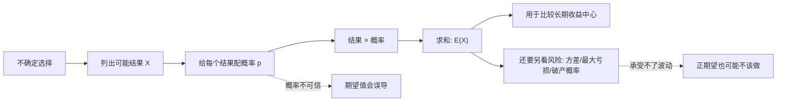
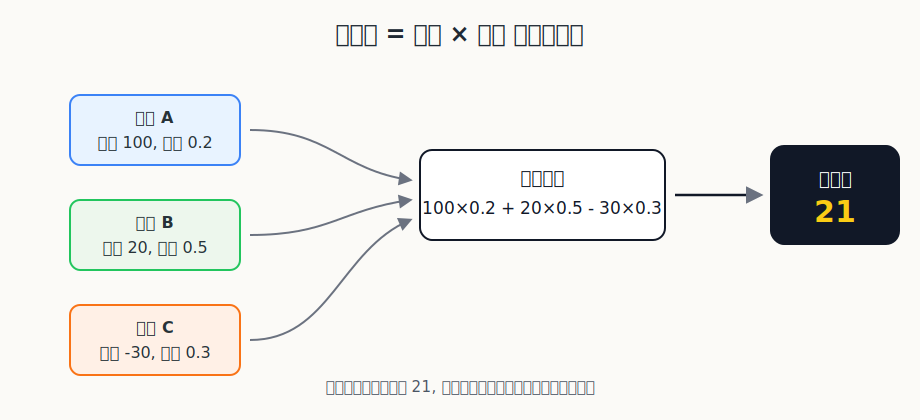
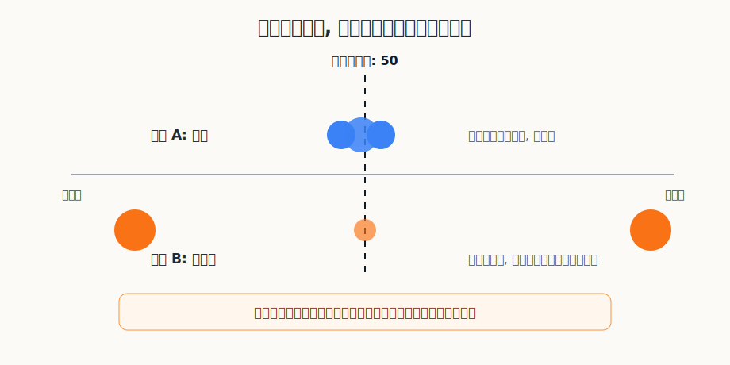

## 数学思维筑基课: 期望值: 不问这次赚多少, 先问长期中心在哪里

### 作者
digoal

### 日期
2026-06-02

### 标签
数学思维筑基 , 期望值 , 单次 , 多次 , 长期中心 , 回归    

----

## 背景
  

> 面向对象: 大学生及有一定社会阅历的成年人  
> 核心问题: 为什么理性决策不能只看最可能发生什么, 而要看所有结果按概率加权后的长期中心?  
> 先说结论: 期望值是随机变量所有可能结果的概率加权平均。它不是“这次最可能得到的结果”, 而是你在大量重复同类决策时会靠近的长期中心。

## 写作控制表

| Item | Required content |
|---|---|
| Input type | theorem/proposition: 概率论中随机变量期望值的标准教材定义 |
| Chosen version | 标准教材版本: 离散情形 E(X)=Σ x_i p_i; 连续情形 E(X)=∫ x f(x) dx, 在绝对可积等条件满足时定义 |
| Central question | 面对收益和损失都不确定的选择时, 应该怎样把“结果大小”和“发生概率”合成一个可比较的数? |
| Assumptions and boundaries | 结果可度量; 概率模型可定义; 概率权重可信; 同类决策可重复或可类比; 决策者能承受波动和尾部风险 |
| Evidence or derivation route | 随机变量 -> 结果与概率配对 -> 加权平均 -> 长期频率直觉 -> 与风险指标分离 |
| Visual plan | Mermaid 展示从不确定结果到决策的推导路径; SVG 展示概率加权平均; 第二个 SVG 展示同样期望下风险分布不同 |

## 一张图先看懂







## 求真讲法

### 它到底说了什么

期望值说的是: 一个不确定结果, 如果把所有可能结果都列出来, 再按各自发生概率加权求平均, 得到的那个数就是它的期望值。

离散情形的公式是:

```text
E(X) = x1×p1 + x2×p2 + ... + xn×pn
```

其中 `X` 是随机变量, `x_i` 是它可能取到的结果, `p_i` 是对应概率。比如一个项目有三种可能:

| 结果 | 收益 | 概率 | 收益×概率 |
|---|---:|---:|---:|
| 大成功 | 100 | 0.2 | 20 |
| 普通成功 | 20 | 0.5 | 10 |
| 失败 | -30 | 0.3 | -9 |
| 合计 |  | 1.0 | 21 |

这个项目的期望收益是 21。注意, 21 不是任何一次实际结果。你这次可能赚 100, 可能赚 20, 也可能亏 30。期望值表达的是: 如果这种结构的项目重复很多次, 每次结果都按这个概率分布出现, 长期平均收益会向 21 靠近。

### 它是怎么来的

期望值来自“加权平均”的思想。

普通平均默认每个结果权重一样。比如三个人收入分别是 10、20、30, 平均数是 `(10+20+30)/3=20`。但随机世界里, 每个结果出现的机会不一样。概率就是权重。

如果一个结果很大但概率很小, 它对期望值有影响, 但不能按“结果很大”单独判断。如果一个结果很小但概率很高, 它对期望值也可能很重要。期望值把两个维度压到同一个问题里:

```text
这个结果有多大? × 它有多可能发生?
```

从大数定律的角度看, 如果你重复做同一种随机试验, 单次结果会波动, 但样本平均会逐渐靠近期望值。这里的直觉不是“世界会补偿你”, 而是“足够多次之后, 各类结果出现的频率会接近其概率, 加权平均会显现出来”。

连续情形下, 结果不再是几个离散点, 而是一个区间上的无穷多可能。此时用概率密度函数 `f(x)` 表示权重, 期望值写成:

```text
E(X) = ∫ x f(x) dx
```

这篇文章不展开测度论细节。对日常决策来说, 先抓住“结果按概率加权”的核心就够了。

### 它依赖哪些假设

| 假设或边界 | 成立时 | 不成立时 |
|---|---|---|
| 结果可度量 | 能把收益、损失、时间、健康风险或机会成本放进同一尺度 | 期望值没有明确计算对象 |
| 概率模型可定义 | 每个结果有概率, 且概率总和为 1 | 讨论会变成感觉判断 |
| 概率权重可信 | 加权平均能代表真实不确定性结构 | 错误概率会制造精确的错觉 |
| 同类决策可重复或可类比 | 长期中心有现实意义 | 一次性不可逆选择不能只看期望 |
| 决策者能承受波动和尾部风险 | 正期望策略可以长期执行 | 还没等到长期优势兑现, 人已经破产或退出 |

### 常见误解

第一种误解: 把期望值当作最可能结果。

彩票的期望收益通常为负, 但最可能结果是“亏掉彩票钱”; 创业项目可能期望为正, 但最可能结果仍可能是失败。期望值是加权平均, 不是众数, 也不是预测下一次会发生什么。

第二种误解: 只要期望值为正就应该做。

如果一个策略 99% 的时候赚 1, 1% 的时候亏 1000, 它的期望值是负的; 这很好判断。但更隐蔽的是: 一个策略期望值为正, 仍可能有巨大尾部风险。比如用高杠杆做投资, 多数时候赚钱, 少数时候爆仓。只看期望值, 会漏掉“能不能活到长期”的问题。

第三种误解: 用单次结果证明期望值错了。

一个正期望决策也会输, 一个负期望决策也会赢。单次结果只能说明这次发生了哪个分支, 不能直接推翻概率结构。真正该复盘的是: 原先列出的结果是否完整? 概率估计是否错了? 风险承受是否被高估了?

## 求存讲法

### 它有什么用

期望值把决策从“我喜欢哪个结果”拉回到“所有结果加权后怎样”。它特别适合处理三类问题:

1. 有收益和损失的不确定选择。
2. 能重复做很多次的策略。
3. 需要比较多个方案长期中心的场景。

比如职业选择、投资组合、产品实验、保险定价、销售线索筛选、时间管理, 都可以用期望值把“大小”和“概率”合起来看。

### 它怎么迁移到熟悉领域

在学习中, 不要只问“这门课有没有用”, 而要问:

```text
E(学习收益) = 能力提升×概率 + 职业机会×概率 + 机会成本×概率
```

一门课可能短期不刺激, 但长期复用概率高, 期望收益就高。相反, 一门课可能看起来热门, 但与你的路径关系弱、实践机会少, 期望收益未必高。

在职业选择中, 不要只看当前薪水。一个岗位可能当前工资高, 但学习曲线平、行业下行、技能不可迁移; 另一个岗位当前工资普通, 但项目密度高、反馈快、能力可迁移。期望值提醒你把“未来结果大小”和“实现概率”一起算。

在投资中, 期望值是最基本的底线语言。一个交易机会不是因为“可能翻倍”就好, 而是要问:

```text
上涨空间×上涨概率 - 下跌损失×下跌概率
```

再进一步, 还要问方差、最大回撤、流动性和仓位。如果一次亏损会让你出局, 那么正期望也不能重仓。

### 它的适用范围和边界

期望值适合比较长期、重复、概率结构相对稳定的选择。它不适合单独处理人格尊严、不可逆健康损伤、法律风险、破产风险和极端尾部风险。

原因很简单: 期望值会把所有结果压成一个平均数, 但人生和组织不是无限可重开的赌场。你可能没有足够多次重复机会, 也可能承受不了一次极端损失。

所以成熟的用法不是“只看期望值”, 而是:

```text
先看期望值, 再看风险分布, 最后看自己能不能承受。
```

### 正例: 怎么用它提升能力

正例: 用期望值选择学习项目。

你有两个选择。A 是追一个短期热点工具, 可能 1 个月后就过时; B 是学概率论和统计学基础, 短期不显眼, 但能长期迁移到投资、产品、管理、实验设计和信息判断。

如果你只看短期爽感, A 更吸引人。如果用期望值看, 你要拆成:

| 维度 | 热点工具 A | 概率统计 B |
|---|---|---|
| 单次收益大小 | 可能较高 | 中等到高 |
| 长期复用概率 | 不稳定 | 高 |
| 迁移范围 | 窄 | 宽 |
| 过时风险 | 高 | 低 |
| 综合期望 | 依赖时机 | 更稳健 |

这个正例依赖的假设是“结果可度量”和“同类决策可类比”。你不是精确算出一个绝对数字, 而是用期望值框架逼自己同时看收益、概率、复用和机会成本。

### 反例: 前提不成立会怎样

反例: 用期望值为高杠杆投资辩护。

某人说: “这个策略长期胜率 60%, 平均赚的时候赚 10%, 亏的时候亏 8%, 所以期望为正, 我应该满仓加杠杆。”

问题不一定出在算式, 而出在边界。这里至少有三个假设可能不成立:

| 失效假设 | 后果 |
|---|---|
| 概率权重可信 | 历史胜率可能来自过拟合, 到新市场环境失效 |
| 同类决策可重复 | 爆仓后没有下一次, 长期优势无法兑现 |
| 能承受波动和尾部风险 | 心理压力和追加保证金会迫使低点退出 |

所以这个反例失败的原因不是“这个人不努力”, 而是把“纸面正期望”误当成“现实可执行”。期望值没有错, 错的是忽略了期望值成立所需的概率、重复性和生存边界。

## 思考

期望值训练的是一种冷静的价值观: 不被单个诱人结果绑架。

看到“最高可赚 100 万”, 你要问概率是多少。看到“只亏一点点”, 你要问亏损会不会频繁发生。看到“某人靠这个成功了”, 你要问没成功的人有多少, 他们有没有进入样本。

它也会改变你对努力的理解。努力不是保证某次成功, 而是提高一系列行动的期望值: 增大好结果的概率, 降低坏结果的概率, 提高好结果的上限, 限制坏结果的下限。

但期望值也提醒人谦逊。不是所有东西都该被平均。对不可逆损伤、道德底线、家庭关系、健康和法律风险, 你不能说“平均下来划算”就去赌。理性不是把世界变成算式, 而是知道算式在哪些地方有效, 哪些地方必须让位于边界。

## 最后记住

1. 期望值是“结果 × 概率”的加权平均。
2. 它表达长期中心, 不预测单次结果。
3. 正期望不等于一定该做, 还要看方差、尾部风险和生存能力。
4. 期望值最适合重复、可比较、概率结构相对稳定的决策。
5. 好决策不是追最大故事, 而是长期做正期望、可承受、可复盘的选择。

## 参考资料

- 基于通用教材体系整理, 未联网核验具体页码。
- Andrey Kolmogorov, *Foundations of the Theory of Probability*.
- William Feller, *An Introduction to Probability Theory and Its Applications*.
- Sheldon Ross, *A First Course in Probability*.
- David Freedman, Robert Pisani, Roger Purves, *Statistics*.
  
#### [PostgreSQL 解决方案集合](../201706/20170601_02.md "40cff096e9ed7122c512b35d8561d9c8")
  
  
#### [德哥 / digoal's Github - 公益是一辈子的事.](https://github.com/digoal/blog/blob/master/README.md "22709685feb7cab07d30f30387f0a9ae")
  
  
#### [About 德哥](https://github.com/digoal/blog/blob/master/me/readme.md "a37735981e7704886ffd590565582dd0")
  
  

  
