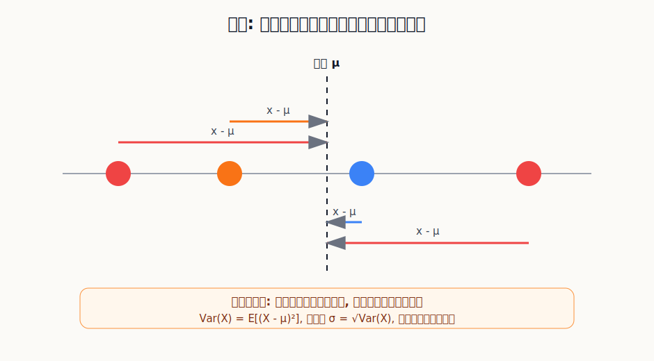
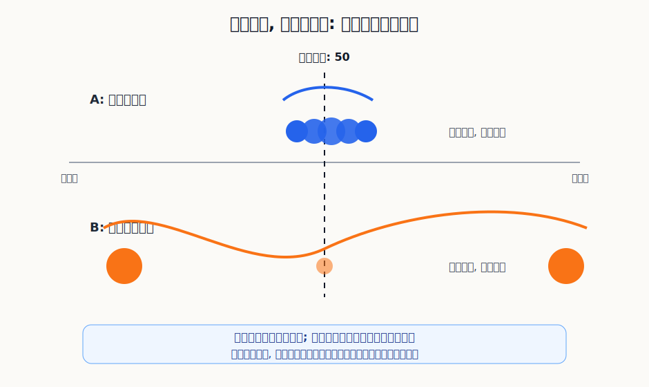

## 数学思维筑基课: 方差与标准差: 不只看平均数, 还要看结果会晃多远

### 作者
digoal

### 日期
2026-06-02

### 标签
数学思维筑基 , 方差 , 标准差 , 异常值 , 抖动情况   

----

## 背景
  

> 面向对象: 大学生及有一定社会阅历的成年人  
> 核心问题: 为什么两个平均收益一样的选择, 真实风险和决策感受可能完全不同?  
> 先说结论: 方差衡量随机结果围绕均值的平均偏离程度, 标准差是方差开平方后回到原单位的波动尺度。均值告诉你中心在哪里, 方差和标准差告诉你结果通常会离中心多远。

## 写作控制表

| Item | Required content |
|---|---|
| Input type | theorem/proposition: 概率统计中方差与标准差的标准教材定义 |
| Chosen version | 标准教材版本: Var(X)=E[(X-μ)²], 其中 μ=E(X); 标准差 σ=√Var(X)。样本方差使用离均差平方和并按 n-1 校正 |
| Central question | 在均值相同或相近时, 应该怎样量化结果的离散程度和风险波动? |
| Assumptions and boundaries | 变量可度量; 均值存在且有意义; 离群值影响可接受; 样本能代表目标总体; 波动可以作为风险代理但不等于全部风险 |
| Evidence or derivation route | 随机变量 -> 均值中心 -> 离均差 -> 平方防抵消并放大大偏差 -> 平均得到方差 -> 开方得到标准差 |
| Visual plan | Mermaid 展示从均值到方差/标准差的推导路径; SVG 展示离均差平方机制; 第二个 SVG 展示同均值不同波动; 表格说明适用与失效边界 |

## 一张图先看懂






## 求真讲法

### 它到底说了什么

方差和标准差解决的是一个平均数解决不了的问题: 结果围绕中心有多分散。

假设两个岗位的年收入均值都是 50 万。A 岗位大多数年份都在 48-52 万之间; B 岗位可能一年 20 万, 也可能一年 100 万。只看均值, 它们一样; 看方差和标准差, 它们完全不同。

对随机变量 `X`, 如果均值是 `μ=E(X)`, 方差定义为:

```text
Var(X) = E[(X - μ)²]
```

标准差定义为:

```text
σ = √Var(X)
```

方差的单位是原变量单位的平方。比如收入用“万元”计, 方差单位就是“万元²”, 不太直观。标准差把方差开平方, 单位回到“万元”, 所以更适合解释和沟通。

### 它是怎么来的

直觉上, 我们想知道每个结果离均值有多远。最直接的想法是算 `X-μ` 的平均值。但这个办法失败了: 高于均值的正偏差和低于均值的负偏差会互相抵消。对任何一组数据, 离均差的平均值通常就是 0。

所以要做两件事。

第一, 把偏差平方:

```text
(X - μ)²
```

平方后, 正偏差和负偏差都变成非负数, 不会互相抵消。同时, 大偏差会被放大。偏离 10 的平方是 100, 偏离 20 的平方是 400, 后者不是前者的 2 倍, 而是 4 倍。这正是方差对极端波动敏感的原因。

第二, 对这些平方偏差求平均:

```text
E[(X - μ)²]
```

这就得到方差。它表达的是: 从长期或总体角度看, 结果围绕均值的平均平方偏离有多大。

在样本统计中, 常见公式是:

```text
s² = Σ(x_i - x̄)² / (n - 1)
```

这里用 `n-1` 而不是 `n`, 是因为样本均值 `x̄` 已经从同一批样本中估计出来, 会让离散程度被低估。`n-1` 是常见的无偏校正。日常理解可以先记住: 总体方差用真实总体均值; 样本方差要考虑“我是在用样本估总体”。

### 它依赖哪些假设

| 假设或边界 | 成立时 | 不成立时 |
|---|---|---|
| 变量可度量 | 收入、收益率、时间、误差、成绩等能计算偏离 | 无法定义“离中心多远” |
| 均值存在且有意义 | 方差围绕一个稳定中心解释波动 | 均值不稳定或不可代表时, 方差解释会失真 |
| 离群值影响可接受 | 方差对极端偏差敏感, 正好揭示高波动 | 单个异常值可能压倒整体结构 |
| 样本能代表目标总体 | 样本标准差能近似真实波动 | 抽样偏差会制造虚假的稳定或虚假的风险 |
| 波动可作为风险代理 | 在投资、质量控制、预测误差中可比较不确定性 | 风险若来自破产、流动性、不可逆损伤, 标准差不够 |

### 常见误解

第一种误解: 方差越小越好。

不一定。对误差、质量、交付时间来说, 方差小通常意味着稳定。但对职业成长、创业、投资等场景, 适度波动可能换来更高上限。关键不是讨厌波动, 而是问: 这个波动是否有补偿? 我是否承受得住?

第二种误解: 标准差就是风险的全部。

标准差衡量的是围绕均值的典型波动, 但它对方向不敏感。向上大幅波动和向下大幅波动都会提高标准差。现实里你通常更怕下行风险、爆仓风险、健康损伤、法律风险和流动性风险。这些不能全部塞进标准差。

第三种误解: 两组数据均值一样, 就代表水平一样。

均值相同只能说明中心相同。一个团队平均交付 10 天, 但有时 3 天、有时 30 天; 另一个团队稳定在 9-11 天。对管理者来说, 后者的可计划性更强。方差和标准差揭示的是“可预测性”。

## 求存讲法

### 它有什么用

方差和标准差让你从“平均会怎样”进入“通常会偏离多远”。它们特别适合三类问题:

1. 比较两个平均结果相近的方案。
2. 判断一个系统是否稳定。
3. 给预测、投资、运营和质量控制设置安全边界。

期望值告诉你长期中心, 方差和标准差告诉你围绕中心的震动幅度。一个成熟决策至少要同时看这两个维度。

### 它怎么迁移到熟悉领域

在职业选择中, 两份工作平均收入相近, 但波动不同。稳定岗位像低标准差资产, 现金流可预测; 销售、创业、投资型收入像高标准差资产, 上限更高, 但需要更强现金储备和心理承受。

在学习中, 标准差可以用来理解表现稳定性。一次考试高分不代表能力稳定, 多次测验的均值和标准差一起看, 才知道你是“稳定掌握”还是“状态波动”。如果均值高但标准差也高, 说明知识结构可能有漏洞。

在投资中, 收益率标准差常被用作波动率。两个策略年化收益都接近 10%, 一个最大波动很小, 另一个经常大涨大跌。后者不一定差, 但它要求更低杠杆、更长持有期、更强回撤承受能力。

### 它的适用范围和边界

| 场景 | 方差/标准差有用在哪里 | 必须补充看的东西 |
|---|---|---|
| 投资收益 | 衡量收益率波动和组合稳定性 | 最大回撤、尾部风险、杠杆、流动性 |
| 工作收入 | 判断现金流稳定程度 | 行业周期、技能成长、失业风险 |
| 产品质量 | 衡量误差和交付稳定性 | 缺陷严重度、客户影响、流程瓶颈 |
| 学习表现 | 区分偶然高分和稳定掌握 | 题型覆盖、知识漏洞、复盘质量 |
| 健康指标 | 观察波动是否异常 | 医学阈值、症状、医生判断 |

标准差适合描述“围绕中心的波动”, 不适合单独描述“最坏会怎样”。如果一个风险是低概率但毁灭性的, 比如爆仓、违法、不可逆健康损伤, 你不能只说“标准差还好”。

### 正例: 怎么用它提升能力

正例: 用标准差管理自己的学习和工作输出。

假设你连续 10 次做数据分析练习, 平均得分 85 分。这个均值不错, 但你还要看标准差。如果 10 次分数都在 82-88 分之间, 说明能力比较稳定。如果分数在 60-100 分之间大幅波动, 平均 85 可能掩盖了结构性短板。

这个正例依赖的假设是“变量可度量”和“样本能代表目标总体”。练习题要覆盖真实能力范围, 评分标准要稳定。满足这些条件时, 标准差能帮你识别: 你需要提高平均水平, 还是先降低波动、补齐短板。

### 反例: 前提不成立会怎样

反例: 用低标准差误判一个投资策略很安全。

某策略过去三年每月收益都很平稳, 标准差很低。于是有人认为它风险很小, 加大杠杆投入。但这个策略的真实结构可能是“多数月份赚小钱, 极端月份亏大钱”, 只是过去三年没有遇到极端环境。

这个反例失败的原因不是计算错了, 而是两个假设不成立:

| 失效假设 | 后果 |
|---|---|
| 样本能代表目标总体 | 三年样本没有覆盖真正的危机场景, 标准差被低估 |
| 波动可作为风险代理 | 策略的核心风险是尾部爆亏和流动性枯竭, 不是日常波动 |

所以, 标准差能告诉你过去样本里的日常波动, 但不能保证未来没有样本外风险。尤其在金融、供应链、公共健康、法律和安全领域, 低波动不等于低风险。

## 思考

方差训练的是一种反平均数崇拜的思维。

现实生活里, 很多话术都喜欢给你一个平均数: 平均收益、平均工资、平均转化率、平均学习时长、平均交付周期。但平均数经常隐藏了真正决定体验的东西: 波动。

一个平均收入很高但极不稳定的人, 需要的生活策略和稳定工资的人不同。一个平均交付很快但波动巨大的团队, 会让上下游难以安排资源。一个平均收益不错但回撤剧烈的投资组合, 可能让持有人在长期优势兑现前就退出。

方差和标准差还提醒你: 稳定本身有价值。不是因为稳定更“保守”, 而是因为稳定降低计划成本、心理成本和破产概率。当然, 稳定也有代价。过度追求低波动, 可能牺牲成长上限和探索机会。

成熟的量化思维不是追求一个数字, 而是同时问三件事:

```text
中心在哪里? 波动多大? 最坏分支我扛得住吗?
```

均值回答第一问, 标准差回答第二问, 但第三问还需要最大亏损、尾部风险、约束条件和人的承受能力。

## 最后记住

1. 方差是离均差平方的平均: `Var(X)=E[(X-μ)²]`。
2. 标准差是方差开平方, 单位回到原变量尺度, 更适合解释波动。
3. 均值相同不代表风险相同; 标准差揭示结果围绕中心的离散程度。
4. 方差对离群值敏感, 这既是优点, 也是使用边界。
5. 标准差是风险代理, 不是风险本身; 遇到尾部风险和不可逆损失时必须补充其他指标。

## 参考资料

- 基于通用教材体系整理, 未联网核验具体页码。
- Andrey Kolmogorov, *Foundations of the Theory of Probability*.
- William Feller, *An Introduction to Probability Theory and Its Applications*.
- Sheldon Ross, *A First Course in Probability*.
- David Freedman, Robert Pisani, Roger Purves, *Statistics*.
  
#### [PostgreSQL 解决方案集合](../201706/20170601_02.md "40cff096e9ed7122c512b35d8561d9c8")
  
  
#### [德哥 / digoal's Github - 公益是一辈子的事.](https://github.com/digoal/blog/blob/master/README.md "22709685feb7cab07d30f30387f0a9ae")
  
  
#### [About 德哥](https://github.com/digoal/blog/blob/master/me/readme.md "a37735981e7704886ffd590565582dd0")
  
  

  
