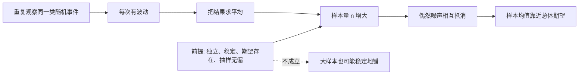
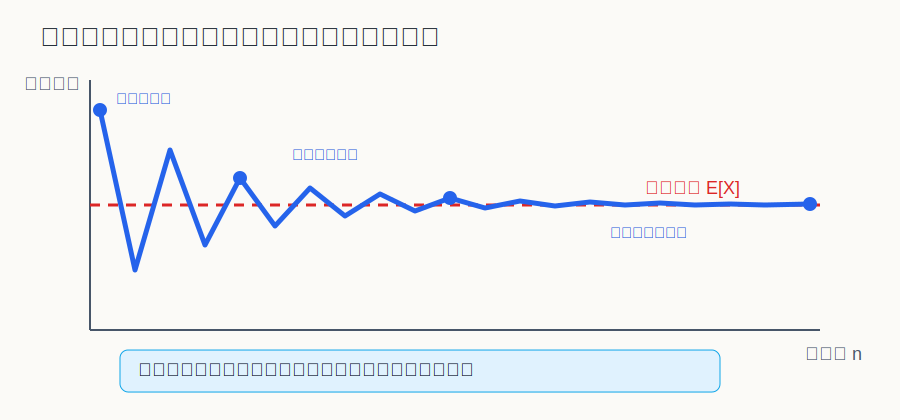
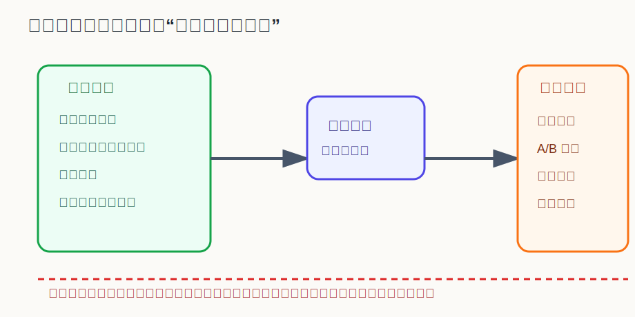

## 数学思维筑基课: 大数定律: 为什么长期平均比单次结果更可靠

### 作者
digoal

### 日期
2026-06-02

### 标签
数学思维筑基 , 大数定律 , 长期平均 , 单次结果  

----

## 背景
  

> 面向对象: 大学生及有一定社会阅历的成年人  
> 核心问题: 为什么一次成败很可能是噪声，但足够多次重复后的平均结果可以支持判断和决策？  
> 先说结论: 大数定律说的是，在满足独立、稳定分布、期望存在等前提时，样本平均值会随着样本量增加而靠近总体期望。它不是“样本多就一定正确”，而是告诉你：只有在前提成立时，长期平均才有资格代表规律。

## 写作控制表

| Item | Required content |
|---|---|
| Input type | theorem/proposition |
| Chosen version | 概率论标准教材版本：独立同分布随机变量且期望存在时，样本均值收敛到总体期望 |
| Central question | 为什么单次结果不可靠，而多次重复后的平均值可以逐渐接近真实水平？ |
| Assumptions and boundaries | 独立性；同分布或稳定机制；期望存在；抽样无系统偏差；样本量足够大但不是万能 |
| Evidence or derivation route | 随机变量定义 -> 期望 -> 样本均值 -> 方差缩小或概率收敛 -> 长期平均靠近期望 |
| Visual plan | Mermaid 展示推导链；SVG 展示样本均值收敛；第二张 SVG 展示适用边界 |

## 一张图先看懂







## 求真讲法

### 它到底说了什么

大数定律研究的是“平均值”的可靠性。

设有一组随机变量 `X1, X2, ..., Xn`，可以理解为你重复观察同一类事件得到的结果。例如连续观察很多次投币、很多个产品缺陷、很多笔交易盈亏、很多名用户转化情况。

如果这些随机变量独立同分布，并且它们有共同的期望 `E[X] = μ`，那么样本均值：

```text
(X1 + X2 + ... + Xn) / n
```

会随着 `n` 增大而越来越接近 `μ`。

这句话的重点不是“每次都会接近真实值”，而是“平均以后，偶然波动被摊薄”。单次结果像一滴水，可能偏热也可能偏冷；长期平均像一桶水，温度更接近整体状态。

### 它是怎么来的

直观推导可以从方差开始。

如果每次观察的结果相互独立，单次结果的方差是 `σ²`，那么 `n` 次结果的样本均值方差大约是：

```text
Var(样本均值) = σ² / n
```

这说明：样本量越大，样本均值的波动越小。单次观察中的随机误差没有消失，但它们在平均时相互抵消了。

严格版本有弱大数定律和强大数定律之分：

| 版本 | 直观意思 | 收敛方式 |
|---|---|---|
| 弱大数定律 | 样本均值偏离期望很多的概率会越来越小 | 依概率收敛 |
| 强大数定律 | 在长期重复中，样本均值几乎必然趋向期望 | 几乎必然收敛 |

对日常决策来说，先掌握弱大数定律已经足够：不要相信少数样本，不要迷信一次成败，长期平均才更接近真实水平。

### 它依赖哪些假设

| 假设 | 成立时 | 不成立时 |
|---|---|---|
| 独立性 | 噪声可以相互抵消 | 结果强相关时，很多样本可能只是同一个原因的重复放大 |
| 同分布或机制稳定 | 每次观察来自同一套概率机制 | 环境变了，旧数据平均值不能代表新环境 |
| 期望存在 | “长期平均”有明确目标 | 极端重尾场景下，平均值可能长期不稳定 |
| 抽样无系统偏差 | 样本均值能代表总体 | 样本越多，只会越精确地代表错误人群 |
| 样本量足够 | 偶然误差被摊薄 | 小样本仍可能被运气主导 |

### 常见误解

第一，把大数定律理解成“赌久了必然回本”。这是典型误读。大数定律说样本均值靠近期望。如果一个游戏的期望是负的，玩得越久，平均结果越稳定地靠近负收益。

第二，把它理解成“样本大就可信”。如果抽样有偏，比如只调查某个高消费社区来估计全国收入，大样本不会纠正偏差，只会让错误更有迷惑性。

第三，把它理解成“未来会补偿过去”。连续抛硬币出现多次正面，不代表下一次反面概率变大。大数定律约束的是长期平均，不是单次事件的补偿机制。

## 求存讲法

### 它有什么用

大数定律的现实价值，是把“看结果”升级成“看长期平均和前提条件”。

保险公司不是靠预测某个人什么时候生病赚钱，而是靠大量相似风险的平均规律定价。工厂不是因为抽检一个产品合格就放心，而是通过足够样本估计整体缺陷率。平台做 A/B 测试，也不是看前十个用户的反应，而是等样本量足够后比较平均转化率。

它让你知道：单次结果只能讲故事，重复样本才能估计机制。

### 它怎么迁移到熟悉领域

在学习中，一次考试不能完全代表能力，但一段时间内多次练习的平均表现更接近真实水平。

在工作中，一次项目成功可能有运气成分，但持续交付质量体现流程和能力。

在投资中，一笔交易盈利不说明策略有效，长期交易的期望收益和回撤才说明策略质量。

在管理中，一个员工一次失误不该被无限放大，但长期稳定的行为模式需要被认真对待。

### 它的适用范围和边界

大数定律适合处理“同一类、可重复、有稳定机制”的问题。

它不适合直接处理完全不可重复的历史事件，也不适合机制快速变化的环境。例如，一个行业政策突然改变，过去十年的平均利润率可能无法预测未来。再如，一个社交平台算法调整后，旧流量数据的平均转化率可能失效。

还要警惕重尾分布。在财富、流量、创业回报、极端灾害等场景中，少数极端值可能支配平均值。此时只看均值会遮蔽风险，需要同时看中位数、分位数、最大回撤和尾部风险。

### 正例: 怎么用它提升能力

假设你在做一个副业项目，连续 5 天收入分别是 0、300、0、1200、50 元。你不能因为第 4 天赚了 1200 元就判断模式已经成功，也不能因为第 1 天为 0 就放弃。

正确做法是先确认前提：

| 前提 | 对应检查 |
|---|---|
| 机制稳定 | 这几天获客渠道、价格、产品是否一致？ |
| 样本足够 | 5 天是否太短？是否需要 30 天或 100 个订单？ |
| 抽样无偏 | 是否刚好赶上促销、节假日或熟人支持？ |
| 期望可估 | 是否记录了收入、成本、时间投入和失败订单？ |

如果这些前提逐步成立，你就可以用长期平均收入、平均成本和平均转化率判断项目，而不是被某一天的峰值或低谷牵着走。

这个正例成立，是因为它把“大数定律”的前提显性化了：同一套机制、足够重复、记录完整、用平均值看长期。

### 反例: 前提不成立会怎样

假设一个公司想评估员工满意度，只在总部管理层会议后发问卷，收到了 1000 份反馈。样本量很大，但结论仍可能错。

原因不是“大数定律失效”，而是前提不成立：抽样有系统偏差，样本主要来自管理层和愿意表达的人，不能代表一线员工、远程员工、离职边缘员工。

这类错误很危险，因为“大样本”会制造可靠感。事实上，它只是更稳定地测量了一个偏样本。

所以，统计骗局常常不是数学公式错，而是前提被藏起来了。

## 思考

大数定律给现代人的一个重要提醒是：不要用故事替代样本，也不要用样本量掩盖偏差。

它训练的是一种朴素但强大的判断习惯：每当你看到一个结论，先问四件事：

1. 这是单次结果，还是长期平均？
2. 样本来自同一套稳定机制吗？
3. 样本是否独立，还是被同一个因素驱动？
4. 抽样是否代表你真正关心的总体？

如果这四个问题答不清楚，数字越精确，越可能只是精确的幻觉。

## 最后记住

1. 大数定律说的是样本均值在前提成立时靠近总体期望。
2. 它削弱的是偶然波动，不会自动消除系统偏差。
3. 负期望游戏玩得越久，平均结果越稳定地变差。
4. 大样本必须配合正确抽样、稳定机制和可定义期望。
5. 日常决策中，少看单次成败，多看长期平均、波动和边界。

## 参考资料

- 基于概率论标准教材体系的通用知识整理，未联网核验具体教材页码。
- 常见教材主题包括：Kolmogorov 概率公理、随机变量、期望、方差、弱大数定律、强大数定律。
- 本文没有使用名人引语或历史轶事作为证据。
  
#### [PostgreSQL 解决方案集合](../201706/20170601_02.md "40cff096e9ed7122c512b35d8561d9c8")
  
  
#### [德哥 / digoal's Github - 公益是一辈子的事.](https://github.com/digoal/blog/blob/master/README.md "22709685feb7cab07d30f30387f0a9ae")
  
  
#### [About 德哥](https://github.com/digoal/blog/blob/master/me/readme.md "a37735981e7704886ffd590565582dd0")
  
  

  
