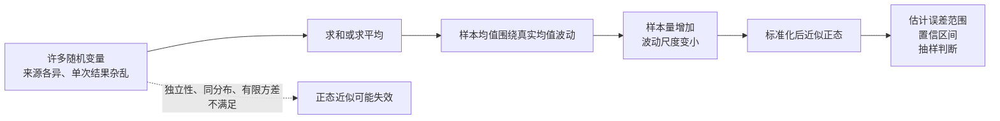
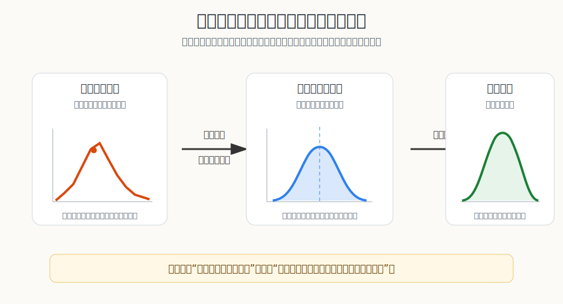
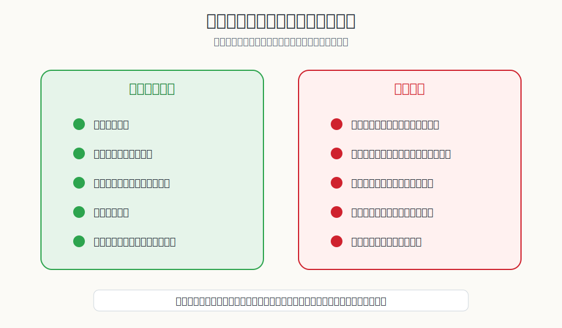

## 数学思维筑基课: 中心极限定理: 为什么平均值会变得可预测

### 作者
digoal

### 日期
2026-06-02

### 标签
数学思维筑基 , 中心极限定理 , 长期平均 , 单次结果  

----

## 背景
  

> 面向对象: 大学生及有一定社会阅历的成年人
> 核心问题: 为什么现实世界里很多杂乱数据的“平均值”可以用正态分布近似，但这件事又不能被滥用？
> 先说结论: 中心极限定理说的是，在一组常见条件下，许多独立随机变量的和或平均值，经过标准化后会接近正态分布。它解释的不是“万物都正态”，而是“平均值的误差常常近似正态”。

## 写作控制表

| Item | Required content |
|---|---|
| Input type | theorem/proposition |
| Chosen version | 标准教材版：独立同分布随机变量，均值和方差有限时，样本均值标准化后收敛到标准正态分布 |
| Central question | 为什么很多非正态的个体数据，一旦取平均，就能用正态分布来估计不确定性？ |
| Assumptions and boundaries | 独立性：成立时误差能相互抵消，不成立时相关冲击会放大；同分布或足够同质：成立时每次抽样来自同一机制，不成立时混合机制会扭曲结论；有限方差：成立时波动有稳定尺度，不成立时极端值可能主宰总和；样本量足够大：成立时近似较可靠，不成立时正态近似可能粗糙；目标是和或平均值：成立时定理适用，不成立时不能直接推出个体分布正态 |
| Evidence or derivation route | 随机变量定义 -> 样本和与样本均值 -> 标准化 -> 收敛到标准正态分布 |
| Visual plan | Mermaid 说明从个体变量到样本均值再到决策的路径；SVG 1 说明收敛机制；SVG 2 说明适用边界；表格对比正确使用与误用 |

## 一张图先看懂







## 求真讲法

### 它到底说了什么

中心极限定理的常见版本可以这样说：

假设有一批独立同分布的随机变量，每个变量都有相同的均值和有限方差。把它们加起来，或者求平均。随着样本量变大，这个“和”或“平均值”经过标准化后，会越来越接近标准正态分布。

用符号写，就是如果 \(X_1, X_2, ..., X_n\) 独立同分布，均值为 \(\mu\)，方差为 \(\sigma^2\)，那么：

\[
\frac{\bar X_n-\mu}{\sigma/\sqrt n} \Rightarrow N(0,1)
\]

这里的 \(\bar X_n\) 是样本平均值，\(\sigma/\sqrt n\) 叫标准误。箭头表示“分布收敛”，不是每一个样本值都等于正态分布。

这句话最容易被误读。中心极限定理不是说原始数据一定是正态分布。一个人的收入、一次交易收益、一个短视频播放量，都可能非常偏斜。它说的是，当你反复抽样并计算平均值时，这些平均值的分布常常接近正态。

### 它是怎么来的

直观理解是：很多小的、相对独立的影响叠加时，单个影响的特殊形状会被平均掉，只剩下整体波动的尺度。

比如一个班级的平均成绩受很多因素影响：学生基础、题目难度、复习时间、考试状态、评分误差。单个学生的成绩分布未必正态，但如果你不断从同一类学生中抽样，每次计算一组人的平均分，这些“平均分”会围绕真实平均水平上下波动。样本量越大，波动越窄。

严格证明通常使用特征函数、矩母函数或更一般的概率收敛工具。成人学习不必先追完整证明，但要抓住推导骨架：

1. 定义随机变量的和：\(S_n=X_1+\cdots+X_n\)。
2. 它的均值是 \(n\mu\)，方差是 \(n\sigma^2\)。
3. 为了比较不同样本量，要减去均值、除以标准差。
4. 标准化后的总和在分布上趋近 \(N(0,1)\)。

这条定理的力量来自“形状被洗掉，尺度被保留”：原始分布的细节不再那么重要，但均值和方差仍然决定中心和宽度。

### 它依赖哪些假设

| 假设 | 成立时 | 不成立时 |
|---|---|---|
| 独立性 | 每次抽样的误差可以相互抵消 | 样本互相影响，误差可能同向放大 |
| 同分布或机制稳定 | 样本来自同一生成机制 | 新旧样本混在一起，平均值代表性下降 |
| 方差有限 | 波动有稳定尺度，标准误有意义 | 厚尾极端值可能主宰结果 |
| 样本量足够大 | 正态近似更可靠 | 小样本下形状仍可能偏斜 |
| 研究对象是和、均值或比例 | 能用中心极限定理估计抽样误差 | 不能推出个体结果一定服从正态 |

### 常见误解

第一，误以为“只要样本量大，所有数据都会正态”。错。大的是样本均值的分布趋近正态，不是原始个体分布自动变成正态。

第二，误以为“大数定律”和“中心极限定理”是同一件事。大数定律说样本平均值会靠近真实均值；中心极限定理进一步说，靠近时的误差形状常常近似正态。前者回答“会不会靠近”，后者回答“误差怎么分布”。

第三，误以为相关样本也能放心套用。比如金融市场里的资产价格、社交网络里的转发、同一公司员工的满意度调查，都可能存在强相关。相关性会让有效样本量小于表面样本量。

第四，误以为置信区间是“真值有 95% 概率在这个区间里”。在频率学派解释下，更准确的说法是：如果重复使用同一种抽样和构造区间的方法，长期看约 95% 的区间会覆盖真值。

## 求存讲法

### 它有什么用

中心极限定理是现代统计推断的发动机。它让人们可以用样本平均值估计总体平均值，并给出误差范围。

你在现实中看到的很多判断，都靠它的影子运行：

- 民调用样本比例估计总体支持率。
- A/B 测试用用户样本估计新功能的平均效果。
- 工厂用抽检样本估计产品误差。
- 医学研究用样本均值比较治疗组和对照组。
- 财务和运营用历史样本估计平均成本、平均转化率、平均等待时间。

它真正教给现代人的不是一个公式，而是一种态度：不要只报一个平均值，还要报告这个平均值有多不确定。

### 它怎么迁移到熟悉领域

在学习和工作中，中心极限定理能帮你识别两类话术。

第一类是“凭几个例子下结论”。有人说某个课程没用，因为他认识三个人学了没涨薪。这里的问题是样本量小，而且样本可能不独立、不代表总体。中心极限定理提醒你：平均效果要靠足够样本估计，单个故事不能代替分布。

第二类是“只报平均值不报波动”。比如一个投资策略说历史平均年化收益 12%。如果不告诉你方差、最大回撤、样本期间和极端年份，这个平均值无法支持决策。中心极限定理提醒你：均值必须和标准误、置信区间、样本条件一起看。

### 它的适用范围和边界


| 场景 | 能不能直接用正态近似 | 关键判断 |
|---|---|---|
| 大量独立用户的平均点击率 | 通常可以谨慎使用 | 用户是否真的近似独立 |
| 一个班级的平均考试分 | 可以作为近似 | 班级是否来自同一教学环境 |
| 投资组合日收益 | 要非常谨慎 | 厚尾、相关性、极端事件会破坏近似 |
| 社交媒体爆款播放量 | 通常不能简单套用 | 幂律分布和网络传播会产生极端值 |
| 小样本面试反馈 | 不宜套用 | 样本少且主观偏差强 |

边界的核心是：中心极限定理偏爱“许多独立小影响的平均”。它不擅长处理“少数极端值决定结果”的厚尾世界。

### 正例: 怎么用它提升能力

假设你负责一个产品功能的 A/B 测试，想判断新版本是否提高了用户平均停留时长。

正确做法不是看第一天的几个用户，也不是只看一个平均值，而是：

1. 确认用户分组近似随机，保护独立性假设。
2. 收集足够样本，降低标准误。
3. 比较新旧版本平均值，同时计算置信区间。
4. 检查异常用户是否主宰结果，避免有限方差假设被厚尾破坏。
5. 把结论写成“在当前样本和假设下，新版本平均停留时长提升约多少，误差范围是多少”。

这个正例成立，是因为它尽量满足了独立性、机制稳定、样本量足够、目标是平均效果这些假设。

### 反例: 前提不成立会怎样

假设一个人用过去 20 次短线交易的平均收益，推断自己已经有稳定盈利能力。

这个推断很危险。第一，20 次样本太小，正态近似粗糙。第二，交易结果可能不独立：市场风格、流动性和情绪会让连续交易同涨同跌。第三，收益分布可能厚尾，一次极端亏损就能抹掉很多次小盈利。

这个反例失败，不是因为这个人“不努力”，而是因为中心极限定理依赖的样本量、独立性和有限方差边界都很弱。把这种小样本平均值当成稳定能力，是统计幻觉。

## 思考

中心极限定理最深的启发是：理性不是消灭不确定性，而是知道什么时候不确定性能被量化，什么时候不能。

它也让人看到现代社会的一个分工：个体故事负责提供线索，统计规律负责约束判断。一个故事可以让你提出假设，但不能单独证明平均效果。一个平均值可以帮你估计趋势，但不能替代对极端风险和机制变化的检查。

反事实地想，如果没有中心极限定理，统计学会失去很多低成本推断工具。我们仍然能收集数据，但很难用样本平均值系统地给出误差范围。民调、质量控制、实验设计、医学试验和很多商业分析都会变得更笨重。

对个人决策而言，中心极限定理给出一个朴素但强硬的要求：当你听到一个平均值时，至少追问五件事：

```text
样本从哪里来？
样本之间独立吗？
样本量有多大？
极端值会不会主宰结果？
这个平均值的误差范围是多少？
```

能问出这五个问题，你就已经比很多“看起来很数据化”的判断更接近真相。

## 最后记住

1. 中心极限定理说的是样本和或样本均值的标准化分布趋近正态，不是原始数据一定正态。
2. 它依赖独立性、机制稳定、有限方差、足够样本量和“研究平均值”这些条件。
3. 大数定律告诉你平均值会靠近真值，中心极限定理告诉你误差大致怎么分布。
4. 现实使用时，不要只看平均值，还要看标准误、置信区间、样本来源和极端值。
5. 在厚尾、强相关、结构突变和小样本场景里，中心极限定理容易被滥用。

## 参考资料

- William Feller, *An Introduction to Probability Theory and Its Applications*, Vol. 1. 经典概率论教材。
- Patrick Billingsley, *Probability and Measure*. 概率论严谨教材，包含收敛与极限定理框架。
- Wasserman, *All of Statistics*. 统计推断入门教材，解释中心极限定理在统计中的作用。
- Sheldon Ross, *A First Course in Probability*. 概率论基础教材。
- 本文未联网核验具体页码；定理表述基于通用概率论与统计学教材体系。
  
#### [PostgreSQL 解决方案集合](../201706/20170601_02.md "40cff096e9ed7122c512b35d8561d9c8")
  
  
#### [德哥 / digoal's Github - 公益是一辈子的事.](https://github.com/digoal/blog/blob/master/README.md "22709685feb7cab07d30f30387f0a9ae")
  
  
#### [About 德哥](https://github.com/digoal/blog/blob/master/me/readme.md "a37735981e7704886ffd590565582dd0")
  
  

  
