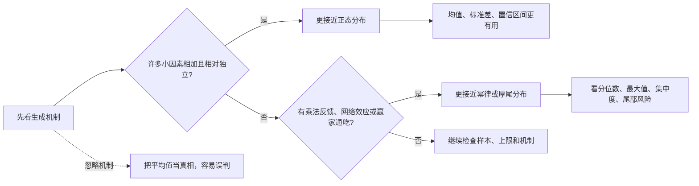
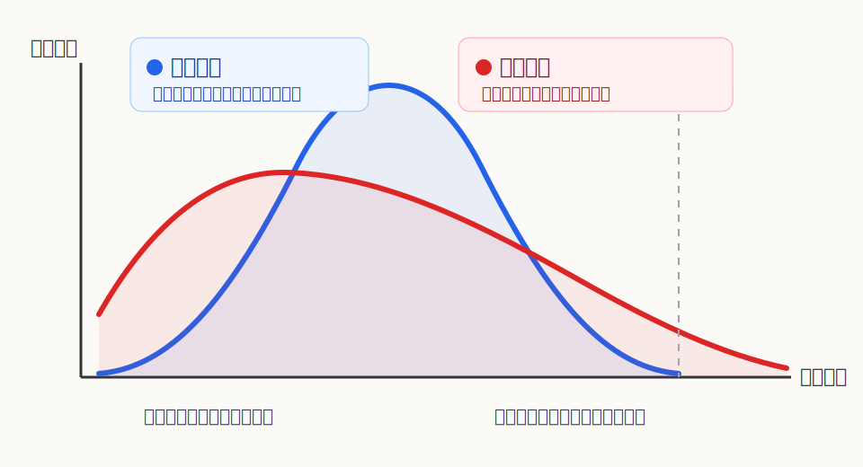
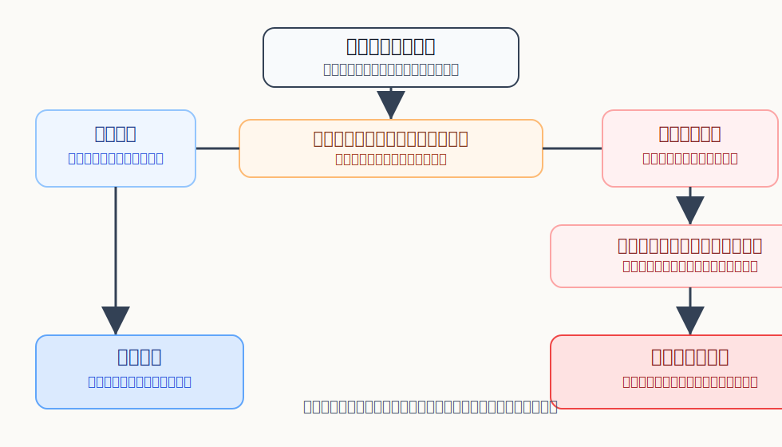

## 数学思维筑基课: 正态分布与幂律分布: 先判断你活在哪种世界

### 作者
digoal

### 日期
2026-06-02

### 标签
数学思维筑基 , 正态分布 , 幂律分布 , 数据分布    

----

## 背景
  

> 面向对象: 大学生及有一定社会阅历的成年人  
> 核心问题: 为什么有些事情可以用“平均水平”判断，而有些事情必须盯住极端值和头部玩家？  
> 先说结论: 正态分布描述的是“许多小因素相加、极端值很快变少”的薄尾世界；幂律分布描述的是“少数极端值仍然巨大、最大值可能支配总量”的厚尾世界。日常决策的第一步不是算平均值，而是先判断数据来自哪一种生成机制。

## 写作控制表

| Item | Required content |
|---|---|
| Input type | 理论链条: 正态分布与幂律分布作为“薄尾与厚尾世界”的对比判断法 |
| Chosen version | 标准教材与常见统计建模版本: 正态分布强调均值和方差，幂律分布强调尾部按尺度规律衰减 |
| Central question | 什么时候平均值可靠，什么时候平均值会骗你？ |
| Assumptions and boundaries | 加法独立性、自然上限、样本代表性、乘法反馈、尾部可观测性 |
| Evidence or derivation route | 机制 -> 分布形状 -> 统计量选择 -> 决策边界 |
| Visual plan | Mermaid 展示判断流程；SVG 展示尾部差异；第二个 SVG 展示分布选择边界；表格展示假设成立和不成立的后果 |

## 一张图先看懂

## 求真讲法

### 它到底说了什么

正态分布的典型形状是钟形曲线: 大多数观测值集中在平均值附近，离平均值越远，出现概率下降得越快。人的身高、许多测量误差、同等条件下的考试波动，常被近似为正态分布。

幂律分布的典型形状不是钟形，而是长尾: 小值很多，大值很少，但大值并没有像正态分布那样迅速消失。财富、城市人口、网站流量、论文引用、企业规模、爆款作品，经常呈现厚尾或近似幂律特征。

两者最关键的差别不是曲线好不好看，而是极端值有没有改写整体的能力。正态世界里，极端值罕见且影响有限；幂律世界里，极端值罕见但影响巨大。

### 它是怎么来的

正态分布背后常见的直觉是“许多小扰动相加”。一个人的身高受遗传、营养、睡眠、环境等很多因素影响，单个因素通常不会无限放大，最后结果会围绕某个中心值波动。中心极限定理给了这个直觉数学支撑: 在一些条件下，大量独立或弱相关的小随机变量相加，会趋近正态分布。

幂律分布背后常见的直觉是“增长会放大已有差距”。如果一个人因为已有资源获得更多资源，一个平台因为已有用户吸引更多用户，一篇论文因为已有引用获得更多注意力，那么结果就不是简单相加，而是乘法反馈。早期优势会被不断放大，头部会越来越突出。

### 它依赖哪些假设

| 假设或边界 | 成立时 | 不成立时 |
|---|---|---|
| 加法独立性 | 正态近似更合理，平均值和标准差有解释力 | 变量相互强化时，尾部会变厚 |
| 自然上限 | 身高、普通考试分数这类变量难以无限放大 | 财富、流量、连接数可能跨越多个数量级 |
| 样本代表性 | 样本均值能接近总体均值 | 只看幸存者或头部样本会严重偏差 |
| 乘法反馈 | 若不存在，极端值较难支配总量 | 若存在，少数极端值可能决定整体 |
| 尾部可观测性 | 样本足够大时能估计风险 | 样本太小会低估黑天鹅和头部集中度 |

### 常见误解

第一个误解是“只要数据多，就可以用正态分布”。数据多不等于机制对。很多互联网、金融、城市、声望系统的数据量很大，但生成机制不是加法小扰动，而是网络效应和累积优势。

第二个误解是“平均值代表普通人”。在正态世界里，平均值通常接近典型值；在幂律世界里，平均值可能被少数极端值拉高。一个行业平均收入很高，不代表多数从业者收入高。

第三个误解是“幂律等于混乱，不能分析”。幂律不是说无法分析，而是提醒你换统计工具: 少看均值，多看分位数、排名、集中度、最大值和尾部风险。

## 求存讲法

### 它有什么用

正态分布帮你管理常规波动。比如生产误差、考试成绩、身高体重、普通运营指标，常用均值、标准差、置信区间来判断是否异常。

幂律分布帮你管理极端差异。比如投资回报、创业结果、内容流量、销售业绩、城市人口、社交影响力，少数结果可能贡献大部分总量。此时最重要的问题不是“平均是多少”，而是“尾部有多厚，头部有多集中，最大损失或最大收益能不能改写全局”。

### 它怎么迁移到熟悉领域

在职业选择中，标准化岗位更像薄尾世界: 大多数人的收入和晋升围绕区间波动，平均值有参考意义。创业、投资、内容创作、技术平台生态更像厚尾世界: 少数成功案例可能极端巨大，但多数结果平庸甚至失败。

在学习中，考试分数通常有上限，更接近薄尾；长期研究能力、开源影响力、论文引用、产品用户数可能更接近厚尾。前者适合稳定刷题和控制失误，后者需要提高暴露在高上限机会中的次数，同时控制下行风险。

### 它的适用范围和边界

如果变量有明确上限、由许多小因素相加、样本代表总体，正态思维有用。你可以问: 平均值是多少？标准差多大？我离均值几个标准差？

如果变量没有稳定上限、存在网络效应、头部能继续吸引资源，幂律思维更有用。你要问: 前 1% 占多少？最大值对总量影响多大？我是否只看到了幸存者？尾部风险是否被样本隐藏？

### 正例: 怎么用它提升能力

一个产品经理分析客服响应时间。响应时间有流程约束和人力上限，极端值通常来自具体异常。这里正态或近似正态思维有用: 看均值、标准差、异常点，定位流程问题。这个正例依赖“自然上限”和“加法小扰动”假设。

另一个创业者分析用户增长。如果产品有社交传播、推荐算法和网络效应，增长可能由少数渠道或少数内容贡献大部分结果。这里要用幂律思维: 不只看平均转化率，还要看头部渠道、爆款内容、最大回撤和增长集中度。这个正例依赖“乘法反馈”和“尾部可观测性”假设。

### 反例: 前提不成立会怎样

一家内容公司用“平均播放量”评估创作者价值，发现平均播放量很高，于是扩大签约。但真实数据是少数爆款拉高平均值，大多数作品播放量很低。公司把厚尾世界误当薄尾世界，忽略了“乘法反馈”和“头部支配总量”的边界，结果预算被平均值误导。

相反，如果一个工厂把所有质量波动都当成幂律尾部风险，过度关注极少数异常样本，不看均值和标准差，就会错过稳定流程改进。这里的问题是把有自然上限、可控误差的薄尾过程误当成厚尾过程。

## 思考

很多现代骗局都藏在“分布错配”里。营销材料喜欢拿平均值讲收入，投资故事喜欢拿头部案例讲机会，管理汇报喜欢拿总体增长掩盖分层差异。你只要多问一句“这是正态世界还是幂律世界”，就能避开很多统计幻觉。

更深一层看，正态思维适合优化稳定系统，幂律思维适合理解开放系统。稳定系统追求控制误差；开放系统追求识别非线性机会，同时防止尾部风险毁掉自己。

反事实问题是: 如果你的收入、学习成果、投资结果、社交影响力都不是正态分布，你还应该用“努力到平均以上”作为人生策略吗？在厚尾世界里，更理性的策略可能是: 保持基本盘稳定，同时用小成本多次尝试高上限机会。

## 最后记住

1. 正态分布看中心，幂律分布看尾部。
2. 平均值在薄尾世界可靠，在厚尾世界可能误导。
3. 先判断生成机制，再选择统计工具。
4. 有自然上限、加法小扰动时，用均值和标准差。
5. 有乘法反馈、赢家通吃时，看分位数、最大值、集中度和尾部风险。

## 参考资料

- 基于概率论与统计学通用教材体系: 正态分布、中心极限定理、幂律分布、厚尾分布、描述统计。
- 基于复杂系统和网络科学中的常见机制解释: preferential attachment、累积优势、网络效应。
- 本文未联网核验具体历史出处和个别实证数据；文中例子用于说明机制，不作为特定行业数据结论。
  
#### [PostgreSQL 解决方案集合](../201706/20170601_02.md "40cff096e9ed7122c512b35d8561d9c8")
  
  
#### [德哥 / digoal's Github - 公益是一辈子的事.](https://github.com/digoal/blog/blob/master/README.md "22709685feb7cab07d30f30387f0a9ae")
  
  
#### [About 德哥](https://github.com/digoal/blog/blob/master/me/readme.md "a37735981e7704886ffd590565582dd0")
  
  

  
