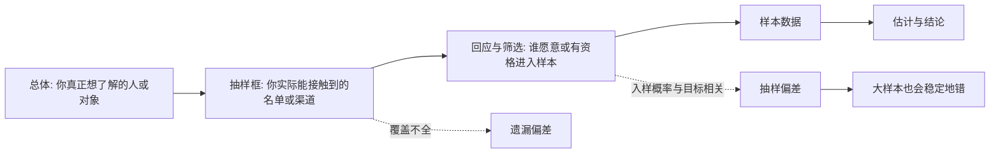
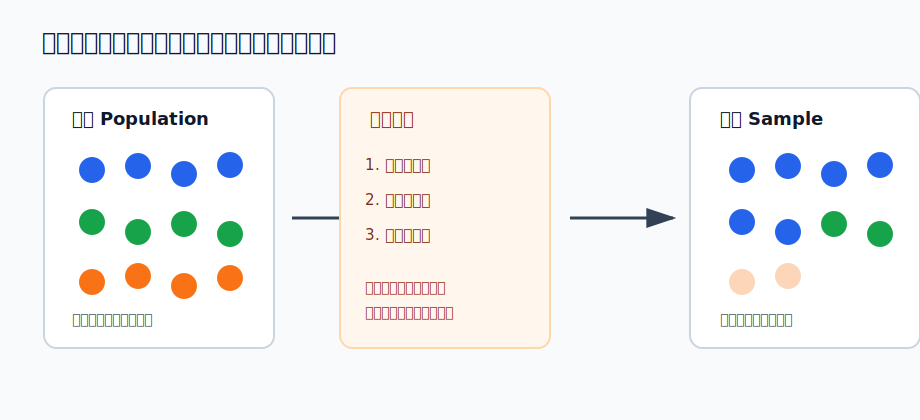
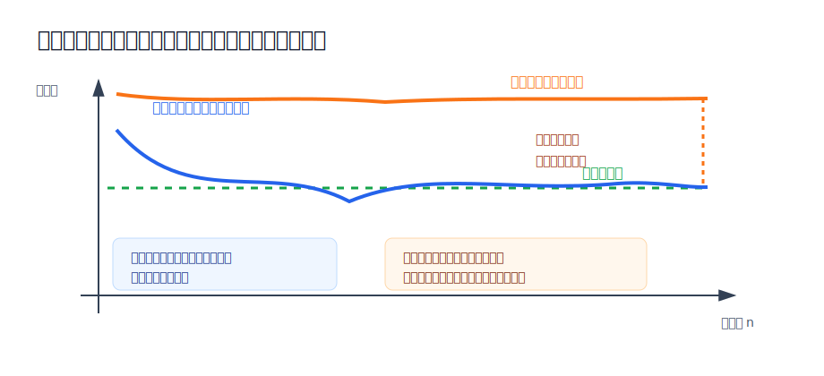

## 数学思维筑基课: 抽样偏差: 样本进错门，结论就会走错路

### 作者
digoal

### 日期
2026-06-02

### 标签
数学思维筑基 , 采样 , 样本 , 抽样偏差      

----

## 背景
  

> 面向对象: 大学生及有一定社会阅历的成年人  
> 核心问题: 为什么有些调查、投票、用户反馈、招聘数据、投资样本看起来很多，却仍然不能代表真实世界？  
> 先说结论: 抽样偏差不是“样本太小”，而是“谁能进入样本”的机制和你要研究的目标变量相关。只要进入样本的门槛歪了，样本量越大，错误结论反而越稳定。

## 决策控制表

| Item | Required content |
|---|---|
| Input type | viewpoint/law/principle |
| Chosen version | 统计学标准教材语境: selection bias / sampling bias，即样本选择机制导致样本分布系统性偏离总体分布 |
| Central question | 看到一组数据时，如何判断它是在反映总体，还是只反映了“能被看到的那群人”？ |
| Assumptions and boundaries | 抽样框覆盖总体: 成立时样本有机会代表总体，不成立时遗漏人群会消失；入样概率与目标变量无关: 成立时估计可接近真实值，不成立时会系统性偏离；回应机制稳定: 成立时非回应影响可控，不成立时沉默者改变结论；校正变量可观测: 成立时可用分层或加权修正，不成立时只能承认不确定性 |
| Evidence or derivation route | claim -> 抽样机制 -> 样本分布偏离总体分布 -> 估计量偏离真实值 -> 反例和修正方法 |
| Visual plan | Mermaid 展示从总体到结论的推断链；SVG 1 展示选择机制如何扭曲样本；SVG 2 展示随机误差和系统偏差的区别；表格展示前提成立/不成立的后果 |

## 一张图先看懂







## 求真讲法

### 它到底说了什么

抽样偏差说的是: 你拿到的样本，不是总体的等比例缩影，而是被某种选择机制筛过的一群人或对象。这个选择机制如果和研究目标有关，样本就会系统性偏离总体。

比如你想知道“公司员工是否支持远程办公”，却只在下班后办公室里发问卷。能被你问到的人，天然更可能是愿意留在办公室、通勤压力较低、岗位更依赖现场协作的人。这个样本不是随机地少了一些人，而是方向性地少了远程办公诉求更强的人。

这里的关键不是“样本有多少”，而是“进入样本的规则是什么”。如果规则歪了，100 个人会错，10 万个人也会错，只是错得更有把握。

### 它是怎么来的

统计推断的基本目标，是用样本估计总体。这个目标背后有一条隐含推理链:

```text
总体真实状态
  -> 通过抽样机制进入样本
  -> 用样本统计量估计总体参数
  -> 得出判断、预测或决策
```

这条链能成立，需要样本的生成机制足够接近“代表总体”。最理想的情况是随机抽样: 总体中每个单位都有已知且合适的入样概率，样本中的差异主要来自随机波动。随机波动可以用更大的样本、更好的估计方法、更窄的置信区间来处理。

抽样偏差破坏的是更前面的环节: 样本不是从总体中自然抽出来的，而是被平台、渠道、时间、资格、回应意愿、幸存状态、可见性等条件筛出来的。筛选条件一旦和目标变量相关，样本均值、比例、相关性都会偏。

一个简化表达是:

| 情况 | 样本进入机制 | 估计后果 |
|---|---|---|
| 随机误差 | 入样机制不偏，但抽到谁有偶然性 | 多抽几次或扩大样本后，估计围绕真实值波动 |
| 抽样偏差 | 入样机制和研究目标相关 | 样本稳定偏向某类人，扩大样本也不能自动修复 |

### 它依赖哪些假设

第一，抽样框要覆盖总体。你要研究“所有消费者”，但数据只来自某个高端电商 App，那抽样框本身就排除了不用这个 App 的人。前提不成立时，样本只能代表“能被这个渠道看见的人”。

第二，入样概率不能和目标变量强相关。你要研究“投资收益率”，却只采访还活跃在市场里的投资者，亏到退出的人消失了，这就是幸存者偏差。前提不成立时，样本会高估真实收益。

第三，回应机制要可解释。问卷调查里，愿意回答的人可能比沉默者更愤怒、更满意、更闲、更有表达欲。前提不成立时，你测到的不是总体态度，而是“愿意回应者”的态度。

第四，偏差修正所需变量要可观测。若你知道年龄、地区、收入、岗位分布，可以做分层抽样或加权。若关键差异不可观测，例如“真正离开市场的人为什么离开”，校正就只能部分有效。

### 常见误解

误解一: “样本大就可靠。”  
大样本只降低随机误差，不保证消除系统偏差。一个只来自单一平台的百万级样本，仍然可能代表不了平台外的人。

误解二: “数据真实，所以结论真实。”  
数据可以真实记录样本，却不能自动代表总体。真实的样本数据，加上错误的代表性假设，会推出错误的总体结论。

误解三: “有偏差就完全不能用。”  
有偏样本仍可用于理解某个子群体。问题在于不能把子群体结论偷换成总体结论。

## 求存讲法

### 它有什么用

抽样偏差是识别统计骗局的第一道门。很多看似精确的数字，问题不在计算，而在数据从一开始就进错了门。

看一份报告、调研、用户反馈、招聘数据、医学观察、投资战绩时，先问四个问题:

| 检查问题 | 要防的偏差 |
|---|---|
| 总体是谁？ | 把局部人群误当总体 |
| 样本从哪里来？ | 渠道偏差、覆盖偏差 |
| 谁没有出现？ | 非回应偏差、沉默者偏差 |
| 入样规则是否和目标相关？ | 幸存者偏差、自选择偏差 |

### 它怎么迁移到熟悉领域

在工作中，只看主动投诉的客户，容易高估问题严重度；只看续费客户访谈，容易低估流失原因。这里失效的是“样本覆盖总体”这个假设。

在管理中，只听会议上发言的人，容易误判团队共识。沉默者可能不是同意，而是没有安全感、没有时间或认为说了没用。这里失效的是“回应机制稳定”这个假设。

在投资中，只研究成功基金经理的访谈，容易把幸存者的路径当成普遍规律。失败者的数据缺失，会让风险被系统性低估。这里失效的是“入样概率与目标变量无关”这个假设。

在互联网产品中，只看 App 内活跃用户行为，容易误判新用户和流失用户的真实需求。你看到的是留下来的人，不是所有曾经尝试过的人。

### 它的适用范围和边界

抽样偏差最适合用来审查“从样本推总体”的场景: 问卷、民调、用户研究、市场调研、A/B 测试、医疗观察、招聘评估、绩效分析、投资回测。

它不适合被滥用成“所有数据都不可信”。正确用法不是否定数据，而是把数据的适用范围说清楚: 这组数据能代表谁，不能代表谁，缺了谁，缺失的人是否会改变结论。

当抽样机制透明、抽样框完整、入样概率已知，并且可以分层或加权修正时，抽样偏差可以被显著降低。当关键人群不可见、选择机制不可观测、沉默者与回应者差异很大时，结论必须降级为假设，而不是事实。

### 正例: 怎么用它提升能力

假设你负责一个在线课程，后台数据显示“完成课程的人满意度很高”。如果你直接得出“课程质量很好”，就可能忽略抽样偏差。

更好的做法是把样本拆开:

| 人群 | 是否在满意度样本中 | 可能携带的信息 |
|---|---:|---|
| 完成课程的人 | 是 | 课程后半段体验、最终收益 |
| 中途放弃的人 | 通常否 | 难度、节奏、时间成本、早期挫败 |
| 购买后未开始的人 | 通常否 | 冲动购买、入口引导、预期落差 |

这个正例成立，是因为你识别了“完成课程”这个入样条件和“满意度”高度相关，于是没有把完成者满意度偷换成全体购买者满意度。接下来的行动也更准确: 分别调查未开始者、中途放弃者和完成者，而不是只优化完成者喜欢的内容。

### 反例: 前提不成立会怎样

某公司想判断“员工是否支持加班餐补改革”，只在深夜食堂门口访谈员工，发现大多数人支持，于是认为改革很受欢迎。

这个反例失败，不是因为调研者“不努力”，而是因为“样本覆盖总体”和“入样概率与目标变量无关”两个假设都不成立。深夜食堂门口能遇到的人，本来就是高频加班者，他们和低频加班者、远程办公者、已因加班不满而离职的人不同。样本越多，只能越精确地代表“深夜仍在食堂的人”，不能代表全体员工。

## 思考

抽样偏差最值得警惕的地方，是它经常伪装成“真实经验”。你亲眼看到的数据、亲自访谈的人、亲自经历的案例，都可能只来自一个狭窄入口。人很容易把“我看见的”误认为“世界本来如此”。

一个反事实问题是: 如果那些没有进入样本的人被迫出现，结论会不会反转？如果会，你现在看到的就不是结论，而只是一个待修正的视角。

另一个跨学科联系是传播学里的可见性偏差。社交媒体上最响亮的人，不一定代表多数人；职场里最会表达的人，也不一定代表最有信息的人。统计学训练的价值，不是让人变冷冰冰，而是让人对“看不见的人”保持智识上的诚实。

## 最后记住

1. 抽样偏差的核心不是样本小，而是样本进入机制和研究目标相关。
2. 大样本能降低随机误差，不能自动修复系统性偏差。
3. 看任何数据前，先问总体是谁、样本从哪里来、谁没有出现。
4. 有偏样本不是完全没用，但只能代表它真正覆盖的人群。
5. 最好的统计素养，是在精确数字面前仍然追问“这个数字代表谁”。

## 参考资料

- 基于统计学教材中的抽样、抽样框、选择偏差、非回应偏差和估计量偏差等通用知识整理。
- David Freedman, Robert Pisani, Roger Purves, *Statistics*, 关于样本调查、偏差和随机误差的基础讨论。
- Sharon L. Lohr, *Sampling: Design and Analysis*, 关于抽样设计、抽样框、非回应和加权修正的系统讨论。
- 本文未联网核验具体页码；未使用名人轶事或具体历史归因。
  
#### [PostgreSQL 解决方案集合](../201706/20170601_02.md "40cff096e9ed7122c512b35d8561d9c8")
  
  
#### [德哥 / digoal's Github - 公益是一辈子的事.](https://github.com/digoal/blog/blob/master/README.md "22709685feb7cab07d30f30387f0a9ae")
  
  
#### [About 德哥](https://github.com/digoal/blog/blob/master/me/readme.md "a37735981e7704886ffd590565582dd0")
  
  

  
