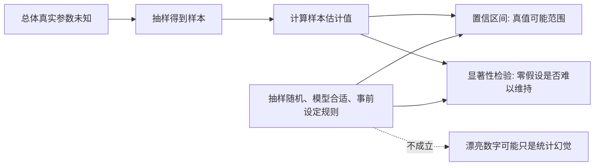
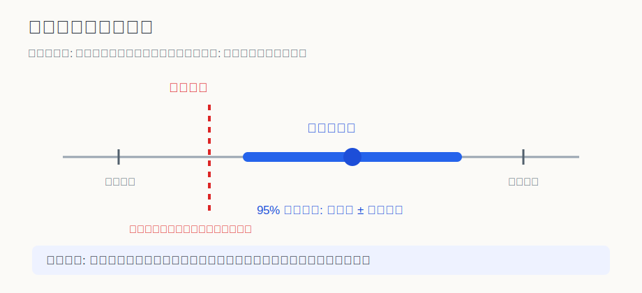
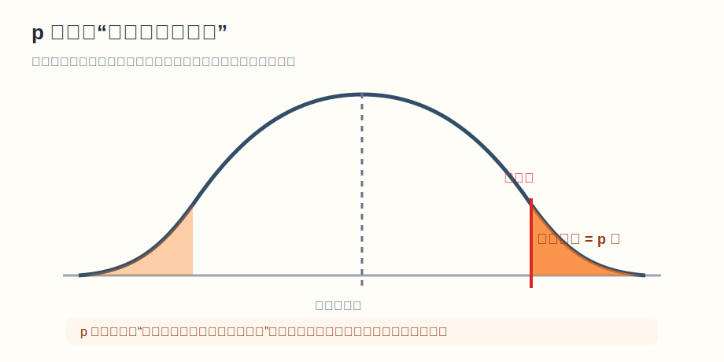

## 数学思维筑基课: 置信区间与显著性检验: 用不确定性约束判断

### 作者
digoal

### 日期
2026-06-02

### 标签
数学思维筑基 , 置信区间 , 显著性检验 , 用不确定性约束判断      

----

## 背景
  

> 面向对象: 大学生及有一定社会阅历的成年人  
> 核心问题: 看见一组样本数据时，我们到底能多有把握地说“真实情况大概如此”，以及“这个差异不像纯偶然”？  
> 先说结论: 置信区间给出估计的合理范围，显著性检验给出反驳零假设的证据强度。它们不是统计仪式，而是防止人把噪声、巧合和小样本误判成规律的工具。

## 一张图先看懂







| 问题 | 置信区间 | 显著性检验 |
|---|---|---|
| 核心问法 | 真值可能在哪个范围？ | 默认假设还撑得住吗？ |
| 常见输出 | 95% CI: [a, b] | p = 0.03 |
| 防止的错误 | 把点估计当真值 | 把随机波动当发现 |
| 最常见误读 | “真值有 95% 概率在这个区间里” | “原假设只有 3% 概率为真” |

## 求真讲法

### 它到底说了什么

现实里，我们通常看不到总体，只能看到样本。比如一家公司只抽查 500 个用户，就想估计全部用户的续费率；一个药物实验只观察几百人，就想判断药物是否有效。统计推断的核心困难是: 样本会抖动。

置信区间承认这种抖动。它不只给你一个点估计，比如“续费率 62%”，还给你一个范围，比如“95% 置信区间为 58% 到 66%”。这句话的严谨含义是: 如果用同样的方法反复抽样并构造区间，长期看大约 95% 的区间会覆盖真实参数。对已经算出来的这个具体区间，真实参数不是随机跳来跳去；随机的是抽样和构造区间的过程。

显著性检验则从另一个方向问问题。它先设一个默认立场，叫零假设，例如“新页面和旧页面转化率没有差异”。然后问: 如果这个默认立场是真的，我们现在看到这么极端或更极端的数据有多罕见？这个概率就是 p 值。p 值越小，数据越不符合零假设。

### 它是怎么来的

背后的推导路线是:

```text
总体未知
  -> 抽样产生样本
  -> 样本统计量会围绕真实参数波动
  -> 用抽样分布描述这种波动
  -> 用标准误估计波动大小
  -> 形成置信区间或检验统计量
```

以均值为例，如果样本足够大，中心极限定理告诉我们，样本均值的抽样分布通常接近正态分布。于是可以用“估计值 ± 若干个标准误”构造置信区间。常见的 95% 区间，直觉上就是在抽样分布中取一个覆盖大部分常见波动的范围。

显著性检验也依赖同一个抽样分布。只不过它把零假设当成参照世界，然后计算当前结果在这个参照世界里有多极端。如果太极端，我们就说结果在某个显著性水平下显著。

在很多标准条件下，双侧 5% 显著性检验和 95% 置信区间有对应关系: 如果 95% 置信区间不包含零假设值，通常等价于双侧检验 p < 0.05。但这个对应依赖同一模型、同一双侧检验和同一参数定义，不能机械套用到所有场景。

### 它依赖哪些假设

1. 抽样机制可信。  
   成立时，样本波动可以用概率模型描述；不成立时，抽样偏差会让区间和 p 值显得精确但方向错误。

2. 模型近似合适。  
   成立时，正态近似、t 分布、二项分布或其他模型能提供合理误差；不成立时，尾部概率和区间覆盖率会失真。

3. 检验规则事前确定。  
   成立时，p 值有明确含义；不成立时，反复试变量、反复分组、挑好看的结果会制造假阳性。

4. 样本量和效应量一起看。  
   成立时，能区分“统计显著”和“现实重要”；不成立时，超大样本能把微小差异也做成显著。

5. 数据质量可靠。  
   成立时，统计推断是在测量真实现象；不成立时，缺失、口径变化、幸存者偏差会让推断失效。

### 常见误解

误解一: 95% 置信区间表示“真值有 95% 概率在这个区间里”。  
更准确的说法是，方法的长期覆盖率是 95%。已经得到的区间要么覆盖真值，要么没有覆盖。

误解二: p < 0.05 表示结论有 95% 概率为真。  
p 值是在零假设为真时观察到当前或更极端数据的概率，不是研究假设为真的概率。

误解三: 显著就等于重要。  
统计显著说明数据相对零假设不寻常，不说明影响大、值得做、一定有因果关系。

误解四: 不显著就等于没有效果。  
不显著可能是样本太小、噪声太大、设计太弱，也可能确实没有效果。它不是“证明无效”。

## 求存讲法

### 它有什么用

置信区间训练你不要迷信单点数字。看到“满意度 83%”时，你会继续问: 样本多大？误差多宽？另一个方案的 81% 是否真的差？如果区间很宽，说明信息还不够，决策要谨慎。

显著性检验训练你尊重默认假设。看到“新广告点击率更高”时，你会问: 如果新旧广告其实没差，这种差异靠随机波动出现的概率有多大？这能防止团队因为一次偶然涨幅就改预算。

### 它怎么迁移到熟悉领域

在工作中，A/B 测试离不开这两者。置信区间告诉你转化率提升可能是 0.2 个百分点，也可能是 2 个百分点；显著性检验告诉你这个提升是否足够不像随机波动。

在投资中，短期收益率经常是噪声。一个基金经理一年跑赢市场，并不自动说明他有能力。你要看长期样本、波动范围、基准选择和显著性，而不是只看冠军榜。

在健康和公共政策里，很多结论来自样本研究。你需要区分“相关显著”“效应很大”“有因果证据”“对我这个人适用”这四件事。

### 它的适用范围和边界

适用条件是: 问题有明确参数或假设，数据来源可解释，抽样和测量过程相对可靠，分析规则不是事后挑出来的。

不适用或要特别谨慎的情况包括: 样本是自选择来的，变量被反复试到显著为止，数据口径中途变化，研究问题本身没有清楚定义，或者把观察性相关强行说成因果。

### 正例: 怎么用它提升能力

假设你负责一个产品注册页。旧页面转化率 10.0%，新页面 10.8%。如果你只看点估计，会觉得新页面赢了。但你计算后发现 95% 置信区间是 -0.1 到 1.7 个百分点，p = 0.08。

这里第 3 条假设“检验规则事前确定”成立，因为实验提前设定了指标和样本量；第 4 条假设“样本量和效应量一起看”提醒你，当前证据还不够强。合理动作不是立刻全量上线，而是继续收集样本，或结合实现成本、潜在收益和风险做小比例放量。

### 反例: 前提不成立会怎样

某团队做了 30 个指标、12 个用户分组、5 个时间窗口，最后挑出一个“新页面让高价值用户在周末点击率显著提升，p = 0.03”的结果来汇报。

这个结论失败在第 3 条假设: 检验规则不是事前确定，而是事后搜索。即使零假设全部为真，反复试很多次也容易撞出一个小 p 值。这里的问题不是团队“不努力”，而是统计程序把随机噪声包装成发现。

## 思考

第一，为什么现代社会如此迷恋“显著”？因为显著性给了人一种决策上的安全感: 我不是拍脑袋，我有数字。但数字只回答了很窄的问题。如果问题设计错了，数字越精确，误导越有说服力。

第二，置信区间比单个 p 值更接近管理语言。管理者真正关心的往往不是“有没有差异”，而是“差异可能有多大，最坏可能怎样，值不值得为它行动”。区间思维天然连接收益、成本和风险。

第三，统计推断不是替你做决定，而是告诉你无知还有多大。成熟的量化思维，不是把所有东西都算成一个精确答案，而是在不确定性里划出可以行动和不能行动的边界。

## 最后记住

1. 置信区间回答“真实参数的合理范围”，显著性检验回答“数据是否足够反驳零假设”。
2. 95% 置信区间说的是方法的长期覆盖率，不是某个具体区间里真值的主观概率。
3. p 值不是原假设为真的概率，也不是结论为真的概率。
4. 显著不等于重要，不显著不等于没有效果。
5. 抽样、模型、事前规则、样本量和数据质量不成立时，统计结论会失去地基。

## 参考资料

- 基于通用教材体系: 统计推断、抽样分布、置信区间、假设检验、中心极限定理。
- David S. Moore, George P. McCabe, Bruce Craig, *Introduction to the Practice of Statistics*.
- Larry Wasserman, *All of Statistics: A Concise Course in Statistical Inference*.
- George Casella, Roger L. Berger, *Statistical Inference*.
  
#### [PostgreSQL 解决方案集合](../201706/20170601_02.md "40cff096e9ed7122c512b35d8561d9c8")
  
  
#### [德哥 / digoal's Github - 公益是一辈子的事.](https://github.com/digoal/blog/blob/master/README.md "22709685feb7cab07d30f30387f0a9ae")
  
  
#### [About 德哥](https://github.com/digoal/blog/blob/master/me/readme.md "a37735981e7704886ffd590565582dd0")
  
  

  
