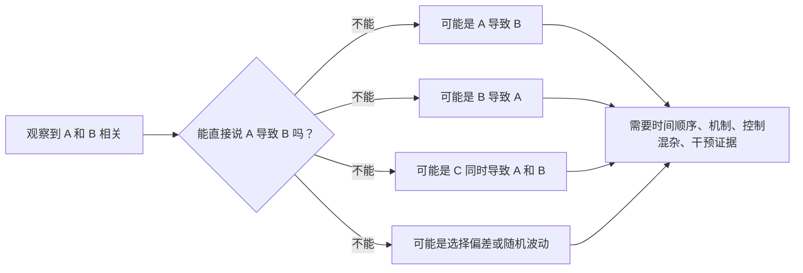
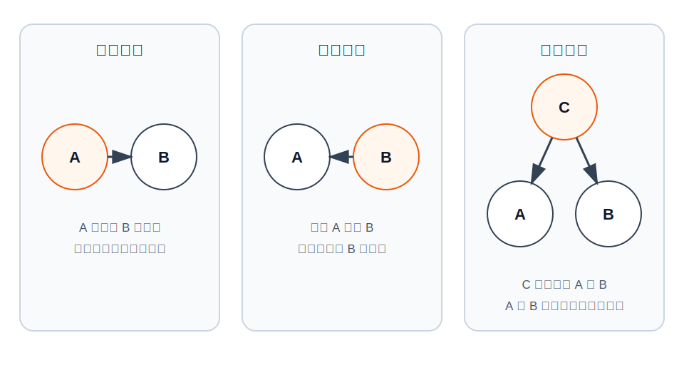
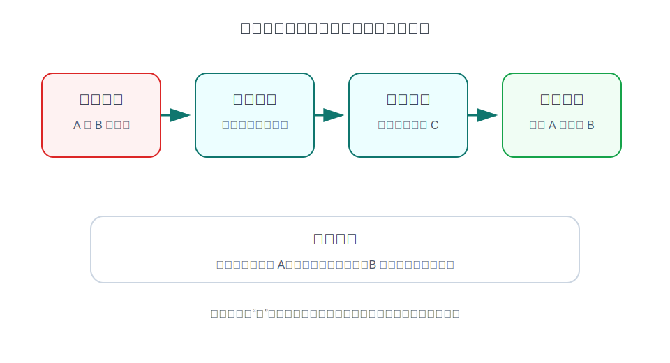

## 数学思维筑基课: 相关不等于因果

### 作者
digoal

### 日期
2026-06-02

### 标签
数学思维筑基 , 因果 , 相关 , 逻辑谬误      

----

## 背景
  

> 面向对象: 大学生及有一定社会阅历的成年人  
> 核心问题: 为什么两个现象经常一起出现，也不能直接说一个导致另一个？  
> 先说结论: 相关关系只说明两个变量的变化有统计联系；因果关系还要求有清楚的机制、时间顺序、排除混杂因素，并最好能经受干预或准实验检验。

## 一张图先看懂

## 求真讲法

### 它到底说了什么

“相关不等于因果”不是说相关没有价值，而是说相关只是因果判断的入口，不是终点。

如果加班时长和收入正相关，我们只能先说：在这组数据里，加班更多的人收入也更高。不能立刻说：加班导致收入提高。可能是高薪岗位本来工作强度更大，可能是能力强的人同时获得高薪和更多责任，也可能是某个行业周期同时推高收入和工作量。

### 它是怎么来的

统计学中的相关，描述的是两个变量共同变化的程度。它可以回答“是否一起变”“变动方向是否一致”“线性关系强不强”。但因果问题问的是另一件事：如果我们主动改变 A，B 会不会随之改变？

这就是观察和干预的区别。观察数据里，A 和 B 一起出现；因果判断里，我们关心的是“把 A 拨动一下，B 是否会系统性变化”。这背后至少有四条要求：

1. 时间顺序: 原因必须先于结果。
2. 机制可解释: A 影响 B 的路径要讲得通。
3. 排除混杂: 不能有一个 C 同时影响 A 和 B，却被我们忽略。
4. 干预或准实验支持: 改变 A 后，B 的变化不是纯粹由其他条件造成。

### 它依赖哪些假设

| 假设或边界 | 成立时 | 不成立时 |
|---|---|---|
| 数据代表目标人群 | 相关关系有讨论价值 | 样本偏了，结论只是在偏样本里成立 |
| 时间顺序清楚 | 可以排除部分反向因果 | 可能是结果反过来影响所谓原因 |
| 关键混杂因素被识别 | 因果主张更可信 | 共同原因会制造虚假相关 |
| 机制可解释 | 相关关系有现实含义 | 可能只是数据挖掘出来的巧合 |
| 干预条件可比较 | 能更接近因果判断 | 观察到的差异可能来自环境差异 |

### 常见误解

第一种误解是“只要样本大，就能推出因果”。样本大能降低随机误差，但不能自动消除混杂因素。十万个偏样本，仍然是偏样本。

第二种误解是“有机制故事，就能推出因果”。机制故事能提高可信度，但不能替代证据。很多营销话术就是先展示一张相关图，再补一个听起来合理的故事。

第三种误解是“相关不等于因果，所以相关没用”。这也不对。相关是发现线索、做预测、提出假设的工具。它的问题不是无用，而是不能单独承担因果结论。

## 求存讲法

### 它有什么用

这条原则的价值，是让你在数据时代少被三类话术带偏。

第一类是广告话术：“使用某产品的人收入更高。”可能不是产品导致高收入，而是高收入人群更愿意购买该产品。

第二类是管理话术：“部门开会越多，项目越重要，所以多开会能提高项目成功率。”可能是重要项目天然需要更多协调，不是会议数量本身创造价值。

第三类是健康或投资话术：“坚持某习惯的人结果更好。”可能是自律、收入、教育水平、资源条件这些共同原因在起作用。

### 它怎么迁移到熟悉领域

在工作中，看到绩效和某个行为相关，不要马上推广为制度。先问：这个行为是原因，还是优秀团队的伴随现象？

在投资中，看到某指标和股价上涨相关，不要马上当成买入信号。先问：这个指标是否只是行情好时一起上升？

在学习中，看到高分学生都做笔记，不要直接得出“做笔记导致高分”。更好的问题是：哪一种笔记行为改变了理解、复盘和迁移能力？

### 它的适用范围和边界

这条原则适用于观察性数据、商业报告、新闻图表、管理复盘、医疗健康建议、投资研究和社会科学讨论。

它不要求你每次都做随机对照试验。现实中很多问题不能随便实验，比如教育、宏观经济、公共政策。但它要求你降低结论强度：没有干预证据时，说“可能有关”“值得进一步验证”，不要说“已经证明导致”。

### 正例: 怎么用它提升能力

假设你发现团队里“代码评审次数越多，线上事故越少”。如果你直接规定“每个需求必须评审五次”，可能会制造流程负担。

更好的做法是把因果问题拆开：评审是否在事故前发生？评审发现了哪些具体风险？团队规模、需求复杂度、工程师经验是否被控制？能不能先在一类项目上试点，提高评审质量而不是只增加次数？

这个正例成立的关键假设是“评审质量确实改变了缺陷进入线上的概率”，而不是“成熟团队同时拥有更多评审和更少事故”。

### 反例: 前提不成立会怎样

某公司发现“经常在线到深夜的员工晋升更快”，于是把在线时长当作勤奋指标。短期内，大家开始延长在线时间；长期看，产出没有提高，疲劳和表演性工作增加。

失败原因不是员工“不努力”，而是共同原因假设没有处理：更重要的岗位、更强的责任心、更高的项目压力，可能同时带来深夜在线和晋升机会。把伴随现象当原因，就会奖励表象，损害真正的产出机制。

## 思考

相关关系像地图上的两条路靠得近；因果关系则要证明其中一条路能把你带到另一条路。靠得近值得注意，但不能替代路径证明。

真正成熟的概率思维，不是看到数据就怀疑一切，而是给结论分级：强相关是线索，时间顺序是门槛，机制是解释，控制混杂是净化，干预证据是加固。

你以后看到任何“数据显示 A 导致 B”的说法，可以先问五个问题：

1. A 是否发生在 B 之前？
2. 有没有 C 同时影响 A 和 B？
3. 样本是不是只选了容易支持结论的人？
4. 有没有合理机制，而不是事后编故事？
5. 如果改变 A，B 是否真的会跟着变？

## 最后记住

1. 相关说明“一起变”，因果说明“改一个会改变另一个”。
2. 大样本不能自动解决混杂、偏样本和反向因果。
3. 因果判断至少要看时间顺序、机制、混杂控制和干预证据。
4. 相关不是废物，它是提出假设和做预测的起点。
5. 在管理、投资、健康和学习中，把伴随现象当原因，常常会奖励错误行为。

## 参考资料

- Judea Pearl, *Causality: Models, Reasoning, and Inference*, 2nd edition, Cambridge University Press, 2009.
- Judea Pearl and Dana Mackenzie, *The Book of Why*, Basic Books, 2018.
- Miguel A. Hernan and James M. Robins, *Causal Inference: What If*, 2020.
- David Freedman, Robert Pisani, and Roger Purves, *Statistics*, 4th edition, W. W. Norton, 2007.
- 本文基于统计学与因果推断教材中的通用知识整理，未联网核验具体页码。
  
#### [PostgreSQL 解决方案集合](../201706/20170601_02.md "40cff096e9ed7122c512b35d8561d9c8")
  
  
#### [德哥 / digoal's Github - 公益是一辈子的事.](https://github.com/digoal/blog/blob/master/README.md "22709685feb7cab07d30f30387f0a9ae")
  
  
#### [About 德哥](https://github.com/digoal/blog/blob/master/me/readme.md "a37735981e7704886ffd590565582dd0")
  
  

  
