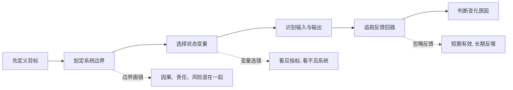
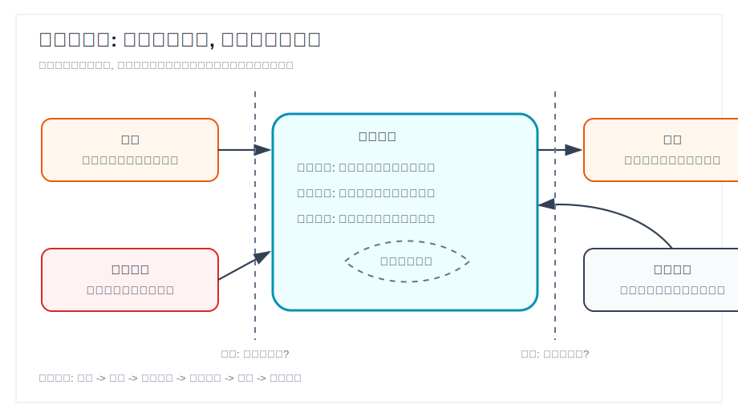

## 物理学思维筑基课: 系统与边界

### 作者
digoal

### 日期
2026-06-02

### 标签
数学思维筑基 , 系统 , 边界      

----

## 背景
  

> 面向对象: 大学生及有一定社会阅历的成年人  
> 核心问题: 为什么很多分析听起来有道理, 一落地就错?  
> 先说结论: 系统与边界是一条分析原则: 先说清楚你把什么当作系统, 把什么放在外部环境, 再讨论变量、因果、责任和反馈。边界画错, 后面的推理越严密, 错得越系统。

## 文章控制表

| Item | Required content |
|---|---|
| Input type | 观点/原则 |
| Chosen version | 标准系统分析版本: 分析前先定义系统、边界、输入、输出、状态变量和反馈 |
| Central question | 如何避免把局部现象误判为整体规律, 或把外部扰动误判为内部能力? |
| Assumptions and boundaries | 目标明确: 成立时能判断哪些变量相关, 不成立时边界没有标准; 时间尺度明确: 成立时能区分短期扰动和长期结构, 不成立时会把噪声当趋势; 可观测变量足够: 成立时能跟踪状态变化, 不成立时只能凭感觉; 外部环境可区分: 成立时能识别输入输出和反馈, 不成立时会把责任和原因混在一起 |
| Evidence or derivation route | 从物理学的研究对象定义出发, 推广到系统分析: 研究对象 -> 边界 -> 状态变量 -> 输入输出 -> 反馈 -> 适用边界 |
| Visual plan | Mermaid 展示分析流程; SVG 展示系统边界、输入输出和反馈; 表格展示前提成立与不成立的后果 |

## 一张图先看懂





## 求真讲法

### 它到底说了什么

“系统”是你为了分析某个问题而圈定的研究对象。“边界”是你暂时划出的内外分界线: 边界之内的变量被当作系统内部结构, 边界之外的变量被当作环境、输入、输出或扰动。

这不是文字游戏。边界决定三件事: 第一, 哪些变量需要被解释; 第二, 哪些因素被视为外因; 第三, 哪些反馈需要纳入分析。

例如分析一家公司的利润下滑。你可以把系统边界画在“销售团队”, 也可以画在“整个公司”, 还可以画在“行业价值链”。边界不同, 结论完全不同: 可能是销售执行差, 可能是产品竞争力下降, 也可能是行业需求进入下行周期。

### 它是怎么来的

在经典力学里, 分析一个物体受力前, 先要说清楚研究对象是什么。你研究的是一个小球, 还是小球加斜面, 还是小球、斜面和地球组成的整体? 研究对象一变, 内力和外力的划分就变了。原来需要计算的摩擦力, 换一个系统边界后, 可能变成系统内部相互作用。

这条思想推广到复杂系统: 任何分析都不能先谈“原因”, 而要先谈“哪个系统里的原因”。因为因果不是悬空存在的, 它总是发生在某个边界内。

### 它依赖哪些假设

| 前提 | 成立时 | 不成立时 |
|---|---|---|
| 目标明确 | 能判断哪些变量该进系统 | 分析会变成什么都想解释 |
| 时间尺度明确 | 能区分短期波动和长期结构 | 会把一次波动误判为根本变化 |
| 可观测变量足够 | 能追踪系统状态 | 只能用印象替代证据 |
| 外部环境可区分 | 能识别输入、输出和扰动 | 会把外因、内因、反馈混为一谈 |

### 常见误解

第一种误解: “边界就是客观存在的墙。”不对。很多边界是分析工具, 不是自然界已经替你画好的线。公司、家庭、市场、产品线、部门, 都可以成为系统, 取决于你要回答什么问题。

第二种误解: “边界越大越真实。”也不对。边界越大, 变量越多, 解释成本越高。好的边界不是最大边界, 而是足以解释目标问题的最小边界。

第三种误解: “局部最优就是整体最优。”这是边界错误的典型后果。一个部门节省成本, 可能让另一个部门交付崩溃; 一个投资人降低单项风险, 可能让整个组合失去收益来源。

## 求存讲法

### 它有什么用

系统与边界的最大用处, 是防止你把问题分析成一堆孤立碎片。它逼你问六个问题:

```text
我要解释什么结果?
我把什么圈进系统?
我把什么放到外部?
系统的关键状态变量是什么?
输入、输出、扰动分别是什么?
反馈会不会改变原来的判断?
```

这六个问题一问, 很多空泛判断会自动失效。

### 它怎么迁移到熟悉领域

在投资里, 如果你只把系统边界画在“公司财报”, 你会过度相信利润表; 如果把边界扩大到“产业链和资本市场”, 你会看到上游成本、下游需求、利率、估值和流动性。前者适合做公司质地分析, 后者适合判断股价波动来源。

在产品管理里, 如果你把系统边界画在“功能完成度”, 你会不断加功能; 如果画在“用户完成任务的全过程”, 你会发现真正的瓶颈可能在注册、理解、协作、支付或售后。

在组织管理里, 如果你只把边界画在“员工个人表现”, 你会把低效率归因于态度; 如果画在“激励、流程、信息流和决策权”, 你可能发现员工只是系统反馈的结果。

### 它的适用范围和边界

这条原则适用于问题诊断、投资研究、产品设计、组织管理、社会分析等场景。它不直接给答案, 但能显著减少错问问题的概率。

它的边界也很清楚: 如果目标本身混乱, 边界无法合理选择; 如果关键变量不可观察, 分析只能保持假设状态; 如果系统处在剧烈相变中, 旧边界可能很快失效。

### 正例: 怎么用它提升能力

假设一个创业公司发现获客成本上升。一个粗糙判断是“市场团队不行”。但如果先画系统边界, 会得到更好的诊断:

- 系统目标: 降低有效获客成本。
- 系统边界: 从广告投放扩展到用户认知、转化、留存和复购。
- 状态变量: 获客成本、转化率、留存率、客单价、复购率。
- 外部扰动: 竞争对手补贴、平台流量价格上涨。
- 反馈回路: 低质量流量导致留存差, 留存差又抬高真实获客成本。

这个正例成立, 是因为“目标明确”和“可观测变量足够”两个前提成立。边界扩大后, 问题不再是单点投放效率, 而是商业系统的单位经济模型。

### 反例: 前提不成立会怎样

一个投资人看到某公司利润连续两个季度下降, 就判断“公司基本面恶化”。这里的问题不一定是结论错, 而是边界太窄。他只把边界画在公司内部, 没有纳入行业周期、原材料价格、汇率、库存周期和竞争格局。

如果利润下降来自行业去库存, 公司市占率反而上升, 那么“内部能力恶化”这个结论就不成立。这个反例失败的原因, 是“外部环境可区分”和“时间尺度明确”两个前提没有满足。

## 思考

系统与边界真正训练的不是分类能力, 而是责任感: 你必须为自己的分析对象负责。很多争论之所以没有结果, 不是因为双方逻辑差, 而是因为他们讨论的不是同一个系统。

一个管理者说“员工执行力差”, 一个员工说“流程和目标天天变”。谁对? 先别急着站队。把系统边界画出来: 如果边界只到个人, 前者看似对; 如果边界扩展到组织流程, 后者可能更接近结构性原因。

一个投资者说“这家公司便宜”, 另一个投资者说“这个行业没前途”。谁对? 也要看边界。前者可能在看估值系统, 后者可能在看产业系统。估值便宜不自动推出长期价值, 行业承压也不自动推出个体失败。

最值得反复练习的问题是: 我现在看到的是系统本身, 还是我画出来的边界?

## 最后记住

1. 不先定义系统, 就没有可靠因果。
2. 边界不是越大越好, 而是要服务于问题。
3. 内因和外因不是天然分类, 它们取决于你画的边界。
4. 反馈回路常常比单个变量更重要。
5. 每次结论改变前, 先检查是不是系统边界变了。

## 参考资料

- 用户提供材料: “系统与边界”作为经典力学、热力学和复杂系统思维的底层概念之一。
- 通用教材体系: 经典力学中的研究对象、受力分析、内力/外力划分; 热力学和系统科学中的系统、环境、边界、输入、输出概念。
- 未联网核验说明: 本文未使用具体历史引文或特定教材页码, 只采用标准教材层面的通用概念。
  
#### [PostgreSQL 解决方案集合](../201706/20170601_02.md "40cff096e9ed7122c512b35d8561d9c8")
  
  
#### [德哥 / digoal's Github - 公益是一辈子的事.](https://github.com/digoal/blog/blob/master/README.md "22709685feb7cab07d30f30387f0a9ae")
  
  
#### [About 德哥](https://github.com/digoal/blog/blob/master/me/readme.md "a37735981e7704886ffd590565582dd0")
  
  

  
