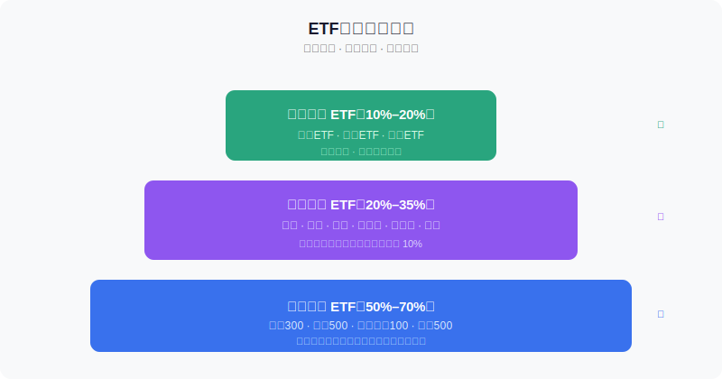
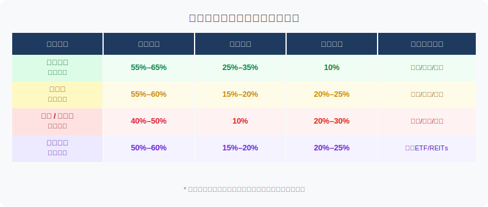
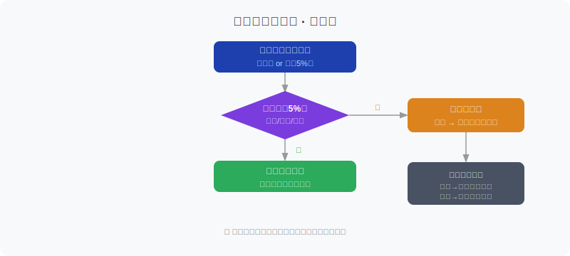

## 散户投资小白金融全品种操盘手册 - 4.11 ETF组合 —— 核心宽基 + 卫星行业 + 防守资产
  
### 作者  
digoal  
  
### 日期  
2026-06-02  
  
### 标签  
金融产品 , 金融工具 , 散户 , 投资小白 , 全品操盘手册  
  
----  
  
## 背景 
  

## 开篇：为什么单买一只ETF大概率跑不赢？

你有没有这种经历：买了沪深300，结果行情是科技板块大涨；买了行业ETF，结果市场系统性下跌把你的行业也拖下去了；全买债券，又觉得涨得太慢，总在后悔。

问题不在于你选错了品种，而在于**你把"品种选择"和"组合构建"这两件事混为一谈了**。

ETF的最大优点不是"选中一只涨得快的"，而是**可以用低成本把多种风险拼在一起，互相对冲，形成一个比单独买任何一种都稳的组合**。

这一节要解决的核心问题就是：**怎么把手里的ETF拼成一个完整的作战体系，而不是一盘散沙？**

---

## 组合的基本逻辑：三层结构

一个成熟的ETF组合，不是"买了几只感觉不错的ETF"，而是像搭建一栋楼：有承重墙、有功能间、有避雷针。

三层结构的分工如下：

**第一层：核心宽基（承重墙）**

占仓位的 50%–70%，目的是**跑赢大盘，长期复利**。

用宽基ETF作为核心，是因为：
- 分散够充分，不押注单一行业；
- 费率低（主流宽基ETF年管理费0.15%–0.5%），长期摩擦成本小；
- 流动性强，可以随时买卖而不产生明显冲击成本；
- 历史数据（Wind，2005–2024年）显示：主动管理基金中约80%在10年维度跑不赢沪深300指数基金。

代表品种：沪深300 ETF（510300）、中证500 ETF（510500）、创业板ETF（159915）、纳斯达克100 ETF（513100）、标普500 ETF（513500）。

**第二层：卫星行业（功能间）**

占仓位的 20%–35%，目的是**在特定市场环境中获取超额收益**。

卫星仓是核心仓的"助攻"，不是主角。它的规则是：
- 单一行业ETF不超过总仓位的 10%（防止行业集中导致的系统性踩雷）；
- 跟随市场环境轮动，不是"看好就一直持有"；
- 行业ETF不是用来"抄底"的，而是用来"顺势加码"的。

代表方向：科技/半导体（牛市）、消费/医药（防御+成长）、金融/地产（低估值周期）、新能源（政策主题期）。

**第三层：防守资产（避雷针）**

占仓位的 10%–20%，目的是**在市场波动时减少整体组合的回撤**。

这一层不是来"赚钱"的，是来"保命"的——当市场下跌20%，防守资产如果只跌5%甚至上涨，就完成了使命。

代表品种：
- 黄金ETF（518880）：避险属性，与A股相关性低；
- 债券ETF（511010国债ETF等）：利率下行时额外增值；
- 红利ETF（510880）：高股息品种，波动率显著低于宽基。

---

## 第一性原理分析

支撑"三层组合比单只ETF更优"成立，需要以下前提：

**前提A：不同ETF之间的相关性较低**
→【常量】→ 跨资产类别（股票vs黄金vs债券）的相关性在历史上长期偏低，是可以依赖的统计规律。

**前提B：投资者能持续执行再平衡操作**
→【变量】→ 需要投资者有纪律，不因行情波动频繁调整。若前提不成立，组合会逐渐退化为"随机买卖"。

**前提C：各层资产的底层逻辑未被破坏**
→【变量】→ 如果宽基指数持续跑输通货膨胀，或债券市场出现系统性违约，组合有效性下降。

**情景推演：**

正常情景（前提全部成立）：三层组合年化波动率显著低于单只行业ETF，回撤更小，长期复利效果优于大多数散户主动操作。

压力情景（前提B不成立，投资者无法坚持再平衡）：组合会因市场波动变形，核心宽基比例可能在牛市末期被动升高（追涨），导致高位集中。应对：设置日历提醒，强制每季度检查一次。

极端情景（前提A+C同时失效，如2008年全球金融危机）：各类资产同步大幅下跌，防守层失效。应对：极端情况下持有现金/货币基金是唯一的"绝对防守"，组合里可保留5%–10%的现金仓位备用。

---

## 不同市场环境下，怎么调整三层比例？

组合不是搭好就不动了。市场环境变化，三层的比例也要随之微调。

关键原则：
- **调整的是"比例"，不是"品种"**。核心宽基ETF一般不换，只是加减仓位比例；
- **卫星仓轮动靠"行业景气度"判断**，不靠"感觉哪个涨了"；
- **防守仓不能因为"觉得没用"就清零**。没出事的时候它是拖累，出事的时候它救你的命。

数据支撑：根据银河证券研究所2023年的基金组合研究报告，采用核心宽基+防守资产组合策略的账户，在2022年熊市中平均最大回撤约为14.2%，而纯宽基ETF持有者平均最大回撤约为22.7%。差距的来源，正是防守层在下跌中的缓冲效果。

---

## 再平衡：让组合自动"低买高卖"

再平衡是整个组合策略中最被低估的操作。很多人觉得"只是调调比例，没什么大用"，实际上，再平衡的本质是**强制你在某类资产涨多了之后卖一些，在跌多了之后买一些**——这正是大多数散户做不到的"逆向操作"。

**再平衡的两种触发方式：**

1. **日历触发**：每季度（或每半年）固定检查一次，不管市场涨跌；
2. **偏离触发**：某层资产实际占比与目标占比偏差超过 5 个百分点，立即再平衡。

**实操例子**：

假设你初始组合是：宽基60% + 卫星25% + 防守15%，共10万元。

半年后，科技行业大涨，卫星ETF涨了40%，宽基涨了15%，防守黄金ETF跌了5%。

此时你的实际组合变成约：宽基55% + 卫星33% + 防守12%（估算）。

卫星占比已从25%飘到33%，偏离目标超过5%。

**操作步骤：**
- 第一步：计算各层当前市值和目标市值的差额；
- 第二步：卖出卫星ETF中超出目标的部分（大约8%对应资金）；
- 第三步：将卖出资金买入宽基ETF或防守ETF，恢复目标比例；
- 第四步：记录再平衡日期和操作金额，下次季度检查时对照。

如果执行错误（比如卖错了ETF或买多了某只）：不要慌，市值偏差在±3%以内不需要立即纠正，等下次日历触发时再调整。

**历史不代表未来，但再平衡逻辑的核心是"均值回归"——任何一类资产不会无限上涨，也不会无限下跌。** 只要底层逻辑（经济增长、利率周期）没有永久性崩溃，再平衡就有统计意义上的有效性。

---

## 常见错误：让组合失效的四种方式

**错误一：卫星仓越来越多，核心仓越来越少。**
常见场景：市场热点轮动，你每次都跟着追行业ETF，最终卫星仓占到60%以上，组合变成"行业赌注"。修正方法：强制设置卫星仓上限，超过就卖。

**错误二：防守仓"太无聊"就清空。**
黄金和债券在牛市里确实跑不赢宽基，很多人会把它们清仓去追科技ETF。结果一旦市场逆转，组合毫无缓冲。记住：防守仓是保险，不是拖累。

**错误三：频繁再平衡，反复产生交易成本。**
有人每周都要"调一调"，每次调几百块，却忘了每次都有手续费和印花税。结论是：调整频率每季度一次足够；偏离不足5%的情况，完全不需要操作。

**错误四：核心宽基选了一只规模太小的ETF。**
一只宽基ETF规模不足1亿元，流动性差，买卖价差大，还可能面临清盘风险（当基金规模长期低于5000万时，基金公司有权清盘）。选宽基ETF，优先选规模前三的主流产品。

---

## 实操：从零搭建一个20万的ETF组合

**场景设定**：有20万可投资资产，风险承受能力中等，当前市场处于震荡偏防御的阶段。

**第一步：确定三层比例**
震荡市参考：核心宽基55% + 卫星行业20% + 防守资产20% + 现金备用5%

对应金额：
- 宽基：11万元
- 卫星：4万元
- 防守：4万元
- 现金（货币基金）：1万元

**第二步：选择具体ETF**

核心宽基（11万）：
- 沪深300 ETF（510300）6万元，跟踪A股大盘；
- 中证500 ETF（510500）3万元，中小盘补充；
- 纳斯达克100 ETF（513100）2万元，海外科技配置。

卫星行业（4万）：
- 消费ETF（159928）2万元（震荡市防御性消费）；
- 医药ETF（512170）2万元（长期成长逻辑稳定）。

防守资产（4万）：
- 黄金ETF（518880）2万元；
- 债券ETF（511010国债ETF）2万元。

现金备用（1万）：放入货币基金（7日年化收益率参考，截至2025年约1.6%–1.8%）。

**第三步：设置再平衡提醒**
在手机日历设置每季度末检查组合比例，超过5%触发再平衡。

**第四步：记录买入逻辑**
每只ETF写明"买入理由"，方便日后判断逻辑是否仍然成立，而不是靠感觉决定卖不卖。

---

## 可复用框架

**【三层检查法】**

适用场景：每次想买一只新ETF时，先问自己：它属于哪一层？

核心逻辑：任何一只ETF在组合里都应该有明确定位，不是"觉得不错"就买。

操作步骤：
1. 判断这只ETF是宽基（承重）、行业（进攻）还是防守（缓冲）；
2. 检查这一层当前占比是否已满；
3. 如果满了，先减仓原有的，再买新的，维持三层比例稳定。

举一反三：这个框架同样适用于A股个股（核心白马+卫星成长+防御高股息）、美股组合（宽基ETF+行业ETF+债券ETF+黄金）。

---

**【偏离5%再平衡规则】**

适用场景：长期持有ETF组合，不想每天盯盘又担心比例失控。

核心逻辑：用偏离阈值代替主观判断，把"要不要调"变成机械化操作。

操作步骤：
1. 每季度打开账户，计算各层实际占比；
2. 与目标占比对比，找出偏差超过5%的层；
3. 卖高买低，恢复目标；
4. 记录操作日期，下季度重复。

举一反三：同样适用于资产配置（A股vs美股vs黄金vs债券），原理完全相同。

---

## 本节行动清单

- [ ] 写下自己当前持有的所有ETF，按三层结构分类，看看属于哪一层；
- [ ] 计算每一层的实际占比，与目标比例对比；
- [ ] 明确自己当前所处的市场环境（牛市/震荡/熊市），对应调整三层比例参考；
- [ ] 在手机日历设置下次季度末的再平衡检查提醒；
- [ ] 清理组合里没有明确定位（说不清属于哪层）的ETF，考虑是否值得继续持有。

---

## 一句话总结

ETF不是越多越好，三层结构的核心是"分工明确"——宽基守底、行业进攻、防守资产兜底，再配合季度再平衡，让组合自动执行"高卖低买"的纪律。

---

> ⚠️ **声明**：本文内容为投资教育目的，所有历史数据、策略框架均为辅助学习工具，不构成证券投资建议。市场有风险，投资需谨慎。实际操作请结合自身风险承受能力，必要时咨询专业投顾。
  
  
#### [PostgreSQL 解决方案集合](../201706/20170601_02.md "40cff096e9ed7122c512b35d8561d9c8")
  
  
#### [德哥 / digoal's Github - 公益是一辈子的事.](https://github.com/digoal/blog/blob/master/README.md "22709685feb7cab07d30f30387f0a9ae")
  
  
#### [About 德哥](https://github.com/digoal/blog/blob/master/me/readme.md "a37735981e7704886ffd590565582dd0")
  
  

  
