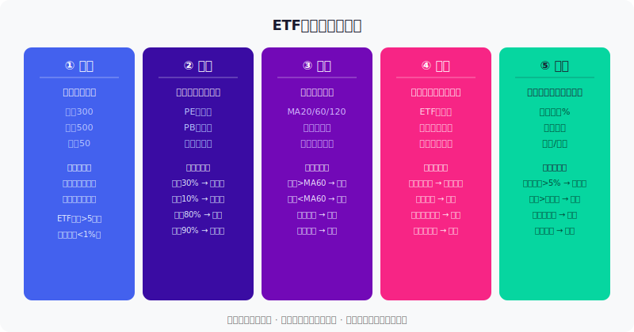
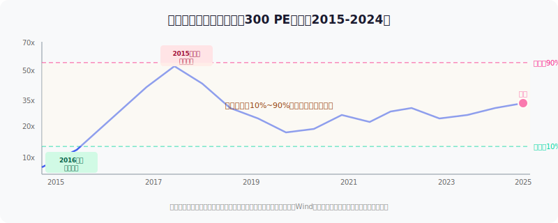
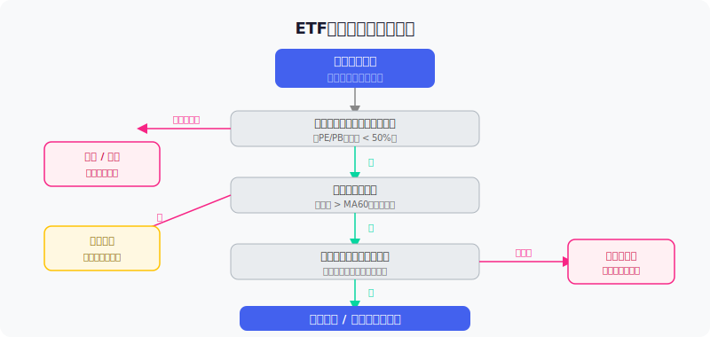

## 散户投资小白金融全品种操盘手册 - 4.12 ETF复盘表 —— 指数、估值、趋势、资金、仓位
  
### 作者  
digoal  
  
### 日期  
2026-06-02  
  
### 标签  
金融产品 , 金融工具 , 散户 , 投资小白 , 全品操盘手册  
  
----  
  
## 背景 
  

## 先问你一件让很多人亏钱的事

有一类投资者，买ETF不复盘，死拿着不动，美其名曰"长期主义"。结果持有三年，指数没回来，自己先跑了。

另一类投资者，天天复盘，每隔三天就想换一只，结果手续费加上踏空，比不动还亏。

真正的复盘不是天天盯着涨跌，而是每周用一张表回答五个问题：**我买的是什么、贵不贵、方向对不对、钱往哪流、我拿了多少**。这五个问题，就是ETF复盘表的全部内容。

本节手把手教你建立这张表，并告诉你什么信号该动，什么信号不用动。

---

## 为什么需要复盘表？

先说一个数据：根据中国证券投资基金业协会2023年报告，个人投资者持有偏股型基金的平均持有期只有**9个月**，而在这9个月内，超过60%的人经历了一次以上的追涨杀跌操作。

问题不是看错了市场，而是没有一套系统来帮他们做判断——什么情况下该加仓，什么情况下该忍住，什么情况下该止损。

复盘表的价值就在这里：它让你的每一次操作都有依据可查，而不是靠情绪拍脑袋。

---

## 核心概念：五维度复盘框架

五个维度，缺一不可：

**① 指数**：你买的ETF跟踪什么指数？指数本身有没有变化？

**② 估值**：这个指数现在是贵还是便宜？

**③ 趋势**：价格是在涨还是在跌？

**④ 资金**：有没有大资金在流入或流出这个ETF？

**⑤ 仓位**：你目前持仓多少？有没有超出自己的计划？

---

## 第一性原理分析

**核心观点**：用五维度复盘表定期评估ETF，能显著提高操作胜率，减少情绪化决策。

【前提清单】

- **前提A**：指数的编制规则是稳定的，不会频繁变更成份股 → 【基本常量】→ A股主流宽基指数规则透明，中证指数公司每半年调整一次，规律可查。
- **前提B**：估值有均值回归特性，极端低估会被市场修复 → 【大概率成立的变量】→ 10年历史数据支撑，但极端情况（如行业性衰退）可能导致长期低估不回归。
- **前提C**：趋势信号有一定预测价值 → 【变量】→ 在趋势市中有效，在剧烈震荡市中容易"被假突破"。
- **前提D**：资金流向能反映市场共识变化 → 【变量】→ 单次数据参考价值有限，需看连续5~10个交易日的方向。

【情景推演】

| 情景 | 前提状态 | 结论 | 操作调整 |
|------|----------|------|---------|
| 正常 | A、B、C、D全部成立 | 五维度评分有效 | 按表操作 |
| 压力 | 前提C失效（震荡市） | 趋势信号频繁假突破 | 降低趋势维度权重，提高估值和仓位权重 |
| 极端 | B+C失效（政策重大转向） | 历史估值区间参考价值降低 | 暂停操作，等待新均衡形成，保守仓位 |

---

## 五个维度详解

### 维度一：指数——你买的是什么？

这是最容易被忽视的一维，很多人买了某个ETF，三年后连成份股换了什么都不知道。

**要检查的内容：**

1. **ETF规模是否健康**：规模低于2亿元的ETF，随时可能因规模不达标被清盘。建议选规模5亿元以上的ETF。
2. **跟踪误差是否正常**：跟踪误差（ETF涨跌与指数涨跌的偏差）全年累计不应超过1%。超了说明基金经理操作有问题或费率侵蚀严重。
3. **折溢价是否异常**：ETF的市价和净值之间的偏差。正常在±0.3%以内。偏离过大要小心。
4. **指数成份股有没有重大变化**：中证500每半年调整一次，如果调整方向与你的判断相反，要重新评估。

**数据来源**：各大ETF的管理公司官网、基金公告、天天基金、Choice数据均可查。

---

### 维度二：估值——贵了还是便宜了？

估值是复盘表里最有价值的维度之一。

**核心指标**：

- **PE百分位**（市盈率百分位）：过去10年里，当前估值比多少历史数据低。比如"PE百分位30%"意味着比过去10年70%的时间都便宜。
- **PB百分位**（市净率百分位）：对于金融、地产等账面资产多的行业更有参考价值。
- **股息率**：当前股息率如果高于历史均值，往往是低估信号。

**操作参考标准**（基于2005-2024年数据，来源：Wind、中证指数）：

| 估值百分位 | 含义 | 参考操作 |
|------------|------|---------|
| 0~10% | 历史极低估 | 分批加仓，提高仓位上限 |
| 10~30% | 低估区间 | 可建仓 / 定投 |
| 30~60% | 中性区间 | 持有为主，不追高 |
| 60~80% | 偏高区间 | 不追买，考虑小幅减仓 |
| 80~100% | 历史高估 | 谨慎，分批止盈 |

**重要提示**：行业ETF的估值参考价值比宽基ETF更弱，因为行业可能长期处于高估或低估（比如游戏在2021年监管收紧后，PE高企但盈利能力下降）。对于行业ETF，要结合行业景气度综合判断，不能只看数字。

---

### 维度三：趋势——方向往哪走？

趋势分析不是让你做短线，而是帮你判断"加仓时机"是否合适。

**核心工具**：移动平均线（MA）

- **MA20**（20日均线）：短期趋势，用于判断近期方向。
- **MA60**（60日均线，约3个月）：中期趋势，最重要的参考线。
- **MA120**（半年线）：中长期趋势。

**简单判断规则**：

| 状态 | 信号 | 含义 |
|------|------|------|
| 价格 > MA60，且MA60向上 | 偏多信号 | 趋势友好，可以持有或加仓 |
| 价格 < MA60，MA60向下 | 偏空信号 | 不宜追入，等待企稳 |
| 价格跌破MA60（放量） | 趋势破坏 | 需要警惕，考虑止损 |
| 价格回踩MA60后企稳（缩量） | 回踩确认 | 相对好的加仓时机 |

**一个反例**：2021年2月，A股宽基ETF估值处于中高区间（PE百分位约75%），但趋势强劲，很多人误以为"趋势向上就可以追"。结果随后两个月大盘大幅回调，宽基ETF最大回撤超过15%。教训是：高估值时，趋势信号的可靠性大幅下降。

---

### 维度四：资金——钱往哪里流？

ETF有一个独特的透明度优势：资金的流入流出是可以直接追踪的。

**三个观察角度**：

1. **ETF净申购/净赎回**：如果某只ETF连续多天被大量申购，意味着市场共识在增强，机构在涌入。连续赎回则相反。可在基金公告、天天基金、东方财富App查到每日份额变化。

2. **北向资金**（沪深港通外资）：北向资金持续流入某个板块，往往代表外资对该板块的中长期看法。但单日数据意义不大，要看连续5~10日的方向。

3. **折溢价**：如果ETF的市价持续高于净值（溢价），说明场内买入热情高涨，是情绪过热的信号，追入要小心。

**数据来源**：东方财富、天天基金、ETF官方公告、上交所、深交所网站。

---

### 维度五：仓位——我拿了多少？合理吗？

这是最容易被跳过、也最重要的一维。

很多人看完估值、趋势、资金，信心十足，结果发现自己这只ETF已经占总仓位的40%——超出了原定计划。

**标准设置建议**（仅供参考，需根据个人风险承受能力调整）：

| ETF类型 | 单只仓位上限 | 说明 |
|---------|-------------|------|
| 宽基ETF（沪深300、中证500等） | 25~30% | 核心仓，可相对集中 |
| 行业ETF | 10~15% | 风险集中，不宜过重 |
| 海外/跨境ETF | 10~15% | 叠加汇率风险 |
| 红利/低波ETF | 15~20% | 防守类，可适当多配 |
| 单只黄金/商品ETF | 5~10% | 对冲工具，不是进攻主力 |

**触发操作的仓位信号**：

- **超出目标上限5%以上** → 执行再平衡，减仓至目标上限
- **亏损触及个人止损线** → 无论其他指标如何，执行止损
- **达到止盈目标价** → 按计划减仓

---

## 实操例子：从零建一张ETF复盘表

**假设场景**：小王，30岁，总投资资金20万，持有沪深300ETF（510300）约5万元，占比25%。他在每周五收盘后进行复盘。

**第一步：填写指数维度**

| 检查项 | 数值 | 结论 |
|--------|------|------|
| ETF规模 | 约600亿元 | ✅ 规模充足 |
| 跟踪误差（年化） | 0.12% | ✅ 正常 |
| 折溢价 | +0.05% | ✅ 几乎无偏差 |
| 成份股近期调整 | 无重大变化 | ✅ 稳定 |

**第二步：填写估值维度**（以2024年数据为例，来源：Wind）

| 指标 | 当前值 | 历史百分位 | 结论 |
|------|--------|-----------|------|
| PE | 约12倍 | 约25% | ✅ 低估偏下 |
| PB | 约1.3倍 | 约20% | ✅ 低估区间 |
| 股息率 | 约3.2% | 历史偏高 | ✅ 积极信号 |

→ **估值结论：偏低估，有吸引力**

**第三步：填写趋势维度**

- 本周收盘价 > MA60：✅ 是
- MA60方向：横盘偏上
- 成交量：较上周缩量
- 是否破位：否

→ **趋势结论：偏多，但量能一般，不急追**

**第四步：资金维度**

- 本周北向净流入：+30亿（连续3周流入）
- 510300份额变化：净申购，增加约5亿份
- 折溢价：+0.05%，正常

→ **资金结论：温和流入，共识增强中**

**第五步：仓位维度**

- 当前持仓占比：25%
- 目标上限：30%
- 浮盈/浮亏：+3%，约盈利1500元
- 止损线：-10%（从买入成本算）

→ **仓位结论：在合理区间，可以维持，或小幅加仓至27%**

**最终操作决策**：估值低、趋势偏多、资金温和流入、仓位未超限 → **维持持仓，下周定投计划继续执行，不追高**。

如果某项指标变红（比如估值突然升到80%百分位以上），下次复盘时就要重新评估是否需要减仓。

---

---

## 可复用框架

---

**【五维度复盘法】**

适用场景：每只ETF的周度/月度复盘，以及买入前的尽调。

核心逻辑：估值决定"值不值"，趋势决定"时机对不对"，资金决定"共识有没有"，仓位决定"超没超边界"，指数决定"工具稳不稳"。五个维度一票否决制——任何一维亮红灯，不能增加仓位。

操作步骤：
1. 建立一张电子表格，列头为五个维度，行为各ETF持仓
2. 每周五花15分钟填写（数据来源：天天基金/东方财富/交易所公告）
3. 给每个维度打分：绿色（积极）/ 黄色（中性）/ 红色（警惕）
4. 统计各持仓的颜色分布，根据结果决定操作

举一反三：这套框架同样可以用在个股复盘（替换"指数维度"为"公司基本面"）、可转债复盘（替换"趋势"为"转股溢价率趋势"），乃至债券ETF（替换"估值"为"利率走势"）。

---

**【信号-操作对应表】**

适用场景：每次想要操作前，强制对照这张表，避免冲动买卖。

| 信号组合 | 建议操作 |
|----------|---------|
| 估值低 + 趋势偏多 + 资金流入 + 仓位未满 | 按计划加仓 |
| 估值低 + 趋势偏空 + 资金中性 | 定投观望，等趋势企稳 |
| 估值中性 + 趋势偏多 + 仓位未满 | 持有，不追加 |
| 估值高 + 任何趋势 | 不买，分批止盈 |
| 任何估值 + 仓位超上限 | 先再平衡到目标，再讨论其他 |
| 触及止损线 | 不管其他信号，执行止损 |

---

## 本节行动清单

1. **建立复盘表**：在电子表格（Excel/飞书/Notion均可）里为自己的每只ETF建立五个维度的记录行，至少保留过去4周的历史。

2. **找到估值数据源**：注册天天基金（免费）或Choice（部分免费），搜索持有的指数，找到PE/PB历史百分位数据，记录下来。

3. **设定仓位上限**：为每只ETF写下目标仓位和上限，贴在复盘表旁边，每次复盘时对照检查。

4. **制定两条红线**：一条是"止损线"（比如从买入成本下跌15%），一条是"减仓线"（比如估值百分位超过80%）。两条线提前写死，复盘时对照执行。

5. **固定复盘时间**：选择每周一个固定时间（建议周五或周末），15分钟填表，不超时。填完表如果没有触发操作条件，就关掉表格，等下周再看。

---

## 一句话总结

复盘表不是为了告诉你该买什么，而是为了告诉你：**在没有充分理由的时候，不要动**。

---

> ⚠️ **声明**：本文内容为投资教育目的，所有历史数据、策略框架、参考区间均为辅助学习工具，不构成证券投资建议。市场有风险，投资需谨慎。所提及估值百分位等数据来源于历史统计，历史规律不代表未来走势，实际判断请结合当时市场环境综合分析。实际操作请结合自身风险承受能力，必要时咨询专业投顾。
  
  
#### [PostgreSQL 解决方案集合](../201706/20170601_02.md "40cff096e9ed7122c512b35d8561d9c8")
  
  
#### [德哥 / digoal's Github - 公益是一辈子的事.](https://github.com/digoal/blog/blob/master/README.md "22709685feb7cab07d30f30387f0a9ae")
  
  
#### [About 德哥](https://github.com/digoal/blog/blob/master/me/readme.md "a37735981e7704886ffd590565582dd0")
  
  

  
