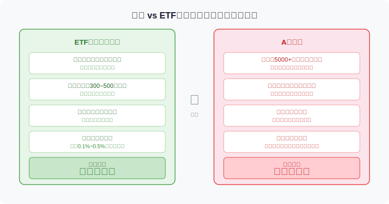
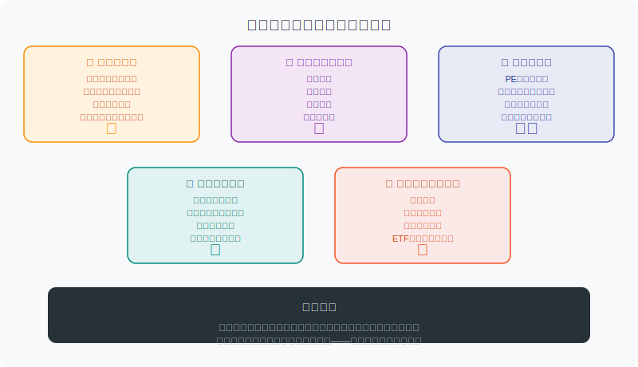
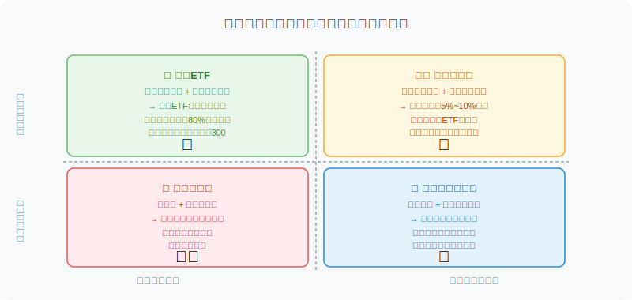

## 散户投资小白金融全品种操盘手册 - 5.1 个股为什么比ETF难
  
### 作者  
digoal  
  
### 日期  
2026-06-02  
  
### 标签  
金融产品 , 金融工具 , 散户 , 投资小白 , 全品操盘手册  
  
----  
  
## 背景 
  


## 先告诉你一个让人不舒服的数据

A股每年有多少散户在个股上亏钱？

根据中国证监会投资者保护局历年发布的数据，A股个人投资者中，**持有期不足一年的短线散户，80%以上的年度亏损概率高于同期指数**（来源：中国证券投资者保护基金，2023年投资者状况调查）。

换句话说，你努力选股、研究公司、盯盘交易，结果很可能还不如什么都不做、买一只跟大盘的ETF。

这不是在劝你不买股票。这一章会系统教你怎么做个股。但在正式进入操盘方法之前，你必须先搞清楚：**你面对的是什么量级的游戏**。

---

## 个股和ETF到底差在哪里？

很多人以为ETF和个股的区别只是"分散"和"集中"——买ETF是买一篮子，买个股是挑一只。这种理解是对的，但太肤浅了。

真正的差别是：**你在跟谁比赛，以及你能拿到什么信息。**



**买ETF，你的对手是"市场平均"。**

沪深300ETF每天的涨跌，就是市场里300只最大公司的加权平均表现。你不需要判断哪只股票好，只需要判断"市场整体环境是不是有机会"。这个判断相对容易——宏观数据是公开的，估值是透明的，指数的历史走势是完整的。

**买个股，你的对手是"所有参与这只股票的投资者"，包括顶级机构。**

当你在研究一家公司的财报时，这家公司的对口基金经理，可能已经见过公司管理层三次了。他的团队有行业分析师、量化模型、产业链专家，甚至有专门做"草根调研"（直接去门店数客流量）的研究员。

你和他在同一个市场里买同一只股票，谁更可能赚钱？

---

## 五大障碍：难在哪里



### 障碍一：信息不对称

这是最核心的障碍，也是最容易被忽视的。

很多散户以为，研究个股就是"看财报、看新闻"。但你看到的这些信息，机构早就知道了。财报一发布，几十个分析师立刻启动模型解读，一小时内报告就出炉了，然后基金经理看完报告调整仓位，这一切可能在你看完财报标题之前就已经完成。

**市场是一台极度高效的"消化机器"**。大部分公开信息都会在发布后极短时间内被反映到股价里。所以散户看"好消息"追进去，往往已经是高位了。

更危险的是，真正重要的信息——管理层真实意图、客户反馈、竞争对手动态——散户几乎拿不到。

### 障碍二：基本面研究量极大

认真做个股，等于认真做一份持续不断的作业：

- 每个季度读一遍财报，不是只看净利润，要看收入结构、现金流、应收账款
- 持续跟踪行业动态：政策变化、竞争对手、上下游原料价格
- 关注管理层的一举一动：有没有减持？对外说的话和财报数据是否一致？

如果你只持有1只股票，这已经是不小的工作量。如果持有5只，基本上要把业余时间全押上。

ETF不需要这些。你只需要大方向对，其余交给指数规则。

### 障碍三：估值判断难

ETF的估值很容易看：沪深300的PE历史分位，是公开数据，有很多网站直接提供。

个股的估值是另一回事。

- 消费股，看PE合不合理
- 银行股，要看PB
- 科技成长股，可能根本没有利润，要看PS甚至GMV（成交额）
- 周期股，要看PB乘以ROE，还要看周期在哪个阶段

不同行业，完全不同的估值逻辑。你不能用"PE低就是便宜"这种模板套所有股票，否则你会不断买到"便宜的烂公司"。

### 障碍四：情绪放大效应

买ETF，你大概率不会每天刷行情，因为你知道它是长期慢慢涨的。

买个股，很多人会不自觉地每隔一小时看一次股价，看到涨了心跳加速，看到跌了开始怀疑自己。

这种心理是有科学支撑的。行为金融学研究发现（Kahneman & Tversky，1979年展望理论），人们对同等幅度的损失，痛苦程度是收益带来的快乐的**2.5倍**。

持有个股放大了这种痛苦感，因为你的注意力高度集中在一只股票上，每一分的波动都无比清晰。这种情绪很容易驱使你在最不该操作的时候做出错误决定。

### 障碍五：极端风险无法分散

ETF里有1%的公司出了问题，对你的影响是1%再打折扣。个股就不一样了。

- 财务造假：乐视、康美药业，股价曾在短时间内暴跌超过80%
- 政策突变：教育股"双减"政策一出，新东方、好未来在一周内跌去七八成
- 竞争颠覆：一个新进入者改变了商业模式，老公司的护城河瞬间消失

这些事情，在ETF里都被摊薄了。在个股里，就是你一个人全扛。

---

## 第一性原理分析

**核心观点：个股操盘比ETF难，是结构性难，不是努力就能克服的难。**

```
【前提清单】
支撑"个股长期跑赢ETF很难"成立，需要以下前提：

- 前提A：市场信息高度竞争，公开信息快速被消化 → 【常量】
  理由：A股机构化程度持续提升，沪深300成分股的机构持仓占比超70%

- 前提B：散户时间、资源、信息渠道受限 → 【常量】
  理由：这是结构性劣势，学习能改善但无法消除

- 前提C：市场效率程度 → 【变量】
  当市场处于极度非理性（如2015年杠杆牛、熊市恐慌）时，
  信息优势的重要性下降，情绪博弈的比重上升，
  散户的逆向操作反而可能有优势 → 结论变为：极端行情中个股机会窗口打开

【情景推演】
正常市场（正常成交量，机构主导）：个股操盘难度★★★★☆，ETF胜率更高
极端情绪市场（恐慌或暴涨）：情绪博弈空间扩大，有经验的个股操盘者可能有机会窗口
市场极度低效（信息严重不透明、造假频发）：基本面分析失效，个股更危险
```

---

## 什么情况下应该考虑个股？

不是说个股不能碰，而是进入之前需要评估自己是不是具备做个股的条件。



做一个简单的自我测试：

**问题一**：你每周有多少时间研究投资？  
- 少于3小时 → 坚守ETF
- 3~10小时 → 可以小仓位试水
- 10小时以上 → 可以认真考虑个股

**问题二**：如果一只股票跌了30%，你的心理反应是？  
- 恐慌，想立刻止损 → 个股仓位要控制在很低比例
- 焦虑，但能撑住 → 中等仓位，要有明确止损计划
- 能冷静复盘，判断逻辑是否还成立 → 具备做个股的基本心理条件

**问题三**：你有没有研究过一家公司超过6个月？  
- 没有 → 先从读财报开始，不要重仓任何个股
- 有 → 这是核心能力，可以在熟悉的领域做个股

---

## 实操例子：两个散户的同一只股票

**场景**：2023年，某消费行业龙头公司（假设代称A公司），PE 25倍，行业平均30倍，看起来"低估"。资金量均为10万元。

**散户甲的操作**：

- 看到估值比同行低，认为值得买
- 直接买入5万元（50%仓位）
- 三个月后，公司公告增长放缓，股价跌18%
- 甲没有分析原因，焦虑之下在低点卖出，亏损9000元
- 事后股价反弹，甲既懊恼又困惑

**问题出在哪里**：
1. 甲没有搞清楚"为什么PE比同行低"——可能是市场已经定价了增速下滑的预期
2. 仓位过重，波动放大了情绪反应
3. 没有提前想好"如果跌了，逻辑还成不成立"的判断依据

**散户乙的操作**：

- 同样看到A公司，先花了两周时间读近四个季度财报
- 发现：收入增长在放缓，但现金流仍然健康，公司在密集回购股票
- 判断：PE低是有原因的，但回购是积极信号，管理层在用自己的钱表态
- 买入2万元（20%仓位），并提前写下：
  - **买入逻辑**：回购支撑，现金流健康，等待市场重估
  - **失效条件**：如果连续两个季度现金流转负，或停止回购，则卖出
  - **止损位**：跌超25%无论原因重新评估是否继续持有
- 三个月后，同样公告增速放缓，乙重新核对失效条件，发现现金流仍健康、回购仍在进行，判断逻辑未破，选择持有
- 六个月后股价反弹20%，乙盈利4000元

两个人信息起点差不多，差别在于：准备工作、仓位控制、预设判断框架。

---

## 可复用框架

**【买前三问框架】**

适用场景：任何个股买入前的必做检查  
核心逻辑：把"感觉好"转化为"有理由"，避免情绪驱动决策

操作步骤：
1. **我为什么买**（具体到数据和逻辑，不能只说"看涨"）
2. **什么时候我会错**（提前写清楚失效条件，而不是买完了再想）
3. **如果跌了20%我怎么办**（是补仓？止损？还是等待？必须提前决定，而不是在情绪激动时临时判断）

举一反三：这个框架不只适合个股，同样适用于可转债、行业ETF、REITs——任何有亏损可能的工具，买前都应该过这三问。

---

## 本节行动清单

1. **评估自己的适合度**：用本节的三个问题做自我测试，判断自己是"坚守ETF"、"小仓位试水"还是"可以认真做个股"
2. **写下你现在持有个股的"买入理由"**：如果写不出来，说明这个仓位是情绪驱动的，需要认真审视
3. **设定单票上限**：在正式进入后续章节之前，先决定自己的单只个股最高仓位（建议新手不超过总仓位的15%）
4. **不要用"便宜"作为唯一理由**：低PE可能是陷阱，后续第五章会详细讲估值判断
5. **学习读一张简化财报**：哪怕只看"营业收入、净利润、经营现金流"三个数字，也比什么都不看强

---

## 一句话总结

> 个股不是不能做，而是做之前要先弄清楚：你在一个信息不对称的游戏里，凭什么赢？

---

> ⚠️ **声明**：本文内容为投资教育目的，所有历史数据、策略框架均为辅助学习工具，不构成证券投资建议。市场有风险，投资需谨慎。实际操作请结合自身风险承受能力，必要时咨询专业投顾。
  
  
#### [PostgreSQL 解决方案集合](../201706/20170601_02.md "40cff096e9ed7122c512b35d8561d9c8")
  
  
#### [德哥 / digoal's Github - 公益是一辈子的事.](https://github.com/digoal/blog/blob/master/README.md "22709685feb7cab07d30f30387f0a9ae")
  
  
#### [About 德哥](https://github.com/digoal/blog/blob/master/me/readme.md "a37735981e7704886ffd590565582dd0")
  
  

  
