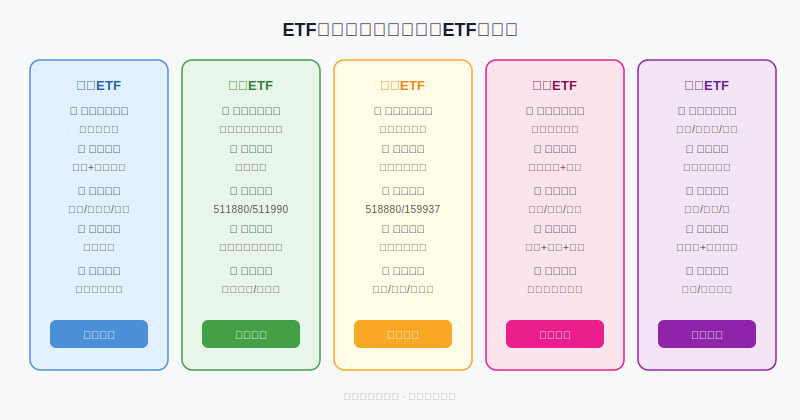
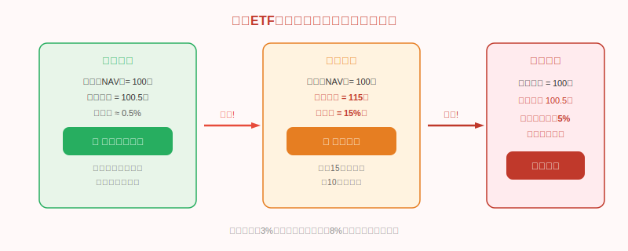
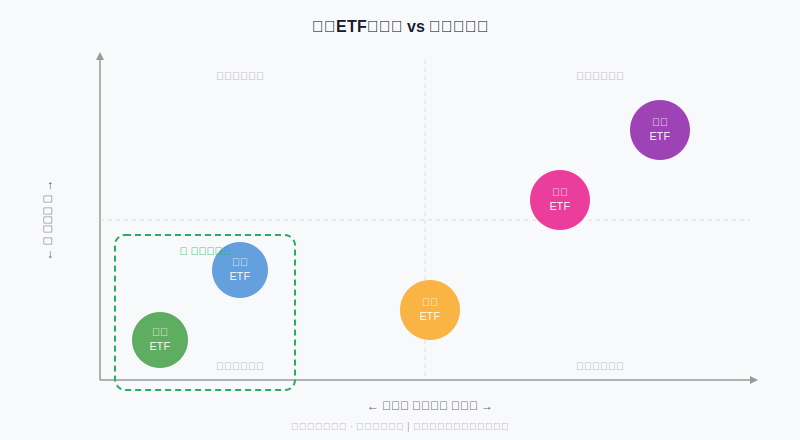

## 散户投资小白金融全品种操盘手册 - 5.2 三类股票 —— 成长、价值、周期
  
### 作者  
digoal  
  
### 日期  
2026-06-02  
  
### 标签  
金融产品 , 金融工具 , 散户 , 投资小白 , 全品操盘手册  
  
----  
  
## 背景 
  


## 先问你一个反直觉的问题

有一只钢铁股，PE（市盈率）只有8倍，看起来极度便宜——结果买进去，一年亏了60%。

另一只同行，PE高达50倍，看起来贵得离谱——反而翻了3倍。

这不是股市的玄学，而是你没搞清楚这是哪类股票，用错了分析框架。

A股里的股票，从商业逻辑上可以分成三大类：**成长股、价值股、周期股**。每一类都有完全不同的驱动力、估值逻辑和操作节奏。弄混了，不是亏一点，而是亏在逻辑本身出了错。

这一节，我们把三类股票说清楚。

---

## 一、先建立整体地图



三类股票的核心差异不在于行业，而在于**盈利的驱动机制**：

- **成长股**：靠"预期"赚钱——市场相信它未来会越来越赚钱，所以今天愿意给高价
- **价值股**：靠"当下"赚钱——它现在就在稳定赚钱，持续分红，价格跌到低估时买入
- **周期股**：靠"商品价格和经济节奏"赚钱——它的利润不是公司自己决定的，而是行业供需决定的

记住这三句话，后面所有分析都会清晰很多。

---

## 二、成长股：买的是未来的故事

### 它是什么？

成长股的核心特征是**收入或利润处于快速增长阶段**，或者市场相信它即将进入快速增长。典型行业包括科技（AI、半导体、云计算）、创新药、新能源、消费互联网。

打个比方：成长股像一个刚创业的年轻人，现在没多少钱，但大家相信他5年后能发财，所以愿意现在借钱给他、追他。

### 估值为什么那么高？

一只创新药公司可能亏损3年，PE没有意义（负的），但市值依然有几百亿。这是因为市场在给**潜在市场空间**定价，而不是给当下利润定价。

这带来一个结果：**成长股对情绪和流动性极其敏感**。

- 降息 → 流动性宽松 → 成长股涨
- 加息 → 流动性收紧 → 成长股跌（因为未来现金流的折现率变高了）
- 产业政策催化（如AI爆发、新能源补贴）→ 预期拉满 → 涨
- 业绩增速低于预期 → 故事破了 → 暴跌

### 成长股的三个致命陷阱

**陷阱一：业绩增速放缓导致估值杀**
一家科技公司，收入从100亿增到150亿（50%增速），市场给80倍PE，市值=150×80=12000亿。
下一年收入增到180亿（增速降到20%），市场认为它不再是高成长，PE压到30倍，市值=180×30=5400亿。
收入还在增，但市值跌了55%。这叫"戴维斯双杀"。

**陷阱二：技术路线赌输**
新能源里锂电池与氢燃料电池，谁赢？AI里哪个模型最终胜出？押错赛道，可能从高点跌90%以上。

**陷阱三：追热点买在估值高峰**
2020年新能源板块泡沫，部分成长股PE超过200倍，随后两年跌去80%。高成长不等于低风险。

### 成长股的操作原则

1. 买在产业趋势确认早期、估值尚未充分定价时
2. 设置估值上限，而不是靠感觉判断贵不贵（比如"PE超过50倍减仓"）
3. 单只成长股仓位不超过总仓的15%，因为不确定性极高
4. 业绩增速连续两季度低于预期，先减仓再想其他理由

---

## 三、价值股：等待低估的稳定现金流机器

### 它是什么？

价值股的核心特征是**稳定的盈利能力、可预测的现金流、持续的分红**。典型行业是银行、保险、白酒消费龙头、公用事业（水电、高速公路）。

它们像一台运转了30年的印钞机——效率不算最高，但每年保证出来，出来的钱里还有一部分直接给你。

### 为什么价值股经常"便宜"？

价值股的问题是：它们的增长慢，甚至不增长。银行每年盈利稳定，但增速只有3%-5%。市场喜欢"性感"的故事，嫌弃价值股无聊。

这种嫌弃，恰好是买入机会所在。

**巴菲特的逻辑**：如果一家公司每年能稳定产生10亿利润，股价跌到80亿，那你买入的实际年化回报率是12.5%（10/80）。不需要故事，只要时间。

### 价值股的估值锚

价值股要看两个核心指标：

**PE（市盈率）**：当前股价 ÷ 每股利润。银行股历史合理PE区间4-10倍，白酒消费龙头15-30倍。当PE在历史低分位（20%以下）时，买入胜率更高。

**股息率**：每股分红 ÷ 当前股价。如果一只银行股股息率达到6%-8%，相当于比银行定期存款高出3-4倍，且资产还有估值修复空间——这就是价值投资的"安全垫"。

### 价值股的三个陷阱

**陷阱一：价值陷阱——看起来便宜，但基本面在恶化**
某些银行股PE只有5倍，但不良贷款率在悄悄升高，未来利润可能大幅减少。便宜有时是有道理的。

判断方法：看近3年ROE（净资产收益率）是否稳定，低于8%且持续下滑的要小心。

**陷阱二：把"便宜"和"会涨"等同**
价值股可以便宜很长时间。2015-2020年，某些银行股PE长期在5倍以下，但股价就是不动——不是买错了，是需要等催化剂（比如利率下降、再评级）。价值投资是时间的游戏，不适合想快速翻倍的人。

**陷阱三：行业结构性衰退**
曾经的"价值股"——报纸、传统零售、传统广告——在互联网冲击下，稳定的商业模式被颠覆。所以买价值股，必须确认它的护城河是真实的。

### 价值股的操作原则

1. 买在PE历史低分位，不要在PE高分位追价值股
2. 以分红率作为最低"保底收益"来考量
3. 可以配置组合仓位的核心压仓，比例20%-40%
4. 耐心等待：价值回归需要时间，不要因为短期不涨就割肉

---

## 四、周期股：看懂行业景气，不然宁可不碰

### 它是什么？

周期股的盈利由行业供需关系和大宗商品价格决定，而这两者都跟宏观经济周期高度相关。典型行业：煤炭、钢铁、有色金属（铜、铝）、化工、航运。

打个比方：周期股像餐饮业的海鲜档，黄金周大量游客来——生意爆炸，黄金周结束就门可罗雀。但它不像成长股，能通过努力创新改变这个逻辑。海鲜的价格，主要是海里有多少鱼决定的。

### 周期股最重要的反直觉：PE越低越危险？

这是散户在周期股上亏钱的核心原因。



上图说明了一个关键点：**周期股在景气顶部，利润最高，PE看起来最低；在景气底部，利润最低，PE看起来最高。**

正确的判断方式，不是看当期PE，而是看：
- **大宗商品价格所处的历史分位**（是高位还是低位？）
- **行业产能利用率**（是过剩还是短缺？）
- **库存周期**（是补库还是去库？）

这三个指标都在低位 → 周期底部 → 未来盈利改善大概率（历史不保证，但胜率偏高）

这三个指标都在高位 → 周期顶部 → 利润可能快速下滑

### 周期股的典型交易节奏

周期股操盘有句口诀：**"在PE高时买，在PE低时卖"——跟大多数人的直觉反着来。**

实际操作中，可以参考以下信号：

| 信号 | 含义 |
|------|------|
| 大宗商品价格处于历史10年低位 | 可以开始建仓关注 |
| 行业亏损、企业破产、产能出清 | 黎明前，底部区域 |
| 价格开始回升，但市场还在怀疑 | 最佳买点 |
| PE看起来高（但实际是盈利还没回来） | 继续持有 |
| 全行业暴利，媒体天天报道，散户蜂拥而入 | 考虑减仓 |
| PE看起来低，利润创历史新高 | 景气顶部信号，减仓甚至清仓 |

### 周期股的四个致命陷阱

**陷阱一：低PE买入，以为捡到便宜（已在上文说明）**

**陷阱二：把短期商品价格涨价当作长期景气**
2021年煤炭价格暴涨，大量散户追入，随后政府干预、供给增加、价格回落，高位买入者套牢2年以上。

**陷阱三：不设止损，扛着"等待景气回来"**
某些周期股的景气低谷可以持续5-8年。扛着，本金的时间成本是真实的。

**陷阱四：不理解行业，把周期误认为价值**
煤炭股分红率6%，看似价值股，但能源转型趋势下，长期需求是下降的。价值和周期混淆，是两种不同的亏法。

---

## 五、三类股票的时机地图



经济周期的四个阶段，对三类股票的适合程度：

**复苏期**（经济从底部回升，信贷扩张）：
- 周期股率先受益：原材料价格回升，企业利润改善
- 成长股开始预热：流动性变好，市场风险偏好回升

**繁荣期**（经济高增长，企业盈利好）：
- 成长股进入加速行情：流动性充裕，产业趋势明确
- 周期股利润达到高峰，但开始接近卖出时机

**滞涨/转折期**（增速见顶，通胀压力大）：
- 周期股依然高利润但景气开始转折
- 成长股开始面临估值压力（利率上行预期）
- 价值股（高股息）开始受到关注

**衰退期**（经济下行，盈利下滑）：
- 价值股（银行、保险、公用事业）成为防守主角
- 高股息资产受资金追捧
- 成长股和周期股都面临较大压力

需要说明的是：**A股价值股和成长股的风格切换历史上大约2-3年一轮**（Wind数据，2003年以来至少发生5次显著轮动），而不是每年都精确切换。不要试图精准预判，调整仓位配比即可。

---

## 六、实操例子：一个10万元的分类配置场景

**场景假设**：2025年初，宏观环境是降息周期启动，经济温和复苏，市场风险偏好中性偏积极。总投资10万元，已有ETF底仓，这次专门配置个股部分3万元。

**第一步：判断当前处于哪个阶段**
- 降息 → 有利成长股
- 温和复苏 → 有利周期股前期（看商品价格是否在低位）
- 市场不确定性仍存在 → 价值股配一部分防守

**第二步：按类型分配**
- 成长股：1.5万元（50%），选2只，每只7500元（控制单只仓位）
- 价值股：0.8万元（27%），选1只高股息防守仓
- 周期股：0.7万元（23%），选1只商品价格在历史低位的品种

**第三步：建立买入条件**
- 成长股：只买行业景气度确认（有收入增速数据支撑），PE<60倍
- 价值股：股息率>5%，ROE最近3年稳定
- 周期股：查该行业大宗商品价格历史分位，需<30%分位才考虑建仓

**第四步：提前写好失效条件**
- 成长股：两个季度收入增速低于30%（原来预期60%）→ 减仓
- 价值股：ROE连续两季度下滑超过15% → 重新评估
- 周期股：商品价格回到历史70%分位以上 → 分批减仓

**如果其中一只成长股亏了10%，怎么处理？**
先看：是因为大盘整体下跌，还是这家公司的业绩出了问题？
- 大盘系统性下跌：持有不动
- 业绩低于预期，逻辑受损：立刻减仓，不管亏了多少

---

## 七、可复用框架

**【三问框架】买个股前必答**

```
适用场景：任何A股个股的买入决策前
核心逻辑：先分类、再选框架、再判断

操作步骤：
  1. 这是成长、价值还是周期？（先分类）
  2. 用对应的估值逻辑判断：
     - 成长股：增速是否在加速？PE是否在历史合理区间内？
     - 价值股：PE历史分位是否<30%？ROE是否稳定？股息率是否有吸引力？
     - 周期股：商品价格在历史分位的哪个位置？行业产能是过剩还是出清？
  3. 写下"什么情况下这个逻辑会破掉"，提前设好减仓触发条件

举一反三：这个框架同样适用于港股个股和美股个股分析
```

**【周期股反直觉买卖口诀】**

```
适用场景：周期行业（煤炭/钢铁/化工/有色/航运）操作
核心逻辑：周期股用PE看是错的，要看商品价格和产能周期

操作步骤：
  1. 查该行业核心商品的10年历史价格分位（如钢铁看螺纹钢价格）
  2. 分位<20%：考虑建仓，分批买入，不要一次性满仓
  3. 分位>70%：考虑减仓，特别是当媒体开始大量报道该行业暴利时
  4. PE看起来低（比如6倍）但商品价格在高位 → 警惕，这是卖出信号

举一反三：航运（BDI指数）、猪周期（生猪存栏量）同理
```

---

## 本节行动清单

- [ ] 打开你现有持仓，按三类分类：成长 / 价值 / 周期。如果分不清，说明你当时买入前没想清楚
- [ ] 检查你是否对同一只周期股用了价值股或成长股的逻辑（比如用PE来判断周期股是否便宜）
- [ ] 选一只你感兴趣的个股，用"三问框架"完整走一遍，写下来
- [ ] 确认每只持仓的"失效条件"是否已经提前设好
- [ ] 如果总持仓里单一类型（比如全是成长股）超过70%，考虑分散到其他类型

---

## 一句话总结

> **成长股买预期、价值股买低估、周期股买供需——搞错了框架，就是用错了武器。**

---

> ⚠️ **声明**：本文内容为投资教育目的，所有历史数据、策略框架均为辅助学习工具，不构成证券投资建议。市场有风险，投资需谨慎。实际操作请结合自身风险承受能力，必要时咨询专业投顾。
  
  
#### [PostgreSQL 解决方案集合](../201706/20170601_02.md "40cff096e9ed7122c512b35d8561d9c8")
  
  
#### [德哥 / digoal's Github - 公益是一辈子的事.](https://github.com/digoal/blog/blob/master/README.md "22709685feb7cab07d30f30387f0a9ae")
  
  
#### [About 德哥](https://github.com/digoal/blog/blob/master/me/readme.md "a37735981e7704886ffd590565582dd0")
  
  

  
