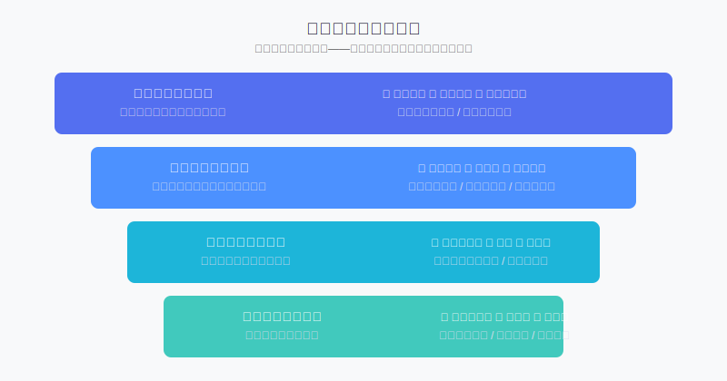
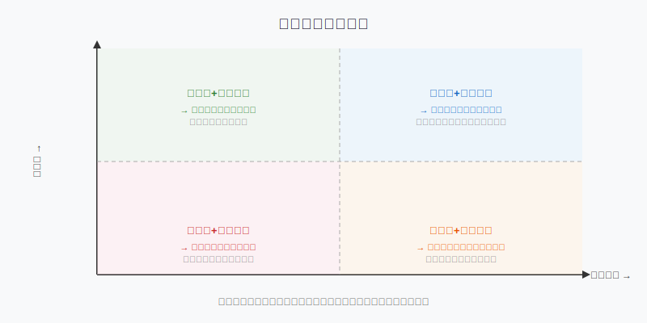
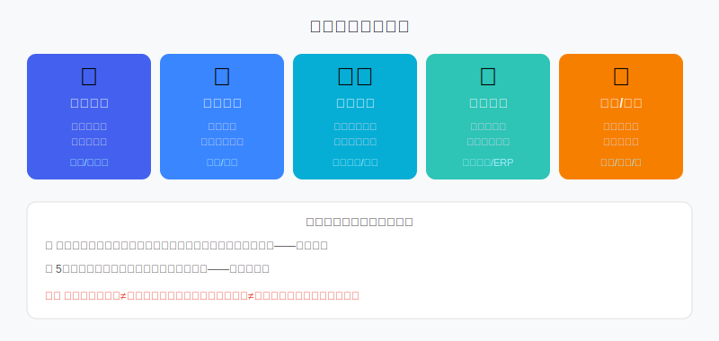

## 散户投资小白金融全品种操盘手册 - 5.3 基本面框架 —— 行业空间、商业模式、竞争优势、财务质量
  
### 作者  
digoal  
  
### 日期  
2026-06-02  
  
### 标签  
金融产品 , 金融工具 , 散户 , 投资小白 , 全品操盘手册  
  
----  
  
## 背景 

## 先问你一个问题

2020年，有人在直播平台相关公司和白酒龙头中间犹豫，最终选了当时更"热"的直播赛道。  
结果三年后，直播平台股价腰斩，白酒龙头翻了将近一倍。

为什么？那个时候两家公司的故事都很好听，消息面都很热闹。  
区别不在于谁"当时更火"，区别在于**基本面的质量**。

基本面分析，本质上是一个**四层筛选漏斗**：不是要你预测未来，而是帮你淘汰那些"不值得持有"的公司。

---

## 第一层：行业空间——蛋糕还有多大？

### 核心问题

这个行业未来5~10年，整体收入和利润盘子能长多大？

很多人买股票只看公司，忘了看公司所在的行业。但有一句话说得很对：**一个优秀的人站在烂行业里，通常也赚不到大钱**。

### 怎么判断行业空间

**方法一：市场渗透率**  
如果一个行业的渗透率（已经有多少人/企业在用这个产品）还很低，说明增量空间大。

例如：2015年移动支付渗透率不到20%，现在接近100%——那个窗口期孕育了巨大收益。

**方法二：对标发达市场**  
把中国的行业和美国/日本的同类行业对比。如果发达国家已经有成熟市场，而中国还在早期，差距就是潜在空间。

例如：养老产业、医疗器械高端化、半导体设备国产化——这些都是"参照系还在远处"的行业。

**方法三：行业增速与GDP的关系**  
一般来说：
- 行业增速 > GDP增速 2倍以上 → 成长型行业
- 行业增速 ≈ GDP增速 → 成熟型行业
- 行业增速 < GDP增速 → 衰退型行业（慎重）

### 需要淘汰的信号

- 行业整体收入已经连续3年负增长（不是周期低谷，而是结构性下滑）
- 行业的核心客户在减少，且没有新客户来源
- 替代技术已经出现，且渗透速度很快

**淘汰案例**：传统出租车公司、传统胶卷企业、固定电话运营商——这些不是经营差，是行业天花板已经到顶，甚至在收缩。

---

## 第二层：商业模式——用什么方式赚钱？

### 核心问题

公司靠什么获取收入？这个收入来源可持续吗？

很多人看财报只看"利润"，但利润是结果，**商业模式是源头**。如果商业模式不好，利润迟早会出问题。

### 好的商业模式具备什么特征

**特征一：高重复消费（复购率高）**  
客户不是买一次就走，而是持续购买。

- 茅台：逢年过节、商务宴请，每年都要喝
- SaaS软件：按年订阅，客户很少主动退订
- 消费品牌：日用消耗品，自然复购

对比：高档轿车（10年买一次）、装修公司（一生买一次）——这类公司需要不断获客，成本高，且容易受经济周期冲击。

**特征二：定价权（涨价客户不跑）**  
公司能主动提价，而客户不会因为涨价就转移？

茅台飞天从2012年市场价约1000元涨到现在3000元以上，核心消费群体几乎没有流失。  
海天味业多次提价，渠道和消费者也基本接受。

这叫**定价权**。有定价权的公司，利润率往往更稳定。

**特征三：收入结构（不依赖单一客户/单一产品）**  
如果一家公司70%收入来自一个客户，那个客户换供应商，公司直接塌方。  
如果一家公司90%收入来自一个产品，这个产品一旦被替代，公司没有缓冲。

分散的收入结构 = 更强的抗风险能力。

### 需要警惕的商业模式

- **靠补贴烧出来的用户**：一旦补贴停，用户立刻流失
- **纯中间商模式（没有差异化）**：谁便宜找谁，毫无粘性
- **项目制、一次性收入为主**：收入不稳定，毛利率难以持续

---

## 第三层：竞争优势——护城河

"护城河"这个词来自沃伦·巴菲特。他说，一家好公司，要像一座城堡，周围有一条又宽又深的护城河，让敌人（竞争对手）很难攻进来。

### 五种护城河类型详解

**① 品牌壁垒**  
消费者愿意为品牌付出溢价，且不容易被说服换品牌。

典型代表：茅台、爱马仕、可口可乐、云南白药  
核心特征：价格贵，但有人排队买；便宜版替代品出现了，消费者仍然选贵的

**② 网络效应**  
用这个产品/平台的人越多，产品对每个用户就越有价值。

典型代表：微信（所有人都在用，你不得不用）、美团（骑手越多，配送越快；餐厅越多，用户越留）  
核心特征：先发优势极强，后进入者极难打败

**③ 成本优势**  
生产同样的东西，比竞争对手便宜，且这个优势可持续。

来源：规模效应（产量越大、单位成本越低）、工艺创新、地理位置、资源禀赋  
典型代表：福耀玻璃（全球最大汽车玻璃制造商，规模成本极低）、海天味业

**④ 转换成本**  
客户想换掉你，但转换的代价太高：要花时间、花钱、还可能带来风险。

典型代表：工业ERP系统（换系统要停产几个月）、医院HIS系统（数据迁移风险极高）  
核心特征：客户不是不想走，是走不起

**⑤ 牌照与资源垄断**  
政府牌照、稀缺资源或政策保护带来的独占优势。

典型代表：银行牌照（进入门槛极高）、机场（城市只有一个）、白酒产区（茅台镇的地理条件不可复制）  
注意：政策类护城河存在政策变化风险，不是永久性的

### 护城河的两个测试

**宽度测试**：如果竞争对手明天砸三倍资金进来，这家公司的核心客户会流失多少？  
- 流失 80%+ → 几乎没有护城河
- 流失 30~50% → 有一定壁垒但不稳固
- 流失 10% 以内 → 护城河较宽

**持久性测试**：5年后这家公司的护城河会更深还是更浅？  
- 如果行业技术迭代快，原本的技术优势可能会消失
- 如果品牌积累越来越强，护城河会越来越深

---

## 第四层：财务质量——数字有没有在说谎

很多公司表面利润好看，但一看财务细节，钱其实没进口袋。财务质量是基本面分析最容易被忽视、也最重要的最后一关。

> 这节只讲"看什么"和"怎么判断好坏"，不要求你掌握会计知识。具体财务指标详见第五章第4节。

### 看财务质量的三个核心维度

**维度一：利润含金量（经营现金流 vs 净利润）**

最简单的测试：把经营现金流和净利润做对比。

- 如果经营现金流 > 净利润 → 利润质量高（真金白银流入）
- 如果经营现金流 << 净利润（差距超过30%）→ 警惕！利润可能是应收账款堆出来的

用大白话说：净利润是"记账"的钱，经营现金流是"到账"的钱。两者长期背离，说明公司赚到的钱没收回来。

**维度二：毛利率水平与稳定性**

毛利率（产品售价 - 直接成本 / 产品售价）反映公司对上游的议价能力和产品本身的价值密度。

- 毛利率 60%+ → 通常有较强定价权（软件、医药、高端消费）
- 毛利率 30~60% → 中等，需结合行业看
- 毛利率 10% 以下 → 低利润率行业（贸易、建筑），需要靠规模或周转速度

更重要的是**稳定性**：毛利率连续3年下滑，往往意味着竞争加剧或定价权下降。

**维度三：资产负债率和有息负债**

资产负债率（总负债 / 总资产）反映公司的财务杠杆水平。

- 制造业：60%以下相对健康
- 金融业：可以更高，但要看核心资本充足率
- 轻资产行业（软件、消费品）：40%以下

更需要关注的是**有息负债**（银行贷款、债券等需要付利息的负债）。如果有息负债快速膨胀，而经营现金流没有同步增长，说明公司在靠借钱维持增长，风险在积累。

---

## 第一性原理分析

**核心观点：基本面分析能帮你找到"值得长期持有的好公司"**

**【前提清单】**  
支撑这个观点成立，需要以下前提：

- **前提A**：行业有成长空间 → 【变量】→ 行业是否会被颠覆、政策是否变化
- **前提B**：商业模式可持续 → 【变量】→ 客户粘性是否真实存在
- **前提C**：护城河是真实的 → 【变量】→ 竞争对手的新技术是否会绕过护城河
- **前提D**：财务是真实的 → 【基本常量（有审计）但并非零风险】→ 财务造假风险虽低但存在

**【情景推演】**

- **正常情景（前提全部成立）**：基本面优质公司长期跑赢市场概率更高，持有3~5年一般能有不错回报
- **压力情景（前提A被推翻——行业天花板到了）**：即使商业模式很好，也要降低仓位，因为增长的引擎失速了
- **极端情景（前提C被推翻——护城河崩塌）**：立刻评估逻辑是否成立，如果护城河消失，重新评估是否继续持有，不要因为持仓成本就死扛

---

## 实操例子：用四层框架筛选一只股票

**假设场景**：你有10万元可投，朋友推荐你买某医疗器械公司A，说"业绩很好，市场认可度高"。

**第一步：判断行业空间**  
医疗器械行业：中国人均医疗器械支出约为美国的1/10~1/5，渗透率低、老龄化驱动，增量空间大。  
✅ 行业空间通过

**第二步：判断商业模式**  
A公司主要做骨科植入物（关节、脊柱），属于耗材类（手术每做一次消耗一套），复购率取决于手术量，不是一次性。  
客户是医院，医院不会频繁换品牌，转换成本较高。  
✅ 商业模式通过

**第三步：判断竞争优势**  
查看A公司市场份额：如果在骨科植入物领域市场份额前三，且有自己的研发管线和注册证积累，说明有一定进入壁垒。  
⚠️ 需要确认：是否面临进口替代竞争（国产替代下外资被挤出，A能否接住）

**第四步：查财务质量**  
打开年报，核对三项：
1. 经营现金流 vs 净利润：如果比值在0.8以上，利润含金量好
2. 毛利率：骨科植入物毛利率通常60~75%，如果异常低需要解释
3. 应收账款：医疗器械赊账给医院很常见，但如果应收账款增速远超收入增速，要警惕

✅ 假设三项都过关

**结论**：A公司四层都通过，可以列入深入研究名单。但这只是"值得研究"，不是"可以立刻买入"——接下来还需要看估值（第5节）和买入时机（第8节）。

---

## 可复用框架

**【四层漏斗法】**

适用场景：筛选任意A股个股时的基本面初筛  
核心逻辑：好公司 = 好行业 × 好模式 × 真护城河 × 干净财务  
操作步骤：
1. 查行业：增速、渗透率、竞争格局（10分钟）
2. 查模式：收入来源、复购率、定价权（看年报业务板块部分）
3. 查护城河：属于哪种类型、宽不宽、有没有被挑战的信号
4. 查财务：经营现金流/净利润比、毛利率趋势、有息负债变化

举一反三：这个框架同样适用于美股个股、港股个股的初步筛选，不同市场只是数据获取渠道不同，逻辑完全一致。

---

**【护城河三问】**

适用场景：快速判断一家公司护城河是否真实存在  
操作步骤：
1. **它凭什么比竞争对手卖得贵？**（定价权来源）
2. **如果有家新公司砸三倍钱来竞争，会怎样？**（宽度测试）
3. **5年后，这个优势是强化了还是削弱了？**（持久性测试）

一条都答不上来 → 可能没有护城河，谨慎持有  
三条都有清晰答案 → 护城河较为可信

---

## 本节行动清单

1. **选一只你感兴趣的股票**，按照四层漏斗顺序各写一段话：行业空间如何、商业模式是什么、护城河属于哪种类型、财务是否干净
2. **做护城河三问**：把答案写在纸上，不能回答的就是盲区
3. **打开上市公司年报（东方财富/同花顺均可查）**，找到"经营活动产生的现金流量净额"和"净利润"，算一下比值——如果低于0.5要认真想想为什么
4. **对照商业模式矩阵**，把你持仓或关注的股票放到象限里——不在右上角的，想清楚为什么还要持有
5. **建立"行业天花板预警"意识**：买之前，想一下这个行业10年后还在吗，大概是什么规模

---

## 一句话总结

基本面分析不是预测公司未来，而是帮你筛掉那些"表面好看、内里脆弱"的公司——行业空间、商业模式、护城河、财务质量，四关都过，才值得给它一个长期持仓的机会。

---

> ⚠️ **声明**：本文内容为投资教育目的，所有历史数据、策略框架均为辅助学习工具，不构成证券投资建议。市场有风险，投资需谨慎。实际操作请结合自身风险承受能力，必要时咨询专业投顾。
  
  
#### [PostgreSQL 解决方案集合](../201706/20170601_02.md "40cff096e9ed7122c512b35d8561d9c8")
  
  
#### [德哥 / digoal's Github - 公益是一辈子的事.](https://github.com/digoal/blog/blob/master/README.md "22709685feb7cab07d30f30387f0a9ae")
  
  
#### [About 德哥](https://github.com/digoal/blog/blob/master/me/readme.md "a37735981e7704886ffd590565582dd0")
  
  

  
