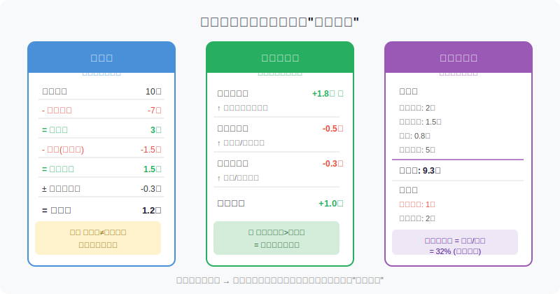
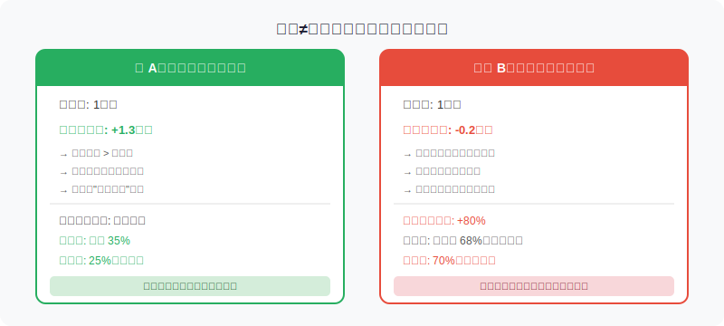
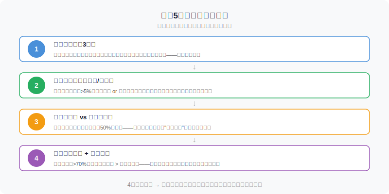

## 散户投资小白金融全品种操盘手册 - 5.4 财报小白版 —— 收入、利润、现金流、负债、毛利率
  
### 作者  
digoal  
  
### 日期  
2026-06-02  
  
### 标签  
金融产品 , 金融工具 , 散户 , 投资小白 , 全品操盘手册  
  
----  
  
## 背景 

## 一个让你亏钱的错觉

很多散户买股票的逻辑是这样的：

> "这家公司净利润5亿，同比增长30%，肯定是好公司，买！"

然后三个月后，股价跌了20%，财务暴雷，应收账款全部变成坏账。

净利润是5亿没错。但钱没有收回来。这就是财报最经典的陷阱——**账面赚的钱，和真正收到的钱，不是一回事**。

读懂财报，不是要你成为会计师，而是让你知道：**在哪些数字上不要被骗**。这节课教你用最少的时间，读懂最关键的5个维度。

---

## 财报的基本结构：三张表

上市公司每季度、每年公布的财务报告，核心是三张报表。把它想象成一个人的体检报告：

- **利润表**：这一年你赚了多少钱（但不代表钱进了口袋）
- **现金流量表**：钱真的有没有进口袋
- **资产负债表**：你的家底有多少，债欠了多少

三张表相互关联、相互验证。如果利润表说赚了1亿，但现金流量表说经营现金流是负数——两者打架了，要么有人在造假，要么业务本身有严重问题。

> 散户最常犯的错误：**只看利润表，不看现金流和负债表**。

---

## 第一个数字：营业收入

**营业收入**（简称"营收"）是公司卖出产品或服务的总金额，是利润表的第一行。

用生活场比喻：你开了一家奶茶店，一年卖出了100万杯奶茶，每杯20元，营收就是2000万元。

**散户要看什么？**

1. **趋势**：连续3年增长？还是时高时低？——好公司的营收应该有持续性，不是靠运气
2. **增速变化**：以前每年增30%，今年只增5%，为什么？是行业见顶了，还是竞争对手来了？
3. **收入结构**：主业收入占多少？靠政府补贴、出售资产撑起来的收入，不可持续

**一个容易被忽视的陷阱**：同样是"营收1000亿"，不同公司含义差很多。

以电商平台为例，京东自营以"总额法"确认收入（把卖货的全额算进去），2024年相关营收约9280亿；而淘天集团以"净额法"确认（只算平台抽成），对应营收约4349亿。两家公司都是行业头部，但营收数字差了两倍多——不是因为京东业务是淘天的两倍，而是**会计口径不同**。所以跨公司比较营收时，要先搞清楚他们的收入确认方式。（来源：中伦律所，2025年8月分析报告）

---

## 第二个数字：毛利率

**毛利率 = （营业收入 - 营业成本）/ 营业收入 × 100%**

用奶茶店举例：每杯奶茶卖20元，原材料+人工成本12元，毛利率就是40%。

毛利率代表：**公司卖出产品后，剥离直接成本后还剩多少**。

**不同行业的正常区间大相径庭：**

| 行业类型 | 典型毛利率区间 | 例子 |
|----------|----------------|------|
| 软件/互联网 | 50%～80% | 金蝶、腾讯 |
| 医药品牌药 | 60%～85% | 片仔癀 |
| 白酒高端品牌 | 75%～93% | 茅台、五粮液 |
| 制造业 | 15%～35% | 机械设备 |
| 商超零售 | 5%～15% | 永辉超市 |
| 钢铁/煤炭 | 5%～25% | 宝钢、神华 |

**毛利率的危险信号：**

- **连续下滑**：原材料涨价了？竞争对手打价格战了？产品老化了？
- **异常暴涨**：要怀疑是否通过会计手段虚增收入，比如把成本挪到下一期
- **远高于同行**：可能是优势，也可能是在造假（典型案例：某些财务造假的公司，毛利率比行业均值高出30个百分点以上）

历史数据提示：A股5000多家上市公司中，连续3年毛利率稳定在30%以上且净利润增速超20%的公司，数量不足80家（来源：公开市场统计，2024年）。这说明**毛利率稳定本身就是稀缺性**。

---

## 第三个数字：净利润

**净利润 = 收入 - 成本 - 费用 - 税 ± 各种非经常项目**

这是大家最熟悉的数字。但净利润有一个**致命弱点**：

> 净利润里包含了大量"非现金收益"——折旧、摊销、应收账款确认等，都是"账面利润"，没有对应的真实现金流入。

举个极端案例：一家工厂今年卖出了1亿元的产品，但客户都是月结半年——钱没收到，账面上照样确认了1亿营收和3000万净利润。与此同时，自己进货的账款要现付。结果：**账面盈利，银行账户却在亏空**。

**散户还要分清：净利润 vs 归母净利润**

- **净利润**：整个集团赚的钱（包括子公司的少数股东份额）
- **归母净利润**（归属于母公司股东的净利润）：属于上市公司股东的那部分

我们作为股东，能分享的是**归母净利润**，看财报要盯这个数。

---

## 第四个数字：现金流（最容易被忽视，也最重要）

现金流量表分三部分：

**1. 经营现金流（最重要）**
公司主业运营产生的真实现金收入。

> 类比：你的工资到账了多少。

**核心判断规则：**
- 经营现金流 > 净利润：利润质量高，说明客户都付了钱，甚至有预收
- 经营现金流 < 净利润的50%：警惕，账面利润可能虚高
- 经营现金流持续为负：主业无法"自我造血"，公司活着靠借钱或融资

**2. 投资现金流（看扩张节奏）**
公司买设备、并购、对外投资的支出。健康的成长企业，投资现金流通常为负（在花钱扩张），这不是问题，但要看**花了多少钱，买回来多少增长**。

**3. 融资现金流（看资金来源）**
银行贷款、发债、再融资等。如果公司经营现金流很差，却依靠不断融资维持运转，这是个危险信号。

---

**现金流对比案例：**

真实市场中，\*ST东通就是"毛利率高、净利润好看、但经营现金流持续为负"的典型案例——从2022年开始，经营现金流转负，最终公司陷入持续亏损危机（来源：东方财富财富号，2025年9月分析）。**高毛利率不能掩盖现金流持续为负这个根本性问题。**

---

## 第五个数字：负债与资产负债率

**资产负债率 = 总负债 / 总资产 × 100%**

负债不是洪水猛兽——有息借贷是公司扩张的正常工具。问题在于：**借的钱多不多、能不能还得上**。

**参考区间：**

| 行业 | 正常资产负债率 | 警戒线 |
|------|----------------|--------|
| 消费品 | 20%～40% | >65% |
| 制造业 | 30%～55% | >70% |
| 重资产（钢铁/化工） | 40%～65% | >80% |
| 金融/银行（特殊行业） | 85%～93%（正常） | — |

**重点看有息负债：**

不是所有负债都危险。应付账款（欠供应商的钱）是正常的，不收利息。真正危险的是**有息负债**（银行贷款、债券），因为要还本付息，利率压力实实在在。

**危险信号：**
- 短期有息负债 > 货币资金：明年就要还钱，账上钱不够还，会引发债务危机
- 资产负债率超70% + 经营现金流为负：双重压力，随时可能爆雷
- 商誉占总资产比例过大：之前并购的公司价值虚高，一旦减值，净资产直接蒸发

---

## 【第一性原理分析】

**核心观点：用"净利润+经营现金流+毛利率"三位一体判断利润质量**

支撑这个观点成立的前提：

**前提A：财务报表数据是真实的** → 【变量】
正常情况下这是常量，但A股存在财务造假。2024年A股年报中，共192家公司被出具非标准审计意见（证监会年报监管报告，2025年8月）。识别信号：审计意见是否"无保留"，如果是"无法表示意见"，直接排除。

**前提B：会计准则一致** → 【常量】
同一公司纵向比较，会计政策突然变更时要特别注意（这是调节利润的常用手段）。

**前提C：行业景气度维持** → 【变量】
周期行业在景气低点时，毛利率和现金流指标同时变差，并不代表公司管理出问题。

**情景推演：**

| 情景 | 条件 | 结论 | 操作调整 |
|------|------|------|---------|
| 正常 | 三指标均良好 | 高质量利润 | 可进入估值分析 |
| 压力 | 经营现金流 < 净利润50% | 利润虚高风险 | 等下一季度验证，不急入场 |
| 极端 | 经营现金流持续为负+资产负债率>70% | 双重危机 | 不碰，不抄底 |

---

## 实操例子：5分钟读完一份财报摘要

**场景：**你有10万元可投资，筛选到某家消费品公司，想做初步判断。可用时间5分钟。

**第一步（1分钟）：找营收和净利润趋势**
打开同花顺或东方财富的"财务摘要"页面，看最近3年数据：
- 营收：2022年30亿 → 2023年36亿 → 2024年42亿（年均增速约18%，健康）
- 净利润：4.5亿 → 5.1亿 → 6.0亿（与营收同步增长，初步OK）

**第二步（1分钟）：看毛利率**
财务摘要直接显示毛利率：2022年34% → 2023年35% → 2024年36%
→ 稳中有升，说明公司在提价或者降本，竞争力没有恶化。绿灯。

**第三步（2分钟）：比较净利润与经营现金流**
在现金流量表找"经营活动产生的现金流量净额"：
2024年：经营现金流 7.2亿 > 净利润 6.0亿
→ 比率 = 7.2/6.0 = 1.2，现金流质量高。绿灯。

**第四步（1分钟）：看资产负债率**
资产负债表找"资产负债率"（或自己算）：
总负债12亿 / 总资产45亿 = 26.7%，消费品行业很健康。绿灯。

**4步全部绿灯 → 进入下一步：研究估值（PE/PB/股息率）和竞争格局。**

如果第三步发现经营现金流只有2亿（低于净利润的50%），正确做法不是继续研究，而是先搞清楚原因：是应收账款暴增？还是存货积压？找到原因再决定要不要继续看。

---

## 散户5分钟财报速读框架

---

## 【可复用框架】财报健康度快速诊断

**框架名称：四灯诊断法**

**适用场景：** 个股初筛时，30秒到5分钟快速判断是否值得深入研究

**核心逻辑：** 用4个最容易查到的指标，构建财报的第一道"防火墙"

**操作步骤：**

1. **营收灯**：近3年营收趋势是否正向？（增长或稳定 → 绿灯；连续下降 → 红灯）
2. **毛利灯**：毛利率是否稳定或提升？与同行相比是否合理？（异常波动 → 黄灯，深度核查）
3. **现金灯**：经营现金流是否长期高于净利润的70%？（否 → 黄灯；持续为负 → 红灯）
4. **负债灯**：资产负债率是否在行业正常范围内，短期有息负债是否超过货币资金？（超 → 红灯）

**判断规则：**
- 4灯全绿 → 财报健康，进入估值分析
- 1～2个黄灯 → 需针对性深入查原因，暂不入场
- 任意1个红灯 → 排除，等下一财报季验证

**举一反三：** 这个框架也适用于可转债正股筛选、REITs底层资产评估、美股中概股财报初筛。

---

## 本节行动清单

1. **找一家你感兴趣的A股公司**，打开东方财富或同花顺的"财务摘要"页面，按四灯诊断法走一遍，用10分钟完成初筛
2. **重点比较**该公司最近2年的"净利润"和"经营活动现金流"，看二者差距是否在合理范围内（一般经营现金流应高于或接近净利润）
3. **找同行中两家公司**对比毛利率，思考为什么有差异——这能帮你快速理解行业竞争格局
4. **检查审计意见**：在年报首页找"审计报告"，确认是"无保留意见"，如果是其他类型，谨慎对待
5. **建立"财报观察清单"**：对感兴趣的股票，每季报/年报出来时，只看这4个指标的变化方向，不需要全读财报

---

## 一句话总结

财报最重要的功能不是让你看懂公司赚了多少钱，而是让你识别公司**是否在用现金流支撑利润、负债是否在可控范围内**——做到这一点，你就已经比90%的散户更会看财报了。

---

> ⚠️ **声明**：本文内容为投资教育目的，所有历史数据、策略框架均为辅助学习工具，不构成证券投资建议。财报数据来源为公开披露信息，历史数据不代表未来表现。市场有风险，投资需谨慎。实际操作请结合自身风险承受能力，必要时咨询专业投顾。
  
  
#### [PostgreSQL 解决方案集合](../201706/20170601_02.md "40cff096e9ed7122c512b35d8561d9c8")
  
  
#### [德哥 / digoal's Github - 公益是一辈子的事.](https://github.com/digoal/blog/blob/master/README.md "22709685feb7cab07d30f30387f0a9ae")
  
  
#### [About 德哥](https://github.com/digoal/blog/blob/master/me/readme.md "a37735981e7704886ffd590565582dd0")
  
  

  
