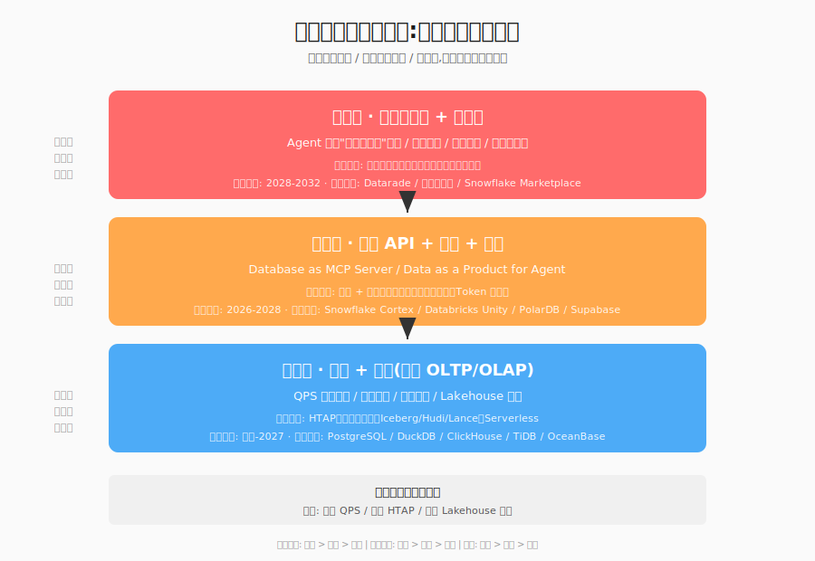

## 德说-第486期, 如果这是 AI 终局, 数据库厂商下一步应该做什么?
  
### 作者  
digoal  
  
### 日期  
2026-06-02  
  
### 标签  
AI , 终局 , 以终为始 , 移动互联网时代 , 智能体时代 , 算力 , 电力 , 数据 , 物质极大丰富 , 数据库 
  
----  
  
## 背景  
  

[《德说-第485期, 如果这是 AI 终局, 现在该押什么宝?》](../202606/20260602_01.md)  这篇文章得出了一个惊人结论：
- 移动互联网时代,人是用户,数据是石油,广告是商业模式;
- 智能体时代,智能体本身就是用户,它们会自己花钱买算力、买电力、买数据 —— 这意味着"算力 + 电力"的市场天花板,从"人能买多少手机"变成"全球智能体能消耗多少焦耳",后者的天花板比前者高 3 到 5 个数量级。

如果这个结论正确, 那么数据库厂商下一步应该做什么?  

> **重要提示**: 文中出现的"老 D""林墨""陈博"是我构造的思考人设(综合了数据库内核工程师、智能体产品架构师、数据要素市场分析师三类人的视角),并非具体真人。涉及的厂商、产品、时间表均基于 2026 年 5-6 月公开信息,具体到个股和数字请再独立核验。

---

## 开场:凌晨 3 点的"数据交易"

先想象一个具体的瞬间。

凌晨 3 点 17 分,你的"数字员工"(智能体)从休眠中醒来——它监测到上海港的集装箱积压率突破了历史阈值,需要在 1 小时内给老板发一份"未来一周吞吐预测",否则一个重要客户可能违约。

它做了 4 件事:

1. 调用气象局的付费 API,花 **0.02 美元** 买"未来 6 小时台风路径数据"
2. 向港口数据交易所下单"实时泊位状态",花 **0.05 美元**
3. 翻出公司 ERP 里过去 3 年的发货记录(免费,但要走权限审批)
4. 调云端一个领域大模型做综合判断,花 **0.30 美元**

整个过程耗时 **4.7 秒**,总花费 **0.37 美元**。它用这份判断签下了一笔 **5 万美元** 的客户合同。

这是我们正在走向的图景:智能体本身成为"数据消费者"。但更重要的是,智能体同时是"数据生产者"——它跑完这次任务后,把"上海港吞吐 + 天气 + 客户履约"这个组合洞察,以 **0.50 美元** 的价格挂到数据交易所上,等下一个智能体来买。

这就是"数据从石油变成水电煤"的下一阶段。在德哥前一篇《AI 终局》里,我们聊了算力、电力、通信、智能体本身、支付协议,但**漏掉了一层**——数据作为智能体自主交易的商品,整个市场由谁来"装"、谁来"管"、谁来"卖"?

答案是:**数据库**。

但今天的数据库,从架构到接口到商业模式,几乎都还是"为人设计"的。智能体时代,数据库要被重新定义。

下面我用三个视角,把这件事拆开讲清楚。

---

## 视角一(技术):智能体"用"数据,和人类完全不一样

我先请出"老 D"——一个做了 15 年数据库内核的架构师,从 Oracle 时代干到云原生,现在专门研究"AI + DB"怎么融合。他会告诉你:智能体用数据的方式,和人类有 **3 个根本性不同**。

**第一,频率差 3 个数量级。**

人类点开一个 Dashboard,看 1 分钟,后台可能跑 1 个查询。智能体呢?一个任务链跑下来,可能调 1000 次微查询——每次只问"这个字段在不在"、"这个值是不是 NaN"、"这段文本的情感分数是多少"。

这意味着:OLTP 的 QPS(每秒查询数)要重写定义。PostgreSQL 集群单机极限大概在 10 万 QPS;但智能体驱动的企业,3-5 年后可能需要 **千万级 QPS**。这不是堆机器能解决的——SQL 解析器、事务协调器、磁盘 IO 都要重做。

这也是为什么 DuckDB、ClickHouse、SingleStore 这一类"单机高并发 OLAP/HTAP"引擎,在 2024-2026 年估值集体往上走——它们赌的就是"Agent 流量先把单节点打满,再上分布式"的路径。

**第二,语义比语法重要 100 倍。**

人类写 SQL,数据库只要按字面执行;智能体调数据,它根本不知道 `customer_lifetime_value` 这个字段是啥意思,更不知道它在哪个 schema、哪个版本、哪个权限范围里。

这就是为什么 MCP(Model Context Protocol,Anthropic 2024 年开源)这么重要——它相当于给数据库加了一层"语义 API":你告诉智能体"我能提供什么数据、字段含义、调用方式、单价",智能体不用懂 SQL,也能调用。

老 D 的判断是:**2026-2028 年,谁能先把"Database as MCP Server"做成熟,谁就能拿到 Agent-Native Database 的入场券**。这事不性感,但决定了下一个 10 年。

具体到产品,他看 3 个方向:

- **Snowflake Cortex**——把 LLM 推理直接集成到 SQL 里,让 SQL 自己能"理解自然语言查询"
- **Databricks Unity Catalog**——尝试做"数据资产目录",让 Agent 能"发现"数据
- **PostgreSQL + pgvector / Apache Doris 向量化**——开源路径,Supabase、Neon 这类"AI-Native Cloud Postgres"已经吃到了第一波红利

**第三,可追溯性从"可选项"变成"必选项"。**

人类误读一个数据,后果顶多是个错决策。智能体误读一个数据,可能自动执行了一笔错误的支付,或签下错误的合同。

这意味着,数据库要为每条数据记录:**来自哪个源、谁授权、何时查询、用于哪个 Agent 决策**——这不是审计日志,是 Agent 的"操作 DNA"。

老 D 认为,这就是为什么传统 ACID(原子性、一致性、隔离性、持久性)不够用了。Agent 时代的数据库要加两个新属性:

- **I**dentifiable:每条数据有"出处身份证"
- **D**iscoverable:智能体能"发现"它,而不是"知道它在哪"

他把这套新规则戏称为 **"ACID-I-D"** 。这是演绎的命名,业界尚无共识——但这个方向,他赌会是下一代数据库的事实标准。

> **小结**:智能体对数据库的需求,本质上是把数据库从"人查询工具"变成"Agent 运行时"。这件事技术可行,但需要 2-3 年(2026-2028)的产品验证期。

---

## 视角二(产品):智能体最痛的,不是"算不动",是"找不到、用不上、信不过"

换个视角。这次我请出"林墨"——一个做了 3 年 Agent 产品的架构师,前阿里通义 Agent 团队,后来出去创业做 Agent OS。

林墨最反对的一种说法是:"数据库只要把性能再提升 10 倍,Agent 就能起飞。"

他用自己踩过的坑反驳:**Agent 最痛的点,从来不是查询慢,而是"找不到、用不上、信不过"。**

举一个真实案例。林墨团队做一个"企业差旅 Agent",要让它能帮员工订机票。听起来简单对吧?但 Agent 要回答的问题有:

- 哪些航空公司的 API 可以调?(签约状态、费率、可用时段)
- 我公司员工有没有签这家公司的协议价?(需要查 HR 系统)
- 这位员工的差旅级别是 P 几?(涉及权限和额度)
- 现在订的票价,公司报销政策允不允许?(需要查财务规则)
- 如果这趟航班延误了,自动改签的政策是啥?(需要查运营 SOP)

**这些信息散落在 6 个系统、12 张表、3 套权限模型里,任何一个都"存在",但 Agent 要调用时,得有人工提前把"取数说明书"写好。**

这就是数据库的下一个产品机会:不是"更快地存",而是"主动把数据'打包'成 Agent 能用的'数据产品'"。

林墨把这个产品形态叫 **"Data as a Product for Agent"(DAP-A)** —— 数据库不再只是"给我 SQL 我给你结果",而是"我能为你这个 Agent 场景,打包好一个'数据盒子',里面包含了数据、语义、权限、计费、追溯"。

他举了几个他看好的产品方向:

- **向量 + 结构化统一查询**——pgvector 是过渡方案,真正的"统一查询"是 Milvus、Qdrant、Weaviate 这类专门为 AI 设计的向量数据库,加上 Iceberg/Lance/Hudi 这类湖仓格式
- **数据资产目录 + 字段血缘**——OpenLineage、DataHub、Unity Catalog 这类"数据资产可发现性"工具,会在 Agent 时代从"治理工具"变成"生产工具"
- **Token 级计费 / 字段级计费**——传统数据库按"连接数/存储量"收费;Agent 时代应该按"数据被消费的次数/质量/价值"收费。这件事 Snowflake 的"按扫描字节计费"已经走了半步,真正的"按 Agent 决策价值计费"还没人做到

他认为,**2027 年之前,谁能率先推出"DAP-A 1.0",谁就有机会在 Agent 生态里卡到一个类似当年 App Store 在 iPhone 里的位置**——不是最炫的那个,但**分发 + 计费 + 治理的中枢**。

> **小结**:Agent-Native Database 的护城河,不在 SQL 引擎有多快,而在"数据语义层 + 治理层 + 计费层"是否做透。这件事,新势力(Supabase、ClickHouse、Databricks)比老巨头(Oracle、IBM)更有机会。

---

## 视角三(市场):数据变成可交易商品后,数据库是"交易所"角色

最后一个视角。我请出"陈博"——一个数据要素市场的分析师,学术 + 产业双背景,长期跟踪上海、深圳、欧盟、美国的数据交易所。

陈博会把整件事的格局再往上推一层。

他说: **"智能体花钱买数据"这件事,最大的变量不是技术,而是"数据"会不会真的变成可交易商品。** 

听起来数据已经是商品了——数据公司卖数据集,API 公司按调用收费。但陈博说,今天 99% 的"数据交易"是 **T+1 批处理批发**(我给你一个 100GB 的 CSV,一次性付清)。而智能体需要的是 **毫秒级、按调用、按结果的微交易**——一秒钟内买 100 笔,每笔 0.001 美元。

这种"高频微交易",需要**新的市场基础设施**,它至少包括 3 层:

**第 1 层:数据交易所(Exchange)**
撮合智能体的"买数据"和"卖数据",类似股票交易所,但商品是"数据 API 的调用权"。目前初露头角的有:
- 美国 Datarade(API 级微交易的早期玩家)
- 上海数据交易所(2025 年累计交易额持续增长,但仍以"数据集批发"为主)
- 香港、新加坡、迪拜的数据交易所,各自主打细分市场(训练数据、跨境数据)

**第 2 层:数据做市商(Market Maker)**
给数据"报价",提供流动性。这层今天几乎空白——因为没人知道"实时天气数据"到底值 0.001 美元还是 0.01 美元。但智能体规模上来后,这是新职业。

**第 3 层:数据信托基础设施(Trust Infra)**
处理"数据确权"、"收益分配"、"合规审计"。链上数据 + 智能合约,可能是终极方案,但距离成熟还有 5-10 年。欧盟 Data Act(2024 年生效)、中国"数据二十条"(2022 年)的细则,都在往这个方向推。

**陈博的判断是:数据库厂商未来 5-10 年最大的卡位机会,是"做交易所运营方"——而不是只做底层存储。**

理由很直接:**交易所是收"过路费"的,而存储是按"容量"收费的**。前者是金融业务,后者是云业务,毛利率和估值倍数完全不在一个量级。

陈博举了一个类比: **数据库厂商在智能体时代,会经历云数据库厂商在 2010-2015 年经历过的事——从"卖资源"到"卖服务"再到"运营生态"** 。AWS 当年靠 EC2 卖资源起家,真正赚钱是后来的 Marketplace(第三方卖家抽成)。数据市场可能会走同样的路。

> **小结**:数据交易所 + 数据做市商 + 数据信托,合起来才是"数据要素市场"的完整基础设施。数据库厂商要么自己进化成"交易所运营方",要么被上层的交易所"管道化"。

---

## 一张图:智能体数据库的"新三层蛋糕"

把上面三个视角拼起来,会看到数据库的价值蛋糕在往上"长"出新的层级。

**底层(传统能力,稳态)** :存储 + 计算。这层 5 年内不会消失,反而会因为 Agent 流量被推高 QPS 需求,推动 HTAP、Lakehouse(Iceberg / Hudi / Lance)走向主流。这是 PG / DuckDB / ClickHouse / TiDB / OceanBase 的基本盘。

**中层(新能力,争夺中)** :语义 API + 治理 + 计费。这层 2026-2028 是关键窗口,Database as MCP Server、Data as a Product for Agent 都在这层打。这层是 Snowflake Cortex / Databricks Unity / PolarDB / Supabase / pgvector 生态的卡位战。

**顶层(新商业模式,远期)** :数据交易所 + 做市商。这层 2028-2032 才有可能成熟,需要监管(欧盟 Data Act、中国"数据二十条")、技术(链上数据确权)、生态(智能体规模)三方共振。这是 Datarade / 上海数交所 / Snowflake Marketplace 的远期故事。

**价值密度**:越往上,赔率越高,但风险越大、时间越长。

**对智能体的依赖**:底层早就成熟、中层正在验证、顶层还卡在"鸡生蛋"的循环里(没有足够 Agent,数据交易所就起不来;没有数据交易所,Agent 没法"按需买数据")。

---

## 三个最值得押注的卡位(以果决行)

回到投资视角——如果数据库是下一波"水电煤",今天应该押什么?

### 卡位 1:Agent-Native 数据库(2026-2028 窗口,赔率最高)

判断标准:谁先发布"Database as MCP Server"成熟产品 + 谁有最多的 Agent 客户。

候选清单(方向性提示,不构成投资建议):

- **美股**:Snowflake(SNOW)、MongoDB(MDB)、Elastic(ESTC)、Confluent(CFLT,做实时数据流的)
- **开源 / 私有**:Databricks(估值独角兽)、Supabase(估值独角兽)、ClickHouse(估值独角兽)
- **中国**:阿里云 PolarDB(借 BABA)、华为云 GaussDB、字节火山引擎的 ByteHouse(基于 ClickHouse)

### 卡位 2:Data as a Product 中间层(2026-2027 窗口,确定性最高)

判断标准:谁有最多企业客户 + 最完整的"数据资产目录" + 最多的字段血缘数据。

候选清单:

- **美股**:Snowflake(SNOW)、Databricks、Salesforce(CRM,Data Cloud)、ServiceNow(NOW)
- **中国**:用友网络(600588)、金蝶国际(0263.HK)、阿里云数据中台、明略科技(IPO 中)

### 卡位 3:数据交易所运营(2027-2030 窗口,想象空间最大)

判断标准:谁拿到了"国家级数据交易所运营权" + "跨境数据流通牌照"。

候选清单:

- **美股**:几乎空白,可能从 Palantir(PLTR)、Snowflake、Microsoft(Azure)里跑出
- **中国**:上海数据交易所相关参股上市公司、易华录(300212,数据要素)、广电运通(002152,数交所 IT 系统)、人民网(603000,数据要素确权)

> **重要提示**:以上个股是基于商业逻辑的方向性提示,不构成投资建议。**涉及具体标的的实时估值、份额、商业进展,你必须自己再核验。** 比如易华录 2026 年的具体营收结构、广电运通的数交所 IT 业务占比、上海数交所的股东结构,这些我都没法实时确认。

---

## 风险提醒:别只看到蛋糕,看到 3 颗地雷

在兴奋之前,有 3 件事得提醒:

**1. 数据库厂商的"创新者窘境"。**

传统 OLTP 市场(Oracle、IBM、Teradata 的客户)还在以每年 5-8% 增长,这些客户每年贡献稳定现金流。**没有任何一家传统数据库厂商会主动革命自己的收入基本盘**。这意味着"Agent-Native"这个新故事,很可能不是从传统巨头里跑出来,而是从开源新势力(Postgres 生态、ClickHouse、Supabase、DuckDB、Polaris)和云厂商的"实验田"里跑出来。

**2. 智能体本身的不成熟,会拖慢数据库革命。**

数据库再创新,如果智能体没真普及,就是"为不存在的需求做产品"。从德哥《AI 终局》的判断,智能体的"爆款级"应用最早 2026 H2 出现,大规模普及在 2027-2028。**这意味着数据库的 Agent 化革命,2027-2028 才是真正的"产品验证年"——不是 2026。**

短期(2026 H1-2026 H2)押 Agent-Native 数据库,是在押"叙事",不是押"业绩"。

**3. 隐私和合规是数据市场最大的"黑天鹅"。**

一个"按 0.001 美元卖实时人脸数据"的交易所,GDPR 和个保法都不会允许。数据交易可能长期被限制在"企业级、非个人、可计量"的小圈子里,大众消费数据反而进不来——这会限制数据市场的天花板。

链上数据信托、隐私计算(联邦学习、安全多方计算)、可验证凭证(VC)这些"技术补丁"会有用,但都需要 3-5 年成熟。

---

## 接下来 6 个月,看什么?(可观测信号清单)

最后给你一份"看盘清单",2026 H2 这半年,盯着这几件事:

| 维度 | 信号 | 在哪看 | 触发什么结论 |
|------|------|--------|------------|
| **产品** | 主流数据库厂商(Oracle / Snowflake / Databricks / 阿里云)是否发布"Agent-Native"产品线 | 各家 blog、GTC、re:Invent、阿里云栖 | 没发布 = 革命未开始;发布了 = 卡位赛开打 |
| **协议** | MCP 协议在数据库领域的渗透率(占 GitHub 数据库类项目 star 增速的%) | GitHub trending、Anthropic 官方数据 | 渗透率持续 > 30% = 事实标准确立 |
| **市场** | 是否有"Agent 数据交易所"出现,月活 Agent 买家是否破万 | Datarade / 上海数交所 / Polygon 等链上数据市场月报 | 突破 = 商业模式验证;没突破 = 仍是概念 |
| **资本** | 数据库厂商收购向量 / 语义层初创公司的金额 | 行业新闻、SEC 13D | 大额并购(>5 亿美元)出现 = 行业整合期开始 |
| **监管** | 欧盟 Data Act、中国"数据二十条"细则是否给"数据 API 交易"开口子 | 各国监管文件 | 开口 = 赛道合法化;不开口 = 增长受限 |
| **客户** | 财富 500 强企业的 IT 预算中,"Agent 数据基础设施"占比是否 > 5% | Gartner、IDC 报告 | 超过 = 主流化;不到 = 早期阶段 |
| **技术** | 字段级血缘、Token 级计费、向量 + 结构化统一查询,是否有开源参考实现 | GitHub、arXiv | 有 = 标准化在推进;没有 = 还在"各做各的"阶段 |

> 任何一个信号出现"突破"或"卡死",都意味着 3-6 个月后会有一次数据库行业的格局重排。

---

## 写在最后:回到那个凌晨 3 点

回到开头的那个凌晨 3 点。

当你的智能体用 0.37 美元"自主买"了 4 份数据,做出预测,赚到一笔 5 万美元的客户合同——

- **金融结算层**是 Stripe / x402 / AP2
- **数据交付层**是某个数据库

未来 5-10 年,谁是这个"数据交付层"的事实标准,谁就拿到了智能体经济里 **仅次于算力供应商** 的位置。

数据库不会消失,反而会重新变成"基础设施的明珠"。

只是今天,大部分数据库厂商还没意识到——他们还活在"卖 License / 卖存储"的时代里。

故事才刚开始。

---

## 附录:三个思考人设的立场复盘(草稿阶段保留,供批判性阅读)

> 这一节是"内部草稿"性质,留在这里是为了让你看清我的分析框架。如果你只想看结论,可以略过。

- **老 D(技术视角)** 的核心立场:数据库的护城河从"SQL 引擎"转向"语义 API + 治理 + 计费"。他的盲点:可能高估技术演进的确定性,低估传统厂商的"换轨"成本。
- **林墨(产品视角)** 的核心立场:数据库要从"被动存储"变"主动数据经纪"。他的盲点:作为创业者可能过于乐观,把"产品机会"误判为"市场已成熟"。
- **陈博(市场视角)** 的核心立场:数据库的终局角色是"数据交易所运营方"。他的盲点:把"金融基础设施"和"数据基础设施"的成熟周期类比,可能低估了数据要素市场化的监管摩擦。

**3 个视角的共识**:数据库在智能体时代不会被淘汰,反而更重要,护城河在从"底层"上移到"中间层"和"顶层"。

**3 个视角的分歧**:技术、产品、市场三层的时间窗口和确定性不同——技术层已经成熟,产品层正在验证,市场层还卡在"鸡生蛋"。

**对小白最重要的 3 个 insight**:

1. 数据库在智能体时代不是被颠覆,是被重新定义——从"数据存储"变成"智能体运行时"
2. 新护城河不在 SQL 引擎,而在"数据语义层 + 治理层 + 计费层"
3. 三个卡位机会:Agent-Native DB、Database MCP Server、数据交易所运营——时间窗口从近到远,赔率从低到高

---

*本文不构成投资建议。所有个股、估值、协议时间表均基于 2026 年 5-6 月的公开信息,实时情况请以最新公告为准。投资有风险,决策需谨慎。*
  
  
#### [PostgreSQL 解决方案集合](../201706/20170601_02.md "40cff096e9ed7122c512b35d8561d9c8")
  
  
#### [德哥 / digoal's Github - 公益是一辈子的事.](https://github.com/digoal/blog/blob/master/README.md "22709685feb7cab07d30f30387f0a9ae")
  
  
#### [About 德哥](https://github.com/digoal/blog/blob/master/me/readme.md "a37735981e7704886ffd590565582dd0")
  
  

  
