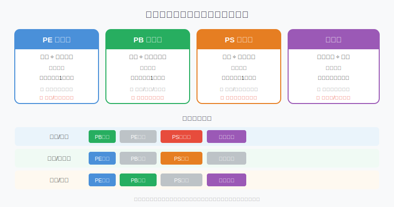
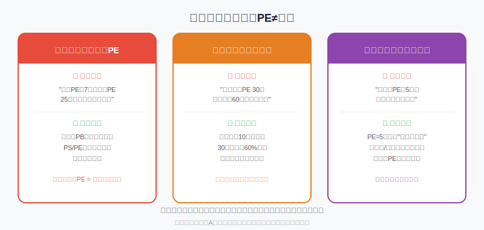
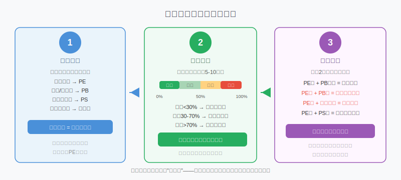

## 散户投资小白金融全品种操盘手册 - 5.5 估值入门 —— PE、PB、PS、股息率，你到底在量什么？
  
### 作者  
digoal  
  
### 日期  
2026-06-03  
  
### 标签  
金融产品 , 金融工具 , 散户 , 投资小白 , 全品操盘手册  
  
----  
  
## 背景 

## 先给你出一道题

假设你相中了一套房，中介告诉你：

> "这套房子，每平米单价 3 万元。"

你会立刻出手吗？大多数人不会——因为你还想知道：周边二手房什么价？这套房历史成交价是多少？同小区有没有更便宜的？

**股票估值做的，正是同一件事。**

价格本身没有意义，估值是把价格放进参照系里，才知道贵还是便宜。PE、PB、PS、股息率，就是四把不同的"量尺"——但每把尺子量的东西不一样，用错了尺子，算出来的结果是垃圾。

---

## 核心概念：四把量尺各量什么？

### PE（市盈率）：花多少钱买1元利润

**公式：股价 ÷ 每股盈利（= 总市值 ÷ 净利润）**

最直观的理解：如果一家公司年赚1亿，你花20亿把它买下来，PE = 20 倍——相当于"静态回本需要 20 年"。

PE 越低，理论上越便宜；PE 越高，意味着市场为这家公司的未来成长支付了更多溢价。

**什么时候用PE有效？**
- 公司盈利稳定，利润质量好（非一次性收益）
- 消费、医药、公用事业等行业

**什么时候PE失效？**
- 公司亏损（PE 变成负数，毫无意义）
- 强周期行业（钢铁、煤炭的利润一年天上一年地下，PE 参考价值极低）
- 银行股（利润受拨备会计处理影响，PE 会失真）

---

### PB（市净率）：花多少钱买1元"家底"

**公式：股价 ÷ 每股净资产（= 总市值 ÷ 净资产）**

净资产（总资产 - 总负债），通俗说就是公司的"家底"。PB=1 意味着你按公司净资产的原价买入；PB<1 意味着你以低于账面价值打折买入，相当于"一块钱的东西，你用八毛钱买"。

**什么时候用PB有效？**
- 银行、保险：利润受拨备影响，但净资产（核心资本）是监管的核心指标，PB 是全球银行股估值的主流工具（来源：行业通行做法）
- 钢铁、地产、电力等重资产行业

**什么时候PB失效？**
- 轻资产科技公司（腾讯、字节的核心资产是算法、用户、品牌，根本不体现在"净资产"里）
- 高商誉公司（并购后净资产水分大，PB 可能虚低）

**破净（PB < 1）是不是一定可以买？**

不一定。银行股破净很常见，背后往往是市场认为坏账没有充分披露，真实净资产比报表低。破净是信号，不是理由。

---

### PS（市销率）：花多少钱买1元营收

**公式：总市值 ÷ 年收入（= 股价 ÷ 每股营收）**

PS 是最"宽容"的估值指标——即使公司在亏损，只要有收入，就能算 PS。这就是为什么互联网初创公司、生物科技、新能源汽车等还没盈利的公司，分析师会用 PS 估值。

**什么时候用PS有效？**
- 公司处于高增长期，暂时亏损但收入快速扩张
- 行业正在从"烧钱抢市场"向"规模盈利"过渡

**PS的局限：**
- 只看收入，完全不关心利润率——一家收入100亿但利润为负的公司，和一家收入100亿利润30亿的公司，PS 可能一样，但价值天壤之别
- PS=10 是贵还是便宜？完全取决于你相信它的利润率未来能达到多少

---

### 股息率：真金白银的现金回报

**公式：每股年分红 ÷ 当前股价**

股息率是四个指标里最"实在"的一个——不看利润、不看净资产，就看公司每年给你打了多少钱到账。

**举个例子：** 某股股价 20 元，每年分红 1 元/股，股息率 = 1/20 = 5%。如果你拿着不动，每年有 5% 的现金回报，不依赖股价涨跌。

**什么时候股息率重要？**
- 你追求"买了可以拿着不动"的现金流资产
- 判断成熟型企业的配置价值（银行、能源、公用事业）
- 利率下行期，高股息股票与债券的比价效应明显

**陷阱：** 股息率高不等于好。有些公司为了维持高股息率，把利润全部分红，不留钱扩张——这对成熟行业正常，对成长型公司是危险信号。

---

## 第一性原理：为什么估值指标有效？

支撑"PE低代表便宜"成立需要以下前提：

**【前提清单】**

- **前提A：利润是真实的、可持续的** → 【常量/变量取决于公司质量】→ 如果利润是一次性补贴或卖地收益，明年归零，PE 低只是幻觉
- **前提B：公司未来盈利不会大幅下滑** → 【变量】→ 行业衰退/竞争加剧时，今年PE=10，明年利润腰斩，PE 实际上变成了20
- **前提C：市场有足够流动性和信息对称度** → 【基本常量】→ 注册制改革后A股信息质量整体提升，但仍有财务造假风险

**【情景推演】**

- **正常情景（前提全部成立）**：PE低于历史30分位，配合基本面稳定，存在合理的估值修复空间
- **压力情景（前提B被推翻）**：行业景气下行，即使PE看起来低，也可能是"利润高点的错觉"——周期股的经典杀手锏，煤炭、猪周期都发生过这种情况
- **极端情景（前提A+B被推翻）**：利润造假+业务萎缩，估值指标完全失效，再低的PE也是陷阱。应对方案：首先排查现金流（如果利润高但经营现金流为负，大概率有问题），其次看收入是否真实持续增长

---

## 三大陷阱：低PE不等于便宜

### 陷阱1：跨行业比PE

**典型错误**："招商银行 PE 才 7 倍，腾讯 PE 25 倍，招行便宜多了！"

错在哪里？银行股应该用 PB 估值，两家公司的商业模式、资产结构、盈利驱动力完全不同，拿 PE 直接比，等于用公斤比米数。

### 陷阱2：只看绝对值，不看历史分位

**典型错误**："这家公司 PE 20 倍，历史最高 60 倍，现在很便宜。"

20倍处于历史什么分位？如果是 70% 分位，说明 70% 的时间 PE 都比现在低，依然偏贵。绝对值本身没有意义，历史分位数才是参照系。

A股数据来看（Wind数据，2014年以来），沪深300历史PE中枢约在12-16倍之间，低于12倍进入历史低估区，超过18倍开始进入偏高区——但这是指数规律，个股差异极大，必须个股单独看。

### 陷阱3：忽视利润质量

**典型错误**："某房企 PE 才 4 倍，超级低估！"

背后可能是：该公司当年出售核心地产资产获得一次性利润，导致 PE 虚低。次年出售资产结束，利润归零，PE 变成无穷大。

**检验利润质量的快捷方法**：对比"净利润"和"经营性现金流"——如果利润高但经营现金流持续为负，这个利润大概率不可持续。

---

## 操作框架：估值三步法

**第一步：选对指标**

| 公司类型 | 优先指标 | 辅助指标 |
|---------|---------|---------|
| 稳定盈利消费/医药 | PE | PB、股息率 |
| 银行/保险/重资产 | PB | 股息率 |
| 亏损/高增速科技 | PS | PE（参考） |
| 成熟分红型企业 | 股息率 | PE、PB |

**第二步：查历史分位数（纵向比较）**

- 分位数 < 30%：历史低估区，可关注
- 分位数 30%-70%：历史合理区，持有可以，追高要谨慎
- 分位数 > 70%：历史偏贵区，除非有明确的基本面改善逻辑，否则不宜重仓追入

查询工具：乌龟量化（wglh.com）、理杏仁、同花顺 F10

**第三步：多指标交叉验证**

- PE低 + PB也低 → 两个维度共振，信号增强
- PE低 + PB高 → 注意净资产是否有水分（高商誉、高应收）
- PE高 + 股息率仍高 → 分红派发率很高，注意是否在压缩再投入
- PE高 + PS低 → 利润率处于改善早期，可能是成长拐点，也可能是昙花一现

---

## 实操例子：一次完整的个股估值分析

**场景设定：** 小李有 5 万元，看上了一家 A 股消费龙头公司，想判断当前价格是否合理入手。

**第一步：确认公司盈利稳定**

查看近 3 年财报：收入持续增长，净利润稳定，经营性现金流与净利润接近（说明利润真实）。→ 选用 PE 为主要指标。

**第二步：查历史PE分位数**

登录乌龟量化，查该公司5年PE历史：当前 PE 22 倍，处于历史 35% 分位（意味着过去 5 年里，65% 的时间 PE 高于现在）。

结论：当前处于历史偏低区，不算高估。

**第三步：交叉验证PB**

查看 PB：当前 PB 4.2 倍，处于历史 40% 分位。两个指标方向一致，低估信号增强。

**第四步：检查逻辑是否仍然成立**

翻最新季报：收入增速 12%，与过去 3 年平均增速相近，无明显恶化。无商誉减值风险，主营业务稳定。

**操作决策：**
- PE、PB 均在历史 30-40% 分位，基本面无恶化 → **可考虑分批建仓，首仓不超过 2 万元**
- 若 PE 继续下行至历史 20% 分位以下，可加仓一次
- 若公司业绩下修超过 20%，无论估值位置如何，重新评估逻辑

**如果判断错了怎么办：**
若入手后公司发布业绩预警，收入增速下滑至 0% 以下，"稳定盈利"的前提被推翻，立刻降低仓位至原来一半，等待下一季度财报确认。估值低位也不是持有亏损股的理由。

---

## 可复用框架

**【估值分位三看法】**

适用场景：任何个股、ETF的估值判断

核心逻辑：不看绝对值，只看相对历史位置（分位数）和基本面是否支撑

操作步骤：
1. 选对适合该公司/行业的估值指标（PE/PB/PS/股息率）
2. 查5-10年历史分位数（工具：乌龟量化、理杏仁）
3. 分位数 < 30% 才算进入"低估关注区"，不够低不要为"便宜"付出高仓位

举一反三：这个框架同样适用于 ETF 的估值判断（沪深300、行业ETF），指数估值分位数是定投加仓的重要参考依据

---

**【指标适配速查表】**

适用场景：拿到一只股票不知道用什么估值指标

核心逻辑：不同商业模式对应不同估值工具，用错了结论必然错

操作步骤：
1. 问：公司主要靠什么赚钱？（资产运营/产品销售/用户增长）
2. 银行/重资产 → PB；稳定盈利 → PE；高增速亏损 → PS；高分红 → 股息率
3. 至少用两个指标交叉，方向一致才建仓

举一反三：评估港股、美股时同样适用，但要注意行业估值中枢可能与 A 股有差异

---

## 本节行动清单

- [ ] **今天就去查** 自己持仓的1-2只股票或ETF的历史 PE/PB 分位数（乌龟量化、理杏仁）
- [ ] **建立记录习惯**：买入时记录估值分位数，卖出时对比，看自己的判断是否准确
- [ ] **检验利润质量**：翻一翻持仓公司最近一期财报，对比"净利润"和"经营性现金流"，如果差距超过30%，记下来追踪原因
- [ ] **不要跨行业比PE**：以后每次分析，先问"这家公司适合用什么指标"，再查数值
- [ ] **备忘查询清单**：收藏乌龟量化（wglh.com）、理杏仁，作为估值查询的基础工具

---

## 一句话总结

估值指标是"价格参照系"，而不是"买入信号"——PE低是买入的必要条件之一，绝不是充分条件；先选对尺子，再比历史分位，最后多指标验证，才算把"贵不贵"这件事想清楚。

---

> ⚠️ **声明**：本文内容为投资教育目的，所有历史数据、策略框架均为辅助学习工具，不构成证券投资建议。市场有风险，投资需谨慎。实际操作请结合自身风险承受能力，必要时咨询专业投顾。
  
  
#### [PostgreSQL 解决方案集合](../201706/20170601_02.md "40cff096e9ed7122c512b35d8561d9c8")
  
  
#### [德哥 / digoal's Github - 公益是一辈子的事.](https://github.com/digoal/blog/blob/master/README.md "22709685feb7cab07d30f30387f0a9ae")
  
  
#### [About 德哥](https://github.com/digoal/blog/blob/master/me/readme.md "a37735981e7704886ffd590565582dd0")
  
  

  
