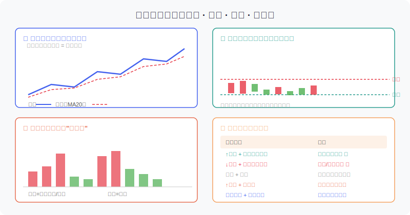
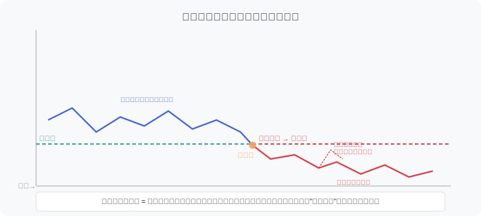
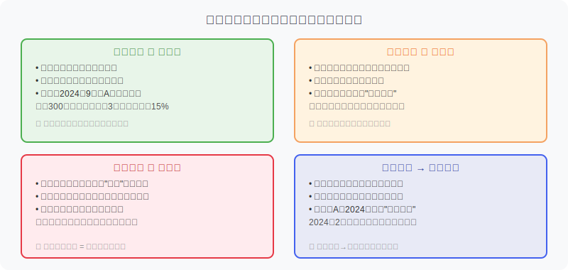

## 散户投资小白金融全品种操盘手册 - 5.6 技术面 —— 趋势、支撑、压力、成交量
  
### 作者  
digoal  
  
### 日期  
2026-06-03  
  
### 标签  
金融产品 , 金融工具 , 散户 , 投资小白 , 全品操盘手册  
  
----  
  
## 背景 
  

## 开篇：一个让你亏钱的直觉

"股票涨了好多了，应该快跌了吧？"

"已经跌了这么久，该反弹了吧？"

你是不是也这样想过？这两句话，是散户亏损最常见的认知根源——**把"感觉涨多了"当成卖出依据，把"感觉跌够了"当成买入依据**。

技术分析要教你做的，恰恰相反：**不猜顶底，只顺趋势；不看感觉，只看证据。**

本节不是教你炒短线、算命预测明天涨跌。技术面在个股操盘中的角色，是**辅助工具**——确认基本面判断、寻找更好的买卖时机、设置止损位置。把它当成主要决策依据，会让你陷入看图炒股的陷阱。

---

## 一、趋势：方向比时机更重要

### 什么是趋势

趋势就是价格移动的方向。听起来简单，但散户最常犯的错是：**在下跌趋势里抄底，在上涨趋势里过早卖出。**

趋势分三种：
- **上升趋势**：高点比高点高，低点比低点高（一浪高过一浪）
- **下降趋势**：高点比高点低，低点比低点低（一浪低过一浪）
- **横盘震荡**：高点和低点都在一个区间内反复波动

判断趋势的最简单工具：**均线**（移动平均线，MA）。

把近N天的收盘价平均，连成一条线，就是均线。常用的是MA5（5日线）、MA20（20日线）、MA60（60日线）和MA250（年线）。

**最实用的趋势判断规则：**
- 股价持续在20日均线上方，且均线向上倾斜 → 上升趋势
- 股价持续在20日均线下方，且均线向下倾斜 → 下降趋势
- 股价反复穿越均线，均线走平 → 震荡

### 趋势的本质是什么

为什么趋势会持续？

因为背后有**资金的惯性**。一个股票在上涨，意味着持续有资金愿意在更高的价位买入，只要买入方的意愿不变，趋势就会延续。趋势反转，需要有足够大的力量改变这一格局——往往是基本面恶化、大资金撤退、或者市场情绪的骤变。

**散户的错误**：把"涨太多了"当成卖出理由。趋势里没有"涨太多"，只有"趋势还在不在"。

### 第一性原理分析

**【前提清单】**
支撑"顺趋势操作胜率更高"成立，需要以下前提：

- 前提A：市场存在价格动量效应（资金惯性）→ **准常量** → 大量学术研究（含A股）证实动量效应存在，但强弱随市场状态变化
- 前提B：趋势尚未到顶/底部拐点 → **变量** → 无法预判，只能用信号确认
- 前提C：没有黑天鹅事件打断趋势 → **变量** → 政策、外部冲击均可突然打断

**【情景推演】**
- 正常情景（趋势延续）：顺趋势持仓，等待出现"趋势破坏信号"再减仓
- 压力情景（趋势减速）：成交量萎缩、均线走平 → 缩减仓位至半仓，等待确认
- 极端情景（黑天鹅突破趋势）：无论技术面多强，基本面恶化时果断止损

---

## 二、支撑与压力：市场的记忆

### 支撑是什么

**支撑位**（Support）：价格历史上多次在这个位置企稳反弹的价格区域。

为什么支撑有效？因为**市场有记忆**。曾经有大批资金在这个价位买入，当股价跌回这里，这批"老买家"不愿意亏损离场，会积极护盘；新买家也看到这是"历史低点"而加入，买盘合力形成"地板"。

**压力位**（Resistance）：价格历史上多次在这个位置遭遇抛压回落的价格区域。

为什么压力有效？曾经被套在这个位置的资金，一旦反弹回来，就想"解套出逃"，形成大量卖出，压制上涨。

### 最重要的规律：支撑和压力会互换

这是技术分析里最值得记住的一条：

> **当价格有效突破压力位，压力变支撑；当价格跌破支撑位，支撑变压力。**

**为什么会互换？**

以"支撑跌破变压力"为例：
- 原来很多资金在支撑位买入
- 支撑跌破，这批资金被套
- 股价反弹回到原支撑位时，被套资金纷纷"解套出逃"
- 大量卖单涌现，原支撑变成了压力

**实操例子（2024年A股沪指3000点）：**
- 沪指在3000点附近反复企稳，这是心理支撑 + 历史支撑
- 2024年9月政策刺激下突破3000点后，3000点成为重要支撑
- 后续每次回调至3000点附近，资金积极介入

**哪些价位容易成为支撑/压力？**
1. **整数关口**：3000点、10元、20元等，心理意义强
2. **历史高点/低点**：历史成交密集区，套牢盘多
3. **均线**：尤其是120日线、250日线，机构重视
4. **前期平台**：横盘整理区间的上下边界

### 有效突破 vs 假突破

突破了压力位，就一定能涨？**不一定。**假突破非常常见，散户追高后被套。

**判断有效突破的标准：**
- 成交量显著放大（至少是近20日均量的1.5倍以上）
- 收盘价站稳突破位（不是盘中突破后拉回）
- 次日未跌回突破位以下

**只满足1条的，谨慎；满足3条的，可信度高。**

---

## 三、成交量：趋势的"发动机"

### 成交量的本质

成交量（Volume）反映的是**市场参与者的意愿强度**。

用一个比喻：股价是车，趋势是方向，成交量是油门。车可以靠惯性滑行（缩量上涨），但走不远；只有持续踩油门（放量），才能跑得又快又稳。

### 四种量价关系，逐一拆解

**1. 量增价涨（最健康）**

资金持续净流入，多头力量强劲，趋势可信度最高。这时可以持仓、甚至适量加仓（注意仓位上限）。

经典案例：2024年9月24日-10月8日，A股在政策刺激下大幅放量拉升，沪深300单周涨幅超过15%，成交量创历史新高。这种放量上涨，是机构资金集体入场的信号。（来源：Wind数据，2024年）

**2. 量缩价涨（需警惕）**

涨势没有量能支撑，像一个在减速的车。通常有两种含义：
- 主力控盘，小量拉高股价（之后往往有出货）
- 市场情绪温和，上涨缺乏持续动力

操作建议：短线可持仓，但不追高，把止损位放在最近支撑位下方。

**3. 量增价跌（最危险）**

**这是散户最容易犯的错：看到成交活跃就以为有人在抢，以为行情要来，其实是主力在出货。**

放量下跌，意味着大量卖单涌出，多空博弈结果是空头占优。在高位出现这个信号，是重要的离场警示。

**一个失败案例**：2015年牛市末期，多只中小创股票出现高位放量大跌，很多散户看到"成交活跃"反而加仓抄底，结果越抄越套，股价再跌60%-80%。

**4. 量缩价跌（观察底部）**

卖盘枯竭，抛压减弱，但还不能急着买入。等待**放量向上确认**——当股价从低位放量上涨，才是底部反转的信号。

**案例**：2024年2月A股探底过程中，成交量萎缩至极低水平，之后随政策预期改善出现放量反弹，这才是底部确认的重要信号。（来源：Wind数据，2024年）

### 成交量的注意事项

1. **看相对量，不看绝对量**。同一只股票放量是相对于自身近期均量而言的，1亿成交对小盘股是天量，对大盘股是常规。
2. **A股的成交量有噪音**。主力可以通过关联账户对倒虚增成交量，放量不一定是真实买盘，但缩量一定是真实的。
3. **看量价配合**，而不是单独看量。量是股价趋势的"确认者"，不是独立信号。

---

## 四、实操例子：如何把四要素结合起来用

### 场景设定

假设你手里有10万元，看好某消费行业龙头股（基本面部分已在前几节判断过，本节只处理技术面的买卖时机）。

**第一步：判断趋势**
- 打开日K线图，看股价是否在20日均线上方且均线向上倾斜
- 若是 → 上升趋势确认，可以考虑买入
- 若均线向下 → 先观望，不在下跌趋势里抄底

**第二步：找支撑位**
- 看近3个月的历史走势，找到股价多次反弹的价格区域
- 例如：股价在25-26元之间反复企稳，这是支撑区
- 等待股价回踩到这个区域（26元附近）

**第三步：看成交量确认**
- 在回踩过程中，量是否在萎缩？
- 如果量缩（说明抛压减弱）+ 股价没破支撑 → 低风险买入窗口
- 如果量增且价破支撑 → 不买，等下一个支撑位或趋势确认

**第四步：设置止损位**
- 止损设在支撑位下方3%-5%
- 例如支撑在26元，止损设在24.8-25.2元
- 一旦收盘价跌破止损位，执行止损，不扛单

**如果操作错误后如何纠偏：**
- 买入后股价没有反弹，而是继续放量下跌 → 这是趋势判断失误
- 纠偏方法：在止损位执行止损，接受损失；重新等待趋势信号再做判断
- 不能做的：继续加仓"摊低成本"（在下跌趋势中加仓是最危险的操作之一）

---

## 五、可复用框架

### 【框架一：技术面四问框架】

**适用场景**：个股买入前的技术面检查

**核心逻辑**：技术面是买卖"时机"的决策工具，不是买入理由

**操作步骤**：
1. **问趋势**：日线均线方向向上吗？股价在MA20上方吗？→ 是才往下问
2. **问位置**：现在的股价离支撑位多远？是在压力位附近还是支撑位附近？
3. **问量能**：回踩支撑时量是否萎缩？突破压力时量是否放大？
4. **问止损**：支撑位在哪里？止损位设在哪里？承受得了这个亏损吗？

**举一反三**：这个框架同样适用于ETF的买入时机判断（第四章）

---

### 【框架二：VPTS验证框架】

**适用场景**：确认一次突破是否有效

**VPTS = Volume（量）+ Price（价）+ Time（时间）+ Support（支撑转化）**

**操作步骤**：
1. **V（量）**：突破时成交量是否放大到近20日均量的1.5倍以上？
2. **P（价）**：收盘价是否站上突破位，而不是仅盘中突破？
3. **T（时间）**：次日是否没有跌回突破位以下？（至少确认1-2天）
4. **S（支撑转化）**：原压力位是否开始成为回踩时的支撑？

**满足4条 → 高可信突破，可以跟进**
**满足2-3条 → 半仓试探，等待更多确认**
**满足0-1条 → 假突破概率大，不追**

**举一反三**：跌破支撑时同样适用（方向反过来），用于判断是否需要止损

---

## 六、常见错误清单

以下四种操作，是散户因为技术面判断错误而最常亏钱的场景：

**错误一：在下跌趋势中抄底**
- 症状："跌这么多了，肯定快到底了"
- 结果：越抄越套
- 纠正：在趋势反转确认（放量站上均线）之前，不参与

**错误二：看到成交量大就以为行情要来**
- 症状：高位放量大跌，反而买入
- 结果：接主力出货的盘
- 纠正：放量要结合方向——高位放量跌 = 出货信号

**错误三：没有设置止损位就买入**
- 症状："到时候再看情况"
- 结果：被套后不甘心止损，越亏越大
- 纠正：买入前必须先确定止损位，止损是买入的前提条件

**错误四：把技术面当成唯一决策依据**
- 症状：不看基本面，只看K线和均线
- 结果：技术面好但公司烂，赚了技术亏了基本面
- 纠正：技术面是时机工具，基本面是买入理由

---

## 本节行动清单

1. **今天打开你关注的一只股票**：找出日线图上的20日均线，判断趋势方向（向上/向下/横盘）
2. **画出近3个月的支撑位和压力位**：用虚线标记，看看历史上哪些价格区域多次出现反转
3. **检查一次历史买卖点的成交量**：你上次买入时，量是放大还是萎缩？结果如何？
4. **为下一次买入提前写好止损位**：确定支撑位在哪，止损位设在支撑位下方5%以内
5. **在模拟账户里练习**：用技术面四问框架过一遍你想买的股票，熟悉这个流程

---

## 一句话总结

技术面不是水晶球，它的价值在于：**告诉你现在的市场合力是什么方向，给你一个相对低风险的买卖时机，以及一个清晰的止损边界。**

---

> ⚠️ **声明**：本文内容为投资教育目的，所有历史数据、策略框架均为辅助学习工具，不构成证券投资建议。市场有风险，投资需谨慎。实际操作请结合自身风险承受能力，必要时咨询专业投顾。历史数据不代表未来表现。
  
  
#### [PostgreSQL 解决方案集合](../201706/20170601_02.md "40cff096e9ed7122c512b35d8561d9c8")
  
  
#### [德哥 / digoal's Github - 公益是一辈子的事.](https://github.com/digoal/blog/blob/master/README.md "22709685feb7cab07d30f30387f0a9ae")
  
  
#### [About 德哥](https://github.com/digoal/blog/blob/master/me/readme.md "a37735981e7704886ffd590565582dd0")
  
  

  
