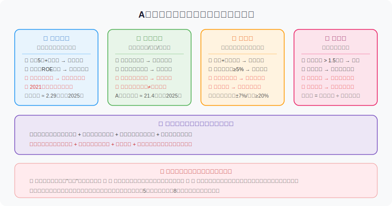
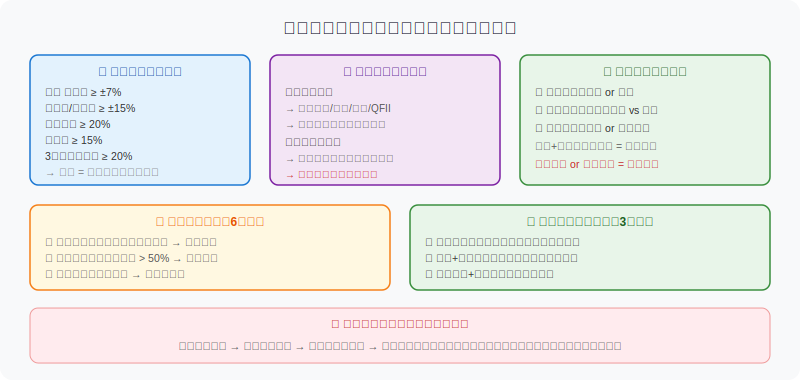
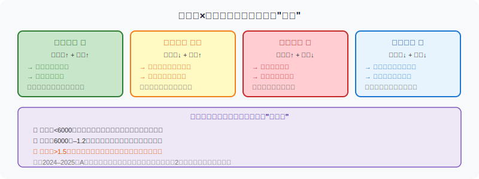

## 散户投资小白金融全品种操盘手册 - 5.7 资金面 —— 北向、机构、龙虎榜、成交额，散户该怎么用？
  
### 作者  
digoal  
  
### 日期  
2026-06-03  
  
### 标签  
金融产品 , 金融工具 , 散户 , 投资小白 , 全品操盘手册  
  
----  
  
## 背景 
  

## 先问你一个问题

你有没有遇到过这种情况：看新闻说"今日北向资金大幅流入50亿"，然后兴冲冲买进去，结果第二天股票该跌还是跌？

或者：龙虎榜显示某股"机构净买入3亿"，你当天追进，结果次日高开低走，才发现机构当天买完就在等你接盘。

资金面的信号，是A股里**最容易被误用的一类信息**——不是没用，而是用错了地方。本节帮你把四个核心资金面指标搞清楚：北向资金、机构资金、龙虎榜、成交额。每一个讲三件事：是什么、真正有用的地方在哪、散户最容易踩的坑是什么。

---

## 一、北向资金：外资的"聪明钱"，但没那么聪明

### 它是什么

"北向资金"就是通过沪港通、深港通进入A股的境外资金。方向是从香港往北流，所以叫北向。反向的叫南向（内地资金买港股）。

资金来源主要是海外机构：全球主权基金、对冲基金、外资投行、跨国保险公司等。截至2025年，北向资金持有A股流通市值约**2.29万亿元**，占全市场比重虽然不大，但因为它们代表的是有系统研究能力的专业机构，所以市场把它叫"聪明钱"。

### 北向真正有用的地方

**第一，中线趋势验证。** 不要看单日数据，要看持续性。连续5个以上交易日净流入，且累计金额有分量（比如单周超过100亿），这才算外资对A股发出中线看多信号。反之，连续大幅净流出，说明外资在减少风险暴露，市场可能面临压力。

**第二，个股筛选背书。** 北向资金历史上偏好高ROE（净资产收益率，可以理解为公司"用股东的钱赚钱的效率"）、高成长性的龙头公司。查一下北向持仓前50大个股，基本都是各行业的核心资产——这些股票的退市风险、财务造假风险极低，对小白来说是"安全感更高的标的池"。

**第三，极端情绪的反指。** 当北向资金某日单日净卖出超过100亿，市场往往陷入恐慌。历史上这种极端流出后，往往反而是买入时机。但这是高级用法，新手不必强行操作。

### 北向的真实限制（很多人不知道）

2021年之后，"跟随北向买股"的超额收益大幅衰减。研究数据显示：以北向资金月度净增持前20大标的构建投资组合，**2021年前有明显超额收益，2021年后优势明显减弱**。

原因有两个：第一，北向策略被市场学习并套利，信号效应下降；第二，北向资金本身也包含被动调仓、指数再平衡等操作，不是每笔都有主动选股逻辑。

**结论：北向是参考维度，不是指令。单日数据基本没有参考价值；连续数据+基本面配合，才有意义。**

---

## 二、机构资金：A股真正的"压舱石"，但你看到的永远是滞后信息

### 机构资金是谁

A股的机构投资者主要包括：公募基金（35万亿净值级别，2025年数据）、保险资金（持有A股约3万亿）、社保基金、养老保险基金、证券公司自营等。截至2025年8月，各类中长期资金持有A股流通市值合计超过**21万亿元**，较五年前增长超30%。

机构投资者的特点是：研究体系完整、持仓周期更长（通常以季度为单位考核）、对估值更敏感。

### 哪些渠道能看到机构动向

**定期报告（季报/年报）：** 上市公司十大流通股东名单，每季度披露一次。你可以看到哪些机构在增持或减持。缺点是有1–2个月滞后，看到时市场早就反应了。

**龙虎榜机构席位：** 这是最实时的机构信号，后面单独讲。

**基金持仓报告：** 每只公募基金每季度公布前十大持仓。如果你发现多只明星基金同时增持某只股票，是一个有参考价值的信号。

### 机构资金的使用误区

最大的误区是：**看到机构增持就立刻跟进**。

实际问题在于：机构建仓一只股票可能需要数周甚至数月。你从季报看到机构增持时，它可能早已在更高价格继续买，也可能已经开始减仓。**机构的动作和你的可操作时间窗口之间，存在结构性的信息差。**

正确做法：用机构持仓方向判断"这个行业/公司是否被长线资金认可"，而不是用来确定具体买入时机。

---

## 三、龙虎榜：A股里最被高估的数据，也是最被误用的数据

### 龙虎榜是什么

沪深交易所每天收盘后，会公布当日出现"异动"的个股榜单——这就是龙虎榜。

**不是所有股票都能上榜**。触发条件包括：沪深主板涨跌幅偏离值超过±7%、或日换手率达到20%、或日内振幅超过15%等。创业板、科创板因为涨跌幅限制±20%，触发条件略有不同。

上榜后，交易所会公布该股当日买卖金额前5名的营业部或机构席位名称及金额。这就是你在软件里能看到的"龙虎榜明细"。

### 席位的含义

榜单里的席位分两大类：

**机构专用席位**：基金、社保、保险、QFII等，统一显示为"机构专用"，代表有研究逻辑的中长线资金。

**游资营业部席位**：就是我们常说的"游资"——资金量大、操作灵活、以短线博弈为主的个人大户或私募。比较有名的游资席位有特定地区的营业部，它们在龙虎榜的出现频率很高，市场上有专门研究这些席位操盘风格的资料。

### 哪些信号值得关注

**最强信号：** 多个机构席位同日净买入，且北向资金也在买方——这代表外资和内资机构对这只股票的基本面有共同认可，是相对高质量的信号。

**次级信号：** 机构净买入金额占当日成交额比例超过5%，说明机构是这轮行情的主导方，而非游资炒作。

**需要回避的信号：**
- **"拉萨"席位出现在买方**：这是特定高频出货席位的代称，历史上该席位大量买入往往意味着主力在用此账户进行掩护性买入配合出货，后续下跌概率较高；
- **一家独大**：某营业部买入金额超过买方合计的50%，可能存在单一主力操控，市场缺乏合力；
- **连续上榜但量能萎缩**：股票连续几天上龙虎榜，但每天成交额在缩小，往往是主力边拉边出。

### 龙虎榜的根本限制

**龙虎榜是盘后数据。** 当你看到"机构买入X亿"，这笔买已经发生了——这家机构买完后，可能当天已经开始减仓，或者等着次日高开时卖给你。

散户跟龙虎榜最常见的亏损路径：看到机构买入→次日高开追进→当天机构已开始卖→接盘被套。这个路径在A股里每天都在重复上演。

**正确姿势：把龙虎榜作为"这只股票今天有大资金参与"的确认，而不是明天能涨的指令。要结合第8节的买入时机框架，等回踩确认后再考虑介入。**

---

## 四、成交额与换手率：市场温度计，最简单也最容易被忽视

### 两个概念先搞清楚

**成交额**：某段时间内（通常指某日）市场所有成交的总金额。A股常说"两市成交额"，就是沪市和深市加总。

**换手率**：当日成交股数 ÷ 该股流通股总数 × 100%。换手率10%意味着今天有10%的流通股易手了。

### 成交额的读法

**全市场成交额：判断整体温度。**

两市日成交额低于6000亿，市场冷清，个股分化严重，追热点风险大。6000亿至1.2万亿，属于正常状态，技术信号和资金信号都比较可信。超过1.5万亿，市场情绪亢奋，接近过热，散户这时追进去容易被高位套住。2024年9月之后的行情中，A股多次单日成交超过2万亿，那是极端的情绪放热阶段。

**个股成交额：判断真假突破。**

价格上涨，同时成交额明显放大（相对近30日均量放大1.5倍以上），说明有真实买盘推动，突破有效性更高。价格上涨但成交额萎缩（所谓"无量上涨"），多半是虚涨，很快会回踩，甚至反转。

**换手率的参考标准：**

个股日换手率1–3%属于正常波动；5%以上开始活跃；10%以上属于放量，市场参与意愿强；超过20%而且同时伴随涨停，说明有主力资金强力介入，但也意味着短期获利盘丰厚，后续波动会加大。

---

## 五、前提清单与情景推演

【前提清单】  
支撑"资金面信号有效"成立需要以下前提：  
- 前提A：市场处于正常流动性环境（无极端政策干预、无系统性风险事件）→ **常量** → 大多数时间成立  
- 前提B：资金信号持续时间足够长（不是单日噪音）→ **变量** → 具体情况需判断  
- 前提C：信号未被市场过度跟风导致失效（如北向2021年前后的信号衰减）→ **变量** → 市场结构变化可能推翻

【情景推演】  
正常情景（前提全部成立）：多项资金面信号共振，结合基本面和技术面，做出决策准确率提升明显。  
压力情景（前提B被推翻，单日信号）：不具参考价值，按噪音处理，不操作。  
极端情景（前提A+C同时出现）：2015年股灾、2020年疫情冲击期间，北向大额流出并非基本面判断，而是强制赎回和风险管理需要，这时跟随北向的反向操作（北向大卖时逢低买入）反而是更合理的做法。  
→ 对应操作调整：极端情绪下，降低资金面信号权重，提高对估值和基本面逻辑的依赖。

---

## 六、实操例子：三种信号叠加时，散户如何决策

**假设场景：**  
你关注一只医药行业龙头，当前持仓20万，该股占总仓位15%。近日观察到以下信号：

**第一步：检查北向资金（5日维度）**  
过去5个交易日，该股北向资金净流入，合计约2亿，占流通市值约0.3%。持续流入且无明显单日异常——北向信号：**中性偏多**。

**第二步：检查龙虎榜（近3日）**  
该股昨日上了龙虎榜（换手率突然超过8%），龙虎榜显示：机构席位净买入5200万，无游资席位，无拉萨，买卖比1.8:1。——龙虎榜信号：**偏多，但需等确认**。

**第三步：检查成交额（近10日）**  
该股近10日成交额整体在低位（日均2亿左右），昨日龙虎榜当天突然放量至6亿，今日成交额缩回至2.5亿，股价小幅回落——成交额信号：**放量上涨后的正常回踩，非放量下跌**。

**第四步：判断信号共振程度**  
三个信号方向一致，但都还没有"确认"状态——北向连续性不够长、龙虎榜只有1天、成交额还没有持续放量。这时操作建议：**不追高，等回踩支撑后确认再介入，可以把目标买入价设在昨日放量后形成的支撑位附近（即昨日K线低点附近）**。

如果操作错误（冲动在昨日龙虎榜后的今日高位追进），后果：股价继续回踩，在没有下一次信号共振之前，可能陷入横盘等待；纠偏方案：参照第10节的逻辑止损原则，如果持有5个交易日仍无新增量信号，考虑小仓位止损撤出。

---

## 七、可复用框架

【框架名称】**资金四维共振法**

适用场景：个股是否值得阶段性介入（持有1–4周的波段操作）

核心逻辑：单一资金信号可信度低，多维信号方向一致时才提高操作确定性

操作步骤：  
1. 北向资金：查近5–10日净流入/流出方向，有没有持续性  
2. 机构/龙虎榜：近3日有无机构席位净买入，占比是否超过5%  
3. 成交额：放量是上涨还是下跌，当前换手率是否健康（3–10%区间）  
4. 评分：三项同向为强信号，两项同向为中等信号，仅一项或方向矛盾则不操作  

举一反三：这个框架也适用于ETF的波段介入判断（把北向改为全市场资金流向，把龙虎榜改为ETF资金净流入数据）。

---

## 本节行动清单

1. **打开你常用的证券软件，找到"北向资金"或"陆股通"数据栏，从今天开始观察5日、10日的净流向，而不是单日数字。**
2. **对你关注的个股，每次买入前查一次近5日龙虎榜记录——有没有机构席位？机构是净买还是净卖？有没有"危险席位"出现？**
3. **把"全市场成交额"加入你的日常看盘清单。超过1.5万亿时，提醒自己放慢追高节奏；低于6000亿时，减少仓位操作频率。**
4. **学会看价量配合：追个股突破前，先确认是放量上涨，还是缩量上涨。缩量突破不追。**
5. **不做"龙虎榜次日追板"操作，这是A股里散户最容易接盘的陷阱之一。**

---

## 一句话总结

资金面四个维度——北向、机构、龙虎榜、成交额——每一个单独都是噪音，四个方向一致才是信号；散户最大的错误，是把别人已经做完的操作当成自己即将赚到的钱。

---

> ⚠️ **声明**：本文内容为投资教育目的，所有历史数据、策略框架均为辅助学习工具，不构成证券投资建议。市场有风险，投资需谨慎。实际操作请结合自身风险承受能力，必要时咨询专业投顾。
  
  
#### [PostgreSQL 解决方案集合](../201706/20170601_02.md "40cff096e9ed7122c512b35d8561d9c8")
  
  
#### [德哥 / digoal's Github - 公益是一辈子的事.](https://github.com/digoal/blog/blob/master/README.md "22709685feb7cab07d30f30387f0a9ae")
  
  
#### [About 德哥](https://github.com/digoal/blog/blob/master/me/readme.md "a37735981e7704886ffd590565582dd0")
  
  

  
