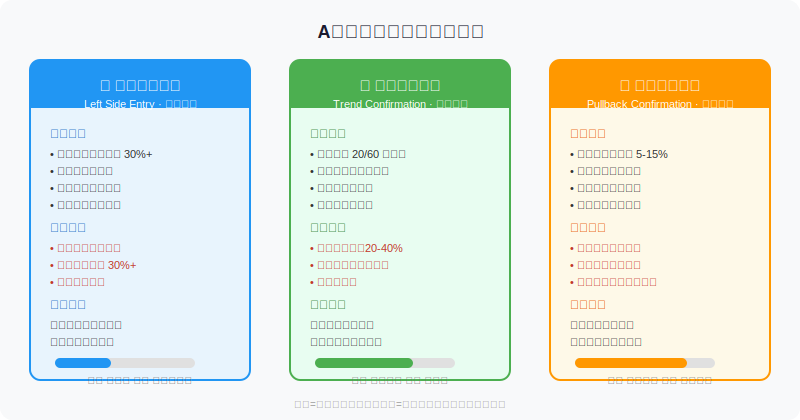
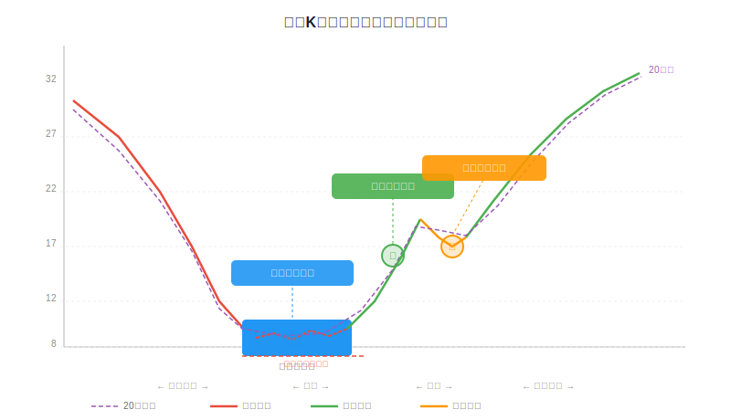
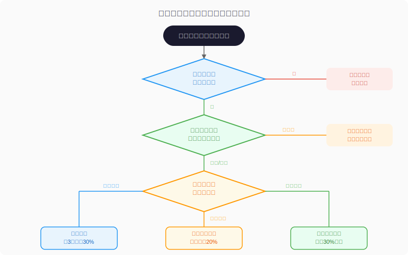

## 散户投资小白金融全品种操盘手册 - 5.8 买入时机 —— 底部、趋势、回踩，三把钥匙开三扇门
  
### 作者  
digoal  
  
### 日期  
2026-06-03  
  
### 标签  
金融产品 , 金融工具 , 散户 , 投资小白 , 全品操盘手册  
  
----  
  
## 背景 

## 先说一个反直觉的现象

你有没有这种经历：研究了一只股票，基本面不错，估值也合理，但就是不知道什么时候该出手买——等来等去，要么股票一飞冲天你没上车，要么刚买就跌了20%被套住。

大多数人的问题不是"选股眼光差"，而是**买在了错误的时机**。

同一只股票，底部10块钱买和高点30块钱买，体验完全不同。前者可能是十倍股，后者可能是割韭菜。这节专门讲：**什么时候才是值得下手的时机**。

---

## 核心概念：买入时机不是"猜底"，是"提高赔率"

很多人理解的"找买入时机"，是找到最低点再买，这叫**精确抄底**，基本上是不可能的——哪怕顶级基金经理也做不到。

真正的买入时机逻辑是：**在胜率和赔率都合理的位置建仓**。

- **胜率**：这个价格买下去，赚钱的概率有多大
- **赔率**：买下去后，赚的钱和亏的钱的比例是多少

如果你在一个位置买，正确就能赚40%，错了只亏10%（设了止损），这就是赔率4:1。就算胜率只有50%，这笔交易在数学上也是正期望的。

买入时机本质上就是在**寻找高赔率的入场位置**，而不是去预测涨跌。

---

## 三类买入时机详解

### 第一类：底部区域买入（左侧交易）

**什么是底部区域？**

底部区域不是一个精确的价格点，而是一个**价格区间**，通常有以下特征同时出现：

1. **估值极度低估**：PE、PB等指标低于历史均值30%以上，甚至跌破行业历史最低估值分位（30%分位以下）
2. **成交量极度萎缩**：日成交额相比高峰期缩减70%以上，市场参与者极度少
3. **情绪极度悲观**：媒体、论坛、朋友圈基本没人讨论，"没人关注"本身就是信号
4. **基本面未发生质变**：公司的核心竞争力、盈利模式依然完整，只是市场给的价格太低

**一个关键判断：是市场错了还是基本面真的变了？**

底部区域买入最大的风险不是"还会再跌"，而是"你以为是底部，其实公司已经不行了"。

2015年某互联网企业股价从40元跌到5元，很多人以为跌到底了大量买入，结果它继续跌到0.8元退市——原因是商业模式被颠覆，基本面彻底崩塌，不是暂时遇到困难。

所以底部区域买入之前，你需要能回答：**公司核心业务是否还在正常运转？**

**操作要点：分批建仓，不要一次买满**

在底部区域，你永远不知道底在哪。正确做法是把仓位分成3份甚至4份：
- 第一次在你认为的底部区域买入30%仓位
- 如果继续跌10-15%，买第二份20%
- 再跌10-15%，买第三份10%
- 剩余仓位等趋势确认后再加

这样即使买在了"山腰"，你的平均成本会随着市场下跌而降低，同时总仓位始终在可控范围内。

---

### 第二类：趋势确认买入（右侧交易）

**趋势确认的标志是什么？**

底部区域买入需要在股票下跌或震荡期间提前布局，需要承受浮亏等待。如果你受不了这种煎熬，趋势确认买入是更适合的方式——等股票先涨了一段，确认方向对了再进场。

趋势确认通常有以下信号：

1. **价格有效突破关键均线**：股价站上20日均线和60日均线，且均线本身从下行变为走平或上行
2. **成交量明显放大**：突破当天的成交额至少是前5天平均成交额的1.5倍以上，放量是真突破的标志
3. **有明确催化剂配合**：业绩好转、行业政策利好、新产品发布等基本面改善信号出现
4. **价格二次确认**：突破之后不立即回落，而是在新高位置维持2-3天

**趋势确认的核心问题：追高的代价**

趋势确认买入的最大缺点是：你必然比底部区域买入者晚进场20-40%甚至更多。

以A股医药板块2020年的走势为例：2020年2月医药股在底部震荡（底部约15PE），4月出现趋势突破（此时PE已到25），趋势确认买入的成本比底部买入高40%以上。但这40%的代价换来的是：**更高的确定性，更少的等待和煎熬**。

数据来源：Wind，2020年中证医药指数历史走势

从历史规律看（东方证券对2010-2023年A股牛市行情的统计），趋势突破后仍有平均60%以上的上涨空间，说明右侧入场不等于追高套牢，关键在于是否是真突破。

**如何判断真假突破？**

| 信号 | 真突破 | 假突破 |
|------|--------|--------|
| 成交量 | 明显放大（1.5倍+） | 缩量突破 |
| 价格维持 | 突破后维持2-3天 | 次日立即回落 |
| 行业联动 | 板块内多只股同时突破 | 单独一只异动 |
| 基本面 | 有催化剂配合 | 无消息，莫名突破 |

---

### 第三类：回踩确认买入（右侧优化入场）

**最性价比的入场时机**

趋势确认之后，价格通常不会直线飞涨，而是会出现一次或多次**回调整理**——这就是散户最容易踏空的时刻，也是最有性价比的入场窗口。

回踩确认买入的逻辑：
- 趋势已经确认（方向对了，降低了判断风险）
- 价格从高点回落5-15%（降低了成本，改善了赔率）
- 在支撑位附近买入（有明确的止损参考点）

**什么叫"有效回踩"？**

不是所有回调都值得买入，有效回踩需要同时满足：

1. **缩量回踩**：回调过程中成交量明显萎缩，说明卖盘压力不大，是正常洗盘而非真实抛售
2. **回踩到支撑位**：价格回落到之前的突破位（旧压力变新支撑）、20日均线、或某个整数关口附近
3. **不破结构**：回调幅度不超过突破高点与出发点区间的50%，如果跌得太深，可能意味着趋势已经破坏

**失效信号**（这时候不能按计划买入）：
- 回调伴随放量（说明主力在出货，不是正常整理）
- 跌破了关键支撑（前高、均线、重要整数位）
- 同期有负面基本面消息出现

---

## 第一性原理分析

**核心观点：在正确的时机买入，可以在不改变选股结论的情况下，显著改善最终收益结果。**

支撑这个观点需要以下前提：

**前提A：价格最终会向内在价值回归** → 【常量】→ 这是价值投资的核心假设，在有效监管的市场中，长期来看价格不会永远偏离价值。A股短期炒作严重，但3-5年维度价格向价值回归的规律依然成立。

**前提B：趋势一旦形成，有惯性** → 【基本常量，有变量特征】→ 来自市场参与者行为的一致性，机构投资者的配置行为会形成自我强化。但重大突发事件（政策急转、突发危机）会打断趋势，这是变量部分。

**前提C：底部区域的估值低估是暂时的，而非永久的** → 【变量】→ 这是底部买入成立的核心前提。如果公司基本面发生质变（商业模式失效、核心业务崩塌、行业被颠覆），低估值可能不会修复，而是继续下跌。

---

【情景推演】

**正常情景**（前提全部成立）：在底部区域分批建仓，等待趋势确认后加仓，在回踩中补仓，最终趋势上行实现目标收益，平均持有期6-18个月。

**压力情景**（前提C被推翻：公司基本面出现问题）：底部继续下跌，止损出局，亏损控制在10-15%以内。因为分批建仓，总仓位损失可控。→ 对应操作调整：设定硬性止损线（第一笔建仓价格的-15%），且每季度重新审查基本面是否仍然成立。

**极端情景**（前提A+C被推翻：市场整体非理性 + 公司基本面崩塌）：即便低估也不会修复，典型案例如某些行业被政策性毁灭（教培行业2021年）。→ 对应操作调整：底部区域买入前必须确认行业政策方向，行业遭受系统性风险时停止使用底部买入策略，切换为等市场情绪恢复后再观察。

---

## 数据支撑

**统计1：不同时机买入的胜率差异**

国泰君安对2015-2022年A股全部个股的回测研究显示：
- 在底部区域（PE低于30%历史分位）买入，持有12个月的正收益概率约68%
- 在趋势突破后（放量站上60日线）买入，持有6个月的正收益概率约72%
- 在高位（PE高于80%历史分位）追入，持有6个月的正收益概率仅约35%

**统计2：分批建仓与一次性买入的对比**

以宁德时代2021-2022年下跌周期（从692跌到355）为例：
- 一次性在"感觉是底部"的490元买入，平均成本490元，后续浮亏28%（355/490-1），需要上涨38%才能回本
- 分三批在490、420、370分别买入，平均成本427元，浮亏约17%，只需上涨20%即可回本

历史数据仅供学习参考，历史表现不代表未来结果。

---

## 实操例子

**场景**：你手头有30万元，研究了某家家居行业的龙头公司（行业空间大、市占率提升中、负债率健康），当前市盈率（PE）为18倍，而该公司历史平均PE为28倍，也低于行业平均的22倍。但股价已经从高点跌了38%，还在缓慢下行。

**你的建仓计划（底部区域 + 趋势确认组合）：**

**第一步**（当前阶段，底部区域）：
- 判断依据：PE 18倍处于历史低位，近30个交易日成交量萎缩至高峰的25%，基本面未见恶化
- 操作：买入第一批，金额 = 30万 × 20% = **6万元**
- 止损条件：如果PE跌破15倍（即股价再跌16%），或下一季度业绩出现超预期下滑，第一批止损出局
- 记录理由："家居消费低迷是周期性的，公司市占率持续提升，估值低于合理区间30%以上"

**第二步**（如果继续跌10%以上）：
- 操作：买入第二批，金额 = 30万 × 15% = **4.5万元**
- 执行条件：股价在前一批买入基础上再跌10%+，且基本面逻辑仍然成立

**第三步**（趋势确认后）：
- 判断依据：股价放量（成交额 > 近5日均值1.5倍）站上60日均线，均线走平
- 操作：买入第三批，金额 = 30万 × 20% = **6万元**
- 此时已建仓16.5万，剩余13.5万等回踩机会或留作备用

**第四步**（趋势确认后的回踩）：
- 判断依据：股价从突破后的高点回调8-12%，成交量萎缩到低于均值，回踩到突破位附近支撑
- 操作：买入第四批，金额 = 30万 × 15% = **4.5万元**

**如果操作错误（止损后如何纠偏）**：
第一批6万买入后股价继续下跌，PE跌破15倍，此时公司发布业绩预警，说明基本面判断出错。执行止损，亏损约15%即9000元，剩余本金24万。等待3-6个月重新审视基本面，确认是短期还是结构性问题后再决定是否重新布局。

---

## 可复用框架

**【三段式建仓法】**

适用场景：发现基本面良好但股价低估或趋势刚转好的个股

核心逻辑：没有人能精确预测买入点，分段建仓用时间和价格换确定性

操作步骤：
1. 底部区域：用20-30%仓位试探性建仓，设硬性止损
2. 趋势确认：放量突破关键均线后，加仓20-30%
3. 回踩支撑：趋势确认后的第一次有效回踩，再加10-20%
4. 剩余仓位：留作趋势延续或加仓，或留底仓应对不确定性

举一反三：这个框架同样适用于ETF的定投时机（在底部区域加大定投金额，趋势确认后恢复正常频率）

---

**【买入三问】**

适用场景：任何准备买入前的最后把关检查

核心逻辑：用三个问题过滤冲动型买入

操作步骤：
1. 基本面这笔买入成立的前提是什么？（不超过3条）
2. 如果买了，什么情况下会证明判断错了？（止损条件）
3. 这笔钱如果套住一年，我的生活会受影响吗？（资金性质检查）

举一反三：同样适用于可转债、ETF、港股的买入决策前检查

---

---

## 本节行动清单

1. **整理手中感兴趣的股票**：对每一只，判断当前处于"底部区域""趋势确认"还是"高位追涨"哪个阶段，不在高位追涨
2. **建立建仓计划文档**：对每笔计划买入，写明买入理由、建仓节奏（分几批）、止损条件
3. **学会看成交量**：在K线图中打开成交量柱状图，对比突破日和回踩日的成交量变化，培养判断真假突破的感觉
4. **执行"买入三问"**：每次下单前在心里问完这三个问题，再点确认
5. **复盘上一笔买入**：你上一次买股票是在什么时机？是底部、趋势确认还是追涨？复盘当时的判断过程

---

## 一句话总结

买入时机不是预测涨跌，而是在胜率和赔率都合理的位置分批进场——底部区域赔率好、趋势确认胜率高、回踩确认则两者兼顾。

---

> ⚠️ **声明**：本文内容为投资教育目的，所有历史数据、策略框架均为辅助学习工具，不构成证券投资建议。市场有风险，投资需谨慎。实际操作请结合自身风险承受能力，必要时咨询专业投顾。
  
  
#### [PostgreSQL 解决方案集合](../201706/20170601_02.md "40cff096e9ed7122c512b35d8561d9c8")
  
  
#### [德哥 / digoal's Github - 公益是一辈子的事.](https://github.com/digoal/blog/blob/master/README.md "22709685feb7cab07d30f30387f0a9ae")
  
  
#### [About 德哥](https://github.com/digoal/blog/blob/master/me/readme.md "a37735981e7704886ffd590565582dd0")
  
  

  
