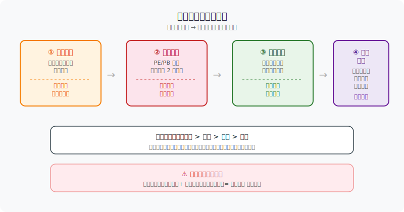
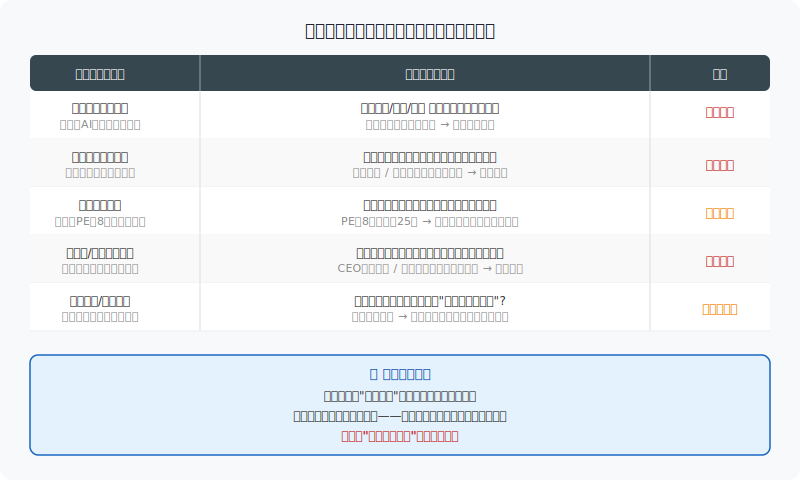
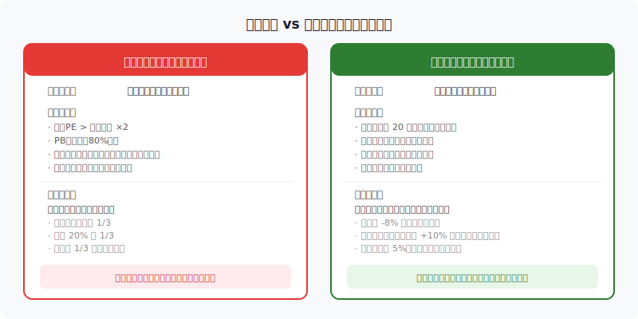
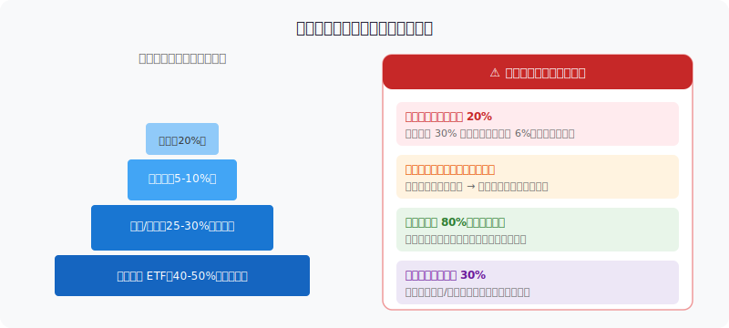

## 散户投资小白金融全品种操盘手册 - 5.9 卖出时机 —— 逻辑破坏、估值过热、趋势破位、仓位失控
  
### 作者  
digoal  
  
### 日期  
2026-06-03  
  
### 标签  
金融产品 , 金融工具 , 散户 , 投资小白 , 全品操盘手册  
  
----  
  
## 背景 
  


## 先问你一个问题

你知道A股散户的最大问题是什么？

不是看不懂买哪只票，而是**不知道什么时候该卖**。

根据多项市场研究数据，A股散户整体亏损率长期维持在 80% 以上。但这里有个反直觉的真相：亏钱的人里，不少人其实**买对了方向**，只是拿不住、卖错了时机。

具体表现是两个方向的错误同时发生：
- **该卖不卖**：亏了死扛，越跌越犹豫，最终在底部割肉。
- **不该卖乱卖**：稍微盈利就跑，没等到主升浪就下车。

结果就是"亏损无限大，盈利有限小"。这不是技术问题，是**卖出规则缺失**的问题。

本节的目标很简单：给你建立一套提前写好的卖出规则，让你在需要执行时，不靠感觉，靠规则。



---

## 核心概念：卖出的四个合理理由

卖出一只股票，应该有充分的理由——不是"跌了好难受"，也不是"涨了好开心太贪了怕回调"。

合理的卖出只有四类触发条件：

**① 逻辑破坏**——当初买入的核心理由不再成立。  
**② 估值过热**——股价涨到了合理估值的天花板之上。  
**③ 趋势破位**——价格跌破了重要技术位或事先设定的止损位。  
**④ 仓位失控**——某只票在账户中占比过高，超出了风险承受范围。

这四条不需要同时满足。**任何一条触发，就值得认真对待**。

优先级排序：逻辑破坏 > 估值过热 > 趋势破位 > 仓位失控。

---

## 第一类：逻辑破坏——最重要的卖出信号

### 什么叫"逻辑破坏"？

回到最基本的问题：你当初为什么买这只股票？

每一个买入决策背后都有一套理由，比如：
- "这家公司做AI服务器，算力需求爆发，订单快速增长"
- "这个行业受政策支持，补贴力度加大，业绩会大幅改善"
- "这只股票PE只有10倍，历史平均25倍，估值严重低估"

把这些理由写下来，就是你的"买入逻辑"。

**逻辑破坏，就是这些理由不再成立了。**

---

### 第一性原理分析

【前提清单】  
支撑"持有一只个股"成立，需要以下前提：

- **前提A**：公司核心业务仍在增长 → 【变量】→ 可能因行业竞争加剧、技术迭代或管理层失误而改变
- **前提B**：行业环境仍然有利 → 【变量】→ 政策转向、周期下行都可能令行业逻辑逆转
- **前提C**：估值仍处于合理区间 → 【变量】→ 股价上涨会使估值走高，可能从低估变成高估
- **前提D**：没有发生重大负面事件 → 【常量前提】→ 财务造假、核心管理层大量减持等属于结构性破坏

【情景推演】  
正常情景（前提全部成立）：继续持有，等待逻辑兑现  
压力情景（前提A出现裂缝，如业绩增速放缓）：减仓1/3，密切跟踪后续财报，持逻辑观察期  
极端情景（前提D触发，如财务造假被立案）：**无论亏损多少，立即清仓**，不计成本

---

### 实操：建立"买入逻辑档案"

具体怎么做：

**第一步**：买入任何一只股票时，打开手机备忘录，写下3-5条买入理由。格式如下：

```
股票名称：XXX
买入日期：2025-03-10
买入价格：45元
买入理由：
  1. 公司AI训练芯片订单同比增长200%
  2. 行业景气度高，2025年资本开支预算未下调
  3. PE 22倍，低于行业平均30倍
卖出条件：
  - 如果连续两季业绩低于预期 → 减仓
  - 如果PE超过40倍且增速放缓 → 开始减仓
  - 如果核心订单客户流失 → 清仓
```

**第二步**：每个季报、年报出来后，逐条对照。

**第三步**：理由还在，继续持有；理由消失，按计划执行，不拖延。

这个流程的核心，是让你**在冷静时做好决策框架，在情绪激动时执行框架**——而不是在股价大跌时才开始纠结"要不要卖"。



---

### "买预期，卖事实"——一个极常见的逻辑兑现信号

A股有一条被反复验证的规律：**利好消息正式落地，往往是最高点**。

原因在于，在消息公布之前，市场已经通过预期把涨幅提前透支了一大半。一旦"事实"兑现，没有新的催化剂，资金就开始获利了结。

例子：
- 某药企申报的新药获批上市，公告当天或之后大跌。
- 某省份出台新能源补贴政策正式落地，相关板块反而见顶。
- 某公司完成并购重组公告，股价冲高后回落。

**这不是"好事变坏事"，而是预期兑现后的自然回归。**

实操建议：持仓的核心逻辑若是"事件驱动型"（等待某个政策、并购、获批），在事件公告前后的情绪高点，就应主动减仓，而不是等到之后再做判断。

---

## 第二类：估值过热——股价走到了不划算的位置

### 什么叫"估值过热"？

简单说：现在的股价，贵了。

以PE（市盈率，即股价/每股盈利，代表你为1块钱盈利愿意付多少钱）为例：

- 一家消费龙头，历史平均PE是25倍，现在涨到了55倍——贵了2倍以上
- 一家制造业公司，历史平均PE是15倍，现在是12倍——还算合理
- 一家科技成长股，行业平均PS（市销率）是5倍，当前是18倍——严重透支

估值过热的判断，不是说"高PE就要卖"，而是说**当前估值已经透支了未来大部分增长预期时，安全边际消失，持有风险上升**。

---

### 估值过热的三个观察维度

**维度一：纵向——与自身历史比**  
同一只股票，当前PE与近5年平均PE相比，高出50%以上，开始警惕；高出100%以上，必须重视。

**维度二：横向——与行业可比公司比**  
如果行业平均PE是20倍，这只票是35倍，且没有明显溢价理由（市场份额领先、增速更快），说明被高估。

**维度三：情绪面——市场亢奋信号**  
- 媒体频繁报道、散户大量涌入（新开户暴增）
- 全市场成交量创历史峰值
- 朋友圈开始讨论"稳赚"——这往往是估值过热的顶部信号

---

### 估值止盈的操作方式

估值止盈不是一次性清仓，而是**分批减仓，让利润继续奔跑**。

具体做法（以10万持仓为例）：

| 触发条件 | 操作 |
|---------|-----|
| PE到达历史均值×1.5倍 | 减仓1/3（约3.3万），落袋部分利润 |
| PE继续涨到历史均值×2倍 | 再减仓1/3 |
| 剩余1/3跟着走 | 把止损提升至成本价，让利润继续奔跑 |

这个方法的好处是：**不需要猜哪里是最高点**。最高点没人知道，但"合理估值区间"可以用历史数据推算。高于这个区间后，每涨一步都在用未来预期换当前价格，安全垫越来越薄。

---

## 第三类：趋势破位——技术面止损

### 什么叫"趋势破位"？

趋势破位（即价格跌破了某个重要的技术参考位置），是判断"市场对这只票的态度是否在转变"的重要信号。

对于不做深度基本面研究的小白，趋势止损是**最容易量化执行的一套规则**。

---

### 常见的趋势破位信号（不需要全懂，选1-2个执行）

**信号一：跌破买入时设定的止损位**  
最简单也最重要。买入时决定"跌超8%就止损"，跌了8%就执行，没有借口。根据实战研究，预先设置止损并严格执行的散户，长期账户表现显著好于没有止损纪律的群体。

**信号二：收盘价跌破20日均线（短线参考）**  
20日均线代表过去20个交易日的平均成本，跌破意味着近期买入者大多数亏损，多空力量转变。

**信号三：跌破前期重要低点**  
支撑位（某个价格区间多次获得买入支撑、没有跌穿）一旦被有效跌破（收盘价低于支撑位，且第二天没有立即收回），趋势性下跌风险上升。

**信号四：量价背离**  
股价在反弹，但成交量越来越小——说明买入意愿在减弱，反弹是"虚的"，下跌逻辑没有真正改变。

---

### 止损执行最容易失败的场景

根据多位操盘手的实战经验，止损失败的高发情景有两个：

**场景A：跳空低开**  
你设了-8%止损，但股票突然跳空低开-10%，第一时间你没有卖，因为"已经跌那么多了再等等看"。结果越拖越深。  
→ 解决方案：开盘价已低于止损位，直接按开盘价执行，不等回升。

**场景B：连续阴跌**  
每天跌1-2%，止损位是-8%，但每天都在"再等等"，20天后跌了30%。  
→ 解决方案：除了价格止损，增加"时间止损"——持股超过X天（如45天）仍未有盈利，且理由没有变强，减仓。



---

## 第四类：仓位失控——强制性的自我保护

仓位失控不是说"买错了"，而是说"某只票的占比已经超出了你的风险承受范围"，继续持有只会让情绪影响决策。

**什么叫仓位失控？**

核心标准有四条（任何一条触发，需要强制调整）：

1. **单只个股占总账户超过20%**：这只票的大幅下跌会对整个账户产生决定性影响。
2. **某只持仓的亏损已开始影响你的睡眠、情绪和日常生活**：这说明仓位已超过你的心理承受阈值。
3. **总仓位超过80%，剩余现金不足以应对机会或风险**：市场下跌时无法加仓，遇到机会无法出手。
4. **同一行业持仓超过30%**：一个行业的周期性风险会同时打击所有持仓。

**仓位失控的处理方式**：强制减到合理比例，不等"涨回来再卖"。"等涨回来"这个念头，本身就是仓位失控带来的情绪化反应。



---

## 案例：两个散户，两种结果

**案例一（失败案例）：小王的新能源持仓**

2022年底，小王以30元买入某光伏设备公司10万元，占账户40%（第一个错误：仓位过重）。

买入理由：双碳政策支持，行业高增长。

2023年中，行业出现大规模产能过剩，上游硅料价格暴跌，企业毛利率从30%跌至15%。这时**买入逻辑已经破坏**——行业不再是"高增长"，而是"产能过剩的内卷"。

但小王没有检查买入逻辑，只看到股价从30元跌到22元，觉得"跌那么多了，再等等"。

最终2024年底以10元卖出，亏损67%，损失6.7万。

**哪里出错**：没有建立买入逻辑档案 → 行业逻辑破坏时没有发现 → 没有执行止损 → 仓位过重放大了亏损。

---

**案例二（成功案例）：小李的消费股操作**

2023年初，小李以20元买入某白酒公司5万元，仅占账户的15%（仓位合理）。

买入理由记录：1. 白酒高端化趋势；2. PE 22倍低于历史均值30倍；3. 疫情后消费复苏逻辑。

**止盈规划同时写好**：PE到35倍减仓1/3，到45倍再减1/3，破20日均线止损。

2023年三季度，股价涨至32元，PE达到38倍，接近第一个减仓线。小李卖出1/3，获利约5000元。

2024年初，白酒消费数据开始走弱，虽然PE只有33倍，但小李回查买入逻辑：**"消费复苏"的逻辑出现裂缝**，高端白酒动销数据不理想。于是主动减仓至1/3剩余仓位。

最终以25元全部卖出，整体盈利约20%，没有因行业后续继续下跌而受损。

**哪里做对**：仓位合理（单票15%）→ 买入时写了逻辑+止盈止损计划 → 估值达标时主动减仓 → 逻辑松动时再度减仓 → 没有等股价跌回成本才行动。

---

## 可复用框架

【框架一：四问卖出法】

**适用场景**：持有任何个股，评估当前是否应该卖出或减仓

**核心逻辑**：在四个维度上系统检查，而不是凭直觉和情绪

**操作步骤**：

1. **问逻辑**：当初买入的3-5条理由，现在还成立几条？不足一半 → 减仓；全部破坏 → 清仓
2. **问估值**：当前PE/PB是否高于历史均值50%以上？是 → 开始减仓计划
3. **问趋势**：是否跌破止损位或20日均线？是 → 按止损规则执行，不犹豫
4. **问仓位**：这只票在账户中占比是否超过20%？是 → 无论盈亏，减到合理比例

**举一反三**：这个框架同样适用于ETF止盈和可转债减仓决策。

---

【框架二：卖出计划前置法】

**适用场景**：任何买入决策之前

**核心逻辑**：在最冷静的时候（买入前）写好卖出规则，而不是在情绪激动时（亏损或暴涨时）做决定

**操作步骤**：

1. 买入时写下：卖出理由清单（逻辑破坏条件）、止盈目标价或估值目标、止损价位
2. 每季度对照财报更新逻辑检查
3. 任一条件触发 → 执行，不拖延，不等"再看看"

**举一反三**：美股个股、港股持仓同样适用。境外市场信息不透明度更高，买入逻辑更需要提前量化。

---

## 本节行动清单

1. **今天就做**：找出账户里持有超过3个月的个股，逐一写出当初买入的3条理由，并检查这3条理由现在是否仍然成立。
2. **每只票设止损**：用账户软件或备忘录，给每只票设一个价格止损（买入价-8%为起点），并写明触发时如何执行。
3. **检查仓位结构**：单只票是否超过总账户20%？若是，无论盈亏，考虑减到合理比例。
4. **建立估值观察**：查一下账户里估值最高的那只票，当前PE/PB是否超过历史均值50%以上？制定分批减仓计划。
5. **养成季报对逻辑的习惯**：每次财报披露后（通常1、4、8、10月），花30分钟对照买入逻辑自查一遍。

---

## 一句话总结

**卖出的纪律，比买入的眼光更值钱——买对了但卖错，最终一场空；买错了但卖快，只是小亏。**

---

> ⚠️ **声明**：本文内容为投资教育目的，所有历史数据、策略框架均为辅助学习工具，不构成证券投资建议。市场有风险，投资需谨慎。实际操作请结合自身风险承受能力，必要时咨询专业投顾。
  
  
#### [PostgreSQL 解决方案集合](../201706/20170601_02.md "40cff096e9ed7122c512b35d8561d9c8")
  
  
#### [德哥 / digoal's Github - 公益是一辈子的事.](https://github.com/digoal/blog/blob/master/README.md "22709685feb7cab07d30f30387f0a9ae")
  
  
#### [About 德哥](https://github.com/digoal/blog/blob/master/me/readme.md "a37735981e7704886ffd590565582dd0")
  
  

  
