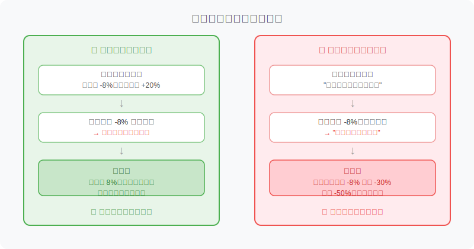
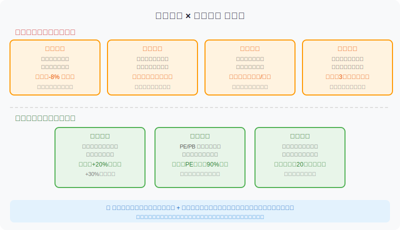
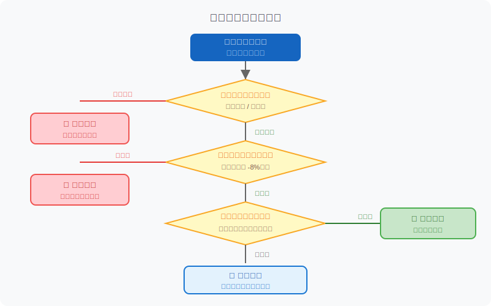

## 散户投资小白金融全品种操盘手册 - 5.10 止盈与止损 —— 为什么卖出规则必须提前写好
  
### 作者  
digoal  
  
### 日期  
2026-06-03  
  
### 标签  
金融产品 , 金融工具 , 散户 , 投资小白 , 全品操盘手册  
  
----  
  
## 背景 

  

## 先说一件让你不舒服的事

很多人买股票时，研究了半天：看财报、看估值、看行业逻辑，下单前做了充分准备。

但你问他：**"跌多少你会卖？涨多少你会止盈？"**

十个人里有九个答不上来。

这不是小问题。这是散户亏损的最核心原因之一。

**买入是一个分析问题，卖出是一个心理问题。** 没有提前写好卖出规则，等到市场真实波动摆在你面前，你会发现自己完全不是在"做决策"，而是在"被情绪推着走"。

---

## 核心概念：卖出规则是一份"事前合同"

你和自己签一份合同：**在买入的时候，就写清楚在什么条件下卖出。**

为什么要事前写？因为买入时是理性状态，而持仓后是情绪状态。

举个例子：

- 你冷静地坐在书房，研究了3小时，买入某股票，逻辑清晰，信心满满。这是你的**理性自我**。
- 三周后，股票跌了12%，账面亏损3000元。你开始焦虑、失眠、不断刷行情。这是你的**情绪自我**。

问题是：**"情绪自我"做的决策，100%不如"理性自我"做的决策。**

所以我们要做的，就是在理性状态下，预先写好卖出规则，让情绪自我在未来没有"随意发挥"的空间。

---

## 止损是什么，止盈是什么

这两个词经常被混着用，先说清楚定义：

**止损（Stop Loss）**：当亏损达到某个条件时，主动卖出，接受损失，防止进一步扩大。  
→ 本质是：**"我认错了，但我控制了错误的代价。"**

**止盈（Take Profit）**：当盈利达到某个条件时，主动卖出，锁定收益，防止行情逆转吃回去。  
→ 本质是：**"我赚到了，但我不贪心，按计划兑现。"**

两个方向，一个核心：**提前定好规则，市场触发时无条件执行。**

---

## 止损的四种类型，你需要至少掌握两种

### 1. 价格止损——最简单，最容易执行

**逻辑**：买入后，跌幅一旦超过预设比例，立刻卖出。

常见设置：
- 个股：**买入成本 × （1 - 8%）** 即为止损价
- 例：10元买入，止损价 = 10 × 0.92 = **9.2元**

优点：机械、客观，不需要判断，只看数字。  
缺点：可能被正常波动"误触"——股票只是短暂调整，你却被止损出来了。

**应对方法**：把止损线设在关键支撑位下方，而不是机械套一个百分比。这需要一点技术面基础（第6节有详述）。

---

### 2. 逻辑止损——更重要，更难执行

**逻辑**：买这只股票，是因为你认可某个理由。一旦那个理由不成立了，不管当前亏损多少，都要卖。

实际案例逻辑（注意：是逻辑示例，非推荐个股）：  
- 你买某家消费公司，理由是"品牌护城河深、毛利率稳定在50%以上、行业增速10%"。  
- 三个季度后，财报显示毛利率降至38%，行业竞争格局恶化，护城河缩窄。  
- **逻辑止损触发：当初买入的前提已经破了，无论股价在哪，卖出是正确的。**

逻辑止损的难点：它要求你诚实地承认"我的判断错了"。这比接受一个数字触发的止损痛苦得多——因为它否定的是你的分析能力。

但这恰恰是最重要的一种止损。

---

### 3. 技术止损——跌破结构就离场

当股价跌破重要支撑位（前期低点、均线等关键位置），说明趋势可能发生转折，此时减仓或离场。

常见触发条件：
- 跌破前一个重要低点
- 连续收盘跌破20日均线，且无法收复

适合有一定技术面基础的投资者，不建议小白一开始就依赖这个。

---

### 4. 时间止损——磨死你的机会成本

**逻辑**：买入后，股价长时间横盘不涨，说明这个逻辑可能没有市场认可，或者时机判断错了。这时候即使没有亏损，也应该考虑离场。

参考标准：持有3~6个月，价格没有显著向预期方向运动，且大盘表现正常，可考虑卖出重新布局。

关键原则：**钱是有时间成本的。** 你的资金停在一只不动的股票里，等于放弃了其他机会。

---

## 止盈的三种方式

### 1. 目标止盈——最适合小白

**买入前，设定盈利目标：达到目标分批卖出。**

执行示例：
- 目标收益：+20%
- 操作计划：涨到 +15% 时卖出一半，涨到 +20%~25% 时卖出剩余

为什么分批？因为没人能精确地卖在最高点。分批让你在"没卖到顶"和"让利润跑掉"之间取得平衡。

---

### 2. 估值止盈——进阶用法

当股票PE/PB进入历史高位区间（比如超过过去10年90%的时间），意味着市场已经把很多乐观预期Price in（定价进去）了，此时就算基本面没变，风险也变大了。

**触发信号**：PE超历史90%分位 → 减仓1/3~1/2，进一步上涨继续减。

需要有基本估值分析能力（第5节有详述），不适合完全不懂估值的新手。

---

### 3. 趋势止盈——跟着强势走，趋势破了就走

上涨趋势完好时持有，趋势破位时减仓。

常见信号：
- 连续两日放量跌破20日均线
- 创阶段性新高后突然巨量下跌

适合趋势型持仓，不适合价值型长期持有。

---

## 第一性原理分析：止损为什么有效，前提是什么

【前提清单】  
支撑"止损能减少总亏损"成立需要以下前提：

- **前提A：市场存在趋势惯性** → 【常量】→ 股价一旦开始跌，倾向于继续跌，直到有新的信息扭转。统计上，A股个股跌穿关键支撑后继续下跌概率较高。
- **前提B：你能做到机械执行** → 【变量】→ 如果你在止损触发时又说"再等等"，止损形同虚设。
- **前提C：你资金没有杠杆** → 【常量】→ 没有杠杆时，-8%止损只是一次小损失；有杠杆时，同样跌幅对应的实际损失翻倍，止损反而可能爆仓。

【情景推演】  
正常情景（前提全部成立）：每次亏损控制在8%以内，即使连续错三次，总亏损约22%，资金保留78%，仍有翻盘空间。

压力情景（前提B被推翻，执行不了）：止损变成一句空话，每次"再等等"直到亏30%~50%，资金大幅萎缩。**这是大多数散户的真实状态。**

极端情景（前提C被推翻，有杠杆）：止损执行失败 + 杠杆放大 → 可能在一次下跌中亏掉本金的绝大部分甚至全部。

---

## 实操案例：从买入到卖出，完整填写一张卡

假设场景：账户10万元，计划买入某只A股消费股，预算使用2万元（仓位20%）。

**买入前填写的《卖出规则卡》：**

| 项目 | 内容 |
|------|------|
| 买入价格 | 25元/股，买入800股，合计2万元 |
| 买入理由 | 品牌护城河强、营收增速15%、PE处于历史中位 |
| 止损线（价格） | 23元（跌幅 -8%）→ 触发则全部卖出 |
| 止损线（逻辑） | 营收增速降至5%以下或毛利率下滑超5pp → 下一个交易日卖出 |
| 止盈目标 | 涨至30元（+20%）→ 卖出400股（减半仓）；涨至35元（+40%）→ 清剩余 |
| 时间止损 | 持有满6个月，股价未突破28元，考虑换仓 |

**三个月后发生了什么：**

第一种情况：股价跌到22.5元（跌幅-10%），同时一份新财报显示营收增速降至4.8%。  
→ 价格止损触发（超过-8%），逻辑止损也触发（增速<5%）。  
→ **第一步**：确认两个止损都触发。**第二步**：下单卖出全部800股。**第三步**：承受1600元实际亏损，剩余资金8400元完好。  
→ 不对自己说"也许会回来"。  

第二种情况：股价升到31元（涨幅+24%）。  
→ 目标止盈触发（已超过+20%）。  
→ **第一步**：按计划卖出400股，锁定约2400元利润。**第二步**：剩余400股继续持有，等待+40%或逻辑止损触发。  

---

## 为什么"止损"这么难执行——行为金融学的解释

有一个经典的研究叫 **"处置效应"** ：投资者普遍倾向于卖出赚钱的股票、继续持有赔钱的股票。

研究数据显示：A股投资者卖出盈利股票的概率是卖出亏损股票概率的两倍（赵学军、王永宏，1998-2000年研究）。美股也有类似现象，但A股更严重。

**心理根源**：
- 卖出亏损股票 = 承认自己判断错了 = 心理上痛苦
- 继续持有亏损股票 = "还没亏，只是账面浮亏" = 自我欺骗

这就是为什么"在情绪状态下做卖出决策"必然失败——大脑会自动寻找理由让你继续持有。

**解决方案只有一个：提前写好，不给情绪发言的机会。**

---

## 常见错误与纠偏

**错误1：止损后股票反弹，懊悔"割在最低点"**

纠偏：止损的目的不是精确判断底部，而是控制损失。你止损后股票反弹了，说明止损规则触发时你确实执行了——这是对的。反弹后悔，会让你下次不敢止损，那才是真正的错误。

---

**错误2：止盈目标设得太高，结果利润全吐回去**

纠偏：止盈目标不是越高越好。目标盈利30%以上需要非常强的逻辑支撑；普通个股，20%~25%是可执行的止盈参考区间。**分批止盈**是对抗"卖飞了"焦虑的最佳方式。

---

**错误3：把止损线随意下移——"再跌5%再止损"**

纠偏：这叫"移动止损柱子"，是最危险的操作。止损线一旦设定，不能因为价格接近而下移。如果止损触发了，要么执行，要么有充分的逻辑理由重新评估（不是因为"舍不得亏"）。

---

**错误4：对不同股票用同一个止损比例**

纠偏：高波动的成长股（日振幅可达5%以上），用-8%止损线会频繁被洗出；低波动的蓝筹股，-8%可能已经是大跌信号。止损线应该结合股票的**历史波动率**来设定。具体做法：参考该股近3~6个月的日均波动幅度，止损线至少设在2~3倍日均波动之外。

---

## 可复用框架

**【卖出规则卡框架】**

适用场景：每次买入个股前填写，买入前必须完成

核心逻辑：在理性状态下预先锁定决策，排除情绪干扰

操作步骤：
1. 写下买入价格、买入理由（核心逻辑1~2条）
2. 设定价格止损线（建议 -7%~-10%，结合波动率）
3. 写下逻辑止损触发条件（什么情况下核心逻辑破了？）
4. 设定止盈目标（分两档：第一止盈点减半仓，第二止盈点清仓）
5. 设定时间止损（最长持有时间，超过未动则重新评估）

举一反三：这个框架同样适用于ETF持仓管理、可转债仓位管理

---

**【三触发清仓原则】**

适用场景：持仓中遇到大跌，犹豫是否止损

核心逻辑：三个维度同时评估，任意两个触发则执行卖出

操作步骤：
1. 价格：跌幅是否超过止损线？
2. 逻辑：买入理由是否还成立？
3. 情绪：你现在是否每天因为持仓焦虑？（这也是信号）

触发1/3 → 观察；触发2/3 → 减半仓；触发3/3 → 清仓

举一反三：同样适用于仓位过重时的快速评估

---

## 本节行动清单

1. **现在就写**：打开你当前所有持仓，为每一只股票补写止损线和止盈目标。如果你说不出来，代表你还没有卖出规则。
2. **格式化**：用《卖出规则卡》格式整理，打印出来或记录在手机备忘录里，每次看盘前先看一眼。
3. **测试自己**：问自己：如果明天该股票触发止损线，你能做到直接卖出吗？如果答案不确定，把止损线设得宽一点，但绝不能不设。
4. **不要移动止损柱子**：一旦止损线设定，非特殊情况不调整；止盈线可以随盈利扩大适当上调，但不能因为怕"卖飞"而无限上移。
5. **复盘每次卖出**：记录每一次止损/止盈的执行情况，3个月后回看：哪些是对的？哪些是情绪干扰导致的？

---

## 一句话总结

**卖出规则不是"天赋"，是"提前写好的合同"——在你还理性的时候，和未来那个会慌张的自己，签一份协议。**

---

> ⚠️ **声明**：本文内容为投资教育目的，所有历史数据、策略框架均为辅助学习工具，不构成证券投资建议。市场有风险，投资需谨慎。实际操作请结合自身风险承受能力，必要时咨询专业投顾。
  
  
#### [PostgreSQL 解决方案集合](../201706/20170601_02.md "40cff096e9ed7122c512b35d8561d9c8")
  
  
#### [德哥 / digoal's Github - 公益是一辈子的事.](https://github.com/digoal/blog/blob/master/README.md "22709685feb7cab07d30f30387f0a9ae")
  
  
#### [About 德哥](https://github.com/digoal/blog/blob/master/me/readme.md "a37735981e7704886ffd590565582dd0")
  
  

  
