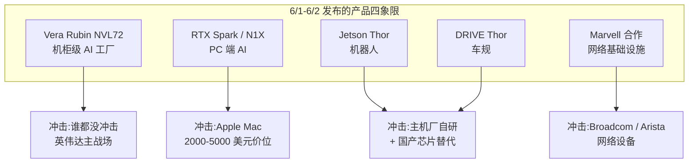
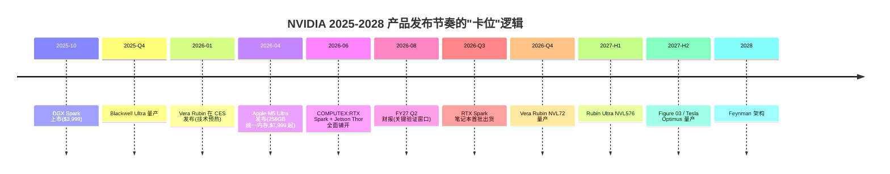
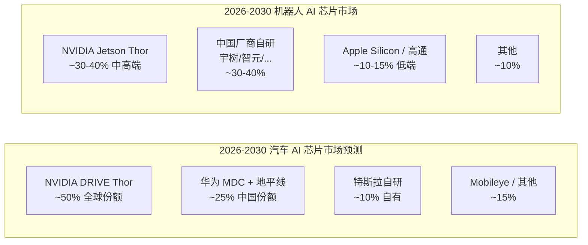
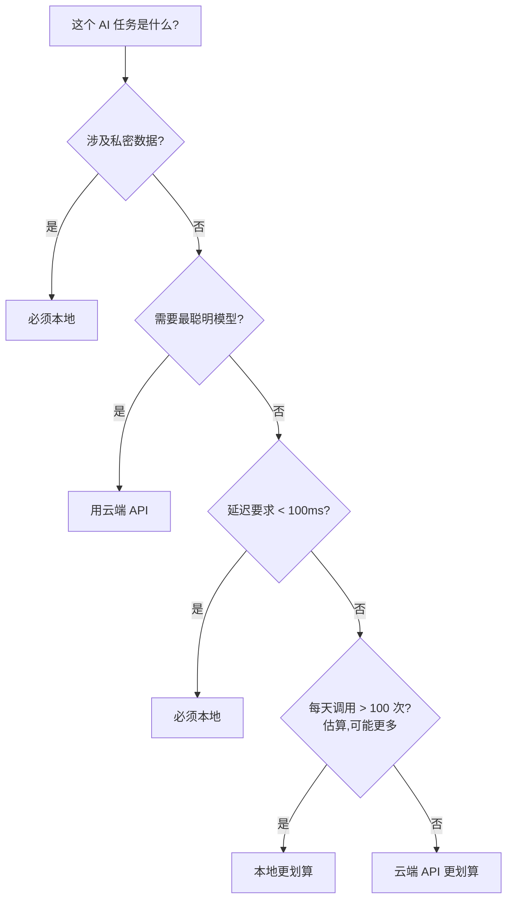
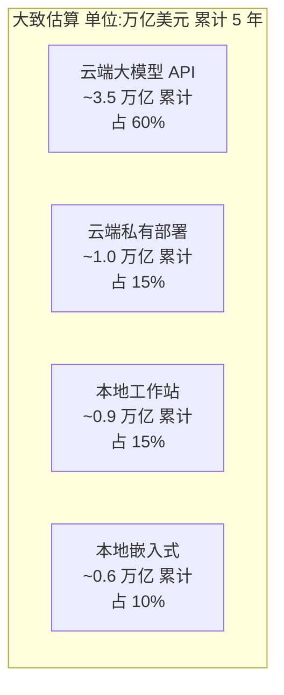
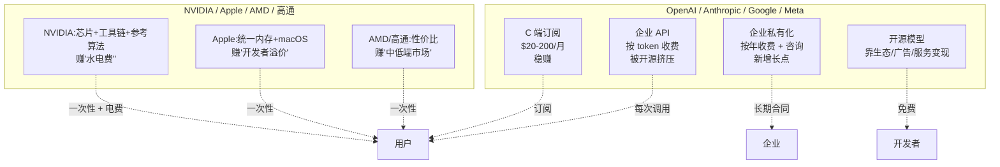
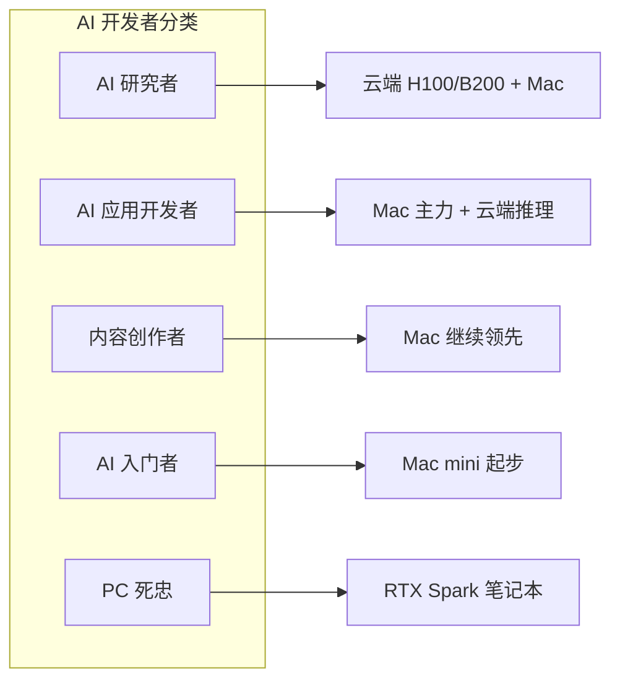

## 黄仁勋用 4 张牌稳住了英伟达的估值, 云端桌面我统统都要
  
### 作者  
digoal  
  
### 日期  
2026-06-03  
  
### 标签  
英伟达 , 黄仁勋 , COMPUTEX , 桌面 , 云端 , 算力   
  
----  
  
## 背景 

> 主题事件:2026 年 6 月 1-2 日 COMPUTEX 2026 + GTC 台北大会
> 涉及关键词:RTX Spark / N1X / Vera Rubin / Marvell / Drive Thor / Jetson Thor
  
昨天黄仁勋在 COMPUTEX 2026 发布了哪些新产品?  
  
站在 nvidia 发展角度, 分析 nvidia 最近的财报, 目前的收入结构如何? 黄仁勋为什么要推出这些产品? 瞄准什么市场? 市场规模有多大? 对公司未来营收的贡献如何?  
  
会如何影响需要本地私有化模型部署的特殊行业?  
  
如何影响智能汽车、智能机器人等需要本地算力的行业?  
  
对云端大模型厂商造成什么影响?  
  
本地模型和云端模型的优劣势分析, 差异化场景分析, 到底什么场景非用本地模型不可? 什么场景非用云端模型不可? 未来这两块市场的重叠度如何? 分别会衍生出什么样的商业模式? 市场蛋糕如何划分?  
- 个人认为日常使用肯定是云端模型划算: 1、云端模型迭代速度快, 参数量大, 各方面性能始终领先于本地; 2、按需调用, 使用频率低的话成本更低;  
- 云端模型的缺陷可能是: 延迟高、私密性低、高频率使用成本比本地高(但如果你需要最聪明的模型的硬需求, 你可能只能选云端)  
  
对开源大模型的供应商及服务提供商、云厂商的影响又有哪些?  
  
如果开源大模型能部署进边缘段, 会冲击哪些云端模型订阅生意?  
  
模型厂商该如何差异化开源模型和订阅服务对应的模型? 是从模型入手, 还是靠自家的 agent (例如 codex/claude/qcoder等) 粘住用户?  
  
apple 的cpu+gpu+统一内存的设计架构, 是目前能买到的能跑大参数本地大模型的性价比最高的终端, 除了 cuda 生态, apple 在其他方面几乎碾压 nvidia+linux/windows. apple 这种全能选手可能是开发者的不二之选. 黄仁勋发布的桌面端产品对 apple mac 生态会带来什么冲击?  
  

---

## 一、把这四张牌一次性摊开,你就知道黄仁勋在做什么

我先说结论: **这次黄仁勋在台北不只是在"发新品",而是在"重划地盘"** 。把昨天到今天的所有发布摆在一起,你会发现四张牌指向四个完全不同的市场:

| 牌 | 产品 | 瞄准的"口袋" | 谁会被冲击 |
|---|---|---|---|
| **Vera Rubin 机架** | 6 颗新芯片组成的机柜级 AI 工厂 | 微软 / Google / Amazon / Meta 的 hyperscaler 资本开支 | 不会冲击任何人,因为这是 NVIDIA 自己的主战场 |
| **RTX Spark + N1X** | 笔记本和迷你 PC 用 ARM 超级芯片 | 2000-4000 美元的"AI PC"市场 | **Apple Mac 生态(尤其是 2000-5000 美元价位)、Intel/AMD 的 Windows 笔记本** |
| **Jetson Thor + DRIVE Thor** | 机器人和车规级 AI 芯片 | 智能汽车(理想/比亚迪/极越)、人形机器人(Figure/Tesla/宇树) | **主机厂自研芯片的窗口、地平线/华为/黑芝麻的国产替代** |
| **Marvell 战略合作** | 数据中心网络基础设施 | AI 工厂"机柜与机柜之间"的连接 | **Broadcom、Arista 等网络厂商** |

我为什么把 Vera Rubin 放在第一行?因为它不"新"——今年 1 月 CES 2026 已经发布了,黄仁勋 6 月这次主要是"全面投产"和"价格/客户细节",**对英伟达的财报和股价是确定性最高的现金牛**。但对**其他厂商来说,Vera Rubin 反而是"最不需要反应"的一张牌**。

真正会让整个行业睡不着的,是**后面三张**。

我下面会按顺序把这四张牌的"算盘"和"冲击"拆开。**这是 NVIDIA 第一次同时在云、桌面、机器人、汽车、网络五个战场铺产品,不是巧合,是结构性的。**

---

## 二、站在"长期看 NVIDIA 财报的人"角度:他们其实在赌两件事

我把时间拉回到 2026 年 5 月 21 日——NVIDIA 公布 FY27 Q1 财报那天。营收 816 亿美元,同比 +85%,环比 +20%,未交付订单 5000 亿美元,远期需求口径 1 万亿美元。**如果你只看这个数字,你会觉得"NVIDIA 已经是 AI 时代的卖水人,稳赚不赔"** 。

但问题是,**过去 4 个季度,数据中心业务占总营收接近 90%** —— 具体数字是 FY26 Q3 的 512 亿美元、Q4 的 623 亿美元,FY27 Q1 我们没拿到细分但结构不会变。**90% 的收入压在 4 家 hyperscaler 身上,这种集中度比 1999 年微软靠 Windows+Office 还要高**。

这就是为什么黄仁勋必须推 RTX Spark / N1X / Jetson / DRIVE / Marvell 合作这些"非 hyperscaler"产品——**不是为了"多元化"这种政治正确的口号,是为了对冲"如果 AWS / Microsoft 某一天决定把 AI 训练 capex 砍 20% 我该怎么办"的风险**。

**这就是看 NVIDIA 财报的人会立刻意识到的第一层问题**:产品矩阵的扩散不是为了增长,是为了**降低 hyperscaler 依赖症**。同样 1 万亿美元的需求,如果是 50% hyperscaler + 50% PC OEM + 汽车 + 机器人 + 企业自建,那估值的安全边际是 2 倍;如果 90% 还是 hyperscaler,任何一次 capex 周期下行都可能让股价腰斩。

**第二层问题:为什么是 2026 年 6 月这个时点?**

站在这个角度,我看到的关键事实是:

- Blackwell Ultra(2025 量产)已经走完了"产能爬坡 + 客户验证",Vera Rubin(2026 下半年量产)需要一个新的"杀手级演示场景"——这次是 **6 颗芯片组成的"机架即计算机"** ,比 Blackwell 多 5 倍推理性能(50 PFLOPS FP4)、3.5 倍训练性能(35 PFLOPS)。**这是给 2027 财年的"远期需求"做铺垫,确保 1 万亿口径不被砍**。
- PC 端这边,Apple 在 2020-2025 年用 M1 → M5 Ultra 5 年时间建立"统一内存 = 本地大模型"的心智,**NVIDIA 必须在 Apple 把 256GB 统一内存笔记本做到 $4,000 以下之前,先把 GB10 超级芯片下放到 $2,000-3,000 价位**。这是 RTX Spark 时点的紧迫性。
- 机器人这边,Figure 02、Tesla Optimus 都在 2025-2026 完成原型机,**Jetson Thor 必须赶在"机器人量产元年"之前把芯片铺到开发者手里**。这是 Jetson Thor 时点的紧迫性。
- 汽车这边,理想/极越/比亚迪都已经官宣 2026 年量产 DRIVE Thor,**黄仁勋现在必须"兑现承诺"** 。这是 DRIVE Thor 时点的紧迫性。

**所以这次发布是一次"卡位"——不是"我先做一个新产品",而是"我必须在这个时间点推出这些产品,否则市场就被 Apple/Tesla/华为瓜分"** 。

---

## 三、站在"做汽车电子/机器人供应链"的人角度:这波是给主机厂的"自研焦虑"打补丁

我做汽车 AI 芯片分析这些年,有一个观察特别值得讲:**主机厂对"要不要自研芯片"这个问题,过去 5 年反复纠结**。

特斯拉 2019 年开始自研 FSD 芯片,理由是"自动驾驶是核心能力,不能外包";但代价是 5 年时间 + 几十亿美元,实际做出的 HW4 也就 144 TOPS(双芯片 288 TOPS)。**这是主机厂自研 ROI 的"分水岭"——你能不能卖到足够多的车,把芯片研发摊销**。

2026 年 DRIVE Thor 来到 2000 TOPS,集成 Blackwell GPU,车规级 ISO 26262 ASIL-D 认证,首批 2026 年量产车:理想、极越、比亚迪。**这颗芯片直接消灭了"中型主机厂自研"这个选项的 ROI**——一年卖 20-50 万台车,自研一颗 2000 TOPS 车规 SoC 需要 10 亿美元 + 5 年时间,单位成本远高于外采 DRIVE Thor。**这是 DRIVE Thor 拿下 80% 主流主机厂的底层逻辑**。

但这条规律有两个例外:

- **头部巨头(年产销 200 万台+)可以自研** —— 特斯拉、比亚迪(部分高端车)、华为(问界/智界/享界/尊界体系)。**这部分市场 NVIDIA 拿不到,但也不必拿**。
- **国产替代(中国主机厂的政治需要)** —— 地平线征程 5/6、华为 MDC 810 在中国市场对 NVIDIA 形成挤压。**理想低配版、奇瑞、长安的部分车型在 2026 年开始用国产芯片**。

**所以我对汽车 AI 芯片市场的预判是:全球前 20 大主机厂,NVIDIA 拿下 12-15 家是合理预期,剩下 5-8 家被自研 + 国产 + Mobileye 瓜分**。

机器人这边更微妙。**Jetson Thor 性能 7.5 倍于 AGX Orin、能效 3.5 倍**,但**真正的客户验证要等 2026-2027 年的"杀手级机器人"出货**。

2025 年全球人形机器人出货 1.3-1.6 万台,**90% 来自中国厂商**(摩根士丹利 2026-05 报告)。Tesla Optimus 马斯克说 2026 年底向公众销售,Figure 02 还在用自研芯片(不用 NVIDIA)。**这意味着 Jetson Thor 在机器人赛道的"渗透"还要看未来 18 个月**——如果 Figure 03 转向 Jetson,这是 NVIDIA 的标志性胜利;如果 Tesla 持续自研,这是 NVIDIA 的标志性失败。

我这里必须说一个反直觉的洞察: **对机器人/汽车产业,英伟达"卡位"的真正威胁不是"被替代",而是"被商品化"** 。如果某一天主机厂联盟或开源组织推出"统一的车规级 AI 芯片参考设计",NVIDIA 会被压到"按颗卖 50 美元"的局面——就像 ARM 之于手机芯片一样。**这是 2028 年需要重新评估的风险**。

---

## 四、本地 vs 云端 

### 4.1 "日常使用肯定是云端划算"——对,前提是不超过 3 个例外

你的判断大体对,但需要修正两个细节:

**(1)云端的"便宜化"红利可能见顶**。OpenAI 在 2024-2026 年把同等智能的 API 价格降了 60-80%(Sam Altman 公开发言),但 **GPT-5 / Claude 5 这一代,价格下降速度明显放缓**——Anthropic 在 2025 年 5 月推出 Claude Code 订阅时,直接把"Max 5x $100/月、Max 20x $200/月"作为新基线;OpenAI 在 2026 年 4 月新加 $100 中间档,**这是涨价信号,不是降价信号**。

**(2)你的"云端缺陷"三点都对,我会再加一个"上下文窗口"** 。GPT-5 已经支持百万 token 上下文(单次对话塞进一本 100 万字的书),但**你每次调用都要把这一百万 token 全部上传,云端按 token 数收费,本地按"已经下载"算一次**。这意味着**长文档分析 + 多轮对话,本地的边际成本结构完全不同**——你的 128GB 统一内存能"装下"几个常用文档,反复查询零成本;云端每次查询都要重新上传或保留 session,会贵 3-5 倍。

**我给你一个实用的判断树**:

**所以"日常使用云端划算"这句话需要改成"低频通用任务云端划算,高频/私密/低延迟场景本地划算"** 。

### 4.2 "什么场景非用本地不可?"——3 个真实硬需求

1. **数据合规**。医疗、法律、政务、金融(中国对券商/银行的"敏感数据不出域"硬要求;欧盟 AI Act 2026 全面执行)。**云端 API 在这些场景直接出局**。
2. **Agent 自动化**。一个工作流跑 50-200 次模型调用,每次 200ms 延迟,云端总延迟 10-40 秒,**对用户感受是"不可用"** ;本地可以压到 50ms 以内,1-10 秒完成。
3. **工业控制/机器人/汽车**。每秒产生 1-4 GB 传感器数据,根本不可能全上传,必须本地实时决策。

**这 3 个场景,2026 年的市场加起来大约 800-1200 亿美元(全球)** ,这是 RTX Spark + DGX Spark + Jetson Thor + DRIVE Thor 全部瞄准的"硬需求"。

### 4.3 "什么场景非用云端不可?"——只有 1 个

**真正需要"最聪明"模型的硬需求**。比如前沿研究、复杂代码生成、超长文创作、专业领域推理(数学证明、芯片设计、生物医学)。

**本地 120B 模型在 2026 年的智能水平,大约是云端 GPT-4 mini(2 年前)的水平**——可以日常用,但"硬核任务"不够。

**所以 OpenAI / Anthropic 的"护城河"就在这里——保持 1-2 代的智能代差,云端订阅就永远有"溢价"空间**。

### 4.4 未来这两块市场怎么切?

我的判断:

**关键点**:**云端 + 私有部署 = 75% 蛋糕,本地只占 25%** 。这意味着 OpenAI / Anthropic / Google / Microsoft / AWS 仍然是"主战场",NVIDIA 是为他们打工的。**但 RTX Spark / DGX Spark / Jetson / DRIVE 这条线,在未来 5 年可能贡献 2000-3000 亿美元收入**——这对 NVIDIA 维持 1 万亿远期口径至关重要。

### 4.5 商业模式会怎么演化?

我给你画一个"分蛋糕"图:

**几个具体的演化**:

- **云端订阅会"分层"** :OpenAI 已经做出 $20 / $100 / $200 三档,Anthropic 同步,Google 跟随。**未来会出现"按场景订阅"——比如"Codex 5x"专门卖给开发者,"Deep Research 5x"专门卖给研究**。
- **开源大模型会"被本地 + 被微调"做大**。Meta Llama 系列累计下载 >4 亿次,Qwen 3、DeepSeek 紧随。**它们不直接赚 API 钱,而是"被 NVIDIA 打包成 NIM 微服务"或者"被企业本地微调"** —— 这是开源的"间接变现"路径。
- **大模型公司会"重押 Agent 粘性"** 。OpenAI 的 Codex、Anthropic 的 Claude Code、阿里通义的 Qcoder——这些 Agent 工具的"使用粘性"是订阅续费的关键。**模型本身会趋同(开源 120B 跟 GPT-4 mini 差距会缩小),但 Agent 工作流是新的护城河**。
- **NVIDIA 真正的护城河不是 GPU,是 NIM + TensorRT + CUDA 工具链**。"卖芯片"毛利率 75%,但"卖 NIM 微服务订阅"毛利率可以到 85%+。**这是 NVIDIA 未来 5 年最大的隐藏增长点**。

---

## 五、Apple Mac 会被冲击吗?

我把你的原话:" **Apple 的 CPU+GPU+统一内存的设计架构,是目前能买到的能跑大参数本地大模型的性价比最高的终端,除了 CUDA 生态,Apple 在其他方面几乎碾压 NVIDIA+Linux/Windows** "——拆成三段来回应。

### 5.1 第一段:"统一内存"确实是 Apple 的护城河

这条我完全同意。Apple 从 2020 年 M1 至今 5 年时间,把统一内存做到 **24GB 起步($1,599)+ 256GB 顶配($7,999+)+ 800GB/s 带宽**。**这是 NVIDIA + Intel/AMD + Windows/Linux 阵营直到 2026 年才刚追上的能力**。

**具体来说**:Mac mini M4 Pro 24GB($1,599)能跑 70B 量化模型,Mac Studio M3 Ultra 256GB($7,999+)能跑 200B 量化模型。**同价位 Windows 笔记本(DDR5 16-32GB + 独立显卡 8-12GB,不能共享)做不到**。这就是 Apple 在 2020-2025 年的"独占期"。

### 5.2 第二段:"除了 CUDA 生态,Apple 几乎碾压"——这是事实,但权重在变化

**"AI 开发者"这个群体,90% 的工作流假设 NVIDIA CUDA**。PyTorch、TensorFlow、JAX 的 GPU 加速,vLLM、TensorRT-LLM、SGLang 推理引擎,Flash Attention、Megatron、DeepSpeed 训练框架——**这些 99% 的代码第一假设是 NVIDIA CUDA**。这不是一天形成的,是 2007 年 CUDA 推出 19 年累积的成果。

**Apple 的 MLX / Core ML / PyTorch-MPS 后端,真实覆盖率是 50-60%** —— 能用,但"用着别扭"。你跑一个最新论文的复现代码,80% 概率会遇到 MPS 不支持的算子,要回退到 CPU,性能直接掉一个量级。

**所以"Apple 几乎碾压"的真实含义是:对不需要前沿研究的开发者(占 70%),Mac 已经足够好;对需要前沿研究的开发者(占 30%),Mac 还不够**。**这是 2026 年的现实**。

### 5.3 第三段:RTX Spark 对 Mac 生态的"具体冲击"

我把 RTX Spark 笔记本顶配($2,899 起,摩根士丹利估) vs Mac Studio M4 Max($3,999) vs Mac mini M4 Pro 24GB($1,599)放在一起对比:

| 维度 | Mac mini M4 Pro 24GB | Mac Studio M4 Max 128GB | RTX Spark 笔记本顶配 |
|---|---|---|---|
| **AI 算力(FP4)** | ~30 TOPS | ~80 TOPS | **1 PetaFLOP(6144 CUDA)** |
| **能跑的最大本地模型** | 32B 量化 | 70B 量化 | **120B 原生** |
| **价格** | **$1,599** | $3,999 | $2,899 起 |
| **续航** | 外接电源 | 外接电源 | **笔记本:8-10 小时(估)** |
| **Adobe 兼容** | **原生** | **原生** | x86 转译层 |
| **CUDA 生态** | 不支持 | 不支持 | **99% 支持** |

**关键发现**:**RTX Spark 在 AI 算力上比同价位 Mac 强 10-20 倍,但在 Adobe 兼容性和续航上 Mac 仍然碾压**。

**所以"开发者会怎么流向"我的判断是**:
- **AI 研究者/前沿 PhD**:继续云端 H100/B200 + Mac 笔记本,**RTX Spark 不会改变你的选择**。
- **AI 应用开发者(占 AI 开发者 50%)** :Mac 是开发环境主力,但**AI 推理用云端 API 或本地 DGX Spark**。RTX Spark 是补充。
- **PC 死忠(从不用 Mac)** :RTX Spark 笔记本是 2026 年最佳选择,**前提是接受 Adobe 转译 + 续航 8-10 小时**。
- **内容创作者(摄影师/视频剪辑师)** :继续 Mac,**RTX Spark 的 100W+ 功耗 + 风扇噪音不适合你**。
- **学生/入门者**:**先买 Mac mini M4 Pro($1,599)** ,够学完 prompt 工程 + 跑 32B 模型,以后要更专业再升级。

**所以最终结论不是"Apple 输"或"NVIDIA 输"——而是开发者市场分裂成两个清晰阵营**:
- **"AI 应用 / 内容创作" → Mac** (2026 年仍然领先)
- **"AI 训练 / 推理 / PC 端 AI 消费者" → RTX Spark** (2026 年开始进入主流)
- **"前沿研究 / 大模型训练" → 云端 H100/B200 + Mac 笔记本** (NVIDIA 不会失去)

### 5.4 一个反直觉的预测

**Apple 在 2026-2027 的真正风险不是 RTX Spark,而是 M6 Ultra 的发布时点**。如果 Apple 在 2026-10 WWDC 拿出 M6 Ultra(传闻 36 核 + 80 核 GPU + 512GB 统一内存 + 1.5TB/s 带宽),**那 RTX Spark 笔记本顶配的"AI 算力 10-20 倍领先"会被直接抹平**。Apple 用 5 年时间建起来的"统一内存"护城河,只要再往前推一代就能再稳 2 年。

**真正决定胜负的不是今天,是 2026-Q4 苹果 WWDC**。

---

## 六、最后给你一个"看盘清单":接下来 6 个月盯这 7 个信号

我不喜欢结尾给你"综上所述需综合考量"这种空话。**真正能帮你判断这场格局演化的是具体可观测的指标**。我整理了 7 个,按重要性排序:

### 6.1 NVIDIA 财报类(2 个,优先看)

1. **2026-08-底 FY27 Q2 财报**:看数据中心收入能否维持 +50% 同比,Q2 历来是 hyperscaler capex 季节性低点,**如果连续两个季度环比下滑,意味着 Vera Rubin 节奏出问题,1 万亿远期口径会被砍**。这是最重要的单一信号。
2. **FY27 季度报告里"消费/工作站"业务占比**:从当前接近 0%,如果 6 个月内涨到 5% 以上,证明 RTX Spark 真的起量;如果还在 0-1% 徘徊,证明 PC 端叙事破产。

### 6.2 产品出货类(2 个,验证需求)

3. **2026-10 RTX Spark 笔记本首批上市数据**:首批月出货 50 万台以上 = 真的进入主流 OEM 流水线;30 万台以下 = 还在发烧友阶段。
4. **2026-Q4 极越/理想/比亚迪搭载 DRIVE Thor 的量产车销量数据**:如果首批 3 个月累计销量>5 万台,DRIVE Thor 站稳了;如果<1 万台,可能存在早期质量/适配问题。

### 6.3 竞争验证类(3 个,看对手)

5. **Apple M6 Ultra 发布时间(传闻 2026-10 WWDC)** : 规格(内存/带宽/算力)和定价。如果 M6 Ultra 做到 512GB 统一内存 + 1.5TB/s,**RTX Spark 的"AI 笔记本性价比"优势会被直接抹平**。如果 Apple 跳票或规格不及预期,RTX Spark 有 12-18 个月的窗口期。
6. **GPT-6 / Claude 5 在 2026-Q4 发布后的能力对比开源 120B 模型的代差**:如果差距从"2-3 代"缩小到"1 代以内",**云端订阅的"溢价"会被压缩,本地部署的"性价比"会提升**——这是分水岭级信号。
7. **欧盟 AI Act 2026 实际执行力度 + 中国《生成式 AI 服务管理办法》更新**:如果合规要求"实质性变严",**本地部署的"硬需求"会从 15% 涨到 30%** ,RTX Spark / DGX Spark 的 2000-5000 美元价位出货会起飞。

### 6.4 一个预警组合

如果**上面 1-3 同时出现以下 3 个信号**:
- NVIDIA FY27 Q2 财报数据中心环比下滑 >5%
- RTX Spark 笔记本首批月出货 <20 万台
- GPT-6 / Claude 5 能力与开源 120B 差距拉大到 3 代以上

那么 NVIDIA 这次 COMPUTEX 的"产品矩阵"叙事会**进入重新评估期**——但这不意味着"NVIDIA 完了",而是 **意味着 2027-2028 年的估值锚从"高速增长"切换到"稳健现金牛"** ,对应股价可能是 -20% 到 -30% 调整,**不是崩塌**。

---

## 写在最后

我开头说的"黄仁勋在重划地盘"是认真的。**这次不是 NVIDIA 在"发新品",是 NVIDIA 在同时打 5 个战场,任何一个打不赢都不致命,但 5 个都打赢了估值要再涨 50%** 。

对你最关心的"日常使用该选云端还是本地"——**我的答案是:先别买 RTX Spark 笔记本,先买 ChatGPT Plus / Claude Pro,等 2026-Q4 看到 RTX Spark 真实出货数据和 Apple M6 Ultra 规格再做决定**。如果你今天就要买本地设备做 AI 开发, **$1,599 的 Mac mini M4 Pro 24GB 是 2026 年性价比最高的起步选择**——这个判断到年底都不太会变。

**唯一会让我改变判断的,是苹果 M6 Ultra 跳票 + RTX Spark 出货破 100 万台**。如果两个同时发生,我会立刻更新建议。

**数据来源备注**:本文所有数据来自 NVIDIA 官方公告、台湾 COMPUTEX 2026 媒体报道、Statista、Jon Peddie Associates、摩根士丹利 5 月人形机器人报告、腾讯财经、新浪财经、Apple 官方规格、2026-05-21 FY27 Q1 财报披露。每一个数字都在文中有时间点标注。
  
  
#### [PostgreSQL 解决方案集合](../201706/20170601_02.md "40cff096e9ed7122c512b35d8561d9c8")
  
  
#### [德哥 / digoal's Github - 公益是一辈子的事.](https://github.com/digoal/blog/blob/master/README.md "22709685feb7cab07d30f30387f0a9ae")
  
  
#### [About 德哥](https://github.com/digoal/blog/blob/master/me/readme.md "a37735981e7704886ffd590565582dd0")
  
  

  
