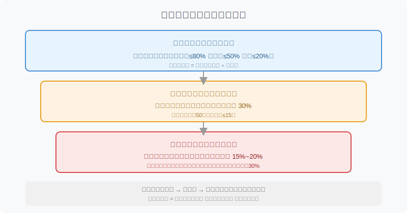
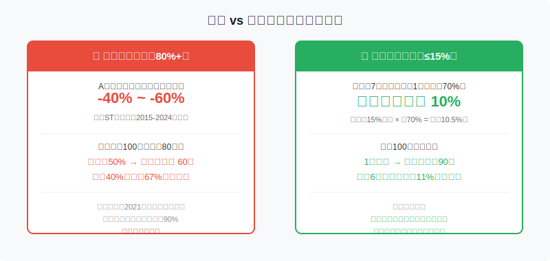
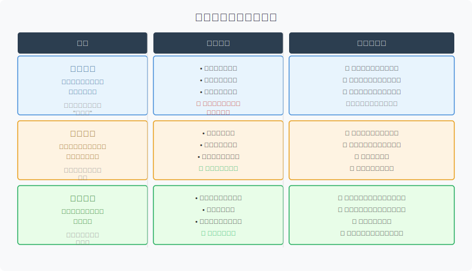

## 散户投资小白金融全品种操盘手册 - 5.11 仓位管理 —— 单票上限、行业上限、分批买入
  
### 作者  
digoal  
  
### 日期  
2026-06-03  
  
### 标签  
金融产品 , 金融工具 , 散户 , 投资小白 , 全品操盘手册  
  
----  
  
## 背景 
  

## 先问你一个问题

你有没有这种经历：看中一只股票，越看越兴奋，最后把70%的钱都押进去——结果股价跌了40%，账户缩水近三分之一，彻夜难眠，不知道该补仓还是割肉？

如果有，那不是你的分析能力有问题，是你的**仓位管理**出了问题。

A股有一条残酷的统计规律：即便是"明显低估"的好公司，在特定的周期内，股价腰斩的概率也可以超过30%。你可以把公司研究得很透彻，但你控制不了市场的情绪、政策的突变、行业的黑天鹅。

仓位管理解决的，正是这个问题：**让单次判断失误，不足以毁掉你的整个账户**。

---

## 核心概念：三层防护墙

仓位管理不是一个数字，而是三层嵌套的上限系统。

从外到里：

**第一层，总股票仓位**：你的钱有多少比例在股票市场里？这个比例由市场环境决定，不是固定的。牛市可以高一些，熊市要大幅压缩。

**第二层，单一行业仓位**：你的股票仓位里，有多少押在同一个行业？同一行业的股票相关性极高——政策一出，全行业同涨同跌。行业集中度太高，等于用多只个股赌一个行业逻辑。

**第三层，单只个股仓位**：你的股票仓位里，有多少押在同一只股票上？这是最后一道防线，决定了单个公司暴雷时，你账户的最大损失。

三层都要设上限，**而且必须提前设好**，不是等到行情变化再临时决定。

---

## 单票上限：怎么设才合理？

先说一个参考基准：

**公募基金的"双十"规定**：一只基金投资单只股票，不能超过基金净值的10%，且单只股票持仓不能超过该股票流通市值的10%。这是监管对专业机构的约束——背后的逻辑是：即便是研究最充分的机构，也承认自己可能判断失误，所以要把单票损失控制在可承受的范围内。

散户没有监管约束，也没有研究团队，所以标准**应该更保守，而不是更激进**。

**散户建议的单票上限**：

| 情况 | 建议单票上限（占股票仓位） |
|------|---------------------------|
| 刚入门，研究能力有限 | 10%（最多同时持有10只）|
| 有一定经验，深度研究过 | 15%~20% |
| 高确信度，逻辑极清晰 | 最高不超过30% |
| 任何情况 | 绝对不超过50% |

**为什么上限是15%~20%？**

做一道数学题：

你的股票仓位50万，单票上限15%，也就是最多持有7.5万在一只股票上。

如果这只股票跌了60%（这在A股并不罕见），你损失的是7.5万 × 60% = 4.5万，占总股票仓位的9%。

心痛，但不致命——你还有87%的仓位可以继续运作。

反过来，如果你把50%押在一只股票上：同样跌60%，你损失的是25万 × 60% = 15万，占股票仓位的30%。一次判断失误，直接把你打趴下，而且心态极可能崩溃、产生追涨杀跌的错误操作。

---

## 行业上限：被忽视的第二道防线

很多人设了单票上限，却忽略了行业上限，结果是：买了5只不同的股票，全部是新能源行业——表面上分散了，实质上集中在同一个行业逻辑上。

**2021年的教育行业**是一个典型案例。政策一出，新东方、好未来、高途、学而思几乎同步暴跌。那些持有多只教育股的散户，看似分散，实则面对一场"行业级别的清零"。

单只教育股跌60%~90%不等，行业整体估值重定价，等待它"修复"的时间以年计。

行业仓位的上限设置，逻辑很简单：**同一行业的股票，在政策风险、周期风险面前，高度相关**。你持有3只同行业个股，和持有1只在本质上差别不大——区别只是公司层面的分散，行业层面没有分散。

**行业上限建议**：

- 任意单一行业，不超过股票仓位的30%
- 如果该行业政策敏感度高（教育、医疗、互联网平台），建议压缩到20%以内
- 同一行业相关性强的公司（如A股同一产业链的上中下游），也应合并计算行业仓位

---

## 第一性原理：为什么仓位管理是系统的核心？

支撑"仓位管理有效"成立的前提，我们来逐一审视：

**【前提清单】**

支撑"控制单票上限能降低组合风险"成立，需要以下前提：

- **前提A：**市场中确实存在不可预测的黑天鹅事件 → 【常量】→ 政策、造假、行业颠覆，历史上一直存在，未来概率不为零
- **前提B：**单票集中暴露会放大账户损失 → 【常量】→ 数学上确定成立，无论市场环境如何
- **前提C：**分散持仓的不同股票之间相关性有限 → 【变量】→ 在全面系统性风险（如2008年金融危机、2015年股灾）下，相关性急剧上升

**【情景推演】**

**正常情景**（前提全部成立）：单票上限15%，任何一只暴雷对总组合损失约≤10%，整体可控。

**压力情景**（前提C被推翻，市场系统性下跌）：行业相关性上升，即使分散持有，组合仍会大幅下跌。对应操作调整：**这时候应降低总股票仓位上限**，回到第一层防护，而非在个股层面继续分散。

**极端情景**（系统性崩溃+持有前提A类事件）：总仓位降到20%以下，其余转为现金或短债。单票上限机制此时保护的是：你在系统性风险之外的额外损失最小化。

---

## 分批买入：三种方式选哪种？

设好了上限，接下来的问题是：**用完这个仓位，要一次性买，还是分批买？**

答案几乎永远是：**分批买**。

原因很简单：你不知道今天是不是最低点。即便你的判断方向正确，时机也可能偏早偏晚——一次性满仓，放大了时机判断的错误成本。

---

## 实操例子：从零到满仓的具体步骤

**场景设定**：
- 总资产：100万，股票仓位上限60万（当前市场环境：震荡市）
- 看中了某消费龙头股票，研究深度中等，单票上限15%，即最多仓位9万

**第一步：建立初始仓位（30%）**

条件：股价已经从高点回撤30%，估值回到历史中位数以下，成交量开始萎缩（卖盘减少）。

操作：买入3万，价格假设为20元，买入1500股。

判断依据：估值合理，下跌有支撑，但趋势未反转，不满仓。

如果操作错误（继续下跌）：浮亏可控，3万最多亏100%也只损失总资产3%。

**第二步：等待趋势信号（再买30%）**

条件：股价在18~20元区间横盘3周以上，量能萎缩到地量，出现明显的日线阳线（趋势可能反转信号）。

操作：再买入3万，假设价格21元，买入约1430股。

总持仓：2930股，均价约20.4元。

**第三步：趋势确认后补足（剩余40%）**

条件：股价突破前期高点，成交量放大配合，基本面有增量信息（如业绩超预期）。

操作：买入剩余3万，价格假设23元，买入约1300股。

总持仓：4230股，均价约21.3元。

**如果始终没等到第三步的条件**：维持6万仓位即可，不要追涨凑满仓。宁可少赚，也不在没有确认的情况下加满。

**纠偏方案**：如果在任何阶段，股价跌破你的止损线（一般设为第一次买入价下方-15%，即17元），全部卖出，不补仓，认亏离场。此时总损失约：3万 × 15% = 4500元，占总资产0.45%，可以接受。

---

## 常见错误：为什么散户总做反？

**错误一：越跌越买，越涨越卖**

这叫"摊薄成本"心态——股价跌了，越买越便宜嘛。

问题在于：**股价跌是有原因的**。如果原因是基本面恶化，越摊薄成本越套越深。只有在你100%确认下跌是非理性的市场情绪导致的，"越跌越买"才有逻辑支撑。不然，这就是用金钱赌自己的判断比市场更聪明。

**错误二：涨了10%就止盈，跌了30%还在等**

这叫"截断利润，放任亏损"——与正确的操作完全相反。正确的应该是"截断亏损，让利润奔跑"。

**错误三：买满仓，再买超仓**

很多人设好了上限，但看着股票大涨，忍不住超仓，"这次机会太好了，上限放宽一次"。

这就是上限失效的开始。设上限的意义，就在于**提前把情绪排除在外**。一旦允许自己在情绪高涨时超仓，这套系统就形同虚设。

---

## 可复用框架

**【分批三成法】**

适用场景：判断方向正确但时机不确定时的所有个股建仓场景

核心逻辑：将预计满仓仓位分为三份，逐步建立，利用"分批"平摊时机判断的误差成本

操作步骤：
1. 第一批（仓位30%）：满足"估值合理+下跌结构"即可启动，不等趋势完全确认
2. 第二批（仓位30%）：等待横盘企稳、量价出现反转迹象再加
3. 第三批（仓位40%）：趋势确认（突破 + 量能 + 基本面增量信息）后补足

举一反三：这个框架还可以用在ETF建仓（以估值代替量价判断触发条件）、可转债（以溢价率回落代替价格信号）。

---

**【行业集中度检查表】**

适用场景：每次调整仓位前，快速检测是否有隐性行业集中

核心逻辑：同行业股票的相关性在风险事件时趋近于1，相当于同一个赌注

操作步骤：
1. 列出所有持仓，标注所属申万一级行业
2. 计算每个行业合计仓位占股票仓位的比例
3. 超过30%的行业，评估是否有政策风险 / 周期集中风险
4. 如超出，减仓该行业的一部分，换入不相关行业

举一反三：在持有多个宽基ETF时同样适用——沪深300 + 创业板 + 科创50，都是A股权益资产，在系统性风险下相关性仍然很高，不能替代行业分散。

---

## 本节行动清单

- [ ] 打开你的账户，列出所有持仓，计算每只股票占总资产的比例——有没有超过30%的？
- [ ] 把所有持仓按行业归类，计算行业集中度——有没有单一行业超过股票仓位30%的？
- [ ] 设定你的单票上限（建议从15%开始），写到纸上或备忘录，下次加仓前先查一眼
- [ ] 下次建仓时，不要一次性买满，试用"分批三成法"，感受一下分批买入对心态的影响
- [ ] 设定每只持仓的止损线（建议最大承受亏损-15%），写到备忘录里，触发时无论如何都执行

---

## 一句话总结

**仓位管理不是限制你赚钱，而是保证你在判断失误时，还能继续留在牌桌上。**

---

> ⚠️ **声明**：本文内容为投资教育目的，所有历史数据、策略框架均为辅助学习工具，不构成证券投资建议。市场有风险，投资需谨慎。实际操作请结合自身风险承受能力，必要时咨询专业投顾。
  
  
#### [PostgreSQL 解决方案集合](../201706/20170601_02.md "40cff096e9ed7122c512b35d8561d9c8")
  
  
#### [德哥 / digoal's Github - 公益是一辈子的事.](https://github.com/digoal/blog/blob/master/README.md "22709685feb7cab07d30f30387f0a9ae")
  
  
#### [About 德哥](https://github.com/digoal/blog/blob/master/me/readme.md "a37735981e7704886ffd590565582dd0")
  
  

  
