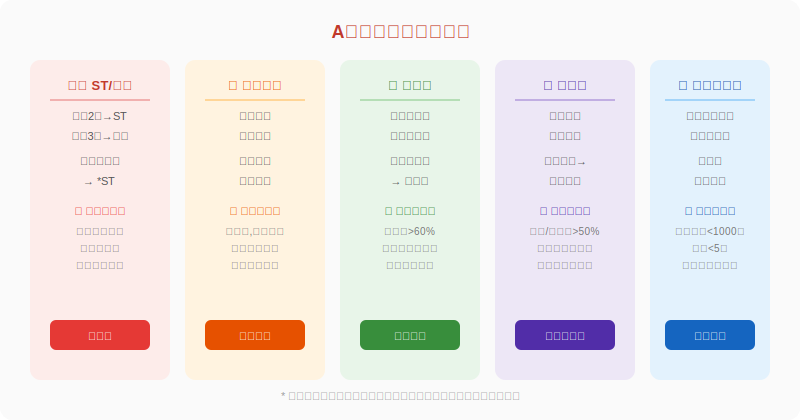
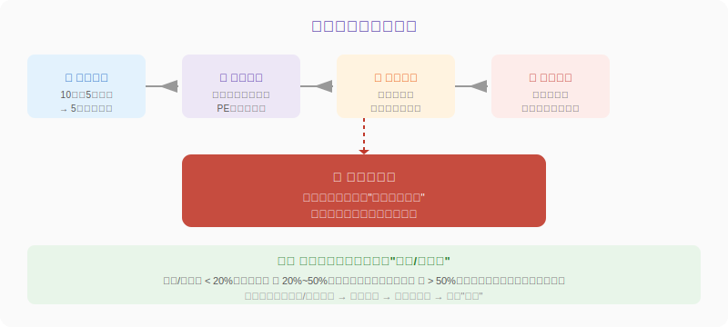
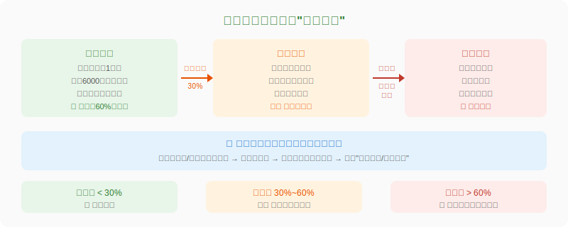
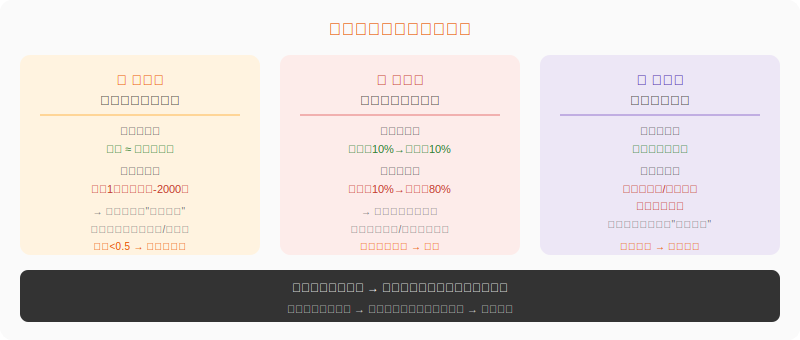

## 散户投资小白金融全品种操盘手册 - 5.12 ST、退市、财务造假、高质押、高商誉排雷
  
### 作者  
digoal  
  
### 日期  
2026-06-04  
  
### 标签  
金融产品 , 金融工具 , 散户 , 投资小白 , 全品操盘手册  
  
----  
  
## 背景 
  

## 开篇：你以为在买便宜货，其实在买定时炸弹

A股历史上有一种常见的悲剧：某只股票跌了很多，散户觉得"跌这么多了，肯定快涨了"，买入后继续跌，再跌，最后退市变废纸。

这不是运气差，是踩进了一类特殊的陷阱——**"外表正常、内部已经腐烂"的公司**。

A股有5000多只股票，其中有一批是真正的地雷：ST股、高商誉、高质押、财务造假嫌疑，以及流动性极差的小盘股。这些股票不是"不好的投资"，而是**有概率让你本金归零**。

这节的任务：教你用最低成本把这些雷区识别出来，绕道走。

---

## 一、ST与退市：最显眼的雷，偏偏有人往上踩

### ST是什么？

**ST（Special Treatment，特殊处理）** 是交易所对"经营出现异常"的公司挂上的警示牌。一只股票名字前面加了"ST"，等于交易所在告诉你：这家公司有问题。

ST的触发条件（以A股为例，规则会更新，以交易所最新公告为准）：

| 情形 | 触发后果 |
|---|---|
| 最近2年净利润连续为负 | ST（每日涨跌幅限制5%） |
| 净资产为负（资不抵债） | *ST（更严重的警示） |
| 最近1年年报被出具"无法表示意见"的审计报告 | ST |
| 连续20个交易日收盘价低于1元 | 触发面值退市 |
| 最近3年连续亏损 | 可能进入退市整理期 |

### *ST和ST的区别

ST是黄牌，*ST是红牌。*ST的原因往往更严重，比如净资产已经为负数，意思是公司的负债已经超过了资产，理论上股东什么都拿不回来。

### 退市：本金归零的真实路径

退市流程大致是：
1. 公司触发退市条件
2. 进入**退市整理期**（30个交易日，每天只能跌20%）
3. 整理期结束后，从主板/创业板摘牌
4. 股票转入**全国股转系统（新三板）** 或直接终止上市

**退市整理期**是散户最容易亏损惨重的阶段——30个交易日每天跌20%，复合下来你还剩多少？

> 举个数据：2023年A股全年退市公司47家（Wind数据），2024年退市约45家。历年退市股从退市整理期开始到最终摘牌，平均跌幅超过80%。

### 为什么还有人买ST股？

两个心理：一是"便宜"，二是赌"保壳"（公司为保住上市资格临时处理资产，股价短期反弹）。偶尔确实有保壳成功的案例，但统计上看，ST股整体是一个**期望值为负**的赌注。

**结论：ST和*ST，大多数情况下直接跳过，不做研究，不做赌注。**

---

## 二、财务造假：看起来好的公司，可能是假好

### 为什么财务造假难防？

因为你看的财报是公司自己提供的，审计机构收了公司的钱来审计，天然存在利益冲突。历史上的财务造假大案——康美药业、瑞幸咖啡、獐子岛等——在东窗事发之前，财报看上去都很"健康"。

小白不可能去核查公司仓库里有没有货，但有几个**财务报表内部的逻辑矛盾**，是造假很难掩盖的。

### 信号一：利润高，现金流低（最重要）

**第一性原理**：公司赚的钱，最终必须体现为真实的现金流入。如果账面上说赚了1亿，但经营活动产生的现金流是-2000万，意味着这1亿大多数还停留在"应收账款"里，可能根本没有收到现金。

**怎么查**：
- 在财报的"现金流量表"里，找"经营活动产生的现金流量净额"
- 计算它和净利润的比值：经营现金流 / 净利润

正常区间：**健康公司这个比值长期在0.8~1.5之间**。持续低于0.5，就要高度警惕。

**案例佐证**：蓝田股份是A股早期的造假大案，其2000年年报显示净利润4.32亿元，但同年经营现金流为-1.06亿元。当时有分析师发现这一矛盾并公开质疑，最终证实造假属实（来源：中国证监会行政处罚决定，2001年）。

### 信号二：应收账款暴增

应收账款是"欠我钱还没收回来"的部分。如果公司收入增加10%，但应收账款增加了80%，说明新增的收入大部分是赊账出去的，这些钱最终能不能收回来是一个大问号。

**怎么查**：看资产负债表中"应收账款"的历年变化，与营收增速对比。如果应收账款增速长期远高于营收增速，要追问：客户为什么不付款？是不是有虚构收入的可能？

### 信号三：审计意见非标

每年上市公司公布年报，必须有会计师事务所出具审计报告。审计意见分为：

- **标准无保留意见**：正常，会计师说"我审过了，报表是真实的"
- **带强调事项的无保留意见**：有一些特殊情况需要你关注，但整体还好
- **保留意见**：会计师发现了一些重大问题，但还没严重到"无法审计"
- **无法表示意见**：会计师说"我没法评判这份报表是否真实"
- **否定意见**：会计师明确说"这份报表有重大虚假"

**只要不是标准无保留意见，都要高度重视。触发"无法表示意见"或"否定意见"的，直接列入黑名单。**

查询方式：打开公司年报PDF，搜索"审计报告"，看第一段结论。

---

## 三、高质押：大股东资金链断裂的预警

### 质押是什么？

大股东把持有的股份"抵押"给银行或券商换取现金，到期归还本息后拿回股份。这本来是合理的融资方式。问题在于：**股价是浮动的，如果股价跌了，质押物的价值缩水，银行会要求补充保证金，大股东补不上就会被强制平仓**。

### 高质押为什么对散户有害？

强制平仓意味着银行在市场上大量卖出被质押的股票，这会形成额外的卖压，进一步压低股价，形成恶性循环：**股价跌→质押物价值缩水→强平→更多股票被抛售→股价继续跌**。

有时候一家基本面还不错的公司，单纯因为大股东高质押遇到了股价下跌，就触发了这个螺旋，散户被迫承担与基本面无关的风险。

### 怎么查质押率？

**方法**：  
① 打开东方财富或同花顺  
② 搜索个股→点击"股东信息"→查"股权质押"  
③ 找主要大股东（一般是持股第一位）的"质押股数/持股总数"

**风险参考标准**：

| 质押率 | 风险等级 | 建议 |
|---|---|---|
| < 30% | 低 | 正常参考 |
| 30%~60% | 中等 | 关注近期股价走势 |
| > 60% | 高 | 深度研究才能参与 |
| 接近100% | 极高 | 大概率不碰 |

**额外注意**：质押率本身只是一个指标，还需要看质押的平仓价格（有时上市公司会公告）和当前股价之间的距离，距离越近，风险越大。

> 数据参考：根据Wind数据，2018年A股股权质押危机期间，质押率超过70%的上市公司中，有超过200家大股东被触发平仓线，当年股价跌幅超过50%的此类公司占比约60%（历史数据，仅供参考，不代表未来）。

---

## 四、高商誉：被收购公司埋下的炸弹

### 商誉从哪来？

当A公司花10亿并购B公司，但B公司的净资产只有3亿，多出来的7亿就被计为"商誉"，挂在A公司的资产负债表上。

商誉代表"我花的钱多出来的部分，是为了买B公司的品牌、技术、客户关系等无形价值"。

### 商誉减值是什么？

每年，公司需要对商誉进行减值测试——看当年B公司的经营情况是否支撑最初的估值。如果B公司的业绩大幅下滑，那7亿的商誉可能只值3亿了，差额的4亿需要**一次性从利润中扣除**，这就是商誉减值。

**散户的感受**：持仓公司突然公告"计提XX亿商誉减值"，次日股价直接跌停，甚至连续几天跌停。你是被大额商誉减值的炸弹炸到了。

### 历史数据有多惨？

根据A股上市公司年报数据（Wind，2019年）：2018年A股共计提商誉减值约1665亿元，较2017年大幅增加，多家公司全年业绩从盈利变为大幅亏损。2019年进一步增加，部分公司单次减值超过净资产的50%，直接触发ST。

### 怎么查商誉风险？

**第一步**：打开资产负债表，搜索"商誉"，看商誉金额  
**第二步**：计算商誉/净资产的比率

| 比率 | 风险等级 |
|---|---|
| < 20% | 相对安全 |
| 20%~50% | 需关注被并购公司业绩 |
| > 50% | 高风险，商誉减值会大幅冲击利润 |

**第三步**：找到并购公告，看当时的业绩承诺是否完成。如果已经连续两年未完成承诺，商誉减值风险极大。

---

## 五、流动性陷阱：跌停时出不去的噩梦

这是一个容易被忽视的风险：**有些股票每天的成交额极低，你想卖的时候卖不出去**。

当一只股票日均成交额不足1000万，而你持有的市值是100万，理论上你要卖出自己的持仓需要好几天。如果遇到市场整体下跌，这只股票连续跌停，你可能几天都无法成交——眼睁睁看着亏损扩大。

**排雷方法**：
- 日均成交额低于3000万的股票，谨慎参与；低于1000万的，不适合作为主仓持有
- 市值低于20亿的小盘股，流动性风险显著更高
- 买入前看最近10天的日成交量是否稳定

---

## 六、第一性原理分析

**核心观点**：以上五类风险，最终都指向一件事——你买的资产可能无法产生预期的现金回报，甚至本金也有归零风险。

【前提清单】

支撑"这五类股票大多数情况下应该回避"成立，需要以下前提：

- 前提A：监管层面，ST/退市制度执行力度维持不变 → 【常量】→ 近年退市制度持续完善，执行力加强  
- 前提B：财务造假的识别信号有一定有效性 → 【常量】→ 基于会计逻辑，现金流与利润不符的矛盾是内在的，难以完全伪造  
- 前提C：高质押平仓是系统性的 → 【变量】→ 若公司引入战略投资者或股价回升，平仓风险可解除；此时不一定是坏投资

【情景推演】

- 正常情景（以上前提全部成立）：回避此类股票，避免不必要的本金损失，专注质地好的公司
- 压力情景（前提C被推翻，高质押公司引来"白衣骑士"）：可能错过一次短期反弹机会，但整体胜率仍支持回避
- 极端情景（监管执法力度大幅下降）：ST/退市机制失效，更多问题公司能"僵而不死"，届时需重新评估参与ST博弈的价值

---

## 七、实操例子

**场景**：你手里有30万，打算买一只创业板股票A，当前股价15元，PE 25倍，行业属于医疗器械，看起来估值合理。

**第一步：快速排雷检查（5分钟）**

打开东方财富，搜索该股，按以下顺序检查：

| 检查项 | 操作 | 判断标准 |
|---|---|---|
| ST状态 | 看股票名字前缀 | 有ST/*ST → 直接跳过 |
| 商誉比率 | 资产负债表 → 商誉/净资产 | > 50% → 需深查 |
| 大股东质押率 | 股东信息 → 质押情况 | > 60% → 需深查 |
| 经营现金流 | 现金流量表 → 经营现金流/净利润 | 持续 < 0.5 → 需深查 |
| 审计意见 | 年报 → 审计报告第一段 | 非标意见 → 直接回避 |

假设检查结果：
- 无ST
- 商誉/净资产 = 45%（中等偏高，需关注）
- 大股东质押率 = 35%（中等，可接受）
- 经营现金流/净利润 = 0.9（健康）
- 审计意见：标准无保留意见

**第二步：针对商誉风险做深查**

发现45%商誉比率，需要找到并购公告，看被并购公司的业绩承诺完成情况。假设查到被并购公司已连续2年未完成业绩承诺，此时商誉减值风险较高。

**第三步：做出决策**

在这个场景下，你有两个选择：

选择A：减仓参与，不超过总仓位的5%（即1.5万），控制商誉减值的潜在损失  
选择B：等待年报公告，确认商誉减值金额后再决策，避免踩到减值的时间点

**如果操作错误，后果是什么？**

若满仓30万买入，次年年报公告大额商誉减值，股价单日跌停（-20%），损失6万。之后若继续下跌，亏损进一步扩大。纠偏方式：在跌停打开瞬间，按原定止损计划卖出，不要等待"反弹"。

---

## 八、可复用框架

【框架名称】**买前五问排雷法**

适用场景：买入任何A股个股之前的快速排查  
核心逻辑：先排除最严重的系统性风险，再做基本面研究

操作步骤：
1. **问一**：名字前面有没有ST？有 → 跳过
2. **问二**：商誉/净资产超过50%吗？超过 → 深查并购子公司业绩承诺完成情况
3. **问三**：大股东质押率超过60%吗？超过 → 看平仓线距离当前股价
4. **问四**：经营现金流/净利润连续两年低于0.5吗？是 → 查应收账款，怀疑利润含水
5. **问五**：审计意见是否为标准无保留意见？否 → 直接跳过

五问全过 → 才能进入下一步的基本面研究。

举一反三：这个框架同样适用于港股个股的初步排查（港股财务造假历史更多，更要严格执行）

---

## 九、本节行动清单

- [ ] **立即行动**：打开你现有持仓，逐一完成"买前五问排雷"，发现问题立刻评估是否需要减仓
- [ ] **工具收藏**：在东方财富APP收藏以下查询路径——股东信息（查质押）、财务报表（查商誉、现金流）
- [ ] **设立规则**：确定自己的个股持仓红线，例如"商誉/净资产>60%的公司，仓位不超过3%"
- [ ] **加入监控**：对已持仓的高商誉公司，在年报季（1月中旬~4月底）重点关注商誉减值公告
- [ ] **习惯养成**：每次看到"便宜"的ST股时，先查退市风险，不因"便宜"就冲动买入

---

## 一句话总结

**A股最容易让本金归零的地雷是：ST/退市风险、财务造假、高质押平仓、高商誉减值、流动性极差——买股之前先花5分钟做"买前五问"，绕过这些雷区，不是保守，是基本的风险自我保护。**

---

> ⚠️ **声明**：本文内容为投资教育目的，所有历史数据、策略框架均为辅助学习工具，不构成证券投资建议。市场有风险，投资需谨慎。实际操作请结合自身风险承受能力，必要时咨询专业投顾。ST制度、退市规则、质押规定等具体政策以交易所最新公告为准。
  
#### [PostgreSQL 解决方案集合](../201706/20170601_02.md "40cff096e9ed7122c512b35d8561d9c8")
  
  
#### [德哥 / digoal's Github - 公益是一辈子的事.](https://github.com/digoal/blog/blob/master/README.md "22709685feb7cab07d30f30387f0a9ae")
  
  
#### [About 德哥](https://github.com/digoal/blog/blob/master/me/readme.md "a37735981e7704886ffd590565582dd0")
  
  

  
