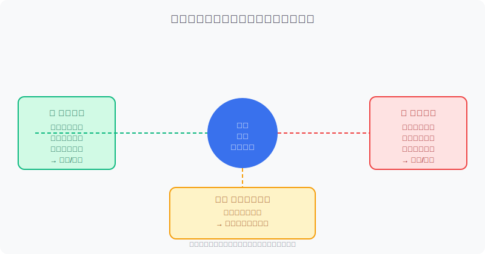
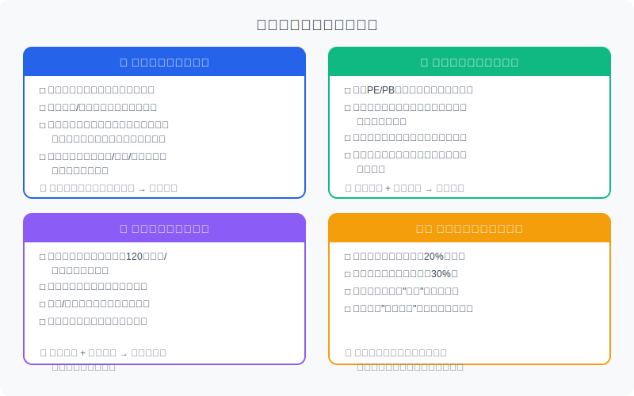
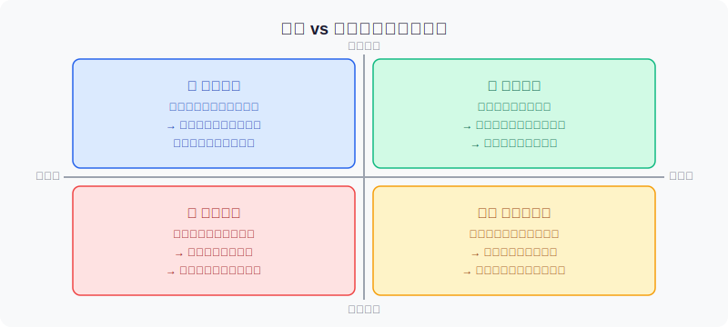

## 散户投资小白金融全品种操盘手册 - 5.13 个股复盘模板 —— 买入理由是否还成立
  
### 作者  
digoal  
  
### 日期  
2026-06-04  
  
### 标签  
金融产品 , 金融工具 , 散户 , 投资小白 , 全品操盘手册  
  
----  
  
## 背景 
  

## 一个让大多数散户亏钱的错误问题

每天收盘后，无数散户坐在屏幕前问自己：

> **"今天涨了还是跌了？"**

这个问题问错了。

正确的问题只有一个：

> **"我当初买它的理由，今天还成立吗？"**

区别在哪里？前一个问题让你盯着价格做决策，后一个问题让你盯着逻辑做决策。巴菲特说过一句话，大意是：如果你仅仅因为股价跌了20%就卖出，那你从一开始就不应该买它。这话听起来像废话，但研究表明，散户卖出赚钱股票、持有亏钱股票的比例，高达70%以上（摩根大通资管2023年散户行为分析报告数据）——这正是因为以"我亏多少"而非"逻辑是否成立"来做决策导致的。

本节的目标，就是给你一套**可以每周用的个股复盘模板**，让你在做决策时有据可依，而不是凭感觉猜。

---

## 先理解核心逻辑：你在检验什么

买入一只股票，背后总有某种理由——哪怕你说不清楚，本质上也是某种预判：

> 我认为这家公司未来会更赚钱（或者市场会给它更高估值）。

这个预判，是由一系列**前提假设**撑起来的。复盘，就是**逐一验证这些前提还在不在**。

大多数散户的问题是：从来没有把这些假设写下来。买的时候靠感觉，复盘时找不到"当初为什么买"的依据，只能盯着涨跌幅做决策。这种操作方式，本质上和猜硬币正反面没有区别。

---

## 复盘四维检验框架

个股复盘，围绕四个维度展开：

下面逐一讲清楚每个维度应该检验什么，以及发现问题后怎么做。

---

### 维度一：基本面逻辑是否完整

这是最核心的维度。你当初买这只股票，八成是因为某种基本面判断：行业景气、公司成长、护城河稳固。

**检验点1：行业景气度有没有变化？**

行业景气度不是你看一篇新闻就能判断的，要看具体数据：
- 行业月度PMI（采购经理人指数）是否仍在扩张区间（50以上）？
- 行业上游原材料价格是否出现异常波动？
- 行业龙头公司最新的业绩指引（Guidance）是否被下调？

**检验点2：财务数据是否有异常？**

季报和年报发布后，必须检查三张表里的这几个信号：

| 检验项 | 正常信号 | 警戒信号 |
|---|---|---|
| 应收账款增速 | 不超过收入增速 | 大幅超过收入增速（有虚增收入嫌疑）|
| 经营性现金流 | 与净利润方向一致 | 净利润持续为正但现金流为负 |
| 商誉规模 | 占净资产比例低 | 占净资产超过30%，且子公司盈利下滑 |
| 存货变化 | 随收入同比波动 | 存货大幅增加但收入未增（可能滞销）|

**检验点3：核心竞争优势是否被侵蚀？**

用你能找到的公开信息回答这个问题：
- 有没有新的强势竞争对手进入这个市场？
- 公司的毛利率是否连续两个季度以上下滑？
- 公司赖以生存的技术/专利/渠道，是否出现了替代性威胁？

---

### 维度二：估值是否已经透支

逻辑没变化，但如果股价涨得太猛，估值已经消化了未来三年的预期，那这只票即便基本面良好，短期也没有继续持有的必要。

**核心公式理解（不需要精确计算）：**

> 安全边际 ≈ 合理估值 − 当前股价

合理估值怎么算？最简单的参考方法：
- 找同行业5只类似公司，看它们的平均PE
- 把你的持仓公司PE和均值对比
- 如果溢价超过50%，且你找不出溢价的理由，那就该减仓

**历史估值分位参考（以沪深300成分股为例，Wind数据2020-2024年）：**

| 行业 | 历史PE 50分位（中位） | 历史PE 80分位（偏贵） | 历史PE 95分位（极贵）|
|---|---|---|---|
| 消费 | 28x | 42x | 60x+ |
| 医药 | 35x | 55x | 80x+ |
| 科技/成长 | 40x | 65x | 100x+ |
| 金融/银行 | 8x | 12x | 16x+ |

当你的持仓股PE进入80分位以上，且近期业绩增速没有明显加速迹象，就应该开始计划减仓，而不是等市场转向才动。

---

### 维度三：趋势与资金面有无警告

基本面是长期的，趋势是中期的，资金是短期的。三者同时验证，判断才可靠。

**技术面关键信号：**

不需要学会复杂的技术分析，只看两个东西：

1. **120日均线**：股价跌破120日均线（半年线），且成交量放大，是中期趋势破坏的警告。
2. **前期重要低点**：如果股价跌破上一次的重要底部，意味着下行趋势确认。

**资金面关键信号：**

- **北向资金**（通过东方财富或Wind查询）：如果该股近一个月北向净卖出金额连续扩大，要留意。
- **机构持仓变化**：每个季度末，上市公司披露前十大股东，如果多家机构连续减持，是显著警告。
- **龙虎榜数据**：如果游资机构频繁上榜卖出，而买入方都是散户游资，资金结构正在恶化。

**一个反常识的提醒：** 放量大跌和缩量小跌的含义完全不同。缩量下跌可能只是没人关注，放量大跌才是主力资金出逃的信号。

---

### 维度四：仓位是否已经失控

这个维度和公司本身无关，和你自己的风险管理有关。

很多人被套，不是因为判断错，是因为仓位太重，一点波动就变成巨大亏损，最终心理崩溃割肉。

**硬性规则：**

- 单只股票不超过总仓位的20%
- 单行业总持仓不超过30%
- 一旦超标，无论基本面多好，先降仓位到上限以内

为什么要这么硬性？因为任何判断都有可能错。你不知道自己哪次判断会错，仓位控制是在承认自己不是神的前提下，保护你继续留在市场里的能力。

---

## 逻辑 vs 股价：四种情景的处理方式

买入逻辑和股价走势，组合起来有四种情景，处理方式完全不同：

**最危险的情景是右下角——逻辑破坏但股价还在涨。**

这时候，散户最容易犯的错误是：看着股价还在涨，舍不得卖，等着"再涨一点"。但破坏的基本面逻辑不会因为股价暂时撑着而自动修复。等到市场反应过来，往往是加速下跌。典型案例：2022年前三季度，部分教育股（股价在政策公布后短暂反弹）最终下跌80%以上，大量散户在"反弹"中补仓被套。

**最容易被错误对待的是左上角——逻辑完整但股价跌。**

这时候，散户往往恐慌卖出。但如果你能确认买入逻辑没有破坏，这其实是一个可以考虑加仓的机会——当然，前提是你的仓位还没有超上限，以及你有足够的现金储备。

---

## 第一性原理分析：复盘的本质是什么

**核心观点：复盘的本质不是总结"涨跌"，而是验证"假设"。**

**【前提清单】**

支撑"持有这只股票有意义"成立需要以下前提：
- 前提A：行业长期景气度向上 → **常量**（行业周期一般以年为单位，不会突然变）
- 前提B：公司在行业内份额持续提升 → **变量**（竞争随时可能改变）
- 前提C：当前估值仍有安全边际 → **变量**（每一轮上涨都在消耗安全边际）
- 前提D：市场愿意给成长溢价 → **变量**（风险偏好可能在几周内剧变）

**【情景推演】**

正常情景（A、B、C、D全部成立）：持有，估值合理可加仓

压力情景（前提C被推翻，估值进入80分位以上）：逢高减仓至半仓，设置止盈目标价

极端情景（前提B+C被推翻，份额开始下滑且估值过高）：清仓，不论亏损多少

**关键结论：止损的信号不是"我亏了多少"，而是"我的判断是否已经被证伪"。**

---

## 实操案例：以某消费电子公司为例

**假设场景：** 你在2024年Q2以30元买入某消费电子公司（PE约35x），总仓位15%，买入逻辑是：国产替代加速 + 公司AI功能迭代带来换机需求。

**半年后复盘（2024年Q4）：**

| 检验项 | 买入时判断 | 半年后实际 | 结论 |
|---|---|---|---|
| 行业景气 | 换机周期上行 | 市场销量同比+12% | ✅ 成立 |
| 公司份额 | 预计国内份额+2% | 实际+1.5% | ✅ 基本成立 |
| 财务质量 | 现金流健康 | 现金流与利润匹配 | ✅ 成立 |
| 估值 | 35x PE（中性） | 股价涨至45元，PE升至52x | ⚠️ 进入偏贵区间 |

**第一步：** 基本面逻辑3/4成立，但估值已进入偏贵区间。

**第二步：** 查看同行业5家公司平均PE：约38x。自身52x，溢价约37%，接近但未超过50%。

**第三步：** 判断结论——减半仓（从15%降至7%），锁定部分利润，剩余仓位设止盈目标价（基于合理PE 45x × 下一年预期EPS，约52元）。

**如果操作失误：** 没有减仓，后续若业绩低于预期，估值会"双杀"收缩（股价跌 + 估值压缩），从45元回落到28元不是没有先例。

---

## 可复用方法论

**【框架一：买入前提清单法】**

适用场景：每次复盘时，快速判断是否需要调整仓位

核心逻辑：买入决策是由一系列前提假设支撑的，只要核心假设没有破坏，就不需要因为股价波动而动

操作步骤：
1. 建仓时写下3-5条买入理由（越具体越好，必须可验证）
2. 每月对照一次，逐条确认成立/部分成立/破坏
3. 1条核心假设破坏 → 减至半仓；2条以上核心假设破坏 → 清仓

举一反三：这个框架同样适用于可转债（持股信心的逻辑验证）和QDII基金（宏观逻辑的季度验证）

---

**【框架二：四象限持仓决策法】**

适用场景：当你不知道持仓是该加、减还是持有时

核心逻辑：逻辑与股价的组合，决定了最优操作

操作步骤：
1. 判断当前买入逻辑是"完整"、"部分动摇"还是"破坏"
2. 判断当前股价走势是"上涨"还是"下跌"
3. 对照四象限图，执行对应操作（持有/加仓/减仓/清仓）

举一反三：这个框架还可以用在基金持仓上，把"买入逻辑"替换成"基金经理投资风格是否仍然有效"

---

## 本节行动清单

1. **立刻做：** 打开你的持仓列表，对每一只股票写下"买入理由是什么"，哪怕只写3条。如果你写不出来，说明你当初买入没有逻辑，应该考虑减仓。

2. **每月做：** 用四维检验框架对每只持仓做一次复盘，把结论记录在一个固定文档里。

3. **每季度做：** 查阅持仓公司的季报，重点检查现金流、应收账款、毛利率三项，对比买入时的状态。

4. **发现逻辑破坏时：** 不要等"再涨一点"再卖，在你决定减仓的那天就执行，价格次要，逻辑优先。

5. **建立买入记录档案：** 以后每次买入，在备忘录或表格里记录：买入日期、买入价、买入逻辑（3-5条）、失效条件（什么情况下你会卖出）。

---

## 一句话总结

> 复盘不是回顾你赚了多少钱，而是检验你的判断是否还站得住脚——买入理由还在，持有；买入理由没了，不论涨跌都该离场。

---

> ⚠️ **声明**：本文内容为投资教育目的，所有历史数据、策略框架均为辅助学习工具，不构成证券投资建议。市场有风险，投资需谨慎。实际操作请结合自身风险承受能力，必要时咨询专业投顾。
  
  
#### [PostgreSQL 解决方案集合](../201706/20170601_02.md "40cff096e9ed7122c512b35d8561d9c8")
  
  
#### [德哥 / digoal's Github - 公益是一辈子的事.](https://github.com/digoal/blog/blob/master/README.md "22709685feb7cab07d30f30387f0a9ae")
  
  
#### [About 德哥](https://github.com/digoal/blog/blob/master/me/readme.md "a37735981e7704886ffd590565582dd0")
  
  

  
