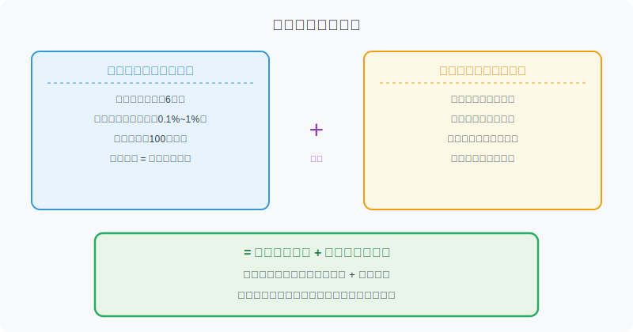
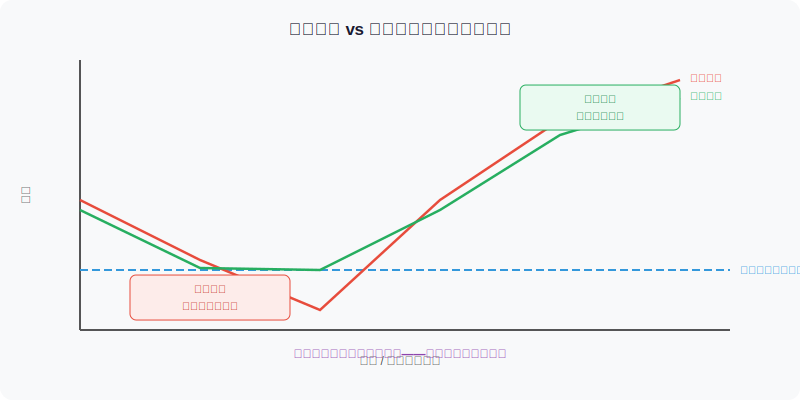

## 散户投资小白金融全品种操盘手册 - 6.1 可转债是什么 —— 债底 + 股票看涨期权
  
### 作者  
digoal  
  
### 日期  
2026-06-04  
  
### 标签  
金融产品 , 金融工具 , 散户 , 投资小白 , 全品操盘手册  
  
----  
  
## 背景 
  

## 先问你一个问题

2021年，A股市场一度出现这样一种现象：某只正股（就是可转债对应的那家公司的股票）暴跌30%，但它发行的可转债只跌了不到8%。而当这家公司股价后来反弹翻倍，它的转债也涨了超过80%。

涨的时候跟着涨，跌的时候跌得少——这不是某种神秘的内幕，而是可转债这个产品结构本身决定的。

今天这一节，我们就把这个结构彻底搞清楚。

---

## 可转债是什么？用一句话说

**可转债 = 一张可以变成股票的债券。**

更准确地说：它是公司发行的债券，但附带了一个特殊权利——持有人可以在约定条件下，按照事先约定的价格（叫做"转股价"），把这张债券换成公司股票。

换不换，是你的权利，不是义务。所以本质上，你拿到的是：

1. **一张债券**：到期能还本付息，亏损有底线
2. **一个看涨期权**：如果股价涨了，你可以用转股价换股票，享受股价上涨的收益



---

## 拆开来讲：债券那一半

债券的核心逻辑是：**你借钱给公司，公司承诺还你。**

可转债通常有以下基本参数：

- **面值**：100元（这是"本金"的基准）
- **期限**：通常6年
- **票息（利息）**：一般很低，0.1%~1.5%/年，分年付（明显低于普通债券，因为附带了期权）
- **到期赎回价**：通常在106~115元之间（相当于含本金+补偿利息）

举个例子：假设你100元买入某可转债，持有6年到期，公司按110元（假设）赎回你——这6年加起来的回报大概是年化1.5%~2%，跑赢货币基金但不多。这就是"纯债价值"给你提供的底线保护。

**关键：纯债价值是转债的价格地板。**

只要发债公司没有违约（信用风险），转债价格理论上不会跌穿纯债价值。这就是"亏损有底"的来源。

> **小白提示：** 纯债价值（Pure Bond Value）= 未来所有利息和到期赎回金额，折现回今天的价值。不需要自己算，各大行情软件都会直接显示。

---

## 拆开来讲：期权那一半

期权（Option）听起来复杂，但这里的期权很好理解：

**你有权利（不是义务），在规定时间内，按"转股价"把债券换成股票。**

举个例子：
- 某转债转股价 = 20元/股
- 现在正股价格 = 25元/股
- 你持有1张面值100元的转债，可以换成 100÷20 = 5股
- 换成股票后，市值 = 25元 × 5股 = 125元

你用100元的债券，换到了125元的股票——这就是"转股"带来的收益，超出部分就是期权的价值。

如果股价跌到了15元呢？你当然不换，因为换了只能拿到75元，不如持有债券等到期回本。

**这就是期权的精髓：好事我参与，坏事我不做。**

---

## 把两半合在一起：不对称的秘密

可转债最迷人的地方，就是它的"涨跌不对称"：

- **正股大涨时**：转债跟涨，因为转股价值提升了
- **正股大跌时**：转债跌得少，因为纯债价值托底



这种不对称，在投资学上叫做 **"凸性"（Convexity）** ——通俗说就是：赚的可能比亏的多，而且这不是靠运气，是产品结构决定的。

---

## 第一性原理分析：这个"亏损有底"有多可靠？

很多人看到这里会问：听起来太好了，有没有陷阱？

当然有，我们来认真拆前提。

```
【前提清单】
支撑"可转债亏损有底"成立需要以下前提：

- 前提A：发行公司不违约（不破产、不赖账）→【变量，但多数为常量】
  → 理由：投资级公司短期内违约率极低，但存在；信用评级低的公司风险更高
  → 若被推翻：债券价值归零，亏损无底 → 对应操作：回避评级BB以下的高风险转债

- 前提B：持有到期价格偿还机制正常运转 →【常量（受法律约束）】
  → 理由：上市公司发行可转债受证监会监管，到期赎回有法律强制力

- 前提C：买入价格接近或低于纯债价值 →【变量】
  → 理由：如果你在溢价很高时买入（比如140元），纯债价值只有95元，那跌穿的空间很大
  → 若被推翻：价格可能从140元跌到95元，亏损约32% → 对应操作：不在高溢价时买入

【情景推演】
正常情景（三个前提全成立）：亏损上限10%~15%，盈利无上限
压力情景（前提C失守，高价买入）：亏损可达30%+，债底保护失效
极端情景（前提A+C均失守，公司违约+高价买入）：亏损50%+甚至本金大幅受损
```

结论：**可转债的"亏损有底"是有条件的，不是无条件的保险。** 条件是：公司信用良好 + 买入价格合理。

---

## 用数据说话：可转债的历史表现

根据Wind数据（2018年至2024年）：

- A股市场全体可转债的**年度平均收益率**约为8%~15%（不同年份差异很大）
- 同期沪深300指数的年度波动率约为20%~30%
- 可转债指数（中证转债）的年度波动率约为8%~12%，**波动率约为股票的一半**

失败案例也要讲：2021年底至2022年，可转债市场整体调整，部分高溢价、高价格转债从140元以上跌至100元附近，跌幅约30%。原因正是前提C失守——很多人在过高的溢价下买入，债底保护效果很弱。

**历史数据表明可转债整体波动低于股票，但不代表任何时候买都安全，高价高溢价买入仍然危险。**

---

## 实操例子：小张买了一张可转债

**场景设定：**
- 小张有5万元本金，想比货币基金多赚一点但又怕亏太多
- 他看中了"某科转债"：当前价格105元，纯债价值约97元，正股近一年稳定，信用评级AA
- 他打算买入10张（1000元/张 × 10张 = 1万元）

**操作步骤：**

第一步：确认买入价格合理
- 当前价格105元，纯债价值97元，溢价约8%
- 判断：溢价不算太高，债底保护有效，符合"买入区间"

第二步：在证券账户场内买入
- 可转债像股票一样在交易所买卖，每张面值100元，小张以105元/张买入10张，花费1050元

第三步：设定预期：
- **最坏情况**：公司不违约，持有到期按约定价格（假设110元）赎回，年化收益约0.9%，没亏
- **中性情况**：正股小幅上涨，一年后转债价格涨至115元，小张卖出，每张赚10元，收益率约9.5%
- **最好情况**：正股大涨50%，转债价格涨至150元以上，小张可以选择转股或直接卖出，收益可超40%

第四步：错误场景应对
- 如果小张冲动在溢价率40%（价格140元）时买入，正股不涨，一年内转债可能跌至110~115元，账面亏损15%~20%——债底保护在高溢价下已经失效

**纠偏动作**：设定溢价率上限（建议初学者不超过20%），超过不买。

---

## 可复用框架

```
【转债底线检验法】（5字框架：价格、纯债、信用）

适用场景：买入可转债前的安全性评估
核心逻辑：只有在"纯债价值提供保护"的前提下，不对称性才真正存在

操作步骤：
  1. 查纯债价值：在行情软件找"纯债价值"字段，通常在95~100元区间
  2. 算溢价率：（当前价格 - 纯债价值）÷ 纯债价值 × 100%
     → 溢价率 < 20%：债底保护有效，可以考虑
     → 溢价率 > 30%：债底保护较弱，需更关注正股逻辑
  3. 查信用评级：AA及以上相对安全，A以下需谨慎，BB及以下视为高风险
  
举一反三：这个框架也适合评估"低价转债"——价格接近纯债价值不等于安全，
还要看信用评级。低价+低信用才是真正的危险组合。
```

---

## 本节行动清单

1. **打开你的证券账户**，搜索"可转债"或"转债"，找一只你熟悉的公司发行的转债，看看当前价格和纯债价值的差距
2. **找到"溢价率"字段**（大多数行情软件直接显示），记住：溢价率越低，债底保护越强
3. **查信用评级**：找BB以上的标的，回避评级过低的转债
4. **不要在溢价率超过40%时买入**，无论故事讲得多好
5. **记住这句话**：可转债不是无风险，是"风险不对称"——跌有底、涨无顶，但前提是你买得合理

---

## 一句话总结

> 可转债 = 一张债券 + 一个免费的股票看涨期权；债底托住下跌，期权参与上涨；但这个保护是有条件的——公司不违约、买入价格合理，缺一不可。

---

> ⚠️ **声明**：本文内容为投资教育目的，所有历史数据、策略框架均为辅助学习工具，不构成证券投资建议。市场有风险，投资需谨慎。实际操作请结合自身风险承受能力，必要时咨询专业投顾。
  
  
#### [PostgreSQL 解决方案集合](../201706/20170601_02.md "40cff096e9ed7122c512b35d8561d9c8")
  
  
#### [德哥 / digoal's Github - 公益是一辈子的事.](https://github.com/digoal/blog/blob/master/README.md "22709685feb7cab07d30f30387f0a9ae")
  
  
#### [About 德哥](https://github.com/digoal/blog/blob/master/me/readme.md "a37735981e7704886ffd590565582dd0")
  
  

  
