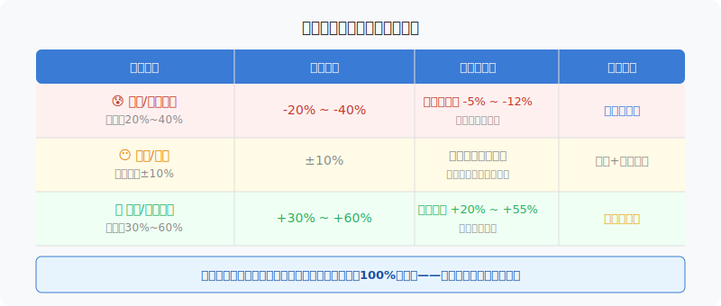
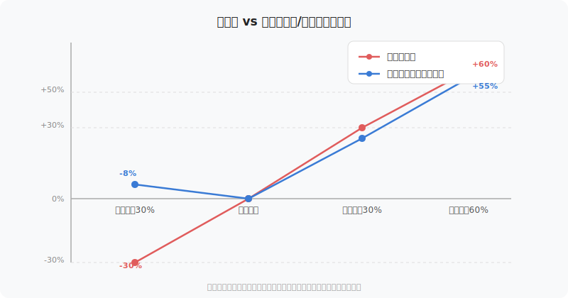

## 散户投资小白金融全品种操盘手册 - 6.2 为什么可转债适合学习风险收益不对称
  
### 作者  
digoal  
  
### 日期  
2026-06-04  
  
### 标签  
金融产品 , 金融工具 , 散户 , 投资小白 , 全品操盘手册  
  
----  
  
## 背景 
   

---

## 先说一个反直觉的结果

2024年全年，沪深300指数收涨约14.7%，A股个股涨跌分化极大。同期，中证转债指数涨幅为6.08%——比股票低。

但你知道2024年初那波下跌时，转债跌了多少吗？

2024年1月到2月，权益市场快速回撤，中小盘股跌幅一度超过25%。同期的转债市场？整体回撤幅度只有约7%~10%。

涨的时候跟得上一半，跌的时候只跌三分之一——这就是可转债的第一个核心特点：**不对称的风险和收益**。

它不是一个"稳赚"的工具。但它是一个**亏起来相对克制、赚起来能参与**的工具——而这个特性，恰恰是散户最需要但最难理解的投资概念。

---

## 什么是"风险收益不对称"？

在开始讲可转债之前，我们需要先搞清楚这个词。

大多数投资品种，风险和收益是"对称的"：你承担多少下跌风险，理论上就享受多少上涨潜力。买一只股票，正股涨30%你赚30%，正股跌30%你亏30%——这是对称的。

**不对称**，意思是：你的下跌空间，被某种机制"截断"了，但上涨空间依然存在。

用生活比喻：想象你在玩一个游戏，骰子结果是1~3的时候你什么都不输，结果是4~6的时候你按点数赢钱。这个游戏对你来说就是不对称的——下行被保护了，上行仍然参与。

可转债的"不对称"，就是靠两个东西撑起来的：

**债底**——帮你把下跌截断  
**期权**——帮你把上涨带进来

---

## 第一性原理：债底从哪里来？期权从哪里来？

### 债底的来源

可转债本质上是一张债券。发行公司每年支付利息，到期还本——这是法律义务，不履行就是违约。

那么，无论正股（可转债对应的那家公司股票）跌成什么样，只要公司还能还钱，转债的价格就不会跌到"债底"以下。

债底的大小取决于：**公司的信用等级 + 当前利率水平**。

举一个近似的例子：某转债票面100元，年利率0.5%，6年到期，参考同信用等级市场利率约3%，折现后的债底大约在82~87元。也就是说，只要公司不违约，这张票的价格理论上不会跌破82~87元区间。

这就是"下跌有底"的本质——**不是政策保护，而是发行合同里白纸黑字写着的还钱承诺**。

### 期权的来源

可转债还有一个权利：你可以在规定条件下，把债券"转换"成公司股票。

这个权利，叫做**转股权**。

转股权是一种看涨期权（Call Option）——当正股价格超过转股价时，你转股就能赚到差价。正股涨得越多，这个权利越值钱。

这个权利是"免费"内嵌在债券里的——你买了转债，就自动拥有了。

这就是"上涨可以参与"的本质——不是运气，是结构决定的。

---

## 前提清单 + 情景推演

支撑"可转债下跌有底、上涨可参与"成立，需要以下前提：

**前提A：发行公司具备偿债能力** → 【变量】  
这是债底成立的核心前提。如果公司濒临破产，债底失效，转债价格可能跌到30~60元甚至更低。

**前提B：市场整体利率水平相对稳定** → 【变量】  
利率大幅上升，纯债价值会下降，债底跟着下移。转债跌幅可能超过预期。

**前提C：正股有上涨潜力** → 【变量】  
转债的上涨参与能力依赖正股——如果正股长期横盘甚至退市，期权价值会归零，只剩债底那部分。

**情景推演：**

- **正常情景（三个前提全部成立）**：转债表现出典型的不对称——股市跌时跌幅收窄，股市涨时参与上行。
- **压力情景（前提A出问题）**：公司被调低信用评级，债底松动，转债价格大幅下跌，不对称优势大幅削弱，甚至跌穿债底。2024年就出现了转债史上首次实质性违约事件，多只低评级转债跌至60元以下。
- **极端情景（前提A+C同时出问题）**：公司即将违约且正股暴跌，此时转债和正股几乎同步崩跌，不对称优势完全消失，参照退市股处理。

**结论**：可转债的不对称保护是**有条件的**，条件就是：公司信用资质必须过关。高评级≠一定安全，但低评级转债大概率让债底失效。

---

## 两个真实案例：不对称是真实存在的

### 案例一（成功方向）：宁德时代正股带动下的某头部新能源转债（2020~2021）

2020~2021年新能源行情，部分新能源转债正股涨幅超过150%，转债价格也从100元附近涨至220~250元区间，全程参与了上行。而在2018年市场下跌期间，类似结构的优质转债价格只下跌了约8%~15%（同期A股指数跌约25%）。

**一涨跟上，一跌收住——正是不对称的教科书案例。**

（数据来源：Wind数据库，2018~2021年历史行情；历史表现不代表未来。）

### 案例二（失败方向）：某地产系低评级转债（2022~2024）

2022年以来，部分房地产行业关联转债因正股暴跌+公司偿债能力受质疑，债底大幅下移，转债价格从100元跌至40~60元区间。"债底保护"几乎彻底失效。

**这些案例告诉我们**：转债的不对称并非钢铁保障，它依赖公司信用资质这个地基。地基松了，"债底"只是一张纸。

（数据来源：公开市场数据及各券商研报整理，2022~2024年；历史表现不代表未来。）

---

## 为什么可转债是"练习"风险收益不对称的绝佳场地？

直接买股票，你体验不到不对称——上涨亏损都是"全程参与"。

直接买期权，你会体验到不对称，但期权结构复杂、时间衰减残酷，小白入场容易交学费。

**可转债恰好处于中间地带**：

1. **门槛低**：100元面值起步，A股投资者均可参与，无需开通期权账户。
2. **结构透明**：债底+期权，两层拆解清楚，不像衍生品那样需要掌握Greeks（期权价格敏感度指标）。
3. **时间容错**：转债有6年存续期，不像短期期权那样"时间价值"消耗迅猛，新手有时间观察和学习。
4. **不对称效果显性**：跌市时你能真切感受到"债底在托着我"，涨市时你能感受到"期权把涨幅带进来了"——这个具身体验，比看任何教材都直接。

用一个比喻：可转债是"带护栏的跳板"。护栏不让你摔死（债底），跳板让你弹起来（期权）。先练这个，再去玩无护栏的纯期权和杠杆，会少交很多学费。

---

## 实操例子：感受不对称的具体操作

**假设场景**：你有5万元，市场处于震荡期，你想参与某行业的上行机会，但不确定正股能否涨，也怕大跌。

**第一步**：找到该行业的转债候选（假设某制造业公司有转债，价格102元，溢价率15%，信用评级AA）。

**第二步**：评估债底是否稳固——确认公司近两年净利润为正，没有重大债务风险（查看交易所公告或券商研报）。

**第三步**：买入1~2手转债（每手10张，约1020~2040元），保留大部分仓位等待正股信号。

**第四步**（正股上涨）：正股涨20%以上后，转债可能涨至115~125元。判断是否接近强赎触发条件（正股连续15/30个交易日高于转股价的130%），及时决定卖出或转股。

**第四步（另一路径）**（正股下跌）：正股跌15%，转债因债底保护只跌至95~97元。此时可选择持有等待反弹，或止损离场——损失远小于直接持股。

**关键判断依据**：转债买入价格离债底的距离。价格越接近债底，向下空间越小，持有安全边际越高。

**如果判断错了怎么办**：如果公司信用恶化（评级下调、大股东爆雷），立即复查债底是否仍然有效，考虑减仓或止损，不要幻想"债底会救我"。

---

## 可复用框架

### 【债底距离法】

**适用场景**：判断一只转债当前的下跌保护是否充分

**核心逻辑**：转债价格离债底越近，下跌空间越小，不对称保护越强

**操作步骤**：
1. 查询转债当前价格（市场实时价）
2. 估算或查阅债底（纯债价值，各主流债券平台均有提供）
3. 计算"债底保护距离"= (当前价格 - 债底) ÷ 当前价格
4. 保护距离 < 10%：债底保护充分，但需核查信用资质
5. 保护距离 > 25%：偏向期权驱动，波动较大，适合博弈正股上行

**举一反三**：这个框架同样适用于其他含有债底属性的产品，如可交换债（EB）、部分结构性存款。

---

### 【不对称三问法】

**适用场景**：买入任何投资品前，快速判断风险收益是否不对称

**核心逻辑**：强迫自己在买入前搞清楚下行极限和上行空间

**操作步骤**：
1. 问自己：**最坏情况下，我最多亏多少？**（对应转债：公司违约，转债跌至30~50元）
2. 问自己：**正常情况下，我的收益上限大约是多少？**（对应转债：正股大涨，转债涨至130~200元）
3. 问自己：**亏损的概率比收益的概率高还是低？**（对应转债：公司信用资质、正股基本面）

如果三个问题都有答案，你才真正理解了这次投资在做什么。

**举一反三**：这个三问法可以用在ETF、个股、期权买方、REITs——任何投资品都适用。

---

## 本节行动清单

1. **找一只正在上市的转债**，查询它的债底（任意债券筛选平台均有，搜索"纯债价值"），计算"债底保护距离"，感受一下当前保护是厚是薄。

2. **观察一只转债三个月**，记录正股每周涨跌 vs 转债每周涨跌，亲眼看一看两者的差异是否呈现"不对称"特征。

3. **用"不对称三问法"对你现在持有的任何一只股票或基金提问一遍**——大概率你会发现，大部分品种其实没有任何下行保护。

4. **只在信用评级AA及以上的转债中练习**。学习阶段，债底的稳固性比期权弹性更重要。低评级转债先不碰。

5. **建立"转债观察清单"**，至少追踪5只不同行业的转债，每月看一次价格、溢价率、债底的变化，培养感觉。

---

## 一句话总结

> 可转债是一张写着"最多亏到这里、有机会赚到那里"的合约——理解它，就是理解了风险收益不对称的本质；用好它，你就掌握了比大多数散户都更清醒的投资逻辑。

---

> ⚠️ **声明**：本文内容为投资教育目的，所有历史数据、策略框架均为辅助学习工具，不构成证券投资建议。市场有风险，投资需谨慎。实际操作请结合自身风险承受能力，必要时咨询专业投顾。
  
  
#### [PostgreSQL 解决方案集合](../201706/20170601_02.md "40cff096e9ed7122c512b35d8561d9c8")
  
  
#### [德哥 / digoal's Github - 公益是一辈子的事.](https://github.com/digoal/blog/blob/master/README.md "22709685feb7cab07d30f30387f0a9ae")
  
  
#### [About 德哥](https://github.com/digoal/blog/blob/master/me/readme.md "a37735981e7704886ffd590565582dd0")
  
  

  
