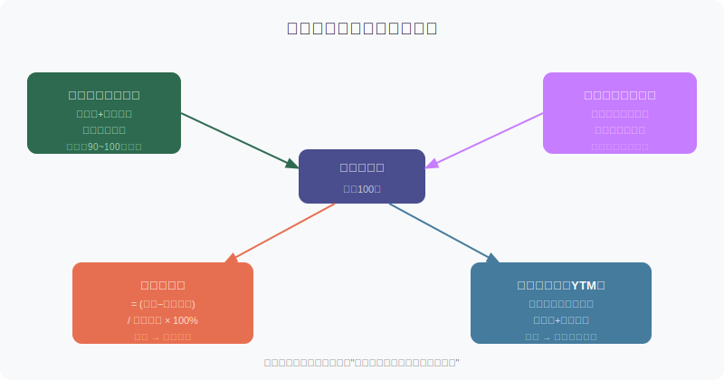
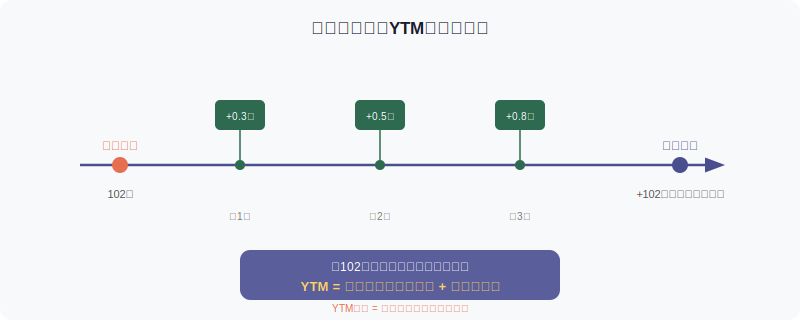
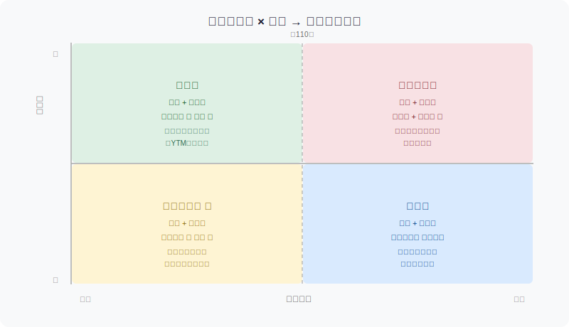

## 散户投资小白金融全品种操盘手册 - 6.3 转股价值、转股溢价率、纯债价值、到期收益率
  
### 作者  
digoal  
  
### 日期  
2026-06-04  
  
### 标签  
金融产品 , 金融工具 , 散户 , 投资小白 , 全品操盘手册  
  
----  
  
## 背景 

## 先问你一个问题

买一张可转债，你到底在买什么？

很多人说"我在买可转债"——但这句话太模糊了。同样是一张价格110元的转债，有人买到的是"接近债底、溢价合理、YTM为正"的安全标的，有人买到的是"溢价高达80%、债底远在90元以下、YTM为负"的烫手山芋。

两张转债，价格一样，但风险和收益潜力天差地别。

**区别它们的，就是本节要讲的四个核心指标：转股价值、转股溢价率、纯债价值、到期收益率。**

读懂这四个数字，你就拥有了评估一张转债的完整工具箱。

---

## 一、四个指标是什么关系？

先用一张图建立整体印象。

简单说：一张可转债的**当前价格**，由两部分支撑——
- **债的价值**：不转股、持有到期能拿多少钱（纯债价值）
- **股的价值**：现在转成股票能换多少钱（转股价值）

而两个"溢价率"，本质是衡量**当前市场价格相对这两种价值的贵或便宜程度**。

---

## 二、转股价值（平价）：股票端值多少钱

### 定义

**转股价值 = 正股当前股价 ÷ 转股价 × 100**

通俗解释：假设你现在把这张转债换成股票，换出来的股票按当前市价能卖多少钱。

### 一个具体例子

- 某转债，面值100元，**转股价格 = 10元**（转1张转债能换 100÷10 = 10股）
- 正股当前股价 = **12元**
- 转股价值 = 12 ÷ 10 × 100 = **120元**

意思是：你今天把这张债换成10股，立刻卖掉，能拿到120元。

如果正股跌到8元：转股价值 = 8 ÷ 10 × 100 = **80元**

**转股价值随正股股价每天波动，这是转债股票属性的核心来源。**

### 前提稳定性

转股价格（注意：不是"转股价值"）是由公司在发行时确定的，一般不轻易变化（但"下修条款"可以让公司主动下调——这是下一节的内容）。正股股价则每天都在变。

---

## 三、转股溢价率：市场给"转股权"定的价

### 定义

**转股溢价率 = （转债价格 − 转股价值）÷ 转股价值 × 100%**

它衡量的是：你现在买这张转债，比直接买股票贵多少？

### 还是那个例子

- 转股价值 = 120元
- 转债当前市场价格 = 132元
- 转股溢价率 = （132 − 120）÷ 120 × 100% ≈ **10%**

意思是：买这张转债，比直接在市场上买等量股票，多付了10%的溢价。你多付的这10%，买的是转债的"债底保护"和"持有期票息"。

### 溢价率的信号含义

| 转股溢价率 | 含义 | 特点 |
|---|---|---|
| 0%~20% | 偏股型，弹性强 | 正股涨，转债涨幅接近；正股跌，转债也跌 |
| 20%~50% | 平衡型 | 攻守兼备，双低策略常见区间 |
| 50%以上 | 偏债型，弹性弱 | 正股涨，转债几乎不动；但债底保护相对强 |

**2024年数据参考**：市场整体转股溢价率均值一度高达69.91%（Wind，2024年8月），创近16年新高——这意味着2024年大部分时间，转债市场普遍"贵"，买了涨幅却跟不上正股。这也是为什么2024年很多人感觉转债"涨不动"。

### 第一性原理：溢价率为什么存在？

支撑溢价率合理存在的前提：

**前提A**：转债有债底保护（到期能还本付息）→ **常量**（条款写死的）→ 只要公司不违约，成立  
**前提B**：持有期有票息补偿 → **常量**（条款写死的）→ 公司不违约则成立  
**前提C**：正股未来有上涨可能 → **变量** → 如果正股长期横盘或持续下跌，这张溢价权证就会贬值，溢价率应压缩

情景推演：
- **正常情景**：正股有上涨预期，溢价率维持合理水平，转债价格 > 转股价值
- **压力情景**：正股持续下跌，转股价值跌穿90元，溢价率大幅扩张——但转债有债底撑着，下跌空间有限
- **极端情景**：正股跌到转债近乎无法转股，且公司信用出问题 → 转债变成"垃圾债"，债底失守，这是转债的真实风险

---

## 四、纯债价值（债底）：不转股，这张债值多少

### 定义

**纯债价值 = 未来所有票息 + 到期本金，按市场利率折现后的总价值**

通俗解释：假设这张转债永远不能转股，只当一张普通债券拿着，按今天的市场利率，它值多少钱？

### 它的意义

纯债价值是转债的**安全垫**，也叫**债底**。

当正股跌得很惨，转债的股票价值几乎为零时，转债的价格理论上不会跌破纯债价值——因为再怎么跌，持有到期也能拿到票息+本金。

**典型数值区间**：大多数转债的纯债价值在85~105元之间，受市场利率和票息高低影响。利率越低，折现率越低，纯债价值越高（这就是为什么降息环境对债券有利）。

### 纯债溢价率

与转股溢价率对应，还有一个"纯债溢价率"：

**纯债溢价率 = （转债价格 − 纯债价值）÷ 纯债价值 × 100%**

这个数字告诉你：你现在买的价格，比纯债底价多付了多少？

- 纯债溢价率越低 → 债底保护越强 → 防守属性越好
- 纯债溢价率越高 → 价格已经远超债底 → 期权价值占比高 → 如果正股崩，跌幅可能很大

---

## 五、到期收益率（YTM）：最终你能赚多少

### 定义

**YTM（Yield to Maturity，到期收益率）**：假设你现在以当前价格买入，一直持有到到期，把所有票息收入和到期兑付价格加起来，换算成年化回报率。

### 一个具体例子

某转债：
- 当前价格：102元
- 剩余3年到期
- 每年票息合计约0.5元（票面利率逐年累进）
- 到期赎回价格：106元（含最后一年票息）

**持有到期总收入**：(106 - 102) + 0.3 + 0.5 + 0.8 = **5.6元**  
**年化YTM约** = 5.6 ÷ 102 ÷ 3 ≈ **1.83%/年**

这意味着：哪怕正股一直不涨，你持有3年到期，仍然能拿到约1.83%/年的年化回报。

### YTM的两种情形

**YTM为正** → 债底保护有效，持有到期不转股也不亏  
**YTM为负** → 你买入的价格已超过到期能收回的全部现金，即便不转股，持有到期也亏损

2024年市场高溢价时期，大量转债的YTM一度跌入负值区间——说明当时转债估值整体偏贵，纯靠债性保护的空间很小。

**YTM是转债"安全边际"的最终测试**：任何你考虑买入的转债，必须先看YTM是否为正。

---

## 六、四个指标组合使用：操盘四象限

光懂单个指标不够，实战中要把**价格**和**转股溢价率**结合起来判断转债属于哪个区间。

**双低区（低价+低溢价）是重点关注区域**：价格不贵、溢价率也低，意味着股性和债性都保留了一定空间，历史上"双低策略"在这个象限捡到便宜货的概率更高（Wind数据回测，2018-2023年双低策略年化约10%~15%，但2024年信用风险上升期表现分化明显）。

---

## 七、实操例子：从零评估一张转债

**场景**：2025年初，你看中一张转债 A，资金准备1万元

**第一步：查四个核心数字**（在集思录、东方财富等平台均可查）

| 指标 | A转债数据 |
|---|---|
| 当前价格 | 108元 |
| 转股价值（平价） | 96元 |
| 纯债价值（债底） | 98元 |
| 转股溢价率 | 12.5% |
| YTM | +1.2% |

**第二步：逐项判断**

- 价格108元，高于纯债价值98元 → **纯债溢价率约10%**，债底尚可，但有一定价差
- 转股溢价率12.5%，偏低 → **股性较强**，正股如果上涨，转债跟涨能力较好
- YTM +1.2% → **安全边际存在**，哪怕正股不涨，持有到期也不亏

**第三步：判断它的位置**

这张转债处于**偏股型**和**双低宝藏区**的边界——股性尚可，债底没有完全失守，可以纳入观察。

**第四步：确认正股和公司信用**

可转债债底成立的前提是**公司不违约**。查一下：
- 公司信用评级（最低不要碰AA以下的小公司转债）
- 公司近3年是否有重大负债或亏损
- 转债到期前公司有没有还款能力

**第五步：决定仓位**

单张转债的仓位上限建议控制在总资金的**5%~10%**，分散持有5~10只，不要集中押注。

---

## 八、常见错误：只看价格，不看指标

很多小白买转债只看一件事：**价格低不低**。

"这张才98元，比面值便宜，肯定安全！"

这个逻辑是错的。

98元的价格是否安全，取决于：
- 它的纯债价值（债底）在哪里？如果债底只有85元，那108元才是"贵"，98元只是稍贵
- YTM是正还是负？如果到期赎回价低于98元（有些票息极低的转债确实如此），持有到期反而亏
- 信用评级和公司质量如何？价格跌破面值有时候是市场在定价信用风险，不是捡便宜

**低价 ≠ 安全，要看债底和YTM共同验证。**

---

## 九、可复用框架

### 【四指标快筛框架】

**适用场景**：快速筛选一张转债是否值得进一步研究

**核心逻辑**：从防御到进攻，逐步放行

**操作步骤**：
1. **第一关（防御）**：YTM > 0 → 持有到期不亏（过关才继续）
2. **第二关（安全垫）**：纯债溢价率 < 20% → 债底还能保护（过关才继续）
3. **第三关（弹性）**：转股溢价率 < 40% → 正股上涨时转债有跟涨能力
4. **第四关（信用）**：公司信用评级 AA 及以上，近两年无重大亏损
5. 四关全过 → 进入备选池，再做深度分析

**举一反三**：这个框架同样适用于筛选可转债ETF中的成分券，或做双低策略的初步筛选。

---

### 【溢价率动态跟踪法】

**适用场景**：已持有转债，判断是否该减仓

**核心逻辑**：溢价率高涨意味着市场情绪过热，转债超涨

**操作步骤**：
1. 记录买入时的转股溢价率（基准值）
2. 若溢价率从低位（比如10%）快速扩张到50%以上，且正股并未大涨 → 说明市场情绪推动转债超涨，考虑减仓
3. 若溢价率收缩（从50%降到20%）且正股稳健 → 转债弹性增强，可维持或加仓
4. 每周记录一次溢价率变化，形成趋势感知

---

## 本节行动清单

1. **打开集思录或东方财富转债页面**，随机找3张转债，分别查出：价格、转股价值、转股溢价率、纯债价值、YTM，并判断它们各属于哪个象限
2. **用四指标快筛框架**对这3张转债打分，看哪张能过四关
3. **记下一张YTM为负的转债**，思考：在什么情况下你才会买它？（答案：当你确信正股会大涨，且大涨幅度能覆盖负的YTM）
4. **设定一个溢价率警戒线**：如果你买入某转债时溢价率是15%，当它涨到60%时，写下你的减仓计划
5. **查看当前市场整体转股溢价率均值**（可在中证指数官网或集思录查），感受市场整体是偏贵还是偏便宜

---

## 一句话总结

> 转债的价格是一个谜，四个指标是破解它的钥匙：**转股价值**告诉你股票端值多少，**转股溢价率**告诉你贵不贵，**纯债价值**告诉你最坏能跌多深，**YTM**告诉你最低保底能赚多少——四个数字一起看，才算真的看懂了一张转债。

---

> ⚠️ **声明**：本文内容为投资教育目的，所有历史数据、策略框架均为辅助学习工具，不构成证券投资建议。市场有风险，投资需谨慎。实际操作请结合自身风险承受能力，必要时咨询专业投顾。
  
  
#### [PostgreSQL 解决方案集合](../201706/20170601_02.md "40cff096e9ed7122c512b35d8561d9c8")
  
  
#### [德哥 / digoal's Github - 公益是一辈子的事.](https://github.com/digoal/blog/blob/master/README.md "22709685feb7cab07d30f30387f0a9ae")
  
  
#### [About 德哥](https://github.com/digoal/blog/blob/master/me/readme.md "a37735981e7704886ffd590565582dd0")
  
  

  
