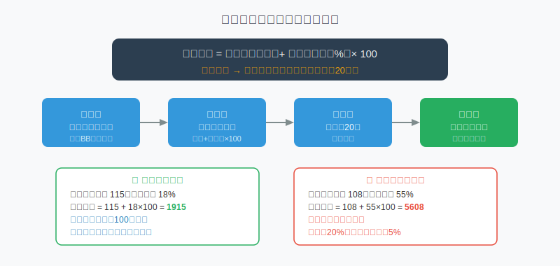
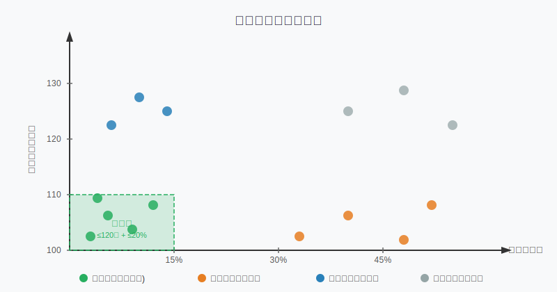

## 散户投资小白金融全品种操盘手册 - 6.4 双低策略 —— 低价格＋低溢价率，可转债最经典的组合拳
  
### 作者  
digoal  
  
### 日期  
2026-06-04  
  
### 标签  
金融产品 , 金融工具 , 散户 , 投资小白 , 全品操盘手册  
  
----  
  
## 背景 
    

## 先说一个让人难受的真相

很多人买可转债，看到价格低就买，比如 105 元、108 元，觉得"便宜，稳"。
但结果是：正股涨了 30%，手里的转债只涨了 8%。

问题出在哪？——**溢价率太高**。

价格低，但转股溢价率高达 60%，这张债和正股几乎"脱钩"了，股票的上涨根本传不进来。

光看价格，是买可转债最常见的半拉子误区。

真正经历过市场验证、被机构和高手反复使用的经典方法，叫做**双低策略**：同时盯住低价格和低溢价率，用一个分数综合衡量，选出性价比最高的那批转债。

---

## 双低策略是什么？一个分数搞定

双低策略的核心，是用一个叫"双低分数"的数字，把价格和溢价率合并在一起排名。

**公式：**

> **双低分数 = 转债价格（元） + 转股溢价率（%） × 100**

分数越低，说明这只转债越"双低"，越值得关注。

举个例子：

| 转债 | 价格 | 溢价率 | 双低分数 | 结论 |
|------|------|--------|----------|------|
| A 转债 | 115 元 | 18% | 115 + 18×100 = **1915** | 双低优质标的 |
| B 转债 | 108 元 | 55% | 108 + 55×100 = **5608** | 价低但溢价陷阱 |
| C 转债 | 135 元 | 5%  | 135 + 5×100 = **635**  | 溢价低但价格高 |

**A 转债**双低分数最优，同时具备债底保护和向上弹性。**B 转债**价格看起来便宜，但溢价率极高，股票上涨的收益根本传不进来，这是最常见的"便宜陷阱"。**C 转债**溢价率极低（几乎纯正股）但价格已高，风险暴露更大。

---

## 为什么两个维度缺一不可？

用图来看最清晰：

把所有可转债放进一个坐标系，横轴是转股溢价率，纵轴是转债价格：

- **左下角（绿色区域）**：低价格 + 低溢价率 → 双低区，首选
- **右下角（橙色）**：价格低但溢价率高 → 表面便宜，实际弹性差
- **左上角（蓝色）**：溢价率低但价格高 → 弹性好但下跌风险大
- **右上角（灰色）**：高价 + 高溢价 → 两头都暴露，最差

双低策略就是专门找绿色区域的那批标的。

### 第一性原理分析：这个策略为什么在理论上成立？

支撑"双低策略有效"成立需要以下前提：

**【前提清单】**

- **前提A：转债发行方有赎回压力**（常量）  
  上市公司发行转债的目的是让投资者转股，促进转股的动力不会消失。

- **前提B：低价提供债底安全垫**（接近常量）  
  100 元面值 + 到期兑付承诺，使低价转债有底部支撑，但如果公司出现信用风险，此前提动摇。

- **前提C：低溢价率意味着与正股高度连动**（变量）  
  溢价率低时，股票每上涨 1%，转债理论上涨幅接近 1%。但若股票持续走弱，溢价率可能被动拉高，连动效果减弱。

- **前提D：分散持有可以平滑个体违约风险**（变量）  
  持有 15~20 只双低转债，单一违约不影响整体，但若市场系统性信用收缩（如 2023~2024 年），多只同时出问题会造成集中回撤。

**【情景推演】**

| 情景 | 条件 | 结论 | 操作调整 |
|------|------|------|----------|
| 正常情景 | 四个前提全部成立 | 双低策略年化收益 13%~16%，夏普比超 1 | 按月调仓，持有最低 20 只 |
| 压力情景 | 前提C被推翻（正股持续下跌） | 转债跟跌但幅度小于正股，分数变化促使调仓 | 加强信用评级筛选，回避 BB 以下 |
| 极端情景 | 前提B+D被推翻（系统性违约） | 双低策略出现较大回撤（历史最大回撤约 12%） | 降低仓位，转向纯债型或货币基金 |

---

## 数据说话：双低策略的历史表现

这不是理论，有真实数据支撑：

**WIND 可转债双低指数（代码：889047.WI）2024 年度表现：**
- 年度收益率：**15.53%**
- 最大回撤：**8.73%**
- 收益风险表现排名：所有转债指数前列

（数据来源：申万固收研报，2025年1月）

**中信证券长期回测（2019年1月至2025年5月）：**
- 年化收益率：**13.63%**
- 夏普比率：**1.21**（夏普比率 > 1 通常被认为风险调整后收益良好）
- 最大回撤：**12.33%**

（数据来源：中信证券固收研报，2025年5月）

**集思录用户十年回测（2013~2023年）：**
- 年化收益率：约 **15.8%**，显著跑赢沪深300指数

失败案例同样存在。2023 年某转债因正股暴跌触发回售，导致策略阶段性回撤约 8.2%。2024 年可转债市场出现实质违约，部分低价转债信用风险暴露，最大回撤一度超出历史范围。这提醒我们：分散和信用筛选是双低策略的生命线，缺一不可。

---

## 实操例子：一个月 2 万元如何执行双低策略

**假设场景：**
- 可用资金：2 万元
- 市场环境：震荡市（2025年中，权益不确定性较高）
- 目标：持有 10~15 只双低转债，分散风险

**第一步：筛选数据来源**  
用集思录（jisilu.cn）→ 可转债专区 → 按"双低分数"排序（集思录已内置此计算）。

**第二步：剔除高风险券**  
排除评级为 BB 及以下的（信用评级可在同一页面看到）。排除上市不足 3 个月的新券（流动性太差）。排除正股已停牌或ST的。

**第三步：选取前 15 只**  
从剩余转债中选双低分数最低的 15 只，每只分配约 1300 元（总仓位 2 万元）。

**第四步：执行买入**  
在二级市场直接买入（证券账户场内交易），每只按市价买，注意确认成交量（成交额一天低于 500 万的小券谨慎，流动性太差）。

**第五步：每月调仓一次**  
下个月重新按双低分数排序，若持仓中某只转债因涨价或溢价率上升导致分数排名跌出前 20，则卖出换入新的最低分数转债。

**如果操作出错怎么办？**  
若因没有剔除信用风险券，买入了一只暴雷转债，单只最多损失约 1300 元（总资金 6.5%），不至于致命。这就是"分散持有"的安全网作用。

---

## 双低策略的失效条件：什么时候要暂停？

这个策略不是万能的，以下情况需要降低仓位或暂停：

**1. 转债市场系统性信用危机**  
2024 年初至中期，多家小盘公司转债出现实质违约，低价转债集体承压。此时需将评级门槛提高至 A+ 以上，缩减持有只数。

**2. 整体溢价率极度压缩（双低区域消失）**  
如果市场情绪过热，大量转债被炒高，双低区域的标的数量锐减至 10 只以下，说明市场估值偏贵，策略胜率下降。

**3. 正股市场极端熊市**  
权益市场长期下跌时，转债即便有债底，依然会承压，价格可能长期低迷甚至触发回售条款纠纷。此时持有比例不应超过总资产 20%。

---

## 可复用框架

**【双低筛选三步法】**

适用场景：震荡市或熊市中寻找兼具防守和弹性的可转债标的

核心逻辑：价格低提供债底保护，溢价率低保留股票上涨传导，两者同时满足时风险收益最优

操作步骤：
1. 打开集思录（或同类数据平台），筛选双低分数最低的 30 只转债
2. 剔除：信用评级 BB 以下、成交额过低（<500万/日）、正股 ST/停牌
3. 从剩余标的中选前 15~20 只，等权持有，每月末按分数重新调仓

举一反三：这个框架的"双维度综合打分"思路，也可以用于筛选红利 ETF（股息率 + 估值分位数）、债券基金（久期 + 信用等级）等其他品种的性价比排序。

---

## 本节行动清单

- [ ] **注册集思录账号**（免费），熟悉可转债双低分数排行界面
- [ ] **筛一次双低列表**，看看目前排名前20的转债，逐一检查评级和正股情况
- [ ] **计算一只你关注转债的双低分数**：价格 + 溢价率 × 100，看它在全市场排名大概多少
- [ ] **确认自己的风险承受**：双低策略历史最大回撤约 12%，持有 2 万元最多可能阶段性亏损约 2400 元，你能接受吗？
- [ ] **做一个小仓位模拟**：先用 3000~5000 元买 3~5 只双低转债，追踪一个月，感受调仓节奏

---

## 一句话总结

双低策略的本质，是同时买"便宜的价格"和"便宜的期权"——转债价格低，意味着债底保护好；溢价率低，意味着股票涨了你也能跟上。两个便宜同时满足，才是真正的性价比，缺一个都不算。

---

> ⚠️ **声明**：本文内容为投资教育目的，所有历史数据、策略框架均为辅助学习工具，不构成证券投资建议。可转债存在信用风险、流动性风险和市场风险，历史收益不代表未来表现。市场有风险，投资需谨慎。实际操作请结合自身风险承受能力，必要时咨询专业投顾。
  
  
#### [PostgreSQL 解决方案集合](../201706/20170601_02.md "40cff096e9ed7122c512b35d8561d9c8")
  
  
#### [德哥 / digoal's Github - 公益是一辈子的事.](https://github.com/digoal/blog/blob/master/README.md "22709685feb7cab07d30f30387f0a9ae")
  
  
#### [About 德哥](https://github.com/digoal/blog/blob/master/me/readme.md "a37735981e7704886ffd590565582dd0")
  
  

  
