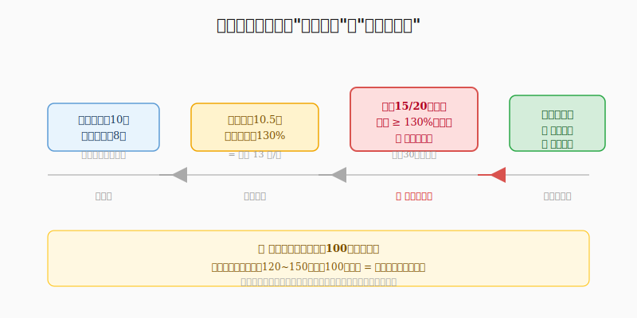
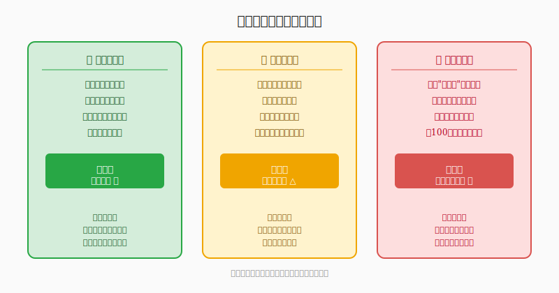

## 散户投资小白金融全品种操盘手册 - 6.5 强赎条款 —— 赚钱时最容易忽视的风险
  
### 作者  
digoal  
  
### 日期  
2026-06-04  
  
### 标签  
金融产品 , 金融工具 , 散户 , 投资小白 , 全品操盘手册  
  
----  
  
## 背景 
   

## 先问你一个问题

你买可转债，涨了30%，账面浮盈丰厚，你的第一个念头是什么？

大多数人的答案是："要不要再等等，说不定还能涨。"

但有一种情况，会让你"等等"的代价极其高昂——转债发出了**强制赎回公告**，而你浑然不知，继续抱着账面利润睡大觉，最终被按100元面值强制赎回，把本该到手的利润白白还给了上市公司。

这不是小概率事件。每年都有大量散户因为不了解强赎条款，在可转债最赚钱的时候，反而损失了大把利润。

---

## 强赎条款是什么？

"强赎"是"强制赎回"的简称，是上市公司写在可转债募集说明书里的一项权利。

用大白话说：**当正股（就是发行转债的那家公司的股票）价格涨得足够高、足够久，上市公司有权强制"买回"你手里的转债，结束这场游戏。**

典型的触发条件是这样的：

> 在转股期内，正股收盘价在任意连续30个交易日中，有不少于15个交易日的价格不低于当期转股价格的130%时，公司有权按照债券面值加当期应计利息的价格赎回全部或部分未转股的可转债。

翻译成人话：

1. **转股价**：比如10元，这是你可以把转债换成股票的基准价格
2. **130%门槛**：正股价格超过 10元 × 130% = **13元**
3. **连续30个交易日里有15天**满足上述条件，强赎被触发
4. 公司发出公告，给你30天（各家不同，看条款）来操作，之后就按**100元面值**强制赎回

问题在哪里？

如果你的转债此时价格在130元，强赎赎回价却只有100元（加一点点利息，大约100.几元），**你损失了将近30元的账面价值。**

这30元，本来是你赚到的利润。

---

## 第一性原理：上市公司为什么设计强赎条款？

理解强赎，先理解它存在的目的。

可转债本质上是上市公司的一种融资工具。公司发债募钱，最希望的结局是：债主们把债转成股票，不用还钱了，股本扩大，皆大欢喜。

但转债持有人（你）未必愿意主动转股——如果股价不够高，留着债拿利息也挺好。

强赎条款的逻辑就是：当股价已经高到让你转股可以获得丰厚收益时，上市公司给你一个期限，**"你要么赶紧转股，要么我按100元赎回，总之这债我要清掉。"**

这对上市公司有利：实现了"债转股"，不用还本金，还清空了负债表上的可转债。

【前提清单】
支撑"强赎条款对公司有利，对持有人是隐形风险"成立需要以下前提：

- **前提A：持有人不了解条款内容** → 【变量】→ 懂条款的人不受影响；不懂的人才会被动吃亏
- **前提B：强赎赎回价低于市价** → 【常量】→ 面值赎回基本上永远低于涨上去的转债价格
- **前提C：公告到截止日之间散户有足够时间操作** → 【变量】→ 一般30天，但若持有人完全不关注，30天也可能错过

【情景推演】

**正常情景（知道条款）：** 强赎公告一出，你第一时间看到，选择在市价附近卖出或转股，利润安全落袋。

**压力情景（看到公告但拖延）：** 你犹豫"再涨涨？"结果临近截止日，市场流动性变差，很多人都要操作，价格可能小幅下跌，但还是比100元高，还能赚，只是少赚了手续费和时机成本。

**极端情景（完全没注意公告）：** 截止日过后被动以约100元赎回，当时转债价格若在130元，损失30元/张，100张转债直接损失3000元。这是真实发生的场景，每年都有。

---

## 两个真实数据

**数据一：** 根据Wind数据统计（2023年），A股市场全年触发强赎的可转债超过100只，其中绝大多数在公告前30个交易日内，转债价格已显著高于130元。换句话说，强赎时往往正是转债最赚钱的时候。

**数据二：** 投资者教育研究显示，在可转债投资者中，明确了解"强赎赎回价为面值+利息"这一规则的比例不足40%——超过六成的持有人对这一关键条款并不清楚。（数据来源：中国证券投资者保护基金相关调查，2022年）

这意味着，每次强赎事件，都可能有相当比例的散户在账面浮盈最高时，却因为被动赎回而损失了大部分利润。

历史数据只反映过去，但强赎条款的规则不会改变，这个风险永远存在。

---

## 强赎的完整流程：从触发到结束

**第一步：正股价格持续上涨**

正股连续30个交易日中，有15天以上的收盘价超过转股价的130%。计时开始，但还没触发——只有满足计数条件后，公司才能选择是否行使权利。

**第二步：公司发布强赎公告**

公司在交易所公告，宣布将在某日之后、某日之前按"面值+应计利息"赎回全部未转股的可转债。这一公告会出现在：
- 交易所公告栏（上交所、深交所均可查）
- 你的证券账户的持仓公告推送（各家券商推送力度不同）
- 转债行情软件（例如集思录、可转债估值网等）

**第三步：赎回截止日前，你有三个选择**

| 选择 | 操作 | 结果 |
|------|------|------|
| 卖出转债 | 在二级市场按市价卖出 | 可以拿到市场价，通常远高于100元 |
| 转股 | 操作"可转债转股"，把债换成正股 | 获得相应股票，按转股价换算数量 |
| 什么都不做 | 截止日后被动赎回 | 按约100元/张拿回现金，损失溢价部分 |

绝大多数情况下，**卖出或转股都优于什么都不做**。具体选择卖出还是转股，取决于：你对后续正股走势是否看好，以及两种操作的价差和手续费对比。

---

## 实操例子：一张转债的强赎全过程

**场景设定：**
- 你持有XX转债100张，买入价格110元/张，共花11000元
- 当前正股价格稳步上涨，转股价10元，正股现价13.5元

**步骤一：识别强赎风险**

计算：13.5 ÷ 10 = 135%，已超过130%门槛。

打开集思录或交易所公告，查看"XX转债"是否已触发强赎计数，当前计数已到第18天（30天周期内）。

判断依据：还有约12个交易日，若正股维持高位，强赎公告可能近在咫尺。

行动：把"XX转债"加入关注列表，每天开盘前检查公告。

**步骤二：强赎公告发出当天**

公告确认：赎回截止日为30天后，赎回价格约101元（面值100元+0.8元利息）。

此时转债市场价格约132元（因为转股价值=13.5×100÷10=135元，略有折价）。

决策：132元卖出 vs 101元被动赎回，两者差31元/张，100张差额**3100元**。

**步骤三：选择操作方式**

方案A（卖出转债）：在市价132元附近挂单卖出100张，收回13200元，扣除手续费约3元，到手约13197元。

方案B（转股）：操作"可转债转股"，100张转债×100元面值=10000元，÷转股价10元=1000股正股。持有1000股，市价13.5元，市值13500元，手续费更低。但转为股票后，需承受后续正股波动风险。

方案C（什么都不做）：30天后收到101元×100张=10100元。

**对比：** 方案A或B相比方案C，多拿约3000元。

如果操作错误（选了方案C）：损失已确定，不可逆。正确纠偏方法是下次必须设置公告提醒。

---

## 可复用框架

**【强赎三步预警法】**

适用场景：持有可转债期间，正股出现明显上涨时

核心逻辑：强赎触发有时间过程，提前监控可以避免被动赎回

操作步骤：
1. **设门槛**：买入转债时，立刻记录转股价×130%，这是预警价格
2. **看计数**：正股超过预警价格后，每周查看集思录的"强赎计数"栏目，看已触发了几天
3. **看公告**：计数超过10天后，每天开盘前检查交易所公告，一旦发现强赎公告立即处理

举一反三：这个框架也可以用于关注"下修公告"（下修触发有类似的计数机制）、以及监控"回售触发"（正股大跌时的另一个条款风险）。

---

## 常见误区：赚钱时的思维盲区

**误区一："涨这么多，肯定还会涨，再等等"**

强赎条款不在乎你的期待。一旦公告发出，截止日就是截止日，不会因为你预期还会涨而延期。强赎本身不是坏消息——它是利润最高时出现的，但它是行动的信号，不是继续持有的理由。

**误区二："转债涨到130元以上，风险很高了吧？"**

不全是。130元以上并不一定马上强赎，关键是看计数有没有达到条件。有些正股反复在130%附近震荡，转债价格长期在130元以上也未必触发。但这并不代表可以放松警惕，而是要持续关注计数。

**误区三："被赎回就赎回，反正也赚了"**

买入110元，被100元赎回，不是赚了，是亏了10元/张。哪怕你买入价在100元以下，被赎回也不代表利润最大化——市价可能是130元，主动卖出是130，被动赎回是100，差距真实存在。

---

## 本节行动清单

1. **买入任何可转债之前，查清楚转股价**，计算出强赎价格门槛（转股价×130%），记录在自己的持仓备忘里

2. **在证券账户或集思录中，给持仓转债开启价格提醒**，当正股价格接近预警价格时自动通知

3. **每周至少一次**检查集思录"强赎计数"栏目，了解持仓转债的当前计数状态

4. **强赎公告发出后，当天行动**，不要等待，不要拖延，选择市价卖出或转股

5. **阅读持仓转债的募集说明书**（在巨潮资讯网可以查到），找到强赎条款原文，了解具体条件（各家略有差异，比如30天/15天 vs 连续20天等）

---

## 一句话总结

强赎条款是可转债投资中最典型的"赚钱时的陷阱"——了解它的人只需要一个及时的操作，不了解它的人会在账面利润最高时白白损失大把真金白银。

---

> ⚠️ **声明**：本文内容为投资教育目的，所有历史数据、策略框架均为辅助学习工具，不构成证券投资建议。市场有风险，投资需谨慎。实际操作请结合自身风险承受能力，必要时咨询专业投顾。
  
  
#### [PostgreSQL 解决方案集合](../201706/20170601_02.md "40cff096e9ed7122c512b35d8561d9c8")
  
  
#### [德哥 / digoal's Github - 公益是一辈子的事.](https://github.com/digoal/blog/blob/master/README.md "22709685feb7cab07d30f30387f0a9ae")
  
  
#### [About 德哥](https://github.com/digoal/blog/blob/master/me/readme.md "a37735981e7704886ffd590565582dd0")
  
  

  
