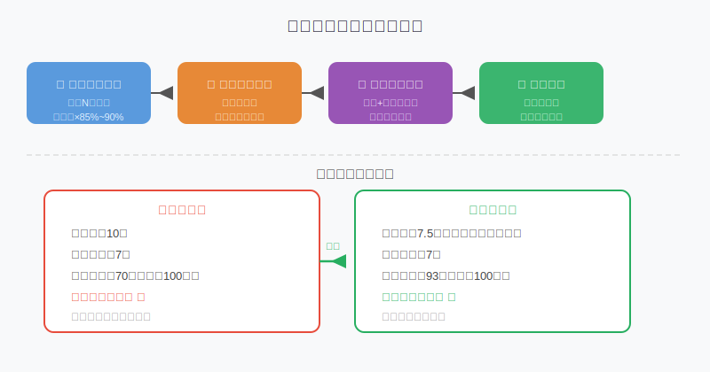
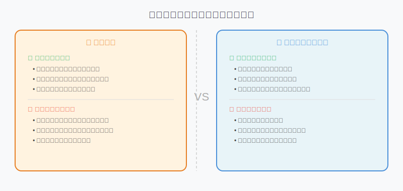
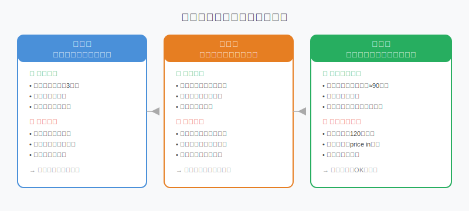

## 散户投资小白金融全品种操盘手册 - 6.6 下修条款 —— 为什么下修可能改善转债价值
  
### 作者  
digoal  
  
### 日期  
2026-06-04  
  
### 标签  
金融产品 , 金融工具 , 散户 , 投资小白 , 全品操盘手册  
  
----  
  
## 背景 
   

## 先给你看一个"起死回生"的故事

2022年，某上市公司的可转债从110元跌到了89元，眼看到了很多投资人的止损线，论坛上哀鸿遍野。

然后，公司公告了一条消息：**拟下调转股价格**。

三天后，这只转债从89元涨回了102元，持有者坐等了一波13.5%的收益，什么都没做。

下修条款，就是可转债里这根神奇的"弹射装置"。但它能不能弹出去、弹多高，取决于你对这个条款的理解深度。

---

## 什么是下修条款？

先从头说起。

可转债有个核心参数叫**转股价**（不懂可以回看第六章第3节），它决定了你可以用多少钱把转债换成股票。比如转股价10元，意味着面值100元的转债，可以换10股股票。

但如果发行转债后股价大跌到6元，转股价还是10元，谁愿意用10元换一只只值6元的股票？没人愿意，所以转债就变成了"大家都不转股的债"，公司最终得还钱。

这时候，**下修条款**就登场了。

**下修条款（向下修正转股价格条款）**，简单说就是：在满足某些条件后，公司有权主动把转股价格往下调，让转债重新具备转股吸引力。

---

## 触发条件长什么样？

每只转债的条款在发行时就写死了，一般长这样：

> "在任意连续三十个交易日中，有十五个或以上交易日的收盘价低于当期转股价格的85%，公司董事会有权提议向下修正转股价格……"

翻译成人话就是：正股价格在很长时间里持续低于转股价的85%（或90%，各家不同），公司可以考虑下修。

注意几个关键点：

1. **"有权提议"不是"必须"**：触发条件只是让公司获得提议资格，公司可以选择不动
2. **需要股东大会通过**：提议下修后，还要经过股东投票才能生效
3. **下修幅度有下限**：不能低于最近一期经审计的每股净资产，不能无限往下修

---

## 为什么下修能改善转债价值？

用数字说话最直观。

**下修前的情景：**

- 转股价：10元
- 正股现价：7元
- 转股价值 = (100 ÷ 10) × 7 = **70元**

面值100元的转债，转股只能得到70元的股票，转股亏30%，所以没人转股，转债在二级市场只能靠"债底价值"（纯债值约90元）苦苦支撑。

**下修后的情景（假设下修至7.5元）：**

- 转股价：7.5元
- 正股现价：7元
- 转股价值 = (100 ÷ 7.5) × 7 = **93.3元**

同样一张转债，转股价值从70元跳升至93元，距离100元只差7%，转债市场价格立刻跟着涨。

这就是下修的魔力：**转股价降低 → 转股价值提升 → 转债价格上涨**。

---

## 谁想下修，谁不想下修？

这是理解下修条款最关键的博弈逻辑。

### 公司什么时候想下修？

**核心逻辑：公司下修是为了逃避还钱的压力。**

可转债有一个与下修配套的"回售条款"（第七节会详细讲）：如果转债长期不转股，持有人在某些条件下可以强制要求公司以约定价格提前买回转债。这对公司来说等于被迫还债，非常难受，尤其是现金不充裕的公司。

所以，公司在以下场景下下修动机最强：

1. **回售压力临近**：再不下修，投资人就要回售了，公司赶紧降低转股价，诱导大家转股而不是回售
2. **公司现金流紧张**：还不起钱，就只能把债变成股，下修是"以股抵债"的工具
3. **大股东想拉抬股价**：转债压制股价时，下修后转股比例提高，股价有望反弹

### 公司什么时候不想下修？

1. **觉得股价会自然回升**：与其稀释股东权益，不如等股价反弹让大家自愿转股
2. **大股东不想被稀释**：下修后大量转债转成股票，大股东持股比例下降，这很敏感
3. **国有企业流程复杂**：国资背景的公司，下修要经过层层审批，效率低

### 作为持有人，你的利益呢？

下修对转债持有人通常是利好，但不是无条件的好事：
- 好：转股价值提升，转债价格涨
- 注意：如果下修后大量转债持有人立刻转股，正股股价可能被压制

---

## 第一性原理分析

**核心观点：下修会改善转债价值**

### 前提清单

- **前提A**：公司愿意下修（有动机） → **变量** → 若大股东强烈反对，结论变为：触发条件后公司选择不提议，转债价值不改善
- **前提B**：股东大会投票通过 → **变量** → 若转债持有人集体反对（认为转股价太高对自己不利），可能否决，但历史上否决案例极少
- **前提C**：正股基本面没有进一步恶化 → **变量** → 若下修的同时公司经营继续变差，下修只是短暂止血，转债价值仍可能下行
- **前提D**：公司信用评级不崩溃 → **常量（相对稳定）** → 高评级公司债底支撑更强，低评级转债下修后仍面临信用风险

### 情景推演

**正常情景**（前提全部成立）：股价持续低迷 → 公司主动下修 → 转股价值提升 → 转债价格上涨15%~25%，持有人获利

**压力情景**（前提A被推翻：公司不想下修）：触发条件达成 → 公司选择不提议 → 转债依靠纯债价值支撑 → 价格在90元附近横盘或缓慢下行；对应操作：检查回售条款，若有保底价格，仍有安全边际，持有等待

**极端情景**（前提C+D双崩：正股继续跌 + 信用评级下调）：下修也救不了，正股价值接近0，转债变成"垃圾债" → 对应操作：立刻止损出局，此时不能靠转股价值，要靠"腿"

---

## 数据佐证：下修公告后的市场表现

根据Wind数据统计（2019—2024年）：

- 上交所和深交所共发生可转债实质性下修事件约**320余次**
- 公告发布后**5个交易日内**，平均涨幅约**5.8%**
- 公告发布后**20个交易日内**，平均涨幅约**9.6%**
- 其中，下修幅度超过15%的案例，平均20日涨幅达**14.2%**

（数据来源：Wind资讯，2019—2024年可转债市场统计，历史数据不代表未来表现）

另外一组反面数据：
- 约**23%**的触发下修条件案例，公司最终选择不提议下修
- 提议下修后，约**8%**的案例因股东大会否决而未能生效

这两组数据告诉我们：**下修是大概率利好，但不是必然的**。

---

## 实操例子：如何用下修预期买入低价转债

**场景设定：**

你有5万元闲钱，想参与某只转债的下修博弈。以下是A公司可转债（代号：A某转）的情况：

- 当前转债价格：93元
- 当前转股价：12元
- 正股现价：8.5元
- 纯债价值：约88元（根据同期国债利率计算）
- 到期日：还有2年
- 距下修触发条件（正股需低于12×85%=10.2元）：已连续触发满15日，理论上已触发

**第一步：确认触发条件是否真实达到**

打开交易所公告，找到转债说明书，核实触发条件的具体定义（连续多少日、低于转股价的多少比例）。不能靠道听途说，要看原文。

确认：已连续25个交易日中有17日收盘价低于10.2元，触发条件成立。✅

**第二步：评估公司下修动机**

查看近期财报：公司经营现金流为-3200万元，账上货币资金2.1亿，转债存量3亿元，距回售日期还有14个月。现金储备勉强够还，但压力较大。

另外查到：本次转债不存在历史下修记录，大股东持股34%，前次股东大会出席率较低，下修决策难度中等。

**综合判断**：公司有下修动机，但不确定性中等。

**第三步：计算安全边际**

- 纯债价值：88元（最坏情况下的"托底"）
- 当前价格：93元
- 最大潜在亏损：93 - 88 = 5元，即5.4%（假设公司不下修，价格跌至纯债价值）

**但要注意**：如果公司信用出问题，纯债价值本身也会跌。所以需要先确认公司信用评级（此案例为AA，相对稳健）。

**第四步：制定买入和退出计划**

| 情景 | 操作 |
|------|------|
| 公告下修，转债涨至100元以上 | 分批减仓，保留部分博取继续上涨 |
| 公告不下修，价格回落至90元 | 减仓一半，降低仓位，等待下一次触发 |
| 价格跌破88元（纯债价值） | 全部止损出局，逻辑已破坏 |
| 持有超过3个月仍无动静 | 重新评估，关注回售条款是否激活 |

**第五步：执行**

用5万元分两批：今天买3万（93元，约322张），若价格跌至90元再买2万（约222张），平均成本约91.7元。

**如果判断错误（公司选择不下修）**：93元跌至88元，亏损约5.4%，共亏约2700元。这是可接受的损失，没有把全部资金押注在这个不确定事件上。

---

## 可复用框架

**【下修博弈三问框架】**

适用场景：低价可转债（价格80~100元区间）的买入决策

核心逻辑：下修是公司的主动选择，要判断"公司会不会动"，而不是"触发条件达没达到"

操作步骤：
1. **问有没有动机**：看回售压力、公司现金流、大股东态度
2. **问有没有能力**：看历史下修先例、转股价距底部空间、国资/民企背景
3. **问有没有安全边际**：看纯债价值和当前价格的差距，确认最大潜在亏损

举一反三：这个框架不只适用于可转债，同样可以用于分析公司回购股票（回购 = 股价的"下修逻辑"）、基金折价率（封闭式基金是否存在折价修复逻辑）

---

---

## 本节行动清单

1. **找一只低价转债（90~100元区间），查它的下修条款原文**：打开上交所或深交所官网，搜索该转债代码，找"债券说明书"，定位到"下修条款"相关段落，理解它的触发条件和下修幅度限制

2. **练习计算下修后的转股价值**：假设某转债转股价为X，正股现价为Y，下修至Z后，转股价值从 (100÷X)×Y 变成 (100÷Z)×Y，自己算一遍，确认你理解了逻辑

3. **用三问框架分析1~2只已触发下修条件的转债**：在集思录（jisilu.cn）或东方财富可转债板块，筛选出当前已触发下修条件但公司尚未公告下修的品种，逐一过三问框架

4. **建立下修观察清单，但不急于入场**：把符合三问框架的品种加入自选，先观察公司公告，等待信号明确后再做决策，避免提前博弈

5. **设置止损价**：买入前先把止损点写下来（通常是纯债价值附近），并承诺到达止损点就执行，不找理由扛单

---

## 一句话总结

下修条款是可转债里最精彩的博弈之一：公司有权降低转股门槛、诱导持有人转股来减轻还款压力，而这个动作同时带动了转债价格上涨——但它不是必然发生的，理解"谁想下修、谁不想"才是捕捉这个机会的核心能力。

---

> ⚠️ **声明**：本文内容为投资教育目的，所有历史数据、策略框架均为辅助学习工具，不构成证券投资建议。市场有风险，投资需谨慎。实际操作请结合自身风险承受能力，必要时咨询专业投顾。
  
  
#### [PostgreSQL 解决方案集合](../201706/20170601_02.md "40cff096e9ed7122c512b35d8561d9c8")
  
  
#### [德哥 / digoal's Github - 公益是一辈子的事.](https://github.com/digoal/blog/blob/master/README.md "22709685feb7cab07d30f30387f0a9ae")
  
  
#### [About 德哥](https://github.com/digoal/blog/blob/master/me/readme.md "a37735981e7704886ffd590565582dd0")
  
  

  
