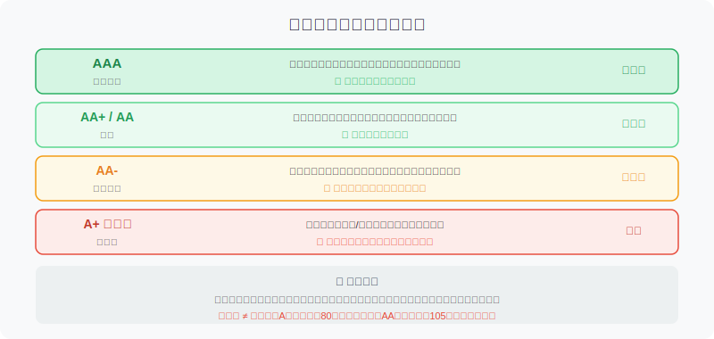
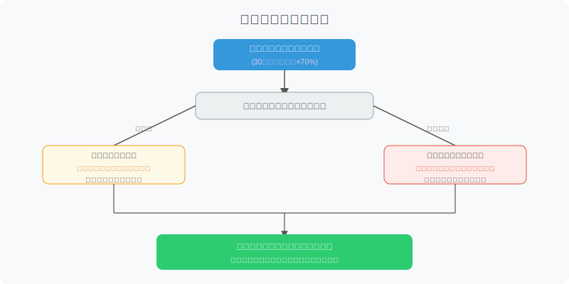

## 散户投资小白金融全品种操盘手册 - 6.7 回售、到期赎回、信用评级 —— 可转债的三道安全网与一个隐形地雷
  
### 作者  
digoal  
  
### 日期  
2026-06-05   
  
### 标签  
金融产品 , 金融工具 , 散户 , 投资小白 , 全品操盘手册  
  
----  
  
## 背景 
   


## 先问你一个问题

你买了一只可转债，股价一直在跌，跌了大半年，转股完全没意义。这时候，你是只能眼睁睁等着，还是有某种机制保护你？

答案是：**你有权利主动把债卖还给发行公司**。这叫**回售**。

但很多人持仓时根本不知道这个权利存在，等到窗口期过了才想起来——白白放弃了一个保护机制。

更少人知道的是：可转债还有一个结局叫**到期赎回**，到期时公司按约定价格把债买回去，大多数情况能拿到本金加一点利息。但如果你当初买在高价，到期赎回反而会亏。

最后一个话题是**信用评级**——这是衡量发行公司会不会违约、赖账的核心指标。低价不等于低风险，很多小白踩进A评级转债的坑，就是把"便宜"当成了"安全"。

这节我们把这三块内容彻底讲清楚。

---

## 一、回售：股价大跌时，你手里的那张"退票"

### 什么是回售？

回售（Put Option）的意思是：**在约定条件满足时，投资者有权利把可转债按约定价格卖回给发行公司**。

这是可转债"下有保底"逻辑的核心支撑之一。

打个比方：你买了一张旅行套票，但航班持续延误，套餐方同意：如果你等了足够久还没出发，你可以按原价把票退回去。回售条款就是可转债版本的"退票权"。

### 回售条件长什么样？

典型回售条款写法（各家略有不同，以下为常见格式）：

> 在本次可转债最后两个计息年度内，如果公司A股股票在任何连续三十个交易日的收盘价低于当期转股价格的70%，可转债持有人有权将其持有的可转债全部或部分按票面价值加上当期应计利息的价格回售给公司。

拆解一下：

- **"最后两个计息年度"**：通常是第5-6年，即到期前两年才能触发。早期跌破无法回售。
- **"连续三十个交易日"**：不是今天跌一下就触发，要连续30个交易日满足条件。
- **"低于转股价的70%"**：举例，转股价10元，则股价需低于7元才满足条件。
- **"按票面价值加当期应计利息"**：通常约定为100元本金加对应年度的累积利息，例如100元本金+约1元利息=约101元。

### 回售价格能保本吗？

**大多数情况能保住本金，但不能保住溢价买入的成本。**

如果你以100元买入，回售价约101元，基本回本。

如果你以120元买入，回售价仍约101元，你直接亏损约19元。

**这就是高溢价转债最危险的地方**——你以为买了"保护"，其实高价买入后，保护的底线远低于你的成本。

### 回售的操作时间窗口

回售条件触发后，**并非随时可以回售**，通常设有申报窗口期，超过窗口期则需等下一个触发周期（或等到期）。

**实操提示**：
- 条件触发后，留意发行公司公告
- 在规定的申报时间内，通过券商系统提交回售申请
- 错过窗口期意味着你需要等下一轮，而公司有可能在此期间通过"下修转股价"来避开你的回售权


### 公司的应对：下修转股价来规避回售

当回售条件快触发时，发行公司有一张牌可以打——**主动下修转股价**（详见第六节）。

逻辑是：转股价下修后，股价相对转股价的比例提高，可能不再满足"低于转股价70%"的条件，从而让回售条件重置或失效。

这对投资者来说是双刃剑：
- **好处**：下修提升了转股价值，债券内在价值回升
- **坏处**：你丧失了按回售价格退出的机会

**判断框架**：下修转股价后，评估新的转股价值是否让持有比回售更合算，再决定下一步行动。

---

## 二、到期赎回：最后的保底机制，但不是你想的那种保底

### 什么是到期赎回？

可转债期限通常为6年。**如果到期时还没有转股、也没有被回售，公司将按照发行时约定的到期赎回价格，把债券买回去**。这是强制的，公司无权拒绝。

到期赎回价格在发行时已写明，典型格式如下：

> 可转债到期后五个交易日内，公司将以本次可转债票面面值加当期应计利息（含最后一期利息）的价格赎回全部未转股的可转债。

以某债为例：
- 面值：100元
- 年利率：0.2%/0.4%/0.6%/0.8%/1.0%/1.5%（逐年递增）
- 6年合计利息：约5元
- 到期赎回价：约105元

听起来像是"至少能回本"，但有两个陷阱需要明白。

### 陷阱一：高价买入者到期亏损

如果你在110元买入这只转债，持有到期只能拿回105元，直接亏损5元（约4.5%），外加这6年期间你把钱锁死的机会成本。

**到期赎回保的是面值附近的本金，不是你的买入成本。**

### 陷阱二：机会成本巨大

可转债6年最终到期收益仅约5%，年化不到1%。如果这6年间你一直持有不动，而公司股价既没涨到触发转股、也没跌到触发回售，你的钱就被锁住几乎"白放"了6年。

**这是"持有到到期"最真实的样子**——不是保本，而是低收益+高机会成本。

### 到期赎回的意义是什么？

**它的真正意义是给你提供兜底线**：哪怕公司股票表现极差，只要公司不违约，你的损失有上限。这条线的具体位置取决于你的买入价。

对于买入价格在90-100元之间的投资者，到期赎回约等于本金保全（含少量利息）。

对于买入价格超过110元的投资者，到期赎回是实质性亏损。

---

## 三、信用评级：最容易被忽视、最不应该被忽视的指标

### 为什么要看信用评级？

可转债的核心保护之一是"纯债价值"（即把这张债当普通债券来看的价值）。但纯债价值成立的前提是：**发行公司能还得起钱**。

如果公司破产、债务违约，纯债价值归零，回售权归零，到期赎回归零。你手里的可转债可能一文不值。

信用评级就是专业机构对这个问题的评估结论。

### 评级的含义

目前A股可转债信用评级由中诚信、联合资信、鹏元等评级机构出具，常见评级从高到低为：

| 评级 | 含义 | 违约概率 |
|------|------|----------|
| AAA | 偿债能力极强 | 极低 |
| AA+ | 偿债能力很强 | 很低 |
| AA | 偿债能力强 | 低 |
| AA- | 偿债能力较强，有轻微不确定性 | 低但需关注 |
| A+ 及以下 | 偿债能力一般或较弱 | 明显上升 |

根据Wind数据（2024年），A股可转债历史违约案例中，AA-及以下评级占绝大多数，而AAA/AA+级转债违约记录极少。



### 信用评级的三个局限性

**1. 评级是滞后的**

评级机构通常在财务恶化已经明显后才调整评级。市场往往先于评级下调反应——股价和债价已经跌了，评级才跟着下调。

**2. 评级是静态的，公司是动态的**

一家公司今天是AA级，6年后可能降至A级甚至违约。评级只能反映当前财务状况，不能预测未来。

**3. 同评级内部分化大**

同样是AA级，一家国企背景的AA和一家民营制造业的AA，风险天差地别。要结合股东背景、行业属性、财务质量综合判断。

### 评级调整：跟踪信号

**需要警惕的信号**：
- 评级展望从"稳定"改为"负面"（往往是下调前兆）
- 主体评级发生下调（债券价格往往随即下跌）
- 公司业绩大幅亏损、现金流持续恶化
- 重大股东质押或减持

**信息获取方式**：
- 发行公司的转债公告（交易所官网可查）
- 评级机构官网（中诚信、联合资信等）
- 投资者关系公告（公司IR页面）

---

## 四、第一性原理分析：三道安全网各自的前提

### 核心观点：可转债的安全性依赖发行人的偿债能力

```
【前提清单】
支撑"可转债下有保底"成立需要以下前提：
- 前提A：发行公司有能力在到期时偿还债务 → 【变量】→ 若公司违约，到期赎回和回售均失效
- 前提B：公司在回售窗口期能够履行回售义务 → 【变量】→ 若资金紧张，回售流程可能被拖延
- 前提C：投资者的买入价格接近面值 → 【变量】→ 若高溢价买入，"保底"价格远低于成本

【情景推演】
正常情景（前提全部成立）：
  - 股票涨了→转股赚钱；股票跌了→回售保本；股票横盘→持有到期回本+少量利息
  
压力情景（前提A被挑战）：
  - 公司信用评级下调，纯债价值下移，市场价格随之下跌
  - 对应操作：出现评级下调预警时，优先止损出场，不要等回售窗口
  
极端情景（前提A+B被推翻）：
  - 公司违约/破产，回售和到期赎回均无法履行
  - 对应操作：持仓可能大幅亏损，参与债务重组程序；核心教训是避免持有低评级转债
```

---

## 五、实操例子：如何综合评估一只转债的出路

**假设场景**：
- 可用资金：5万元
- 持仓：某AA评级民营制造业转债，买入价102元，现价95元
- 距到期：还有2年（处于最后两个计息年度）
- 当前股价：6.5元
- 转股价：10元（6.5/10 = 65%，低于70%）
- 公司最新动态：暂无下修公告

**分析步骤**：

**第一步：确认回售条件是否已触发**

股价6.5元 ÷ 转股价10元 = 65%，低于70%触发线。需要查询：这个状态是否已持续30个交易日？

→ 打开交易所公告，搜索"回售""可回售"，确认公司有无发出回售条件触发公告。

**第二步：查看公司是否有下修计划**

→ 查看近期公告，若无下修，则回售条件保持有效。

**第三步：计算回售价格与当前损益**

假设回售价为100+1.5元（含利息）= 101.5元
买入价102元，回售收回101.5元，亏损约0.5元。

→ 对比：持有到期赎回价约105元，但还有2年等待时间，期间存在不确定性。

**第四步：评估信用风险**

→ 查看公司最新财报：营收、利润、现金流是否稳定？有无负债率大幅提升、评级展望变化？

→ 若财务稳健：可选择持有等到期赎回（105元）或等回售窗口处理（101.5元）。
→ 若财务出现恶化信号：立刻通过二级市场卖出，不要寄希望于回售或到期赎回。

**如果判断有误，会发生什么？**

- 若高估了公司偿债能力，等到评级下调，债券价格可能跌至85元以下，届时回售和赎回能力均受质疑，损失更大。
- **纠偏方法**：一旦出现评级下调或重大财务负面事件，优先在二级市场卖出，不要"等保底"。

---

## 六、可复用框架

```
【三看框架】（用于持仓可转债的定期检查）

适用场景：每季度对持仓可转债做一次健康检查

核心逻辑：可转债的价值由转股路径、债底保护、信用质量三个维度决定

操作步骤：
  1. 看转股路径：当前股价 vs 转股价，溢价率是在缩小还是扩大？
  2. 看债底保护：到期收益率是否为正？回售条件是否触发/即将触发？
  3. 看信用质量：最新财报是否正常？有无评级下调预警？

举一反三：这个框架也可以用在债券基金的持仓审查中，以信用质量作为核心筛选维度。
```

```
【回售申报操作流程】

适用场景：回售条件触发，准备行使回售权

核心逻辑：回售是有期限的权利，错过窗口等于主动放弃保护

操作步骤：
  1. 关注持仓转债的公告（微信订阅号、交易所官网）
  2. 看到"回售条件触发"公告后，记录申报起止日期
  3. 在申报日期内，通过券商APP找到对应可转债的"回售申报"功能
  4. 提交申报，确认回售价格和到账时间
  5. 申报后不可撤回（部分平台有撤回期），注意规则

举一反三：上市公司对融资有主动权，回售期往往是博弈窗口，下修公告往往在回售窗口前出现，留意节奏。
```



---

## 七、本节行动清单

- [ ] **查持仓转债的到期日和回售条款**：登录持仓转债的招募说明书（在基金公司官网或上交所/深交所可下载），找到"回售条款"和"到期赎回价格"具体约定
- [ ] **建立买入价格 vs 回售价/赎回价的对比表**：每只持仓转债，算一遍：我买入价是多少，回售价多少，到期赎回价多少，亏损空间多大
- [ ] **设置公告跟踪提醒**：在证券软件或交易所APP里订阅持仓转债的公告，关键词：回售、下修、评级
- [ ] **核查持仓转债信用评级**：确认每只持仓转债当前评级，AA-及以下的转债，重点追踪财报和评级展望
- [ ] **制定信用恶化止损线**：一旦评级下调或出现重大财务负面信号，不等回售窗口，在二级市场优先止损

---

## 一句话总结

回售是你在股价大跌时的"退票权"，到期赎回是6年到期的"最低保障"，信用评级决定了这两张保障是否可信——三道安全网都有价格前提，高溢价买入会让安全网变成摆设。

---

> ⚠️ **声明**：本文内容为投资教育目的，所有历史数据、策略框架均为辅助学习工具，不构成证券投资建议。市场有风险，投资需谨慎。实际操作请结合自身风险承受能力，必要时咨询专业投顾。历史数据参考：Wind数据2024年、上交所/深交所可转债信息披露规则。
  
  
#### [PostgreSQL 解决方案集合](../201706/20170601_02.md "40cff096e9ed7122c512b35d8561d9c8")
  
  
#### [德哥 / digoal's Github - 公益是一辈子的事.](https://github.com/digoal/blog/blob/master/README.md "22709685feb7cab07d30f30387f0a9ae")
  
  
#### [About 德哥](https://github.com/digoal/blog/blob/master/me/readme.md "a37735981e7704886ffd590565582dd0")
  
  

  
