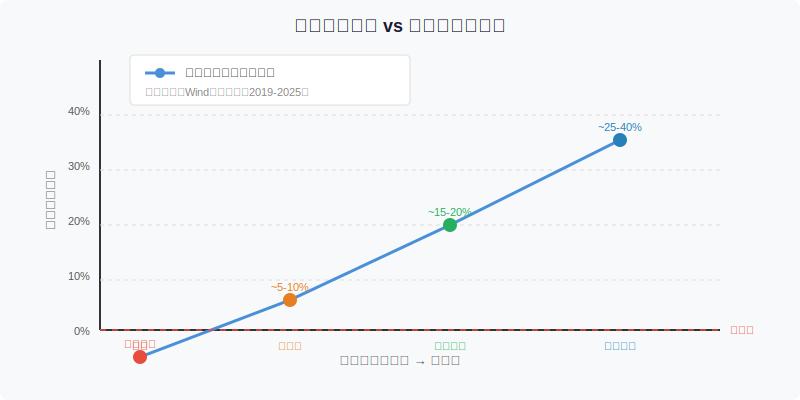
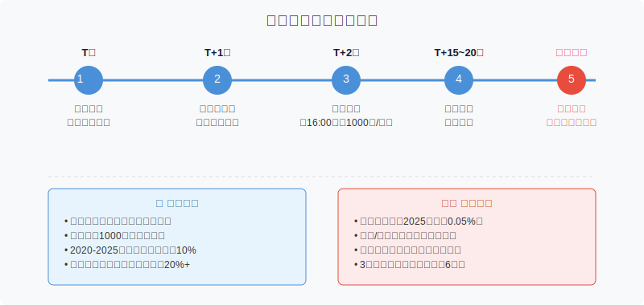

## 散户投资小白金融全品种操盘手册 - 6.8 新债申购 —— 收益想象与破发风险
  
### 作者  
digoal  
  
### 日期  
2026-06-05   
  
### 标签  
金融产品 , 金融工具 , 散户 , 投资小白 , 全品操盘手册  
  
----  
  
## 背景 
   

## 先问你一个问题

如果有一种投资，不用提前备钱、申购免费、中签再交钱，而且历史上大多数情况下两三周就能赚10%到30%，你会天天去参与吗？

大概率会。

但问题来了：如果这种投资，在某些时候会直接亏钱，而且你用一个账户最多只能"抽一次签"，中签概率有时候低到连0.05%都不到，每年到手的收益加起来也就一部红米手机的价格……

你还觉得它是"躺赚神器"吗？

这就是新债申购的真实面目：不是骗局，但也没有想象中那么美。本节把它讲清楚——**什么时候值得打，什么时候破发亏钱，以及不适合谁。**

---

## 新债申购是什么？

**可转债打新（新债申购）= 用一个证券账户，免费参与新发行可转债的抽签，中签后缴款，等上市后卖出赚差价。**

打个比方：上市公司要发行一批面值100元/张的债券，但市场觉得值110元甚至120元，于是大家争着抢购。交易所把名额用摇号分配，你申请参与，但不用先打钱，中了才交钱。上市后，债券开盘如果价格高于100元，你就赚了差价。

关键机制：

- **面值100元/张**，最小申购单位1手=10张=1000元
- **申购时不占用资金**，中签后T+2日才缴款
- **每个账户只能申购一次**，顶格申购100万元（顶格意义在于增加"配号数量"，从而提高中签概率，但每次最多中1手）
- **从申购到上市，通常2到4周**，资金占用时间短

---

## 为什么大家觉得它能赚钱？

数据说话。

根据Wind统计，**2020年至2024年上市的可转债，首日破发率低于10%，多数新债上市首日涨幅在10%到30%之间**。2025年市场回暖后，部分新债首日涨幅甚至超过20%。

换算成单签收益：中1签=花1000元，首日涨20%就能拿到200元左右的利润，折合年化收益相当高。

而且这个操作几乎没有"机会成本"——申购免费，中不了就当没这回事，中了才交钱，上市首日卖掉，资金重新空出来参与下一只。

听起来确实美。

那问题出在哪里？

---

## 三个被忽视的真相

### 真相一：中签率极低，一年到手没多少

打新债不是"只要申购就能赚"，首先得中签。

根据统计，**2025年和2024年可转债平均中签率均低于0.05%**，比2023年的0.34%还大幅缩水，主要原因是：新债发行数量减少，但参与打新的账户数量不减反增。

用通俗的话说：僧多粥少。一百万人抢，最后中签的就几百个人。

按2023年稍好的数据，**全年每个账户平均中签5到8次，每次收益约100到300元，全年总收益大概1000到2000元**，相当于"白捡一部红米手机"。这个收益不难看，但也不是致富路径。

**结论：打新债适合"攒羊毛"，不适合作为主力收益来源。**

---

### 真相二：破发是真实存在的，且跟市场行情强挂钩

很多人以为新债申购是"稳赚"，其实不然。

历史上，破发并非个例：
- **2018年熊市期间**，多只可转债上市即破发，面值100元的债券开盘跌到94到97元，1000元买进亏掉30到60元
- **2024年9月**，万凯转债上市首日开盘即破发报95元，成为当年首只上市当天跌破100元面值的转债
- 从规律上看，**发行规模越大、评级越低、正股表现越差的债，破发概率越高**

破发的本质原因：可转债的定价依赖正股（发行公司股票）的预期，如果市场整体下跌，正股跌破转股价，债的"股票属性"就失去价值支撑，债价自然跌破面值。

---

### 真相三：弃购有惩罚，中签必须付钱

很多人忽略了一个规则：

**中签后如果不缴款（弃购），连续12个月内累计出现3次，将被禁止参与新股和新债申购，限制期长达6个月。**

这意味着：你不能"中了感觉不划算就不要了"。如果行情突然变差，破发概率上升，你已经中签，只有两个选择：
1. 缴款认购，上市后若破发承担亏损
2. 弃购，计入弃购次数，累积3次就丧失申购资格

所以，**打新债之前要确认账户里有几千元的备用金**，万一中签能立刻缴款。

---

## 新债申购全流程

以下是完整的操作步骤，具体到每一步：

**第一步（T日，申购日）**

- 提前在券商APP开通"可转债交易权限"（新账户需先满足：持有账户20个交易日以上、完成C3级风险评估）
- 当天通过券商APP找到"新债申购"入口，输入申购代码，**选择顶格申购，金额填100万（无需账户真实有100万）**
- 申购时间：09:30至11:30，13:00至15:00
- 提交申请，界面提示"申购成功"即完成，不占用任何资金

**第二步（T+1日，中签公布）**

- 登录券商APP，在"新股/新债中签"里查看是否中签
- 中签会有短信或APP推送提醒
- 未中签：本次结束，不需要任何操作

**第三步（T+2日，缴款日）**

- 确认中签后，确保账户内有至少1000元现金
- 系统通常会自动扣款，但需在16:00前确保账户资金充足
- 未及时缴款=弃购，计入违规次数

**第四步（T+15至T+20日前后，等待上市）**

- 债券到账，可在持仓看到
- 此阶段正常持有等待，不可提前卖出

**第五步（上市首日，卖出决策）**

- 上市当天可在二级市场正常买卖
- 常规策略：开盘直接以市价卖出，锁定利润
- 若看好正股长期走势，也可继续持有，按转债逻辑管理（详见第六章其他节）

---

## 【第一性原理分析】：打新债凭什么赚钱？

**核心逻辑**：可转债的发行定价（面值100元）通常低于其实际理论价值（转股价值+债底价值），这个"折扣"在上市后被市场填平，申购者赚的就是这段"价差回归"的钱。

**支撑这个逻辑成立，需要以下前提：**

| 前提 | 性质 | 说明 |
|------|------|------|
| 正股股价高于或接近转股价 | 变量 | 正股大跌会让转股价值崩塌 |
| 市场有足够资金接盘 | 变量 | 熊市资金撤退，流动性消失 |
| 债券评级尚可，无违约风险 | 变量 | 低评级债信用溢价被放大 |
| 申购规模不过于巨大 | 变量 | 大盘债上市套现压力大 |

**情景推演：**

- **正常情景**（正股平稳、市场流动性好）：上市首日溢价10%至20%，申购有效
- **压力情景**（正股跌幅10%+、市场震荡）：上市首日可能平开或微涨，收益缩水至5%以内
- **极端情景**（正股跌破转股价、市场恐慌）：上市破发，持有亏损，应在首日止损卖出，不扛单

---

## 破发风险怎么提前判断？

并非每只新债都值得参与，申购前可用以下框架快速评估：

**快速评估四维度（每次申购前30秒看一眼）：**

**维度一：发行规模**

规模越大，上市后抛售压力越大。一般来说：
- 发行规模小于5亿元：相对安全
- 5亿至20亿：中等
- 超过20亿（尤其银行类大规模转债）：破发概率明显上升

根据历史数据，**非金融行业小规模转债上市首日破发较为罕见，大规模转债破发相对集中**（如2024年万凯转债发行规模近13亿，上市即破发）。

**维度二：正股走势**

申购日前一周，看看发行公司的股价：
- 股价在转股价附近或以上：偏安全
- 股价明显低于转股价：危险信号，转债失去股票属性

**维度三：信用评级**

AA及以上评级的转债，到期偿还风险低，债底支撑稳；AA-以下要谨慎。

**维度四：整体市场环境**

大盘处于上升趋势时，申购胜率显著高于震荡市或熊市。"924"新政后（2024年底至2025年初），市场回暖期新债首日涨幅明显改善，破发现象基本消失。

---

## 实操例子：两个真实场景对比

### 场景A（成功案例，牛市环境）

**背景**：2025年初，某小盘科技公司发行4亿元可转债，正股近期上涨，发行评级AA。

**操作**：
1. T日开盘后打开券商APP，搜索该转债申购代码，顶格申购，提交
2. T+1日收到短信：中签1手，需缴款1000元
3. T+2日检查账户余额，自动扣款完成
4. T+17日，转债上市，开盘价122元
5. 直接以122元市价卖出10张，到账1220元，净赚约220元（扣除手续费后）

收益率：22%。资金占用约17天（实际只有最后缴款后2周）。

---

### 场景B（破发案例，需止损）

**背景**：2024年9月，某化工企业发行13亿元大规模可转债，发行前正股已跌10%，市场处于震荡状态。

**操作失误**：忽视规模大、正股下跌的预警信号，正常打新中签。

**结果**：
- T+2缴款1000元
- 上市首日开盘价93.8元，已破发
- 错误操作一：认为"会涨回去"，继续持有
- 错误操作二：越跌越加仓，以88元再买了2手

**正确做法应该是**：
1. 上市前发现发行规模大+正股下跌，主动评估破发风险
2. 上市首日确认破发（开盘低于100元），当日止损卖出，亏损控制在62元（100-93.8）×10张
3. 不扛单，不幻想反弹，接受"这次中签亏了"的事实

**教训**：打新债不等于稳赚。破发时的止损比侥幸持有更重要。

---

## 可复用框架

### 【打新四看框架】

**适用场景**：每次遇到可转债申购，申购前快速评估要不要参与

**核心逻辑**：打新债的收益来自发行折价，破发来自市场承接力不足，所以在申请前先判断"市场能不能接住这只债"

**操作步骤**：

1. **看规模**：发行总额小于10亿优先参与，超过20亿保持谨慎
2. **看正股**：申购日前正股价格与转股价的比值，越高越好（>1.1为优）
3. **看评级**：AA以上正常参与，AA-以下需结合规模和正股决定
4. **看大盘**：大盘近1个月上涨→积极参与；大盘近1个月下跌超5%→谨慎参与

**四项都好**：积极申购，上市首日开盘卖出  
**一项有问题**：参与但设好心理止损位（上市首日若低于97元即卖）  
**两项以上有问题**：放弃本次申购

**举一反三**：这个框架同样适用于判断二级市场上"刚上市不久的新债要不要买入"，逻辑完全一致

---

### 【打新日历管理法】

**适用场景**：长期参与打新，避免遗漏和弃购惩罚

**操作步骤**：

1. 每天09:00前检查一次券商APP的"新债申购"入口，有就申购，没有就跳过（全程1分钟）
2. 在手机日历里记录"申购成功"的日期，T+1设提醒"查看是否中签"
3. 中签后立刻确认账户余额足够（留3000元备用金即可）
4. 上市首日开盘后10分钟内完成卖出

---

## 打新债不适合谁？

以下几类人参与打新债要特别谨慎：

1. **账户里没有3000元以上备用金的人**：中签后没法缴款，弃购三次就被踢出局
2. **没有时间盯盘的人**：上市首日的卖出时机很关键，第一天不卖，后续涨跌难预测
3. **只图"躺赚"，不愿意学基本判断的人**：破发的债你一样可能申购到，不经过任何筛选就参与，亏损概率不低于收益
4. **期望年化高收益的人**：每年到手也就1000到2000元，这不是发财路，是"捡零钱"

---

## 本节行动清单

- [ ] 打开券商APP，检查自己的账户是否已开通"可转债交易权限"，没有就去申请
- [ ] 确认账户内长期保有至少3000元备用金，专门用于中签缴款
- [ ] 每天用1分钟检查有没有新债申购，有就顶格申购
- [ ] 申购后在手机日历设提醒，T+1查中签，T+2确认缴款
- [ ] 记住打新四看框架，每次申购前30秒做一遍快速评估

---

## 一句话总结

**新债申购是小白可以参与的低门槛"捡零钱"操作，但不是稳赚的无脑策略——牛市赚得多，熊市可能破发，关键是要会筛选和止损，而不是闭眼全申购。**

---

> ⚠️ **声明**：本文内容为投资教育目的，所有历史数据、策略框架均为辅助学习工具，不构成证券投资建议。市场有风险，投资需谨慎。实际操作请结合自身风险承受能力，必要时咨询专业投顾。
   
  
#### [PostgreSQL 解决方案集合](../201706/20170601_02.md "40cff096e9ed7122c512b35d8561d9c8")
  
  
#### [德哥 / digoal's Github - 公益是一辈子的事.](https://github.com/digoal/blog/blob/master/README.md "22709685feb7cab07d30f30387f0a9ae")
  
  
#### [About 德哥](https://github.com/digoal/blog/blob/master/me/readme.md "a37735981e7704886ffd590565582dd0")
  
  

  
