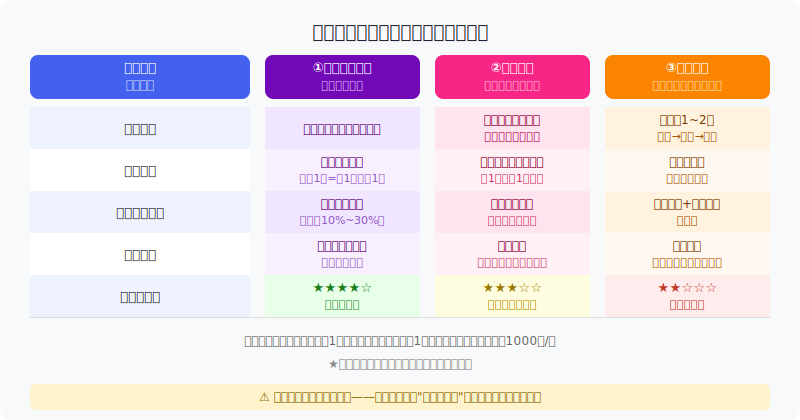
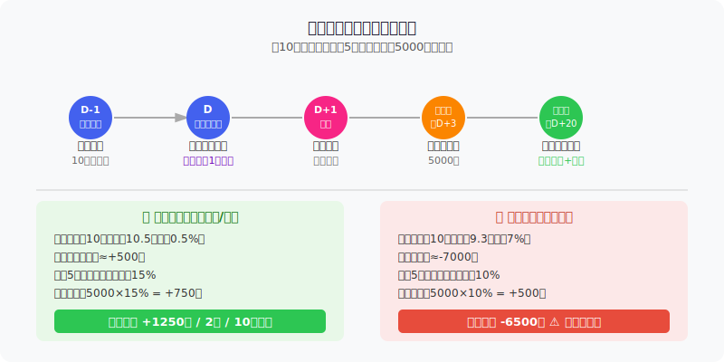
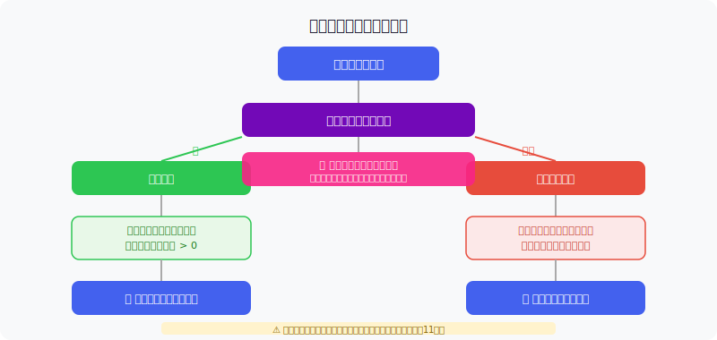

## 散户投资小白金融全品种操盘手册 - 6.9 配债策略 —— 为什么不适合所有小白
  
### 作者  
digoal  
  
### 日期  
2026-06-05   
  
### 标签  
金融产品 , 金融工具 , 散户 , 投资小白 , 全品操盘手册  
  
----  
  
## 背景 
   
  

## 你以为自己发现了一个"免费午餐"

2024年某段时间，网上流传着一个"必赚"说法：

> "持有某公司股票，就能在它发可转债时优先配到，上市当天卖出，稳赚。"

听起来很美。但你有没有想过：如果真这么稳，为什么机构不把这个策略用穷？

配债策略有其合理的参与空间，但它绝不是"稳赚"，更不是"所有散户都应该做"的默认操作。这一节我们把三种参与方式拆开来讲，让你弄明白自己是不是真的适合参与。

---

## 先搞清楚：什么叫"配债"

可转债发行时，上市公司有义务**优先向原有股东配售**。

规则很简单（以A股主流为例）：

- **沪深两市**：股权登记日收盘时，每持有1股正股，可以优先认购1元面值的可转债
- 可转债每张面值1000元，所以要配到1张，你需要持有至少1000股正股
- 你可以选择认购，也可以放弃——配额是你的权利，不是义务

举个例子：某公司发行可转债，股权登记日你持有2000股，你就有资格认购2000元面值（即2张）的可转债，需要缴款2000元。

---

## 三种参与姿势

配债策略实际上有三种玩法，风险完全不同：

### ①网上申购打新（最适合小白）

跟打新股类似。在发行期间，用任何证券账户申请认购，系统抽签，中签了才缴款买入。

**特点：**
- 资金几乎零占用（申购无需冻结资金，中签后才缴款）
- 参与门槛低，无需持有该公司股票
- 中签概率与持有市值挂钩（不同券商略有差异）
- 上市后如果跌破100元面值，可以立刻卖出止损

**历史数据参考：** 2020年至2024年，可转债新债上市首日破发率整体低于10%，多数新债上市首日涨幅在10%~30%之间（数据来源：新浪财经2025年5月28日报道），但2024年个别大规模发行的转债（如万凯转债）出现首日破发6.3%的情形。

**结论：打新申购是三种方式中风险最低、最适合小白的参与姿势。**

---

### ②持股配售（中等适合）

如果你本来就持有某家公司股票，碰上它发转债，可以用手上的股票资格去配售新债。

**特点：**
- 不需要额外买股，用现有持仓的"权利"换新债
- 配债上市后通常能获得一定涨幅，等于持股之外额外有收益
- **核心风险在于正股本身**：你买股票的逻辑必须成立，配债只是锦上添花

**适合人群：** 已经看好某家公司并持有正股的投资者，配债作为"顺手"操作，而不是"为了配债而持股"。

⚠️ 如果你持有正股亏损，不建议因为"还有配债收益"就继续持有——配债溢价通常是几百元，正股跌一个跌停板就是十几个配债收益。

---

### ③抢权配售（不推荐新手）

这个玩法更进一步：**提前买入正股，拿到配债资格，第二天卖出正股，等转债上市后卖出**。

看起来只持有正股一两天，风险好像很小。但这是最危险的误解。

**风险在哪里？**

参考2025年6月一个真实案例：某投资者在股权登记日前买入正股，配债上市赚了230元，但正股当天开始大跌，两天卖出时亏了超过1800元，净亏超过1500元。

原因很简单：

- 你持有正股的期间，是市场消息最敏感的时候（发债公告刚出来，各路资金可能借机出货）
- 正股跌1%可能就抹掉全部配债收益
- 正股跌5%~10%，配债收益完全覆盖不了亏损

用第一性原理拆解这个策略的前提：

**【前提清单】**

| 前提 | 类型 | 说明 |
|------|------|------|
| 持股1~2日内正股不大跌 | **变量** | 无法保证，尤其遇到大盘系统性下跌 |
| 新债上市首日高于面值 | **变量** | 历史大多数如此，但2024年有破发案例 |
| 配债比例足够高 | **变量** | 取决于公司配债规模和持股数量 |
| 交易成本可忽略 | **基本稳定** | 双边手续费，实际也会侵蚀部分收益 |

**【情景推演】**

- 正常情景（前提全部成立）：持股1~2日期间横盘，新债上市涨15%，10万持股配5张（5000元面值），总收益约750元
- 压力情景（正股跌3%）：股票亏3000元，配债收益750元，净亏约2250元
- 极端情景（遇到大盘暴跌，正股单日跌7%）：股票亏7000元，配债收益可能只有500元，净亏约6500元

---

## 持股配售：正确姿势是什么

持股配售最容易犯的错误有两类：

**错误一：看到配债公告，就决定去买正股**

这本质上就是抢权配售，风险如上所述。

**错误二：因为有配债，不愿意卖已经亏损的正股**

典型的"沉没成本"陷阱。配债能给你额外几百元收益，但这不应该成为你继续持有亏损股票的理由。

**正确姿势：**

1. 你持有正股，是因为你看好这家公司的基本面
2. 碰上发转债，是额外的收益机会，不是主逻辑
3. 是否认购配债，看你是否有闲置资金（认购需要另外缴款），以及对转债上市后价格的判断
4. 缴款前，看一下当前正股价格和转债二级市场情绪，如果已经上市的同类转债估值很低，可以考虑放弃认购

---

## 实操例子：手把手走一遍

**场景设定：**
- 你持有A公司股票2000股，成本7元/股，现价7.5元，持仓市值1.5万元
- A公司公告发行可转债，股权登记日：下周三
- 你有资格配售2000元面值（2张）可转债

**第一步：**确认你的配债资格。在App里找"可转债—优先配售"页面，确认截止日期和配售数量。

**第二步：**评估是否缴款认购。你需要额外拿出2000元认购这2张转债。考虑两点：
- 这家公司的基本面是否支持转债上市后高于面值？（简单看：正股最近是涨是跌？）
- 2000元对你来说是否是闲置资金，不影响其他操作？

如果两个都是YES，则参与认购。

**第三步：**缴款日（通常在股权登记日后3~5个工作日），在App里确认认购，完成缴款。

**第四步：**等待上市（通常20天左右）。上市当天登录账户，查看转债价格。
- 如果上市价格在110元以上，可以考虑当天卖出锁定收益（每张赚100元，2张赚200元）
- 如果上市价格在100~105元之间，可以继续持有等待正股上涨推动转债上涨
- 如果上市即破发（低于100元），判断是否是系统性下跌导致，如果正股基本面没问题，可以继续持有等债底保护

**如果操作失误：**
- 你认购了2000元转债，但上市跌到96元：每张亏40元，2张亏80元。不大，但下次要提前预判上市环境。
- 如果你当时是为了配债而额外去买了2000股正股（抢权），结果正股跌了5%：亏损约1000元，配债收益最多100~200元，净亏约800元。

---

## 可复用框架

**【配债三问框架】**

适用场景：碰到任何配债机会时，快速决策是否参与

核心逻辑：配债收益是锦上添花，不是独立的收益来源；判断顺序必须从正股开始

操作步骤：

1. 我持有这家公司正股吗？
   - 没有 → 只考虑打新申购，不为配债专门买股
   - 有 → 进入第二问

2. 我认购配债的资金从哪里来？
   - 没有闲置资金 → 放弃本次配债
   - 有闲置资金 → 进入第三问

3. 当前市场环境和正股基本面，支持转债上市后高于面值吗？
   - 正股趋势向上、行业景气 → 认购，上市后视情况持有或卖出
   - 正股趋势不明、估值偏高 → 谨慎，可以放弃配额

举一反三：这个框架也适用于判断是否申请打新——最核心的问题始终是"这家公司的质地支撑转债价格吗"，而不是"这次配债机会会不会赚钱"。

---

## 本节行动清单

- [ ] 在券商App里找一下"可转债优先配售"入口，熟悉操作界面（不需要实际操作）
- [ ] 下次碰到自己持仓公司的配债机会，用"配债三问框架"做一次决策演练
- [ ] 记住：抢权配售（专门买股去配债）不在你的操作范围内，至少在彻底理解前不做
- [ ] 如果只是想参与新债打新，直接走申购流程即可，不需要持有正股
- [ ] 无论哪种方式，单只转债仓位不超过总可转债仓位的20%

---

## 一句话总结

配债不是"持股送福利"，是一种**需要你同时判断正股和转债双重风险**的策略；打新申购是最适合新手的入场方式，抢权配售是风险最容易被低估的陷阱。

---

> ⚠️ **声明**：本文内容为投资教育目的，所有历史数据、策略框架均为辅助学习工具，不构成证券投资建议。市场有风险，投资需谨慎。实际操作请结合自身风险承受能力，必要时咨询专业投顾。
  
  
#### [PostgreSQL 解决方案集合](../201706/20170601_02.md "40cff096e9ed7122c512b35d8561d9c8")
  
  
#### [德哥 / digoal's Github - 公益是一辈子的事.](https://github.com/digoal/blog/blob/master/README.md "22709685feb7cab07d30f30387f0a9ae")
  
  
#### [About 德哥](https://github.com/digoal/blog/blob/master/me/readme.md "a37735981e7704886ffd590565582dd0")
  
  

  
