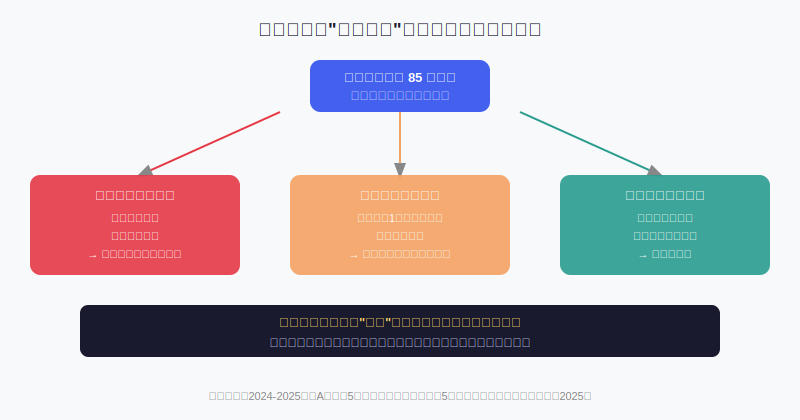
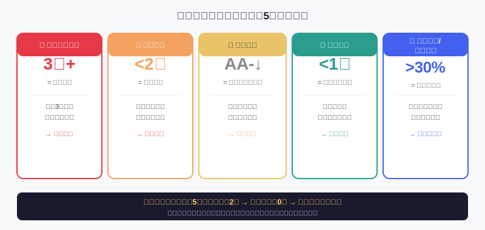
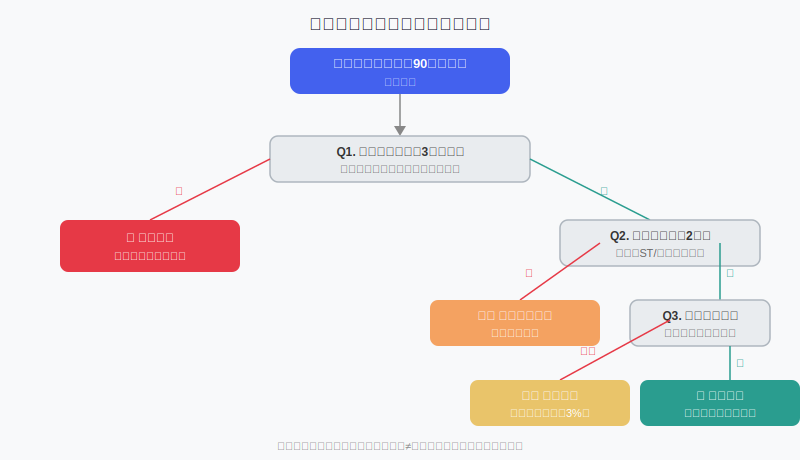

## 散户投资小白金融全品种操盘手册 - 6.10 低价转债陷阱 —— 便宜不等于安全
  
### 作者  
digoal  
  
### 日期  
2026-06-05   
  
### 标签  
金融产品 , 金融工具 , 散户 , 投资小白 , 全品操盘手册  
  
----  
  
## 背景 
   

## 先问你一个问题

2024年，一只叫做"搜特转债"的可转债，价格一路跌到了60元附近。

很多散户看到了：面值100元，现在只要60元，还有债底保护，稳赚40元？

结果：公司破产重整，转债违约，持有人血本无归。那个所谓的"债底"，没有兜住任何东西。

**便宜，从来都不是买入的理由。便宜背后的原因，才是。**

---

## 什么叫"低价转债"？

先把概念说清楚。

可转债的面值是100元。当市场价格跌到100元以下（俗称"破面"），或者跌到85元、70元这些更低的位置时，我们就把它叫做"低价转债"。

散户看到低价转债，本能的反应是：**这不是打折吗？**

逻辑看起来也很通顺：可转债有"债底"保护（即纯债价值，也就是假设这家公司永远不涨股，把债券持有到期能拿回的本息折现值），只要公司不倒，最坏情况不也能拿回本金吗？

问题是：**"公司不倒"这个前提，恰恰是低价转债最不稳定的变量。**

---

## 价格跌下来的三条路

为什么一只转债会跌到低价？原因其实只有三种：

**路径①：信用风险——公司本身出了问题**

公司连续亏损，现金流枯竭，市场开始怀疑它能不能还上这笔债。这时候"债底"失效了——因为债底是基于"公司能正常还债"这个假设计算的，一旦市场认为公司还不了，价格就会跌穿债底，完全由信用风险决定价格。

**路径②：正股退市风险——股带着债一起沉**

正股股价跌破1元面临面值退市，或者连续亏损触发财务退市警告。正股一旦退市，转债会同步被强制摘牌，流动性瞬间消失，持有人只能等破产清算，而清算回收率历史上极低。

**路径③：真正的情绪低估——市场过度悲观**

公司基本面其实尚可，但由于整体市场情绪崩溃或者板块系统性下跌，这只转债被错杀，价格低于合理估值。这才是机会。

**散户的问题在于：看到便宜，默认是路径③，却没有能力排除路径①和②。**

---

## 第一性原理：债底为什么会失效？

【前提清单】

支撑"低价转债有债底保护、下跌空间有限"成立需要以下前提：

- **前提A：公司有持续偿债能力** → 【变量】→ 如果被推翻，债底变成一张废纸，价格没有明确下限
- **前提B：正股不会退市** → 【变量】→ 如果正股退市，转债同步退市，买卖通道关闭
- **前提C：市场流动性正常** → 【相对稳定】→ 特殊时期（如信用风险集中爆发）低价转债会同步遭遇流动性危机，卖不掉

【情景推演】

**正常情景**（前提全部成立）：公司按期还本付息，债底真的是底，持有到期获得完整回报

**压力情景**（前提A被推翻）：评级被下调，市场进入"高收益债逻辑"，60元可能跌到40元，没有底

**极端情景**（前提A+B均被推翻）：公司破产 + 正股退市，债权人进入漫长清算程序。参考历史案例：搜特转债2024年违约，截至2025年初仍处于破产清算状态，回收进展几乎为零（联合资信，2025年一季度数据）

---

## 真实案例：那些"便宜"变成了"血亏"

### 案例一：搜特转债（2024年违约）

搜于特（正股）连续多年亏损，2023年股价跌破1元被强制退市，同年转债随之摘牌，并于2024年3月无法按期兑付第四年利息，构成实质性违约。

**散户认知盲区**：很多人在它跌到70-80元时认为"有债底保护"买入，却没有意识到公司已经进入破产边缘，债底假设完全失效。

### 案例二：岭南转债（2024年违约）

岭南股份虽有国企实控背景（中山市国资委），但国企持股比例较低（约19%），业绩大幅下滑后，国资救助意愿有限。转债违约后，仅由国资对10万元以下小额持有人进行有限兑付，大额持有者损失巨大。

**散户认知盲区**：看到"国企背景"就放松警惕，没有判断国企持股比例和实际救助能力。

### 规律总结（基于2024-2025年违约数据）

根据联合资信2025年研究，2024年以来发生实质性违约的可转债，呈现三个共同特征：
1. 违约主体以低评级民营企业为主，评级均为AA及以下
2. 连续3-4年净利润为负，盈利持续恶化
3. 风险征兆出现较早，但多数散户忽视早期信号

值得注意的是，截至2024年12月20日，历史所有退市转债的违约损失率为41.49%——也就是说，一旦转债违约，平均损失本金的41%。这不是小概率事件，是真实发生过的损失数字。

---

## 低价转债风险识别：5个必查指标

散户在看到低价转债时，不需要做复杂的财务分析，只需要对这5个指标做一次快速排查：

**① 正股净利润是否连续3年为负**

去哪里查：东方财富、同花顺，搜索正股，看财务数据里的"归母净利润"，三年数字是否全为负。连续3年亏损，说明公司无法自我造血，偿债能力存疑。这是第一道红线，触发则直接排除。

**② 正股股价是否低于2元**

股价低于2元，意味着面值退市风险真实存在（A股规定股价连续20个交易日低于1元则强制退市）。转债会随正股同步退市。同时要查是否被ST（警示风险）或是否被证监会立案调查。

**③ 信用评级及近期变动**

查看转债的信用评级（一般在债券基本信息里可以找到）。评级AA-及以下需要特别关注，更重要的是看评级近一年内是否被下调过。一旦评级被下调，市场会进入系统性抛售，低评级及低价券会出现超跌。评级下调是流动性快速枯竭的先行信号。

**④ 剩余期限是否低于1.5年**

剩余期限越短，公司还款压力越集中。如果一家公司经营不佳，剩余期限又短，意味着还款窗口已经临近，而它可能没有足够的现金储备。可以在集思录、债券通等平台查到转债的到期日。

**⑤ 转债余额是否超过正股市值的30%**

用转债余额÷正股总市值。比例越高，说明公司对转债的处置压力越大。信达证券研究指出，转债余额超过正股市值30%，是识别高风险转债的重要筛选维度之一。这个比例过高时，公司想通过转股"甩掉"这笔负债的难度极大，违约风险相应上升。

---

## 实操例子：一次真实的排查过程

**假设场景**：你有10万元，在市场上发现了一只转债X，当前价格82元，感觉很便宜，想买入。

**第一步：查正股净利润**

打开东方财富，搜索正股，在财务数据看归母净利润：2022年亏损、2023年亏损、2024年亏损。**触发红线①**，直接排除，不进入下一步分析。

---

**换一个场景**：另一只转债Y，当前价格88元。

**第一步**：查净利润——2022年盈利，2023年微亏，2024年前三季度盈利。未触发红线①，继续。

**第二步**：查正股价格——目前4.5元，无ST，未被立案。未触发红线②，继续。

**第三步**：查信用评级——AA，2024年维持不变，未被下调。红线③未触发，继续。

**第四步**：查剩余期限——2.3年后到期，还有时间。红线④未触发，继续。

**第五步**：查转债余额/正股市值——转债余额18亿，正股市值110亿，比例约16%。在合理范围内，红线⑤未触发。

**结论**：5项指标全部通过，可以进入下一步，做更详细的估值分析（参考本章第四节的双低策略框架）。

**仓位限制**：即使通过所有排查，单只低价转债仓位不超过总资金的5%。低价转债的风险是真实的，分散才是核心。

---

## 低价转债决策树

---

## 可复用框架

【框架名称】**低价转债五问排除法**

适用场景：发现价格低于90元的可转债，判断是否值得进一步研究

核心逻辑：低价转债多数时候是因为公司出了真实问题，而不是市场错误定价。先用5个快速问题排除最危险的类型，再考虑进一步分析。

操作步骤：
1. 查净利润——连续3年亏损？是→排除
2. 查正股价格——低于2元或被ST？是→排除
3. 查信用评级——近一年被下调？是→高度谨慎
4. 查剩余期限——不到1.5年？是→重点核查偿债能力
5. 查余额/市值比——超过30%？是→结合其他因素判断

举一反三：这个框架的核心逻辑——"先排除不能接受的风险，再找机会"——同样适用于低价债券ETF、困境股票的筛选。

---

## 为什么这个坑散户特别容易踩？

低价转债的陷阱之所以对散户杀伤力特别大，有一个心理根源：**锚定效应**。

我们的大脑天生会用历史价格作为参考点。看到一个曾经120元的债，现在跌到80元，本能就觉得"便宜了40元"。但这个参考点是假的——价格下跌本身就意味着市场认为它值更少的钱，过去的高价是因为当时的信用状况比现在好。

更危险的思维是：**"亏了这么多，不可能再跌了吧。"**

可转债的信用风险一旦暴露，价格是可以跌到60元、50元，甚至更低的，并且没有明确的底部支撑。华泰证券分析师指出，信用风险个券失去偿债能力的保底后，价格往往没有明确的底部支撑，向下可能回撤至80元以下。过去的跌幅不是未来不再下跌的理由。

---

## 本节行动清单

1. **建立排除清单**：把本节的5个指标做成检查表（净利润、股价、评级、期限、余额比），每次看到低价转债时，先跑一遍这5个问题，用时5分钟。

2. **学会查信用评级**：去集思录、上交所、深交所的官网，或者债券基本信息页面，看评级及评级变动历史，这是最容易被散户忽略的关键信息。

3. **设定单只低价转债仓位上限**：任何通过排查的低价转债，单只仓位不超过总资金的5%，组合内低价转债整体不超过20%。分散是对冲尾部风险的唯一免费工具。

4. **远离"便宜"直觉**：下次看到一只价格跌了很多的转债，第一反应不是"便宜"，而是"为什么便宜，市场比我更了解这家公司"。先质疑，再分析。

5. **定期关注年报及评级跟踪**：每年4月是年报披露高峰，6月是评级跟踪披露高峰，这两个月是低价转债风险集中暴露的时间窗口。提前准备，在窗口期前检查持仓。

---

## 一句话总结

低价转债不是打折商品，是市场在告诉你：**这家公司的风险，比你想象的要真实。**

---

> ⚠️ **声明**：本文内容为投资教育目的，所有历史数据、案例及策略框架均为辅助学习工具，不构成证券投资建议。2024-2025年转债违约案例数据来源：联合资信评估股份有限公司研究报告、信达证券固收研究。市场有风险，投资需谨慎。实际操作请结合自身风险承受能力，必要时咨询专业投顾。历史违约案例不代表所有低价转债必然违约，本文排除框架亦不能保证避开所有风险。
  
  
#### [PostgreSQL 解决方案集合](../201706/20170601_02.md "40cff096e9ed7122c512b35d8561d9c8")
  
  
#### [德哥 / digoal's Github - 公益是一辈子的事.](https://github.com/digoal/blog/blob/master/README.md "22709685feb7cab07d30f30387f0a9ae")
  
  
#### [About 德哥](https://github.com/digoal/blog/blob/master/me/readme.md "a37735981e7704886ffd590565582dd0")
  
  

  
