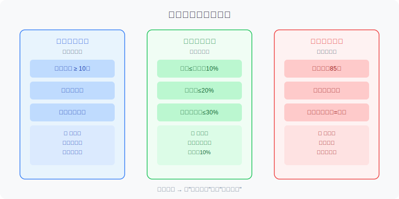
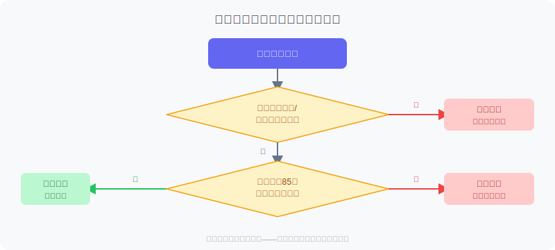
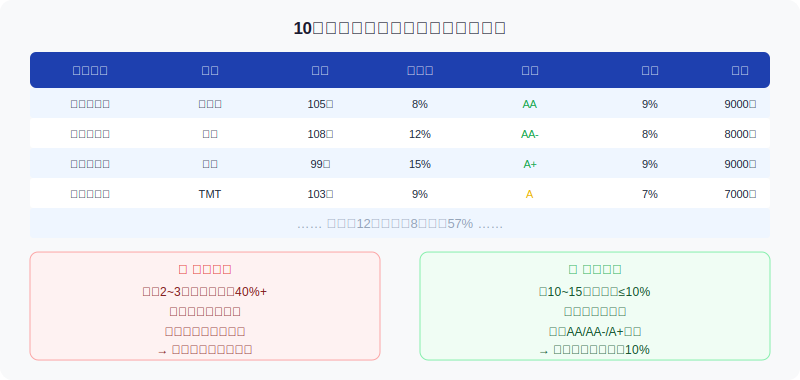

## 散户投资小白金融全品种操盘手册 - 6.11 可转债组合 —— 分散、止损、单只上限
  
### 作者  
digoal  
  
### 日期  
2026-06-05   
  
### 标签  
金融产品 , 金融工具 , 散户 , 投资小白 , 全品操盘手册  
  
----  
  
## 背景 
   

## 先讲一个真实的坑

2021年，"蓝盾转债"退市前，有散户重仓持有，价格从100元附近跌到20元以下，一只债把整个账户打穿了大半。

不是因为分析错了，而是因为**只买了一只**，而且**没有止损规则**。

可转债最大的魅力，是"下有底、上无顶"——但这个"底"是理论上的，前提是发债公司不违约。一旦公司信用出问题，那个底可以比你想象的低很多。

所以本节要解决的问题不是"买哪只"，而是：**买对了之后，怎么组合，才能让一只踩雷不影响全局？**

---

## 可转债为什么更需要组合思维？

先做一个对比：

- 买沪深300 ETF，底层是300只大蓝筹，哪只出问题影响不大。
- 买单只A股，踩雷了可能腰斩，但极少见到归零。
- 买单只可转债，如果发债公司违约、退市、强制赎回，**极端情况下可以跌到20~30元**，亏损幅度超过70%。

可转债的"下有底"是相对的，**那个底是纯债价值**（假设公司不违约时，到期还本付息的折现值），大概在85~90元区间。但如果公司本身出了信用问题，这个底就不存在了。

所以，转债投资最本质的风险，是**信用风险**——而信用风险是小概率事件，管理它的最好武器是**分散 + 止损 + 单只上限**。

---

## 第一防线：分散持仓

分散不是随便买一堆，而是**有逻辑的分散**。

### 持债数量：10~15只是合理区间

太少（1~3只）：一只踩雷，组合受重伤。  
太多（30只以上）：管理成本过高，很难跟踪每只债的动态，反而变成"假分散"。

实证数据支持：芝加哥大学金融学者Fama & French的研究显示，股票持仓15~20只时，非系统性风险（即个股踩雷风险）已经降到接近市场平均的90%以上。可转债与股票类似，这个规律同样适用（来源：Fama, E.F. & French, K.R., 1992, *The Journal of Finance*）。

实操建议：

- 初始资金10万以下，持有10只，每只约8000~10000元
- 资金20万以上，可以持有12~15只
- 每只转债按面值100元计，每只建仓1~2手（1000~2000元）到10手（10000元）

### 行业分散：不能集中在一个板块

同一行业的公司，在行业景气度下行时往往会同步出问题。2020年地产债危机，很多持有多只地产转债的投资者无论怎么"分散"都同步踩雷——因为底层行业是一样的。

建议单一行业持债不超过20%（即10只里不超过2只来自同一行业）。

### 评级搭配：不全押低评级

信用评级（AA、AA-、A+、A等）是发债公司信用质量的粗略标尺。评级越低，潜在收益率越高，但违约风险也越高。

合理搭配参考：

| 评级区间 | 建议仓位占比 | 说明 |
|---------|------------|------|
| AA及以上 | 40%~50% | 压舱石，风险低 |
| AA- 至 A+ | 30%~40% | 主力仓位，收益/风险均衡 |
| A及以下 | 不超过20% | 高收益博弈仓，严格止损 |

---

## 第二防线：单只上限

这是最容易被忽视、却最重要的规则。

**规则：单只转债不超过总可转债资金的10%。**

为什么是10%？

数学很简单：如果一只转债极端情况下归零（实际上很少，但要按最坏情况设计），10%的仓位归零，你的总组合损失是10%。加上止损规则（下面讲），实际损失还会更小。

如果是30%仓位，这只债出问题，你少了三成。这不是分散，是赌博。

**进阶规则：超涨仓位要主动减回10%以内**

比如你买了一只债，仓位8%，后来这只债大涨，仓位自然增加到15%。这时候要减仓回10%以内——不是因为这只债不好，而是**组合纪律不能因为浮盈就放弃**。

很多人舍不得减仓涨得好的债，结果一只债占仓位25%，后来强赎前没来得及卖，利润大幅缩水。

---

## 第三防线：止损规则

可转债止损，有三种情景：

### 情景一：信用事件触发（硬止损）

公司出现以下信号时，**不计价格，立刻止损**：

- 评级被下调到B级以下
- 公司主要产品被监管叫停
- 实控人失联、被调查
- 连续亏损、净资产转负

这类情况下等待"反弹"往往越等越深。蓝盾转债、搜特转债等违约案例均有过类似前兆。

### 情景二：价格持续下跌，跌破纯债价值（软止损）

当转债价格跌到85元以下，说明市场对这家公司的纯债价值也开始质疑了。

止损参考线：**价格跌破85元且无下修预期时，建议减仓或止损。**

注意：如果公司主动发布下修公告（把转股价下调），说明公司还有意愿保持转债正常运作，这时可以暂缓止损，等待下修落地后的机会。

### 情景三：强赎前没卖（止盈即止损）

可转债设有强制赎回条款——当正股价格连续15~20个交易日高于转股价130%时，公司有权以面值103元赎回转债。

**如果你持有一只已经涨到130元的转债，没有在强赎前卖出，最终只能以103元被强制赎回，相当于亏损了本该赚到的27元。**

强赎不是风险，是机会——但你要在公告出来前或确认后及时卖出。忽视强赎条款，等于把赚来的钱白白还回去。

---

## 第一性原理分析

核心观点：**"分散 + 上限 + 止损"能让单只踩雷不伤全局**

【前提清单】

- 前提A：你持有的债之间，信用风险相关性较低 → **相对常量**，只要跨行业分散，相关性通常较低
- 前提B：你的止损规则能被执行，而不是情绪化地拖延 → **变量**，人性弱点会导致止损失败
- 前提C：市场流动性足够支持你在想卖时能卖出 → **变量**，极端行情下低流动性债可能卖不掉

【情景推演】

正常情景（前提全部成立）：分散组合中一只债出问题，最多亏组合总资金的10%，整体基本不受影响。

压力情景（前提B被推翻：执行不了止损）：踩雷的债从90元跌到40元，10%仓位亏掉一半 = 5%总亏损，虽然心疼，尚可承受。

极端情景（前提B + C同时失效：情绪崩溃 + 流动性枯竭）：极端踩雷 + 无法卖出。应对方式：**提前设置止损价格的条件单**，不依赖自己当时的情绪判断；且对低流动性债（日均成交低于100万的）仓位更要严格控制在5%以内。

---

## 实操例子

**场景**：你有10万元打算做可转债组合，打算用双低策略（低价格 + 低溢价率）。

**第一步：筛选标的**

用集思录或东方财富可转债数据，筛选条件：
- 价格：90~115元
- 溢价率：低于20%
- 评级：A+及以上
- 上市天数：超过6个月（排除新债炒作期）

筛选后通常能出来20~40只候选标的。

**第二步：按行业分层**

从候选池里，优先挑选不同行业的。强迫自己每个行业最多选2只，凑够12只。

**第三步：设定每只仓位**

每只初始仓位8000元（10万 × 8%），分12只，合计96000元，留4000元现金备用（补仓或应急）。

**第四步：写止损条件（提前！）**

对每只债，在买入时就在笔记里写：
- 如果价格跌到XX元以下，无条件减半仓
- 如果出现信用事件，全部卖出

**如果不写，你很可能在跌的时候说"再等等"，然后等到更低。**

**第五步：季度检查**

每三个月检查一次：

1. 每只债仓位是否超过10%（超了就减）
2. 是否有强赎公告（有了就准备卖）
3. 是否有评级下调公告（有了执行止损计划）

**如果操作出错**：有只债跌破止损线但舍不得卖，先减半，给自己一周观察期。超过一周还没有好转信号（下修公告、公司回购公告、强势正股），执行剩余半仓止损。

---

## 组合示意（10万元）

---

## 可复用框架

**【10-10-10 转债组合法】**

适用场景：主动管理可转债组合，资金规模5万元以上

核心逻辑：三个"10"分别对应三个控制维度

操作步骤：
1. 持债数量 ≥ 10只（分散原则）
2. 单只仓位 ≤ 10%（上限原则）
3. 低评级（A及以下）合计 ≤ 10只中的2只，即 ≤ 20%（信用原则）

举一反三：这个框架的逻辑适用于所有高信用风险的固收品种，包括高收益债、地产债、城投债等，凡是有信用风险的品种，都要用"分散 + 上限"来管控。

---

**【转债止损三问】**

适用场景：持有某只转债时，每周做一次自检

核心逻辑：主动触发，而不是等亏损够大了才反应

操作步骤：
1. 第一问：这家公司的信用状况有没有变化？（看评级、看公告、看财务）
2. 第二问：当前价格是否已经跌破纯债价值区间？（低于85元需警惕）
3. 第三问：强赎预警是否触发？（正股持续在130%转股价以上，快到强赎日了吗？）

举一反三：这个"三问"可以扩展到其他固收品种——城投债看财政，可交换债看母公司，高收益债看现金流。本质都是：主动检查，而不是被动等亏损。

---

## 本节行动清单

1. **清查当前持仓**：如果持有转债不足5只，或者单只超过20%，立刻制定分散计划
2. **写下每只债的止损条件**：价格止损线、信用事件止损线，今天就写，存档备查
3. **检查强赎预警**：对已经涨超120元的转债，确认是否有强赎可能，提前设定卖出目标
4. **设定季度检查日**：每年1月、4月、7月、10月的第一个周末做一次组合体检
5. **建立候选池**：在集思录或同类工具里收藏20只符合双低条件的候选债，作为补仓备用

---

## 一句话总结

可转债不是彩票，组合的本质是：**用分散换安全边际，用止损锁定失误上限，用单只上限让任何一只踩雷都不能伤到你的根基**。

---

> ⚠️ **声明**：本文内容为投资教育目的，所有历史数据、策略框架均为辅助学习工具，不构成证券投资建议。文中提及的历史案例（如蓝盾转债、搜特转债）均已公开，仅作教育示例用途。市场有风险，投资需谨慎。实际操作请结合自身风险承受能力，必要时咨询专业投顾。
  
  
#### [PostgreSQL 解决方案集合](../201706/20170601_02.md "40cff096e9ed7122c512b35d8561d9c8")
  
  
#### [德哥 / digoal's Github - 公益是一辈子的事.](https://github.com/digoal/blog/blob/master/README.md "22709685feb7cab07d30f30387f0a9ae")
  
  
#### [About 德哥](https://github.com/digoal/blog/blob/master/me/readme.md "a37735981e7704886ffd590565582dd0")
  
  

  
