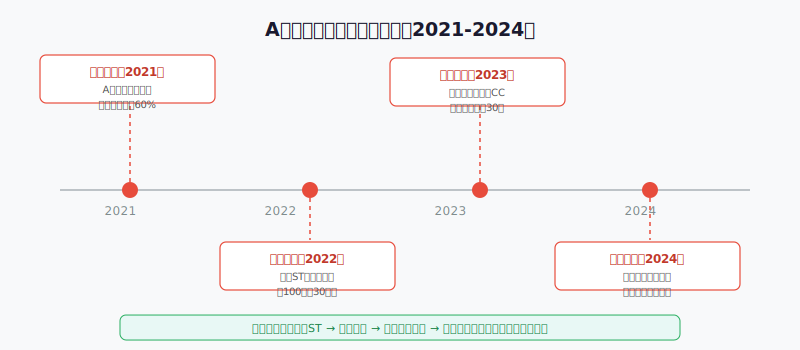
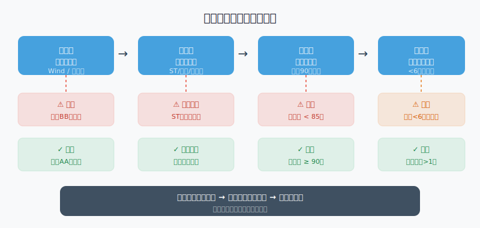

## 散户投资小白金融全品种操盘手册 - 6.12 可转债退市与违约风险规避
  
### 作者  
digoal  
  
### 日期  
2026-06-05   
  
### 标签  
金融产品 , 金融工具 , 散户 , 投资小白 , 全品操盘手册  
  
----  
  
## 背景 
   


## 先问你一个问题

2021年，一只可转债在正式违约前6个月，就已经给出了所有预警信号：正股被ST、评级降到BB、纯债价值跌破70。但持有人里，依然有很多人没有卖出。

为什么？因为他们觉得"应该不会真的违约吧"。

这是一种心理——损失厌恶（已经亏了，不想认输）+侥幸心理（总会有人来救）。本节要做的，就是帮你在情绪之前，建立一套可执行的风险识别系统。


---

## 可转债到底能不能亏成零？

很多人买可转债的理由是"最坏有债底保底，不会亏太多"。这个逻辑在正常情况下是成立的——但它有一个隐含前提：**发行人没有违约**。

一旦违约，债底就是一张废纸。

理解这件事需要先搞清楚两个概念：

**退市风险** 和 **违约风险**，是两件事，但经常连在一起出现。

| | 退市风险 | 违约风险 |
|---|---|---|
| 定义 | 正股（股票）被摘牌，不再上市交易 | 发行人无法按期还本付息 |
| 对转债的影响 | 转股价值归零，转债变成纯债 | 本金和利息都可能拿不回来 |
| 是否会直接归零 | 不一定，取决于发行人偿债能力 | 接近归零（清偿率通常很低） |
| 出现信号 | 正股ST、*ST、退市预警 | 评级持续下调、财务恶化、逾期 |

两者的关系：正股退市不一定导致转债违约，但绝大多数转债违约，正股之前都经历过ST或退市过程。

---

## 历史案例：违约不是偶然，每次都有信号



从已发生的违约案例中，可以总结出一个清晰的规律：

**违约四步走**：正股业绩恶化 → 正股ST → 评级下调 → 转债价格崩塌 → 到期无力兑付

以鸿达兴业转债（A股首单实质性违约）为例：

- 2020年下半年，鸿达兴业（正股）开始出现亏损，财务状况持续恶化；
- 2021年初，正股被ST，市场开始定价违约风险；
- 评级机构将其债项评级从A下调至BB，再到CCC；
- 转债从面值100元附近跌至40元以下；
- 最终在到期日无法完全兑付。

**关键结论**：整个过程历时超过6个月，信号是公开的，不是黑天鹅。散户之所以亏损，不是"信息不够"，是"不知道看哪里"或者"看到了但不行动"。

---

## 第一性原理：可转债的安全边际来自哪里？

我们说可转债"有债底保护"，这个保护的来源是什么？

```
【前提清单】
支撑"可转债有债底保底"成立需要以下前提：

- 前提A：发行人具备到期还款能力 → 【变量】→ 如果企业资不抵债，债底归零
- 前提B：公司没有被退市 → 【变量】→ 退市后转债失去流动性和转股价值
- 前提C：信用评级反映真实风险 → 【相对常量】→ 评级机构有滞后性，但方向通常是对的
- 前提D：市场保持流动性 → 【变量】→ 小市值、低成交量转债可能无法及时卖出

【情景推演】
正常情景（前提全部成立）：转债确实有债底，亏损有下限，适合稳健投资。

压力情景（前提A动摇，企业亏损但尚未违约）：纯债价值开始下降，债底走低，持有风险上升 → 操作调整：评级下调至A时开始减仓。

极端情景（前提A+B同时被推翻，企业破产+退市）：转债接近归零，进入漫长的破产清偿程序 → 操作调整：一旦正股被ST，不管价格高低立刻卖出。
```

---

## 四个预警信号：比你想象的好识别

### 信号一：评级下调

可转债有信用评级，由中诚信、联合资信等评级机构发布。等级从AAA（最安全）到D（已违约）。

**实操识别**：每季度在集思录或Wind搜索持仓转债的最新评级。

| 评级 | 信号含义 | 建议操作 |
|---|---|---|
| AAA / AA+ | 优质，信用风险低 | 正常持有 |
| AA / AA- | 还好，需关注 | 持续观察财报 |
| A+ / A | 开始偏弱，需警惕 | 考虑减仓 |
| A- 及以下 | 高风险区 | 减半或清仓 |
| BB及以下 | 危险信号 | 立刻卖出 |

**重要说明**：评级机构有滞后性，评级下调往往比真实风险晚几个月。所以不能等到评级下调才行动——正股财务状况才是领先指标。

### 信号二：正股ST或退市预警

ST（Special Treatment）是A股对财务异常公司的警示标识。正股被ST，意味着：

1. 公司连续亏损或其他财务异常；
2. 未来被摘牌退市的概率大幅上升；
3. 机构投资者通常会主动回避ST股票的转债。

**操作原则**：正股出现ST或\*ST标记，对应转债不论当前价格，应立即卖出或在第一时间安排卖出。

这条规则的理由是：正股ST后，转债的转股价值实际已归零（没有人想把债转成一家快要退市公司的股票），仅剩纯债价值，而纯债价值又依赖发行人偿债能力——而发行人之所以被ST，正是因为偿债能力出现问题。

### 信号三：纯债价值跌破警戒线

纯债价值（也叫债底）是把这张转债当成普通债券时，它值多少钱。计算方式是把未来所有票息和本金，用市场利率折现。

正常情况下，纯债价值应该在90元以上。

如果纯债价值跌破85元，意味着市场在给你发出信号：这家公司未来还钱的能力，已经被市场打了折扣。

**查询方式**：集思录可转债页面，直接有纯债价值的显示。

### 信号四：流动性枯竭（成交量骤降）

一只转债如果每天成交金额不足500万元，当你想卖的时候，可能根本卖不掉——或者需要大幅压价才能成交。

这个问题在小规模、低知名度的转债上特别突出。流动性枯竭本身就是风险的前置信号，也是执行止损的障碍。

**操作原则**：避开日均成交额低于1000万的转债。已持有的，出现流动性枯竭迹象时，宁可小幅亏损也要提前卖出，不要等到真正需要卖的时候反而卖不掉。

---

## 识别流程图



---

## 实操例子：你该怎么处理手里那只"问题转债"

**场景设定**：你持有某转债5万元，买入成本95元，现在价格84元，已经亏损约11%。你在集思录上看到，它的信用评级上周被从AA-下调至A，同时正股上个季度净利润同比下降60%，但尚未被ST。

**第一步**：核对四项指标

- 信用评级：A（黄灯，已进入警戒区）
- 正股状态：尚未ST（绿灯，但方向不对）
- 纯债价值：需要查集思录，假设显示82元（红灯，已跌破85警戒线）
- 成交量：日均1500万（尚可）

**第二步**：判断结论

三个指标里，有两个已经亮黄或红灯。依据我们的规则：任一亮红灯，应减仓。纯债价值跌破85元是红灯，执行减仓操作。

**第三步**：执行操作

- 不等到"涨回来再卖"——这是止损拖延的典型陷阱；
- 分两次卖出：第一天以接近市价出掉50%仓位（约2.5万元），剩余50%次日再看；
- 如果次日评级再下调或正股出现ST，立刻清仓剩余部分。

**第四步：如果操作失误**

如果你犹豫不决，等了一个月后正股被ST，转债从84跌到55——这时候应该怎么办？

答案依然是：**立刻卖出**。

"反正都亏了，再等等"是最危险的想法。进入违约程序后，清偿率可能低至30%以下，84→55已经是最轻的损失。

---

## 可复用框架

```
【红绿灯止损框架】

适用场景：持有可转债，出现潜在风险信号时的决策判断

核心逻辑：
  四项指标各自独立判断，任一出现红灯不等黄灯变红，立即执行减仓。

操作步骤：
  1. 每月检查：信用评级、正股ST状态、纯债价值、日均成交额
  2. 全绿 → 正常持有
  3. 出现一项黄灯（评级降至A区间 / 纯债价值85-90之间）→ 减仓30%，提高关注频率至每周
  4. 出现一项红灯（正股ST / 评级BB以下 / 纯债价值<85）→ 减仓50%以上，次日评估是否清仓
  5. 两项及以上红灯 → 全部清仓，不设目标价，市价成交

举一反三：
  这个框架同样适用于债券基金的持仓检查，以及信用债ETF的风险评估。
```

---

## 关于"被套"后的特别说明

有一种情况特别容易出错：你买的时候100元，现在80元，亏了20%。这时候发现了上面说的红灯信号，但你想的是"亏这么多了，再等等看能不能回本"。

这叫**沉没成本谬误**——过去的损失已经发生，未来的决策应该只基于未来的风险和收益，而不是"我亏了多少"。

从80元再跌到40元，比从100元跌到80元要多亏很多——而且40元以下的转债在违约程序中，可能最终拿回的连40元都不到。

**正确的心理设定**：每次做持有/卖出决策，假装今天是你第一天以当前价格买入。问你自己：现在这个价格，这只转债值得买吗？如果答案是不值得，那就是卖出的信号。

---

## 本节行动清单

1. **建立月检表**：每月1日，检查所有持仓转债的信用评级（集思录）、正股ST状态、纯债价值三项指标，记录下来。
2. **设置预警**：在股票软件或集思录，对持仓转债的正股设置"ST提醒"功能，第一时间收到通知。
3. **评级下调即行动**：信用评级下调一个等级，当天就执行减仓——不要等"确认是否继续下调"。
4. **单只仓位不超过20%**：分散持有5只以上，单次踩雷的最大损失控制在组合总仓位的20%以内。
5. **流动性检查**：买入前先看日均成交额，低于1000万的转债不碰。

---

## 一句话总结

可转债违约不是黑天鹅，是正股先烂，再评级下调，再价格崩塌的慢动作事故——早一步识别信号、早一步行动，是散户唯一能控制的变量。

---

> ⚠️ **声明**：本文内容为投资教育目的，所有历史数据、策略框架均为辅助学习工具，不构成证券投资建议。市场有风险，投资需谨慎。实际操作请结合自身风险承受能力，必要时咨询专业投顾。历史数据不代表未来表现。
  
  
#### [PostgreSQL 解决方案集合](../201706/20170601_02.md "40cff096e9ed7122c512b35d8561d9c8")
  
  
#### [德哥 / digoal's Github - 公益是一辈子的事.](https://github.com/digoal/blog/blob/master/README.md "22709685feb7cab07d30f30387f0a9ae")
  
  
#### [About 德哥](https://github.com/digoal/blog/blob/master/me/readme.md "a37735981e7704886ffd590565582dd0")
  
  

  
