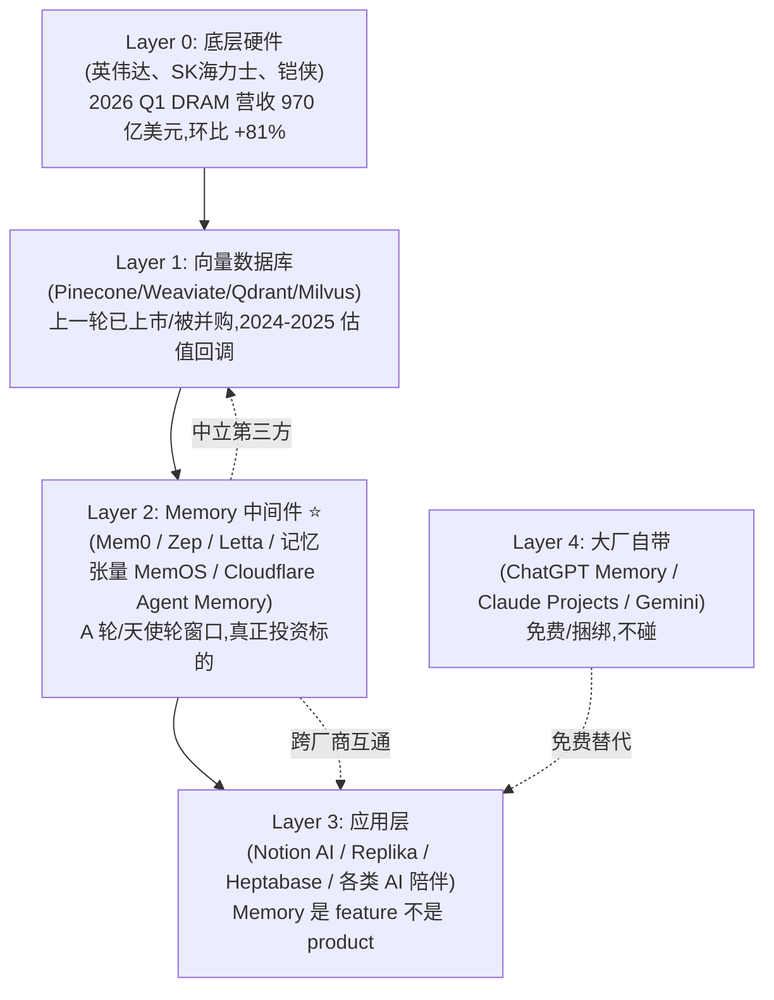

## AI Memory 赛道分析:大模型越来越聪明,记忆确成了瓶颈
  
### 作者  
digoal  
  
### 日期  
2026-06-05   
  
### 标签  
AI Memory , 记忆 , mem0 , memos , pgvector 
  
----  
  
## 背景 
   

2026 年的 AI 圈出现了一个叫 "AI Memory" 的赛道。开源项目 Mem0 在 GitHub 上 Star 破万, 上海一家叫"记忆张量"的公司 6 个月内融了近亿人民币, Cloudflare 这种老牌基础设施厂商也下场做了 Agent Memory。北大、邮电、清华的团队开始专门研究"AI 记忆操作系统"。甚至连 OpenAI 自己,也在 2026 年 6 月 4 日把 ChatGPT 的记忆系统升级了一轮,核心机制叫做 "Dreaming V3"。

## 一、大模型为什么会"失忆",这和有没有"记忆层"是两件事

我们先承认一个事实:大模型本身不是"无记忆"的。它在一次对话里,可以把整本《战争与和平》塞进上下文窗口里,逐字逐句地引用。问题出在"跨会话、跨设备、跨应用"——你今天用 ChatGPT 聊的内容,它明天就不认你了;你在 Claude 里写的偏好,Gemini 不知道;你上周在某个 AI 助手那里整理的资料,这周全得重新解释一遍。

这件事的本质是:**大模型没有"持久化"能力,它的"记忆"是临时的、用完即扔的**。要让 AI 真的"记住你",需要在模型外面,单独搭一层"记忆系统"——类似人的大脑皮层和长期记忆区的关系:模型是处理器,记忆系统是仓库。

这就引出了整个赛道的核心张力:这个"记忆仓库",是该由大模型厂商自己搭(并免费送),还是由第三方中立公司做(并按月/按 token 收费)?

如果你是 OpenAI 的产品经理,你会说"这功能我顺手就做了,免费送用户";如果你是创业者,你会说"大厂做的是通用版,中立的、可控的、跨厂商的版本,只有第三方能做"。这两种叙事都成立,所以赛道才能热闹起来。

 

## 二、AI Memory 不是单一产品,是一整条分层生态

这是我看完这条赛道后最想强调的一点:**别把"AI Memory"当成一个产品分类,它是一整条产业链,从硬件到应用分了好几层**,每一层的商业逻辑完全不一样。

我用一张图把这几层画出来,你一眼就能看明白不同公司在哪个位置:

**关键判断**: 真正能容纳 5 亿美元以上市值的公司,只可能出现在 Layer 1(向量数据库)和 Layer 2(memory 中间件)。Layer 3(应用层)会有无数小而美的公司,但天花板有限。Layer 4 已经被大厂免费吃掉,中间层不碰。

Layer 1 的故事,2022-2024 年已经讲过一遍,Pinecone 一度估值 7.5 亿美元,2024-2025 年砍估值裁员;Weaviate、Qdrant 走开源路线但盈利困难。这一波已经教育了市场——基础设施层不是稳赚的。

真正还在窗口期的,是 **Layer 2:Memory 中间件**。这条线上,海外跑出了 Mem0(开源事实标准,GitHub Star 破万),Zep(主打时序图谱),Letta(基于 MemGPT 的"自管理"路线),Cognee(主打 ECL 流水线,把文档自动变知识图谱);国内跑出了记忆张量(MemOS 操作系统,半年内金融/工业/通信跑通,获孚腾资本、算丰信息、中金资本近亿元天使轮);Cloudflare 这种老牌厂商也在 2026 年 5 月下场,做了 Agent Memory 托管服务。

这才是当下值得花时间理解的赛道。

  

## 三、三种"AI 记忆"的哲学:向量、图谱、操作系统

如果你再往里钻一层,会发现光 Layer 2 内部,技术路线也分成了三派,各自的哲学完全不同:

**第一派:纯向量派**。认为"记忆的本质就是高维向量的相似度",把所有信息编码成 1536 维的浮点数,检索时算余弦距离。代表是 Pinecone、Weaviate、Qdrant,加上还在用纯向量检索的早期 RAG 系统。优势是便宜、快、易部署;劣势是"长尾 query"准确率上不去——5% 的冷门问题可能从 95% 的准确率直接掉到 60% 以下。架构师们都知道,纯向量在生产环境是撑不住的。

**第二派:知识图谱派**。认为"记忆的本质是实体和关系",把用户、事件、属性作为节点和边存进图数据库。代表是 Cognee(主打 ECL 流水线)、Mem0 的"图+向量双栈"、Zep/Graphiti(时序图谱)。优势是关系推理强——比如"张三喜欢李四,李四讨厌咖啡,推导出张三可能不喜欢李四推荐的咖啡馆",这种推理纯向量做不了;劣势是图谱构建贵、更新慢,数据量上来后成本指数级上升。

**第三派:操作系统派**。认为"记忆应该像操作系统的内存一样被统一调度",把"生产、调度、迁移、遗忘"全链路管起来,提供统一 API。代表是记忆张量的 MemOS(国内首个,联合上交大、同济、人大等高校研发),以及 Letta(基于 MemGPT 的类 OS 思路)。优势是 API 干净、可以跨应用、跨模态(文本/图像/工具调用轨迹);劣势是复杂度高,生态还在早期。

这三派不是"二选一",而是**各自守住了不同的应用场景**:纯向量守住了"快速便宜"阵地,知识图谱守住了"企业级 B 端"(金融风控、医疗诊断必须用),操作系统派是 2-3 年后的方向。

我作为非技术读者最需要记住的一点是: **如果你正在做技术选型,不要问"哪个框架最牛",要问"我的场景是关系推理多、还是便宜快多、还是统一调度多"** 。这就跟 2010 年代选数据库一样,MongoDB、PostgreSQL、Redis 各自有活路,不必非此即彼。

 

## 四、谁会为"AI 记忆"付钱? 

技术再花哨,最后都得有人愿意掏钱。我看到的现实是:**C 端付费意愿其实很弱,真正在掏钱的是 B 端**。

为什么 C 端弱?我自己做过 AI 陪伴产品,有个很扎心的数据: **真正愿意每月花 30 美元维持一个"记住我"的 AI 角色的人,不到 3%** 。大部分人尝鲜 3 天就卸载,核心原因是:"AI 记住我"这件事对日常生活没那么痛。ChatGPT 偶尔失忆一下,用户多花 5 秒把背景重新说一遍,可以忍。

但 B 端完全不同。企业部署一个 AI 客服,这个客服需要记住客户 3 年来的所有历史工单、偏好、过往的解决方案;一个企业级 AI 分析师,需要消化公司过去 10 年的财报、内部文档、行业报告。这些场景下,"AI 失忆"会直接导致业务出错甚至合规风险,企业**愿意为"可控、可审计、可解释"的记忆系统单独付钱**。这就是为什么 Mem0、记忆张量、Cognee 这类公司都把"私有化部署 + 合规审计"当核心卖点。

这意味着如果你是个体用户,**你大概率不需要为 memory 单独付钱** —— ChatGPT Memory、Claude Projects 已经覆盖 80% 的需求;但如果你想买"跨平台同步的笔记 + AI",Notion AI、Reflect、Heptabase 这类 $10-20/月的产品是值得的;但如果你是个企业 CTO,**memory 是"应该买而不是自研"的东西** —— 3-5 人小团队花 18 个月自研,大概率打不过 Mem0 这种已经跑了 2 年的成熟产品。

说到底,AI Memory 这条赛道,正处于"混乱期"的中间 —— 基础设施已铺好(Pinecone 这种), 应用层开始爆(Replika、Heptabase), 中间层公司正在跑马圈地(Mem0、记忆张量、Letta)。 **这种 18-24 个月的窗口, 只在新一代技术范式出现时才有** —— 上一次是 2010-2012 年的云原生, 上上次是 2014-2016 年的 SaaS 化。 

如果你只想看热闹,这件事和你关系不大,继续用 ChatGPT 就好。

如果你想参与,先想清楚你在哪一层:做硬件(壁垒高、周期长)、做中间件(技术深、节奏快)、做应用(产品力为王)、做"卖水人"(评测/合规/咨询) —— 每一层的入场姿势完全不同。

大模型越聪明,人类越需要为"记住"单独付钱。 因为越聪明的 AI,产生的信息越密集、关系越复杂、跨场景越频繁,人类大脑已经装不下了 —— 而这件事,在未来 5 年只会越来越痛,不会缓解。
  
  
#### [PostgreSQL 解决方案集合](../201706/20170601_02.md "40cff096e9ed7122c512b35d8561d9c8")
  
  
#### [德哥 / digoal's Github - 公益是一辈子的事.](https://github.com/digoal/blog/blob/master/README.md "22709685feb7cab07d30f30387f0a9ae")
  
  
#### [About 德哥](https://github.com/digoal/blog/blob/master/me/readme.md "a37735981e7704886ffd590565582dd0")
  
  

  
