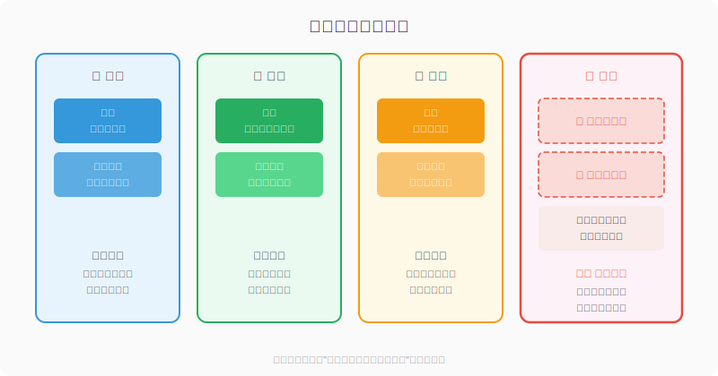
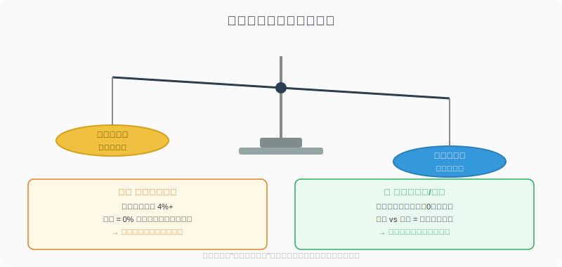
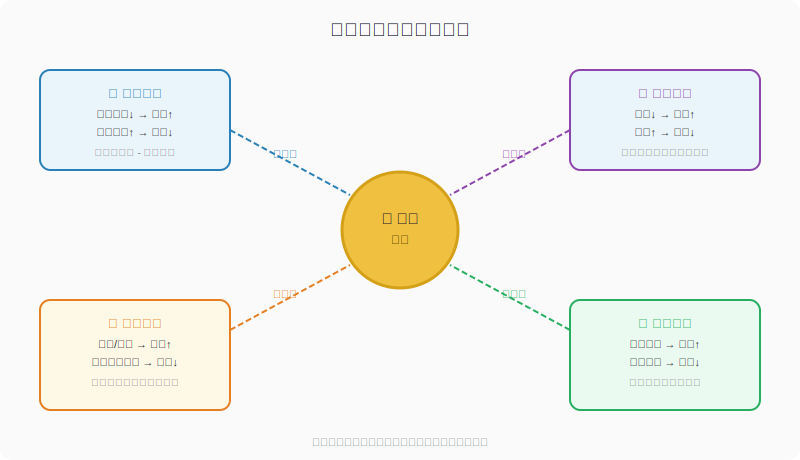

## 散户投资小白金融全品种操盘手册 - 7.1 黄金不是生息资产，它赚的是风险重估的钱
  
### 作者  
digoal  
  
### 日期  
2026-06-05   
  
### 标签  
金融产品 , 金融工具 , 散户 , 投资小白 , 全品操盘手册  
  
----  
  
## 背景 
   

## 先问你一个问题

2024年，黄金全年涨了约27%，2025年更是涨超60%——创下1979年以来最大年度涨幅。

有没有人问过你：**黄金凭什么涨？**

它不派息，不分红，不给你任何定期收入。你买了黄金，它就在那儿，什么都不干。那这些年疯涨的逻辑到底是什么？

答案只有一句话：**黄金赚的不是"持有的收益"，而是"世界对风险重新定价"的钱。**

这句话听着抽象，但只要搞清楚它，你就能判断什么时候值得买黄金，什么时候离它远一点。

---

## 一、黄金是什么？先把它放对位置

看完上面这张图，你可能会困惑：**黄金竟然是所有主流资产里，唯一一种持有本身不产生任何收益的东西？**

没错。

股票有分红，债券有利息，房产有租金，连银行存款都给你点利息。但黄金什么都不给你。放在那里，放1年、放10年，黄金本身分文不吐。

这在金融上有个专业叫法——**零息资产**（Zero-Yield Asset）。

"零息"不是说它不能涨，而是说它**不主动产生现金流**。你赚钱，只能靠它涨价后卖掉。

这就是为什么很多经济学家说，黄金是一种"古老的信仰"——人们相信它有价值，所以它有价值。它的价格，本质上是全球数十亿人对它的**集体认知**在实时定价。

---

## 二、零息资产的代价：机会成本

既然黄金不给你收益，那你拿着它，就等于放弃了把这笔钱存入银行、买债券、买股票所能得到的收益。

这个放弃掉的收益，叫做**机会成本**（Opportunity Cost）。

用人话说就是：

> 你有10万块，买了黄金。同期美国国债年化收益率是4%。那你这一年的机会成本就是4000块——你没拿到这笔钱，因为你把钱押在了一个不给利息的东西上。

问题来了：**机会成本越高，你持有黄金的意愿就越低**，因为"不买黄金"能赚的钱越多。

所以有一个在2006—2021年间解释力高达90%以上的规律：

> **美国实际利率（名义利率 - 通胀率）越高，金价越承压；实际利率越低甚至为负，金价越有爆发力。**

这不是玄学，这是最基础的资产比较逻辑：当"什么都不做"的代价越小，持有黄金才越合算。

---

## 三、黄金价格的四大驱动力

搞清楚了机会成本的底层逻辑，再往上看，黄金的价格实际上由四股力量共同推动：

### 驱动力①：实际利率（最核心）

**实际利率 = 名义利率 - 通货膨胀率**

- 实际利率下行 → 持有黄金的机会成本降低 → 金价上涨
- 实际利率上升 → 持有黄金的机会成本升高 → 金价承压

2008—2012年、2019—2021年两轮黄金大牛市，背后都是全球量化宽松（央行大量印钱）和零利率政策把实际利率压到了负值区间，资金大量涌入黄金。

2022年美联储激进加息，实际利率快速飙升，按理金价应该崩，但黄金只是震荡并没有大跌——这说明什么？说明2022年之后，**实际利率对金价的解释力已经明显下降**，其他力量开始接棒。

### 驱动力②：美元强弱

黄金以美元计价，美元贬值时，买黄金相当于"抢在美元缩水前换成实物"。

1971年布雷顿森林体系崩溃（美元脱离金本位）以来，美元指数与金价的**反向关系**在大多数时间都非常显著。

当美国债务突破38万亿美元，市场对美元信用产生怀疑，全球央行就会减持美元资产、增持黄金——这正是2023年以来的大背景。

### 驱动力③：避险情绪

战争、金融危机、政治动荡……当世界变得不安全，人们会本能地抓住一个"不会归零"的东西。黄金5000年来都没有归过零，这种信任已经刻进人类集体记忆。

2024年地缘政治冲突（俄乌、中东）加剧，避险需求成为当年金价屡创新高的重要推手之一。

### 驱动力④：央行购金（2022年后的新变量）

世界黄金协会数据显示，2024年全球央行净购金量达**1045吨**，连续第三年超过1000吨。中国、土耳其、波兰、印度等国持续增持黄金储备。

这背后是一个长期趋势：越来越多的国家希望降低对美元的依赖，把黄金作为外汇储备的"压舱石"。这股力量不会因短期利率变化而消失，是近年金价走强的结构性支撑。

---

## 四、第一性原理分析

**核心观点：黄金适合在"实际利率下行 + 避险上升"的环境中配置**

支撑这个观点成立，需要以下前提：

| 前提 | 类型 | 说明 |
|------|------|------|
| A. 实际利率与金价负相关 | **变量** | 2006—2021年解释力90%+，但2022年后有所弱化 |
| B. 美元仍是全球主要储备货币 | **相对稳定** | 短期内难以根本改变，但趋势上"去美元化"在推进 |
| C. 黄金的避险地位被全球认可 | **常量** | 5000年历史，短期内不会动摇 |
| D. 全球央行持续购金 | **变量** | 取决于地缘政治和去美元化进程，可能放缓也可能加速 |

**情景推演：**

- **正常情景**（A+D同时成立）：实际利率下行 + 央行持续增持 → 黄金处于顺风期，可在组合中保持配置
- **压力情景**（前提A减弱）：实际利率上行但市场恐慌 → 黄金可能因避险情绪仍维持韧性，但上涨驱动力减弱；操作调整：控制仓位，不追高
- **极端情景**（A+B同时逆转）：美联储激进加息 + 美元大幅走强 → 金价面临双重压制；操作调整：减仓至防守比例（5%以内），等待拐点

---

## 五、两个历史案例：为什么不能只看一个因素

### 案例一：2022年的"反常"

2022年，美联储一年内加息475个基点（bp，每100bp等于1%），美国10年期实际收益率从约-1%飙升到+1.5%以上。按照"实际利率上行金价跌"的逻辑，黄金应该大跌。

结果：2022年全年，黄金仅下跌约0.3%，近乎平盘。

原因：俄乌冲突爆发，避险需求和央行购金需求部分对冲了利率上行的压制。

**结论：黄金的定价从来不是单因素线性关系。**当你只押某一个驱动力时，其他驱动力可能推翻你的判断。

### 案例二：2024—2025年的超级牛市

2024年实际利率并非处于历史低位，美联储降息节奏也不算激进，但金价全年涨超27%；2025年更暴涨超60%，创近半个世纪最大年度涨幅。

驱动力来自：实际利率边际下行 + 央行购金创纪录（1045吨）+ 地缘风险持续 + 美元信用受疑。

**结论：当四大驱动力同时向好，黄金的爆发力可以远超历史均值。但这也意味着，一旦某几个驱动力反转，回调也可以很猛。**

历史不代表未来，但这两个案例的价值在于：它们提醒你**不要用单一逻辑押单一方向**，要同时观察多个变量。

---

## 六、实操例子：用这个框架判断一次买入决策

**假设场景：** 你有20万投资资金，当前市场环境为——美联储开始降息周期、实际利率从2.5%下行至1.5%、中东局势持续紧张、全球央行购金保持强劲、你目前没有任何黄金仓位。

**第一步：确认驱动力方向**

| 驱动力 | 当前方向 | 对金价的影响 |
|--------|----------|-------------|
| 实际利率 | 下行中 | ✅ 利多 |
| 美元 | 随降息走弱 | ✅ 利多 |
| 避险情绪 | 中东风险持续 | ✅ 轻度利多 |
| 央行购金 | 强劲 | ✅ 利多 |

四个驱动力同向，逻辑一致。

**第二步：判断仓位上限**

黄金是防守型资产，不是进攻型工具。参考第七章后续节的仓位管理，一般组合中黄金比例建议不超过15%，进攻型组合不超过10%。

20万资金，黄金上限 = 20万 × 10% = **2万元**。

**第三步：选择工具**

初学者首选黄金ETF（如华安黄金ETF：518880，或博时黄金ETF：159937），不用担心保管、买卖价差等问题。下一节详细讲工具选择，这里只定位置。

**第四步：设置止损条件**

如果实际利率快速反弹回升、美联储转鹰，或地缘风险大幅降温，重新评估持仓。不设定价格止损，而是**逻辑止损**——"买入理由不再成立时，无论亏盈都需要重新审视"。

**如果操作错误（比如买在高点后立刻大跌）：**
先不要恐慌，回头看四大驱动力是否仍然成立。如果成立，属于正常波动，维持仓位。如果驱动力已反转，果断执行逻辑止损，不要"等回本"。

---

## 七、可复用框架

**【驱动力核查表】**

适用场景：每次考虑是否买入或加仓黄金之前

核心逻辑：黄金不像股票可以用PE估值，只能靠观察驱动力方向来判断顺逆风

操作步骤：
1. 查当前美国10年期TIPS收益率（即实际利率），判断是上行还是下行
2. 查美元指数近期走势，判断美元是走强还是走弱
3. 判断当前全球是否有重大地缘政治风险或金融动荡
4. 查世界黄金协会最新的央行购金数据，确认趋势是否持续
5. 四个方向中，3个及以上利多 → 顺风，可考虑建仓；2个及以下 → 逆风，谨慎或持有观望

举一反三：这个"多因子核查"的思维框架，同样适用于判断债券、REITs等其他利率敏感型资产的买入时机。

---

**【零息资产估值口诀】**

适用场景：快速判断黄金当前"贵不贵"

核心逻辑：黄金没有PE可以估，但可以看机会成本

操作步骤：
1. 看实际利率水平——如果TIPS收益率超过2%，黄金的机会成本很高，需要更高的风险溢价支撑才值得持有
2. 看金价与实际利率的背离幅度——如果金价已在实际利率正常水平下涨很多，说明其他因素（如去美元化）在推动，但也意味着更高的回调风险
3. 不要追高——黄金没有"止不住的上涨"，只有"驱动力持不持续"

---

## 本节行动清单

1. **搞清楚你手上的资产有没有现金流**：股票、债券、房产都有，黄金没有——这是它定价逻辑与众不同的根源。

2. **收藏一个查实际利率的数据源**：美国圣路易斯联储官网（fred.stlouisfed.org）可以直接搜索"TIPS 10 Year"，看美国10年期实际利率走势，这是理解金价最重要的单一指标。

3. **每次想买黄金前，先过一遍四大驱动力核查表**：实际利率方向、美元方向、避险情绪、央行购金趋势——四个方向，3个利多才考虑建仓。

4. **把黄金定位成防守资产，不是暴富工具**：它的历史年化回报不高，但在特定环境下的爆发力强。仓位不宜超过总资金的10—15%。

5. **不要因为"金价创历史新高"就追涨**：历史新高不是买入信号，驱动力是否持续才是。

---

## 一句话总结

**黄金是零息资产，它赚的是"持有它的机会成本下降"和"全球风险偏好重估"的钱——搞懂这两件事，你才算真正开始理解黄金。**

---

> ⚠️ **声明**：本文内容为投资教育目的，所有历史数据、策略框架均为辅助学习工具，不构成证券投资建议。市场有风险，投资需谨慎。实际操作请结合自身风险承受能力，必要时咨询专业投顾。
  
  
#### [PostgreSQL 解决方案集合](../201706/20170601_02.md "40cff096e9ed7122c512b35d8561d9c8")
  
  
#### [德哥 / digoal's Github - 公益是一辈子的事.](https://github.com/digoal/blog/blob/master/README.md "22709685feb7cab07d30f30387f0a9ae")
  
  
#### [About 德哥](https://github.com/digoal/blog/blob/master/me/readme.md "a37735981e7704886ffd590565582dd0")
  
  

  
