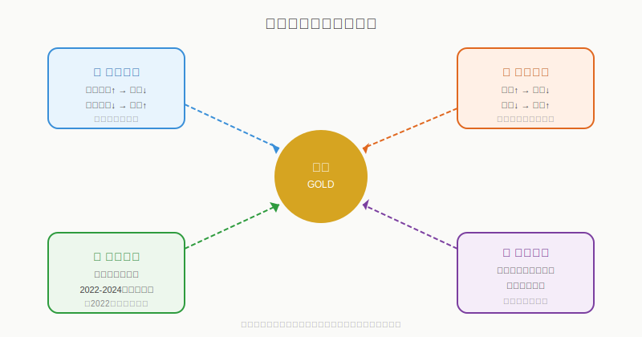
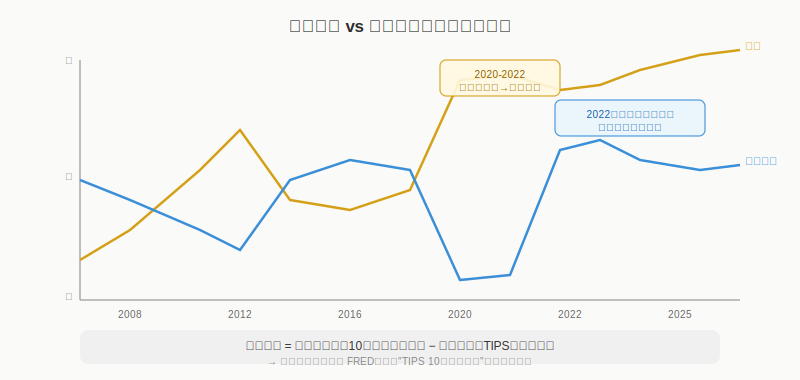
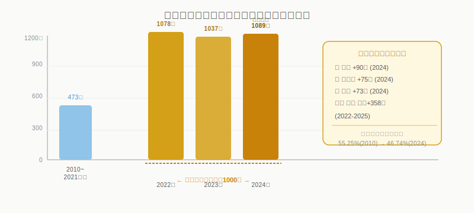
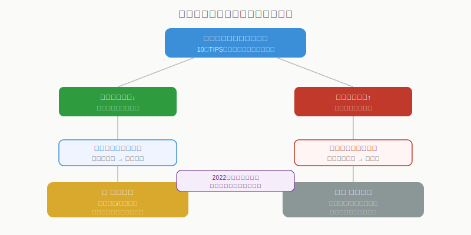

## 散户投资小白金融全品种操盘手册 - 7.2 黄金为什么涨 —— 读懂背后的四根绳子
  
### 作者  
digoal  
  
### 日期  
2026-06-06   
  
### 标签  
金融产品 , 金融工具 , 散户 , 投资小白 , 全品操盘手册  
  
----  
  
## 背景 
   

## 先问你一个问题

2022年，美联储以40年最快速度加息，把利率从0%猛推到5.25%。按常理，借钱成本这么高，大家都去买国债收利息，谁还抱着一块不生息的金砖？

结果，黄金从2022年到2025年涨了超过100%，2025年全年涨幅超64%，创1979年以来最大年度涨幅。

这说明一件事：**如果你只用一个因素解释黄金，早晚会被市场打脸。** 黄金的真实定价，是四根绳子拉着走的，有时候方向一致，有时候相互撕扯，你只有看清楚每根绳子的力度和方向，才能不被甩出去。

本节把这四根绳子拆开来讲清楚。

---

## 黄金的四大驱动力：一张框架图

黄金的价格，由以下四个变量共同决定：

**① 实际利率**（最核心的锚）  
**② 美元强弱**（与实际利率高度联动）  
**③ 央行购金**（2022年后崛起的结构性力量）  
**④ 避险情绪**（短期催化剂，通常不是主驱动）

理解了这四个变量怎么运作、怎么互动，你就掌握了分析黄金走势的基本工具。

---

## 第一根绳子：实际利率——黄金最重要的锚

### 什么是实际利率？

先把这个词说清楚。

**实际利率 = 名义利率 − 通胀预期**

举个例子：
- 10年美国国债收益率（名义利率）= 4.5%
- 市场预期通胀率（从TIPS债券推算）= 2.5%
- 实际利率 = 4.5% − 2.5% = **2%**

这个2%，意味着你买国债，扣掉通胀之后，每年还能实际赚2%的购买力。

### 实际利率为什么影响黄金？

黄金不生息，不分红，持有它的唯一代价就是"机会成本"——你本来可以把这笔钱存到别的地方生利息。

- **实际利率高（比如+2%）**：国债能跑赢通胀，大家有充分理由持有债券，黄金吸引力下降，金价承压。
- **实际利率低甚至为负（比如-1%）**：国债名义有收益，扣掉通胀后反而亏钱，那"不生息"的黄金反而成了最好的保值选择，金价上涨。

用一句话记住：**实际利率是黄金的机会成本。利率越低，抱金砖越不亏。**

### 历史数据怎么说？

过去二十年，这个关系一度非常稳定：
- 2008-2012年，全球大放水，实际利率持续为负，黄金从700美元涨到1900美元/盎司；
- 2012-2018年，实际利率回升，黄金从高点回落30%；
- 2020-2021年，疫情大放水，实际利率再度变负，黄金再次创历史新高；
- 2022年，美联储激进加息，实际利率快速走正至+2%。按教科书，金价该暴跌。

**但金价没有暴跌，反而在横盘后继续上涨。**

这就引出了第三根绳子——央行购金，是2022年后打破传统定价框架的关键变量。我们先把前两根说完。

---

## 第二根绳子：美元——与黄金天然对立

### 为什么美元和黄金通常反向？

黄金是以美元计价的。当美元走强时：
1. 其他货币持有者购买黄金的成本上升（同样一盎司金，要花更多本币换美元），需求下降；
2. 美元走强往往对应实际利率走高（资金回流美国），两个因素叠加压制金价。

反过来，美元走弱，两个因素都变成利好黄金。

### 但这个关系也会失效

2023-2024年，出现了金价和美元**同时走强**的罕见现象。按正常逻辑，这不该发生。

原因在于第三根绳子：**央行集体购金，把黄金从"美元的对立面"部分变成了"美元信用的替代品"**。地缘政治紧张时，资金同时涌向美元和黄金，两者都成了避风港，传统负相关暂时失效。

**操作结论**：美元走弱时，黄金的顺风更顺。美元走强时，不代表黄金一定跌——要看第三根绳子强不强。

---

## 第三根绳子：央行购金——2022年后的新变量

这是2022年后黄金定价逻辑发生最大变化的地方。很多人还在用旧框架分析黄金，结果被市场一次次打脸，根本原因就是忽略了这一条。

### 数字先说话

根据世界黄金协会数据：
- 2010-2021年，全球央行年均净购入黄金约473吨
- 2022年，购入量激增至1078吨，同比接近翻倍
- 2023年，1037吨；2024年，1089吨——**连续三年超过1000吨，其中2024年创有记录以来历史新高**

这还不是全部。各央行公布的数据往往滞后甚至不完整，实际购入量可能更高。

### 央行为什么抢着买黄金？

背后是一个很大的结构性变化：**去美元化**。

2022年2月，美国冻结了俄罗斯约3000亿美元的海外资产，一个月之内宣布的制裁让全球非西方国家的央行都意识到一件事——美元资产（主要是美国国债）是有"国籍风险"的，如果你被美国认定为敌对方，你的美元储备可以被冻结。

黄金不一样。黄金没有发行方，没有国籍，只要储存在本国，谁也冻结不了。这种"无主权信用风险"的特性，突然变得极度宝贵。

IMF数据显示，美元在全球外汇储备中的占比从2010年的55.25%降至2024年的46.74%；同期，黄金占比从11.24%升至19.13%。这是长期趋势，不是短期情绪。

### 这对黄金定价意味着什么？

央行的购金行为是**结构性的、非价格敏感的**。国家央行不会因为金价贵了就停止买（它们买的是战略储备，不是炒短线）。这意味着黄金多了一个强劲的"底部买盘"，**即使实际利率走高，央行购金也能对冲部分压力**，这正是2022年后金价走势打破旧框架的核心原因。

### 第一性原理分析

**【前提清单】**  
支撑"央行购金是金价新驱动力"成立需要以下前提：

- **前提A**：主要央行持续面临美元资产被冻结的地缘政治风险 → 【常量，短期难变】→ 只要中美博弈格局不根本改变，这个前提成立
- **前提B**：黄金对央行而言仍是可信的价值储存工具 → 【常量】→ 黄金六千年历史积淀的信任不会短期消失
- **前提C**：新兴市场央行有足够外汇储备支撑购金 → 【变量】→ 若全球经济衰退导致新兴市场本币崩溃，可能被迫卖金换美元

**【情景推演】**  
- **正常情景**（前提全部成立）：央行年购金量维持800吨以上，对金价形成持续性结构支撑，即使实际利率走高，金价下跌空间有限
- **压力情景**（前提C被推翻，新兴市场资金紧张）：央行购金放缓甚至转为卖出，传统利率框架重新主导，金价对实际利率变得更敏感，下行风险增大
- **极端情景**（前提A被推翻，地缘政治缓和+美元信用修复）：去美元化逻辑瓦解，央行购金量大幅下降，黄金失去结构性支撑，回归纯粹利率驱动模式

---

## 第四根绳子：避险情绪——催化剂，不是发动机

黄金的避险属性是真实的，但很多小白对它的理解过于简单：一有地缘冲突就去买黄金。

**这个逻辑本身没错，但用错了场景。**

避险情绪是**短期催化剂**，是黄金价格短期快速波动的触发器，但它**无法单独支撑金价的长期上涨**。

- 2022年2月俄乌冲突爆发，金价从1800美元涨到2070美元，涨了约15%；但随后三个月，美联储开始加息，实际利率走高，金价回落到1700美元——避险溢价全部还了回去。
- 2023-2024年中东局势持续紧张，避险叠加央行购金+降息预期，三根绳子同向发力，金价才实现了长期趋势性上涨。

**结论**：避险情绪触发短期买盘，但能不能持续，取决于实际利率和央行购金能不能接棒。单靠避险做判断，容易买在情绪高点。

---

## 通胀和黄金：最大的认知误区

很多人认为"通胀高→买黄金"。这个判断有时对，但经常错。

**正确逻辑是**：通胀影响黄金，是通过影响**实际利率**来间接作用的，而不是直接的。

| 场景 | 通胀 | 利率政策 | 实际利率 | 金价 |
|------|------|----------|----------|------|
| A | 高 | 央行不加息 | 为负 | ✅ 上涨 |
| B | 高 | 央行激进加息 | 为正且走高 | ❌ 承压 |
| C | 低 | 央行维持低利率 | 为负 | ✅ 上涨 |
| D | 低 | 央行加息预防 | 为正且走高 | ❌ 承压 |

**看懂了吗？** 通胀高≠买黄金。关键是"实际利率"，也就是央行对通胀的应对速度。2022年美国通胀最高达9.1%，但美联储快速加息把实际利率拉正，黄金那一年反而是跌的。

**一句话记住**：决定金价的不是通胀本身，而是"通胀减去利率政策"的结果，即实际利率。

---

## 实操例子：如何用四根绳子做判断

**假设场景（2025年初，仅供教学演示）**：

某散户小张，手上有20万闲置资金，准备用其中10%（2万元）配置黄金ETF。他想判断当前时点合不合适。

**第一步：查实际利率方向**  
- 去美联储官网或东方财富等平台搜"10年TIPS收益率"
- 当前数值：+1.8%（较去年+2.3%有所下降）
- 判断：实际利率在下行，对黄金有利

**第二步：看美元走势**  
- 查美元指数DXY（东方财富/英为财情均有）
- 当前美元指数从年初高点下行约5%
- 判断：美元走弱，对黄金有利

**第三步：看央行购金节奏**  
- 世界黄金协会每季度发布报告（goldcouncil.org）
- 当季央行净购金量超900吨（年化）
- 判断：结构性支撑仍在

**第四步：综合判断**  
三根主绳子（实际利率下行 + 美元走弱 + 央行持续购金）方向一致，属于黄金的顺风环境。2万元分两批买入黄金ETF（如518880），先买1万，等一次3-5%以上的回调再加仓剩余1万。

**如果操作错了（比如追高后金价短期回落10%），怎么办？**  
- 判断逻辑是否发生改变（实际利率是否突然走高？央行是否转为卖金？）
- 如果逻辑未变，属于正常波动，按计划持有
- 如果实际利率开始大幅回升（比如超过+2.5%），且美元重新走强，重新评估是否减仓

---

## 情景推演：看懂"反常"现象

**问题：为什么美元和黄金有时同涨？**

正常框架下，两者负相关。但当以下情况发生时，相关性可能转正：
- 全球爆发重大金融风险（如2008年、2020年）
- 美国自身信用受质疑（如国债被降级、政策极度不确定）
- 地缘冲突导致资金同时寻求美元和黄金的双重避险

**判断方法**：如果金价和美元同涨，看驱动黄金的主要是"央行购金+避险"而非"实际利率"，这种同涨持续性相对有限，要更加谨慎。

---

## 可复用框架：黄金三因子快速检查表

**【框架名称】黄金三因子表**

适用场景：每次考虑买卖黄金前，用5分钟做一次快速检查

核心逻辑：黄金短期受实际利率和美元主导，中长期受央行购金结构性支撑，避险情绪只是临时催化

操作步骤：
1. **查实际利率**（TIPS 10年收益率）：最近1-3个月是上行还是下行？
2. **查美元指数DXY**：最近1-3个月是走强还是走弱？
3. **看央行购金节奏**：最近季度购金量是否维持在800吨/年以上？

| 因子 | 利好黄金 | 利空黄金 |
|------|----------|----------|
| 实际利率 | 下行/为负 | 上行/为正且高 |
| 美元指数 | 走弱 | 走强 |
| 央行购金 | 年化超800吨 | 明显放缓/转为卖出 |

**打分规则**：三因子各1分（利好=1分，利空=0分），加上避险情绪（有=0.5分，无=0分）
- 3.5分及以上：顺风明显，可考虑加仓
- 2~3分：环境中性，维持底仓不追高
- 1.5分及以下：逆风较多，控制仓位，等待信号改善

举一反三：这个框架还可以用于判断何时适合卖出黄金——当三个因子全部转向利空时，是减仓的信号，而不是"还可以再等等"。

---

## 本节行动清单

1. **收藏一个实际利率查询入口**：英为财情搜索"美国10年期通胀保值国债收益率"，或直接访问美联储FRED网站搜"TIPS 10-Year"，每月看一次方向
2. **收藏美元指数查询入口**：东方财富或英为财情搜"DXY美元指数"，看趋势方向而非单日涨跌
3. **每季度看一次世界黄金协会购金报告**（World Gold Council，官网可免费下载），了解央行购金节奏是否有变化
4. **不要只因为"通胀高"就买黄金**——先看实际利率，再做判断
5. **建立自己的黄金三因子打分记录**：每次买卖决策前打一次分，留档复盘，看自己判断的准确率

---

## 一句话总结

黄金的涨跌，本质上是**实际利率（机会成本）、美元信用（计价货币）、央行购金（结构需求）和避险情绪（短期催化）**四根绳子的合力结果；其中实际利率是传统主锚，央行购金是2022年后越来越重要的新变量，只看一条线分析黄金，迟早被市场教做人。

---

> ⚠️ **声明**：本文内容为投资教育目的，所有历史数据、策略框架均为辅助学习工具，不构成证券投资建议。市场有风险，投资需谨慎。实际操作请结合自身风险承受能力，必要时咨询专业投顾。
>
> **数据来源**：世界黄金协会（World Gold Council）、美联储FRED数据库、IMF全球外汇储备数据、CME Group研究报告、Wind金融数据库，统计截至2025年。历史数据不代表未来表现。
  
  
#### [PostgreSQL 解决方案集合](../201706/20170601_02.md "40cff096e9ed7122c512b35d8561d9c8")
  
  
#### [德哥 / digoal's Github - 公益是一辈子的事.](https://github.com/digoal/blog/blob/master/README.md "22709685feb7cab07d30f30387f0a9ae")
  
  
#### [About 德哥](https://github.com/digoal/blog/blob/master/me/readme.md "a37735981e7704886ffd590565582dd0")
  
  

  
