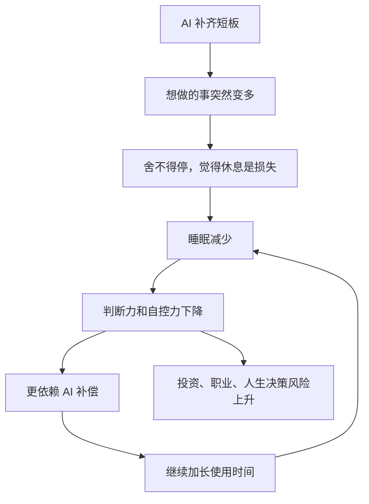

## 德说-第487期, 人的欲望被 AI 无限放大, 但肉体已无法承受
  
### 作者  
digoal  
  
### 日期  
2026-06-06  
  
### 标签  
AI , 终局 , 欲望 , 肉体 , 健康 , 节奏 , 杠杆 , 第二职业
  
----  
  
## 背景  
  

最近接到一位盆友的焦虑(其实就是自己): 

因为AI发展很快, AI现在的能力越来越强, 想象空间真的很大, 用AI可以解决自己的短板, 完成自己有想法但无法做到的事情. 

人的欲望从而被勾起, 陷入重度的AI使用过程. 

比如在AI出现前, 我专注于数据库领域, 其他方面纯纯的小白, 虽然有想法却也没有时间、没有能力实现. 离职后, 时间有了, AI又补齐了我缺失的部分, 我目前就在发展第二职业(专业炒股), 先通过AI辅助学习重新构建认知系统、投资知识, 通过AI进行行业分析、财报分析、政策分析等做价值投资. 当然, 还有其他的欲望可能也被勾起, 进入重度的AI使用过程. 

说实话我很久没有好好的睡一觉了, 恨不得把购买的 token 都耗光, 恨不得用AI快点实现我想做的事. 

也很久没有向朋友请教问题了, 因为问 AI 就可以解决. 

假设未来我们都活在由AI带来的物质极大丰富的世界, 社会最低生活保障的那条线应该是越来越高, 但是最高的生活肯定还是需要打拼的. 人类可能活在兴趣驱动, 而不是生存驱动的世界. 

那到底多久能进入这样的世界? 我现在是不是仅仅应该保持身体健康、适当的社交, 控制欲望, 慢节奏的生活? 

我真的很想大睡一觉, 等 AI 终局的出现.

-----

不知道你有没有也遇到类似的问题.

这绝对是一个健康和判断系统的预警。不是因为 AI 不重要，恰恰是因为 AI 太重要，所以不能用一个睡眠不足、社交反馈减少、欲望持续膨胀的大脑去驾驭它。

如果 AI 未来真的越来越强，那么你的核心资产不是今天多烧掉多少 token，而是你能否长期保持清醒、健康、能验证、能判断、能和人协作。如果你提前把身体和判断系统烧坏，AI 越强，你越可能被自己的欲望牵着走。

## AI 可能带来的职业病是什么

我觉得未来重度 AI 使用者最常见的职业病，未必是传统意义上的颈椎病、鼠标手，而是几种更隐蔽的东西。

第一种是“可能性过载”。过去很多想法会被能力、时间、资源挡住。挡住本身很痛苦，但它也是刹车。AI 出现后，很多刹车突然消失了。不会写代码，可以让 AI 写；不懂财报，可以让 AI 解释；不懂政策，可以让 AI 梳理；不懂一个行业，可以让 AI 做框架。于是人的欲望不是一点点增加，而是被一次性放大。

问题是，AI 放大的是可能性，不是人的生理容量。人的睡眠、注意力、情绪稳定性、风险承受力、社交反馈能力，并没有同步升级。

第二种是“输出幻觉”。AI 很容易让人感觉自己每天都在产出：报告、框架、表格、计划、分析、脚本、文章。可是产出不等于进步。尤其在投资这种领域，真正稀缺的不是一份看起来像样的行业分析，而是判断力、耐心、仓位控制、承认错误的速度，以及在亏损时不变形的心态。

第三种是“验证债”。AI 让生成答案的成本急剧下降，但验证答案的成本没有同比例下降。一个晚上可以生成十份行业分析，但我不可能同等质量地核查十份分析里的假设、数据、竞争格局、财报口径和政策变量。久而久之，我欠下的不是技术债，而是判断债。

第四种是“人类反馈退化”。AI 是一个随叫随到、不会嫌我基础差、不会嘲笑我问题幼稚的对象。这很好，但也危险。因为真正的朋友、同行、专家，会带来摩擦。他们会不耐烦，会质疑，会指出我不懂装懂，会让我感到尴尬。正是这种不舒服，能校准现实。

第五种是“终局焦虑”。当我相信 AI 会越来越强，甚至会走向某种终局，我会很容易觉得现在每一分钟都不能浪费。于是我一边想大睡一觉，一边又睡不着，因为我觉得自己正在错过历史窗口。这种状态很像把未来的生产力革命提前透支到今天的身体里。

## 物质极大丰富会不会很快到来

我认为方向上可以乐观，时间上必须保守。

站在产业经济学角度，AI 的扩散已经很快。Stanford HAI 的 2026 AI Index 经济章节显示，组织层面的 AI 采用继续上升，很多企业已经把 AI 放进业务函数里。McKinsey 的 2025 调查也显示，AI 使用已经非常普遍。

但这不等于“AI 终局”很快到来。因为从模型能力到社会现实，中间还有很多环节：算力、能源、机器人、流程改造、监管、责任归属、商业模式、组织信任、收入分配。AI 能写一份报告，和 AI 让整个社会进入物质极大丰富，不是一回事。

更现实的路径是：某些行业、某些公司、某些个人先获得巨大杠杆；社会底线可能逐渐提高；但顶层生活依然需要判断力、资源配置能力、组织能力、信誉和长期主义。

所以我不会把人生策略建立在“睡一觉醒来终局出现”上。我会建立在另一个假设上：AI 会持续变强，但过程会很不均匀；越是在这种不均匀的阶段，越需要健康、节奏、社交和独立判断。
  
站在睡眠门诊角度看，一个人如果说“我很久没有好好睡一觉了”，这已经不是效率问题，而是底线问题。CDC 在 2024 年的睡眠资料里写得很清楚，18-60 岁成人通常每 24 小时需要 7 小时或更多睡眠；CDC/NCHS 的 2024 年美国成人睡眠数据也显示，30.5% 的成年人平均每 24 小时睡不到 7 小时。短睡眠很常见，但常见不等于没代价。

AI 会让睡眠问题变得更隐蔽。过去你累了，脑子转不动，事情就停了。现在不一样，你累了也能继续问，AI 还能继续答。你困，但屏幕那边永远清醒。你卡住，它给你下一步。你想停，它又给你一个更漂亮的可能性。
  
这就很像一个正反馈：

这张图里最要命的一环不是“使用 AI”，而是“睡眠减少之后还继续做高后果判断”。尤其你现在做的是专业炒股和价值投资学习，这不是写一篇文章错了还能改的事。睡眠不足的时候，大脑最容易把兴奋误认为洞察，把连续分析误认为确定性，把“我还能再推进一点”误认为“我状态很好”。
  
所以如果我是你，我不会先问“AI 终局什么时候来”。我会先问：今晚我能不能睡够？明天我能不能在清醒状态下判断？
  
## 投资需谨慎

你说第二职业是专业炒股，并且用 AI 辅助价值投资。这个方向可以做，但要格外小心。

投资不是知识竞赛。AI 能帮我读财报、看政策、拆行业链、找竞争对手、总结电话会。但市场里其他人也会用 AI。公开信息被总结得更快，并不自动产生超额收益。

真正的问题是：AI 会让一个新手更快地获得“我懂了”的感觉。尤其当我睡眠不足时，这种感觉更危险。因为投资的反馈有延迟，错了也不一定马上暴露；短期赚钱也不一定说明方法对；长期亏钱之前，AI 还可以不断帮我生成新的解释。

SEC、FINRA 等机构已经提醒过，AI 热潮会被用于投资欺诈，AI 生成的信息也可能不准确、不完整、误导甚至编造。即使不遇到骗局，过度相信 AI 研究本身也是风险。

建议给投资这件事设一个硬规则：在睡眠没有恢复之前，不扩大本金、不加杠杆、不做冲动交易。

## 怎么调整

把 AI 从“欲望放大器”改造成“有边界的生产工具”。

第一，先用 14 天修复睡眠。不是永久慢生活，而是先恢复系统。每天固定一个停止使用 AI 的时间，睡前至少留出不用屏幕、不讨论重大问题、不做投资决策的缓冲区。如果连续两周仍然睡不好，或者出现睡得很少却异常亢奋、思维停不下来、冲动交易、明显易怒或自我膨胀，我会认真考虑找专业人士评估。这不是给自己贴标签，而是风险控制。

第二，把 token 消耗改成项目预算。不要问“今天还能用多少 token”，而要问“这个项目本周最重要的一个可验证成果是什么”。比如投资学习，本周只完成一个行业、一家公司、一份反方清单。宁可少产出，也要能复盘。

第三，每次问 AI 前先写自己的判断。哪怕只有三句话：我认为这家公司为什么好，最大风险是什么，什么证据会证明我错。然后让 AI 攻击我，而不是让 AI 替我想。

第四，恢复人类反馈。不是所有问题都问朋友，而是每周至少找一个真实的人校准一次。可以是懂投资的人、懂行业的人、懂心理状态的人，也可以是老朋友。AI 负责低成本练习，人负责现实摩擦。

第五，给投资设防火墙。睡眠不足不交易；没有反方观点不交易；没有写清楚退出条件不交易；没有核对原始材料不交易；单个想法不因 AI 写得很漂亮就提高仓位。

## 观察清单

如果未来 14 到 30 天出现这些变化，我会认为自己在恢复：

- 多数夜晚能睡到接近 7 小时或以上。
- AI 使用有固定结束时间，而且大多数时候能停下。
- 每周至少有一次和真实的人讨论非舒适区问题。
- 投资相关输出减少，但每份都更可验证。
- 我能说清楚哪些事必须现在做，哪些事可以等。
- 我不再因为 token 没用完而焦虑。

如果出现这些信号，我会认为风险在加重：

- 睡眠继续恶化。
- 越累越想开新项目。
- 看到 AI 输出就想立刻行动，尤其是交易。
- 不愿意让别人看自己的判断。
- 明明身体很累，却觉得自己停下来就会错过时代。
- 生活里只剩 AI、信息、分析和目标，没有恢复。

## 总结

我不认为你应该慢到放弃野心。你真正需要的不是躺平，而是降速到身体能承受、判断能校准、关系能维持的速度。

也就是说，我会把当前阶段定义为：机会是真的，风险也是真的；AI 可以成为第二职业的杠杆，但现在最优先的任务不是多生成几份分析，把握节奏。

如果 AI 终局真的会来，一个睡得好、身体稳、能判断、有人类反馈、能长期学习的人，会比一个提前透支的人更接近它。

  
  
#### [PostgreSQL 解决方案集合](../201706/20170601_02.md "40cff096e9ed7122c512b35d8561d9c8")
  
  
#### [德哥 / digoal's Github - 公益是一辈子的事.](https://github.com/digoal/blog/blob/master/README.md "22709685feb7cab07d30f30387f0a9ae")
  
  
#### [About 德哥](https://github.com/digoal/blog/blob/master/me/readme.md "a37735981e7704886ffd590565582dd0")
  
  

  
