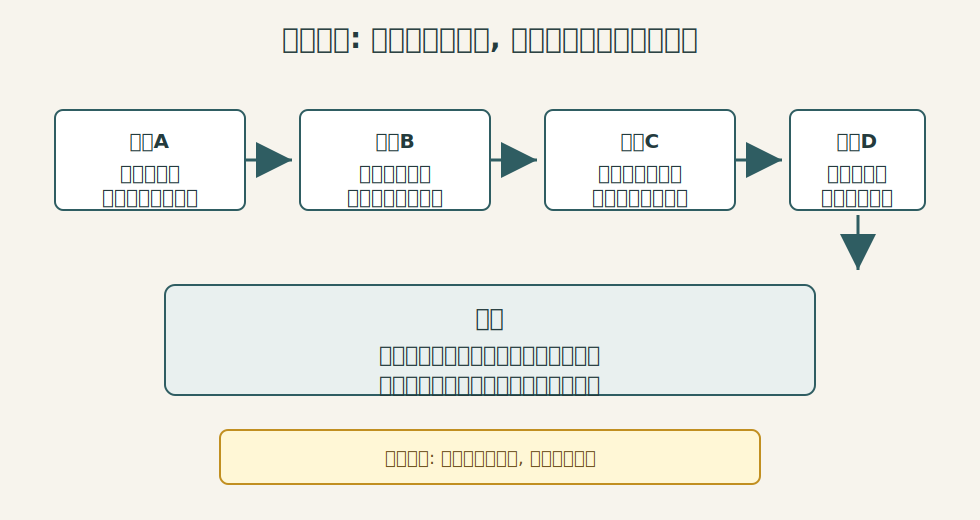
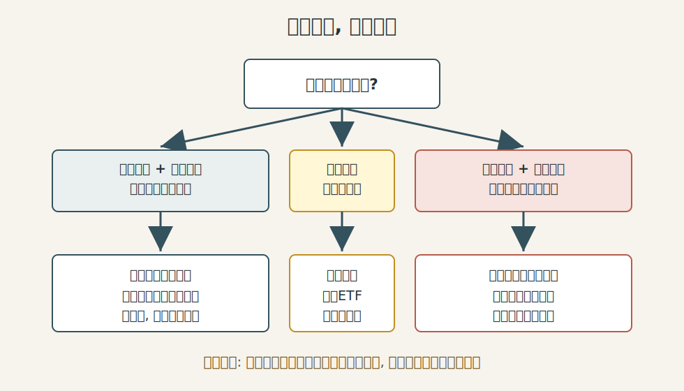
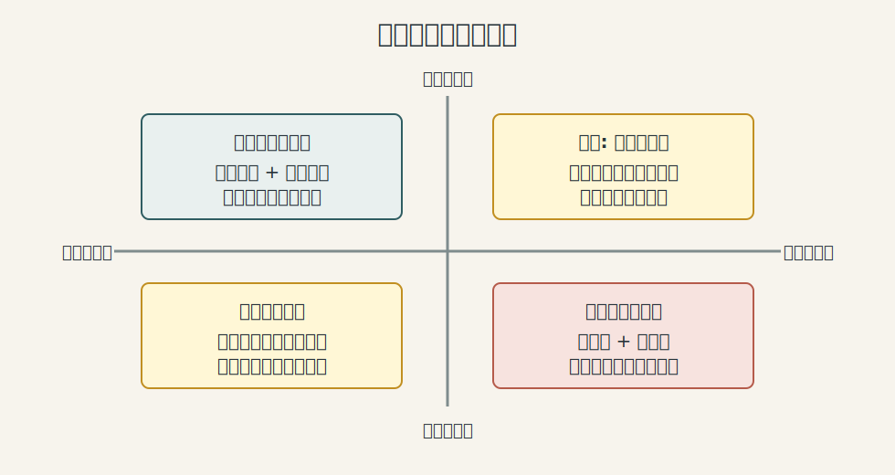
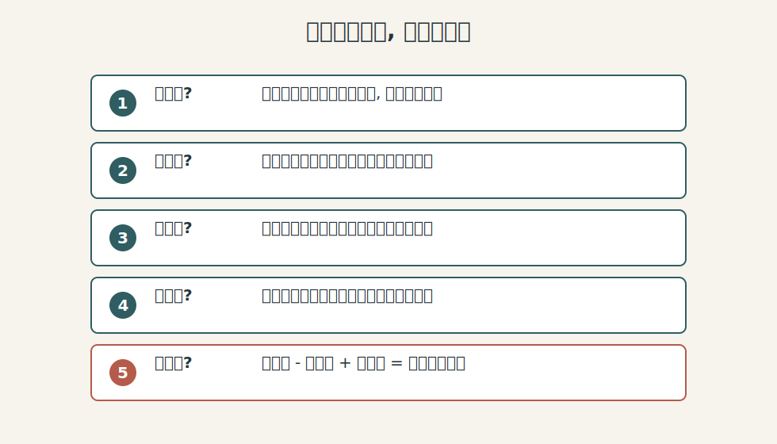

## 散户投资小白金融全品种操盘手册 - 7.3 实物黄金: 保管、买卖价差、流动性
  
### 作者  
digoal  
  
### 日期  
2026-06-06   
  
### 标签  
金融产品 , 金融工具 , 散户 , 投资小白 , 全品操盘手册  
  
----  
  
## 背景 
   

> 适用读者: 中国大陆投资小白、散户、想用黄金做防守资产但不熟悉实物交易成本的人。
> 本文定位: 投资教育框架, 不构成个性化投资建议。

## 一句话先懂

实物黄金不是“买了就等于无成本避险”, 它的核心问题是: 你拿到了金属本体, 同时也承担了保管、验真、买卖价差和变现流程。

## 核心观点

第七章前两节已经讲过: 黄金不生息, 它赚的不是利息、分红或企业利润, 而是市场对风险、货币信用、实际利率和通胀预期重新定价的钱。到了实物黄金这一节, 结论要再收紧一步: 实物黄金适合少量、长期、防守性持有, 不适合小白拿来短线交易。

原因很简单: 纸面金价涨跌只是第一层, 真正落到个人账户时, 你还要面对买入时的溢价、卖出时的回购扣减、鉴定检测、证书发票、保管安全和到账时间。金价涨 2%, 如果你的买卖摩擦、保管成本和时间成本超过 2%, 这笔交易在教育意义上就是“看对方向, 做错工具”。

## 逻辑推导链

先把几个词说清楚。实物黄金, 指你真正拿到或可提取的金条、金币、金章、首饰等黄金制品。买卖价差, 是你买入价和卖出回购价之间的差额。流动性, 不是“这个东西贵不贵”, 而是“你想卖时, 能不能以接近合理价格、在可接受时间内卖出去”。

本节的前提分三类: 第一, 黄金不生息, 这是常量; 第二, 实物需要保管、验真和交割, 这是慢变量, 只要你拿实物就绕不开; 第三, 渠道回购规则、价差和检测要求, 是关键变量, 不同银行、金店、平台、地区、时间都会变化。

1. 因为黄金本身不产生现金流 -> 所以你的收益主要来自未来卖出价高于真实买入总成本 -> 因此小白不能只看国际金价或上海金价, 必须先算“买入价 + 工费/溢价 + 保管成本”。

如果这个前提被推翻, 比如你买的是带收藏属性的纪念币, 那它就不再是单纯黄金投资, 而变成“黄金价格 + 题材溢价 + 收藏品流动性”的混合品。重新推导后, 你需要研究发行量、品相和收藏市场, 不能用普通金条逻辑判断。

2. 因为实物黄金离开账户后需要安全保管 -> 所以它天然多了一层防盗、防损、防调包和凭证保存问题 -> 因此小白若没有稳定保管条件, 实物比例就不能高。

世界黄金协会在黄金投资说明中提醒, 投资者购买实物黄金通常要承担高于现货价的溢价, 并自行处理交割、保管和保险问题。这条证据支撑的不是“实物黄金不好”, 而是说明实物工具的成本结构和 ETF、基金不同。

3. 因为零售渠道买卖黄金存在价差 -> 所以短线涨幅必须先覆盖价差才有真实利润 -> 因此实物黄金不适合用来追涨杀跌。

建设银行某分行的实物黄金回购说明提供了一个代表性案例: 回购要在指定时间、指定地点办理, 需要身份证、银行卡、实物和配套证书, 并经过重量和质量检验; 不同产品按基准价扣减不同金额结算。这里不能把某一网点规则当成全国统一规则, 但它清楚说明了一个机制: 实物黄金变现不是证券账户里点一下卖出, 而是“报价 + 检测 + 交割 + 到账”的流程。

4. 因为黄金市场整体很大、很活跃, 但个人手里的实物金条不等于机构市场里的标准金条 -> 所以“黄金有流动性”不等于“你手里的每一块黄金都随时高价好卖” -> 因此小白要区分宏观流动性和个人变现流动性。

世界黄金协会 2025 年资料显示, 黄金是全球规模大、交易活跃的资产; LBMA 的 Good Delivery 规则也说明机构市场重视精炼商、成色、编号、标记等标准。对小白的启发是: 越接近标准化、正规渠道、凭证完整的实物, 越容易被市场接受; 越偏首饰、纪念、工艺、非标准渠道, 越容易在回购时遇到折价和检测摩擦。

最后得到本节结论: 实物黄金可以作为防守资产的一小部分, 但它首先是“保管型资产”, 其次才是“交易型资产”。这条结论在三个边界下成立: 你有长期持有意愿, 有安全保管条件, 买入前确认过回购规则。如果其中任何一条不成立, 结论就要调整为: 优先研究黄金 ETF、黄金基金或银行积存类工具的规则, 而不是直接拿实物做短线交易。

## 适用边界

- 适合: 用小比例资金做长期防守、纪念或家庭应急储备, 并能接受买卖摩擦的人。
- 不适合: 短期要用的钱、想频繁做波段的钱、没有安全保管条件的钱、只因金价上涨而临时追进去的钱。
- 需要重新判断: 回购渠道变少、买卖价差扩大、保管条件变差、家庭现金流紧张、黄金仓位已经过高。

## 操作框架

第一步, 定目的。你买的是投资金条、纪念金币、首饰, 还是家庭礼赠? 如果是投资, 优先看标准化投资金条; 如果是首饰和纪念, 就不要幻想按投资金条逻辑回购。

第二步, 算总成本。记录当天基础金价、渠道卖出价、工费或溢价、未来回购规则、可能的检测扣减和保管费用。你真正的起跑线不是屏幕上的金价, 而是“未来卖出价超过总成本多少”。

第三步, 查回购。买之前就问清楚: 哪里回购、什么时间回购、是否只回购本渠道产品、证书发票丢失怎么办、外包装破损怎么办、到账方式是什么。

第四步, 定仓位。把实物黄金放在防守仓里, 而不是进攻仓里。它的角色是降低组合对单一货币、单一市场的依赖, 不是替你一夜翻身。

第五步, 留凭证。发票、证书、包装、编号、购买记录、保管位置都要记录。对实物资产来说, 凭证本身就是流动性的一部分。

## 实操例子

假设小李有一笔长期不用的家庭防守资金, 想买一部分实物黄金。他先看到金价上涨, 直觉是“赶紧买”。按本节框架, 他不能直接下单, 而要先做四个检查。

他发现某渠道投资金条买入价高于基础金价, 未来回购价又可能低于当日基准价; 如果短期只涨一小段, 可能刚好被价差吃掉。再看保管, 家里没有保险柜, 银行保管箱也有费用和取用时间限制。最后看目的, 他不是为了礼赠, 而是为了长期防守。重新推导后, 更合理的动作不是“马上重仓实物”, 而是: 若确实需要实物, 只买小比例、选择可回购渠道、保存完整凭证; 若主要是配置黄金价格风险暴露, 则把下一节的黄金 ETF 一起比较。

这个例子不是推荐任何产品, 而是示范: 同样看好黄金, 工具选择也会因为保管能力、价差和变现需求不同而改变。

## 常见错误

- 把首饰当投资金条: 首饰有工艺和品牌溢价, 回购时未必按你的购买价逻辑结算。
- 只看金价不看价差: 小涨小跌里, 价差可能比方向判断更重要。
- 以为有黄金就一定好卖: 个人实物变现要看成色、凭证、渠道、检测和报价。
- 涨了才想买很多: 防守资产一旦被当成暴富工具, 就容易变成追高。
- 凭证随手丢: 发票、证书、包装和编号缺失, 会削弱回购便利性。

## 执行清单

| 买入前问题 | 判断标准 |
|---|---|
| 我买的是投资金条、首饰还是纪念品? | 投资目的优先选择标准化、低工费、规则清楚的产品 |
| 买入价比基础金价高多少? | 把溢价、工费、手续费单独记下, 不混在“金价”里 |
| 未来哪里能回购? | 有明确网点、时间、证件、检测、扣减和到账规则 |
| 我能安全保管多久? | 家庭保管、银行保管箱或机构托管至少有一个方案 |
| 如果急用钱怎么办? | 不把短期生活钱放进实物黄金, 避免被迫折价卖出 |

## 本节小结

实物黄金最大的优点是“真实”, 最大的代价也来自“真实”: 它要保管, 要验真, 要交割, 要面对买卖价差。小白记住一句话: 实物黄金先算摩擦, 再谈避险; 先保命, 再赚钱。下一节讲黄金 ETF, 重点就是比较它如何降低保管和变现摩擦, 又会引入哪些新的基金风险。

## 参考资料

- 上海黄金交易所: 《黄金白银投资一点通》个人客户版, https://www.sge.com.cn/upload/resources/file/2014/09/24/28936.pdf
- World Gold Council: How to invest in gold, 访问日期 2026-06-06, https://www.gold.org/goldhub/how-to-invest
- World Gold Council: Gold as a strategic asset: 2025 edition - Liquidity, 2025-01-23, https://www.gold.org/goldhub/research/relevance-of-gold-as-a-strategic-asset/liquidity
- LBMA: Good Delivery Rules / Technical Specifications, 访问日期 2026-06-06, https://www.lbma.org.uk/publications/good-delivery-rules
- 中国建设银行宁波市分行: 实物黄金回购, 访问日期 2026-06-06, https://www.ccb.com/chn/home/gnfx/nb/ywtj/tsxyk/swhjhg/index.shtml
  
#### [PostgreSQL 解决方案集合](../201706/20170601_02.md "40cff096e9ed7122c512b35d8561d9c8")
  
  
#### [德哥 / digoal's Github - 公益是一辈子的事.](https://github.com/digoal/blog/blob/master/README.md "22709685feb7cab07d30f30387f0a9ae")
  
  
#### [About 德哥](https://github.com/digoal/blog/blob/master/me/readme.md "a37735981e7704886ffd590565582dd0")
  
  

  
