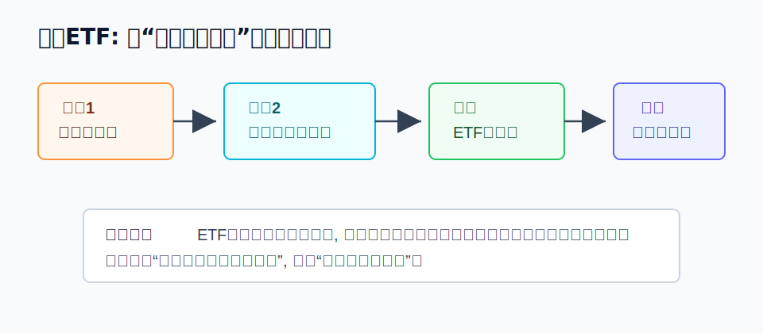
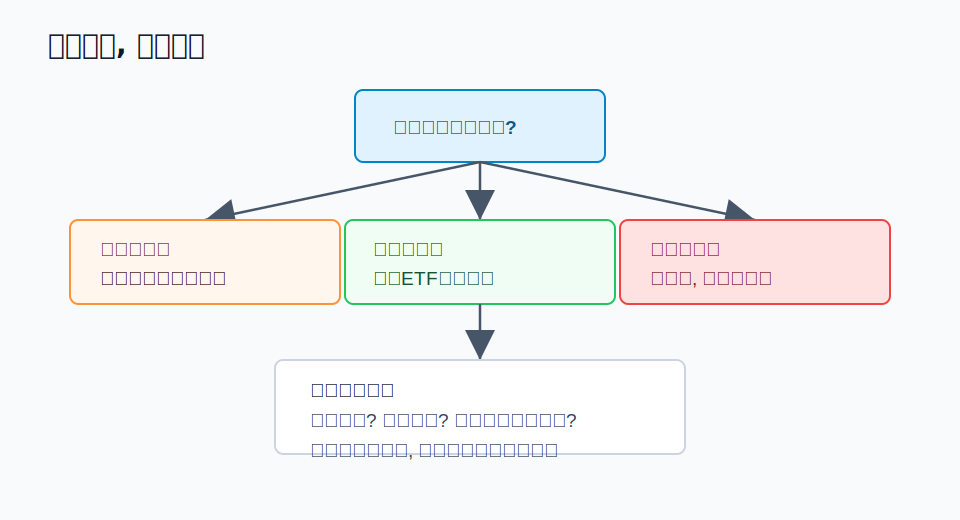
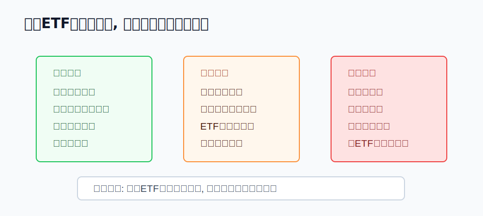
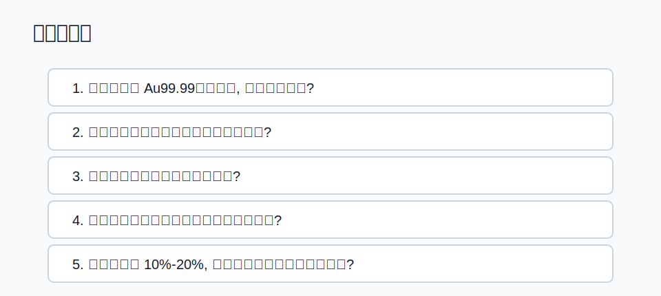

## 散户投资小白金融全品种操盘手册 - 7.4 黄金ETF: 小白最容易理解的黄金工具
  
### 作者  
digoal  
  
### 日期  
2026-06-06   
  
### 标签  
金融产品 , 金融工具 , 散户 , 投资小白 , 全品操盘手册  
  
----  
  
## 背景 
   

> 适用读者: 中国大陆投资小白、散户、想配置黄金但不想处理实物保管和回购流程的人。
> 本文定位: 投资教育框架, 不构成个性化投资建议。

## 一句话先懂

黄金ETF把“黄金价格暴露”放进证券账户, 让你不用搬金条、验成色、问回购, 也能参与黄金价格变化; 但它仍然会随金价波动, 不是保本工具。

## 核心观点

上一节讲实物黄金时, 重点是保管、买卖价差和变现流程。黄金ETF解决的正是这几个摩擦: 它把黄金现货合约做成基金份额, 放到证券交易所买卖, 小白更容易看价格、下单、止损、复盘。

但核心判断不能变: 黄金不生息, 黄金ETF也不生息。它适合作为小比例防守资产和黄金价格观察工具, 不适合被当成短线暴富工具。你买的不是“安全感”, 而是“黄金价格涨跌 + ETF交易机制 + 基金成本”的组合。

## 逻辑推导链

先解释几个词。黄金ETF, 是在证券交易所上市交易、主要跟踪国内黄金现货价格的开放式基金。基金净值, 是基金资产扣除费用后的每份价值。溢价折价, 是场内成交价高于或低于基金净值的差额。跟踪误差, 是ETF表现和目标金价之间的偏离。

本节的前提分三类: 第一, 黄金不产生利息、分红和企业利润, 这是常量; 第二, ETF通过基金和交易所规则降低实物保管摩擦, 这是慢变量; 第三, 溢价折价、成交量、买卖价差、基金费率和跟踪误差, 是关键变量, 会随产品和市场状态变化。

1. 因为黄金不生息 -> 所以黄金ETF的长期收益主要来自黄金价格上涨, 而不是现金流再投资 -> 因此小白不能用债券、货币基金或高股息资产的逻辑去看黄金ETF。

如果这个前提被推翻, 比如你买的其实是黄金股基金, 那收益来源就会变成“金价 + 矿企经营 + 股票估值”, 结论必须重推。黄金ETF的优点恰恰在于更接近黄金本身, 少掺入企业经营风险。

2. 因为实物黄金要保管、验真、回购和交割 -> 所以短线或中小金额投资时, 摩擦可能吃掉判断收益 -> 因此对多数小白来说, 想获得黄金价格暴露, 先研究黄金ETF比先买金条更容易。

中国证监会《黄金交易型开放式证券投资基金暂行规定》规定, 黄金ETF可以投资上海黄金交易所挂盘交易的黄金现货合约及证监会允许的其他品种。上海证券交易所业务指南也说明, 黄金ETF追踪国内黄金现货价格, 基础资产为上海黄金交易所黄金现货实盘合约, 并在交易所上市交易。这里支撑的机制是: 它不是平台虚拟积分, 而是有基金、交易所、登记结算和金交所合约支撑的标准化产品。

3. 因为ETF在证券账户里交易 -> 所以它比实物黄金更容易买卖、记录和复盘 -> 因此小白可以把它纳入统一操作模板: 环境判断、品种选择、仓位上限、买入条件、卖出条件、复盘。

但这个前提有边界。上交所黄金ETF业务指引提到, 当日买入的黄金ETF份额当日可以卖出; 申赎可以采用黄金现货合约或现金方式。对小白的意义不是鼓励日内交易, 而是说明工具流动性比实物更强。流动性越强, 越需要纪律, 否则“方便”会变成频繁追涨杀跌。

4. 因为ETF成交价会围绕净值波动 -> 所以你真正买入的成本不是金价本身, 还包括溢价折价、买卖价差、佣金、管理费和托管费 -> 因此买入前必须先看“价格有没有偏离净值”。

上海黄金交易所介绍, 我国黄金ETF主要有两类: 一类跟踪 Au99.99 现货实盘合约价格, 另一类跟踪上海金集中定价合约价格。上海黄金交易所 Au99.99 合约以人民币/克报价, 交易单位为10克/手, 交割品种为成色不低于99.99%的标准金锭。这些规则帮助你理解ETF背后的价格口径, 但不能保证场内成交价永远等于净值。若短期资金涌入导致高溢价, 重新推导后的结论就是: 方向看对也可能因为买贵而降低胜率。

5. 因为黄金价格受实际利率、美元、通胀预期、央行购金和风险偏好影响 -> 所以黄金ETF不是“只涨不跌”的避险按钮 -> 因此它更适合做组合里的防守模块, 不适合单品种重仓赌博。

世界黄金协会在黄金战略资产研究中强调, 黄金需求来源多元, 投资需求会受风险偏好、实际利率、货币走势和宏观环境影响。这支持了前两节的主线: 黄金赚的是风险重估的钱。当前提变化时, 结论也要变化: 如果实际利率上行、美元走强、市场风险偏好恢复, 黄金ETF的防守价值可能下降; 如果货币信用受疑、避险需求上升、实际利率下行, 它的配置价值才更容易提高。

最终结论是: 黄金ETF是小白理解黄金工具的优先入口, 因为它降低了实物摩擦, 保留了较纯粹的黄金价格暴露; 但它的安全边界来自小仓位、低溢价、可复盘和能承受波动, 而不是来自“黄金”两个字。

## 适用边界

- 适合: 想用证券账户配置少量黄金、防守组合、学习黄金价格机制的人。
- 不适合: 短期生活钱、借钱投资、追涨想暴富、不能承受净值回撤的人。
- 需要重新判断: ETF出现明显高溢价、成交量萎缩、跟踪误差扩大、黄金仓位超过原计划、宏观前提从避险转为强风险偏好。

## 操作框架

第一步, 定角色。你买黄金ETF是为了组合防守, 还是为了短线交易? 如果答案是短线暴富, 先暂停。

第二步, 看口径。确认它跟踪 Au99.99、上海金, 还是其他黄金价格口径。口径不同, 不能只看名字比较。

第三步, 查价格。买入前看基金净值、IOPV或行情软件里的溢价折价提示, 不在明显高溢价时冲动追入。

第四步, 定仓位。黄金ETF可以作为防守资产, 但防守资产也有上限。小白可以先用组合小比例练习, 不用一次买满。

第五步, 写退出条件。提前写清楚: 金价跌多少要复盘? 溢价扩大怎么办? 原本的实际利率、美元、避险前提变了怎么办?

## 实操例子

假设小陈想给自己的ETF组合加入黄金。他的第一反应是看哪个黄金ETF最近涨得最多。按本节框架, 这一步是错的, 因为涨得多只能说明过去价格变化, 不能说明现在适合你买。

他应该先问目的: 这笔钱是不是长期防守资金? 如果三个月后要用, 就不适合。再看口径: 这只ETF跟踪什么黄金价格? 再看交易: 成交额是否足够、买卖价差是否很窄、场内价格是否明显高于净值? 最后定仓位: 即使看好黄金, 也只把它放在防守仓的一部分。

如果之后金价上涨, 他复盘的是“前提是否继续成立”, 而不是幻想继续暴涨。如果金价下跌, 他检查的是实际利率、美元、风险偏好和仓位是否越界, 而不是靠补仓来证明自己没错。这个例子不是推荐任何基金, 只是示范如何把工具放进可执行流程。

## 常见错误

- 把黄金ETF当保本产品: 它交易方便, 但净值仍会随金价波动。
- 只看涨幅不看溢价: 买贵了, 方向看对也可能收益变差。
- 把ETF流动性当交易冲动: 当日可卖不等于应该频繁买卖。
- 忽略跟踪口径: Au99.99、上海金和海外金价不是完全相同的观察口径。
- 黄金仓位越涨越加: 防守资产一旦失去仓位纪律, 就变成进攻赌博。

## 执行清单

| 买入前问题 | 判断标准 |
|---|---|
| 它跟踪什么黄金价格口径? | 看基金资料概要、招募说明书或交易所说明, 不只看简称 |
| 场内价格是否明显偏离净值? | 溢价过高时先暂停, 等价格回到合理区间再评估 |
| 成交是否足够顺畅? | 成交额较低、买卖价差较宽时降低仓位或避开 |
| 总成本是否清楚? | 同时考虑管理费、托管费、佣金、买卖价差和跟踪误差 |
| 仓位是否有上限? | 黄金ETF只做组合一部分, 不替代现金和核心宽基资产 |

## 本节小结

黄金ETF的价值不是让你更大胆, 而是让你用更标准化、更低摩擦的方式学习黄金。它降低了保管和变现问题, 但保留了金价波动和产品交易风险。先保命, 再赚钱: 小白先把仓位、溢价和退出条件写清楚, 再谈是否参与。

下一节会比较黄金基金、黄金股和黄金ETF的区别: 同样名字里有“黄金”, 买到的风险可能完全不同。

## 参考资料

- 中国证监会: 《黄金交易型开放式证券投资基金暂行规定》, 2013-01-25, https://www.csrc.gov.cn/csrc/c100028/c1002350/content.shtml
- 上海证券交易所: 《上海证券交易所黄金交易型开放式证券投资基金业务指引》, 访问日期 2026-06-06, https://www.sse.com.cn/lawandrules/sselawsrules2025/fund/trading/c/c_20250519_10779388.shtml
- 上海证券交易所: 《上海证券交易所黄金交易型开放式证券投资基金业务指南》, 访问日期 2026-06-06, https://www.sse.com.cn/assortment/fund/etf/rules/c/c_20150911_3985190.shtml
- 上海黄金交易所: 黄金ETF产品介绍, 访问日期 2026-06-06, https://sge.com.cn/h5_cpfw/hjetf
- 上海黄金交易所: Au99.99 现货实盘合约参数, 访问日期 2026-06-06, https://www.sge.com.cn/h5_cpfw/xhsph_xq?cplx=7&parent_cplx=0&pro_id=793730879941324800
- World Gold Council: Gold Market Primer: Market size and structure, 访问日期 2026-06-06, https://www.gold.org/goldhub/research/market-primer/gold-market-primer-market-size-and-structure
  
#### [PostgreSQL 解决方案集合](../201706/20170601_02.md "40cff096e9ed7122c512b35d8561d9c8")
  
  
#### [德哥 / digoal's Github - 公益是一辈子的事.](https://github.com/digoal/blog/blob/master/README.md "22709685feb7cab07d30f30387f0a9ae")
  
  
#### [About 德哥](https://github.com/digoal/blog/blob/master/me/readme.md "a37735981e7704886ffd590565582dd0")
  
  

  
