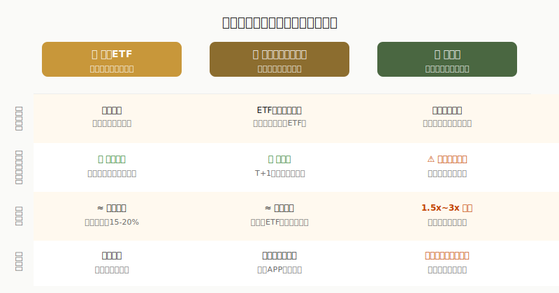
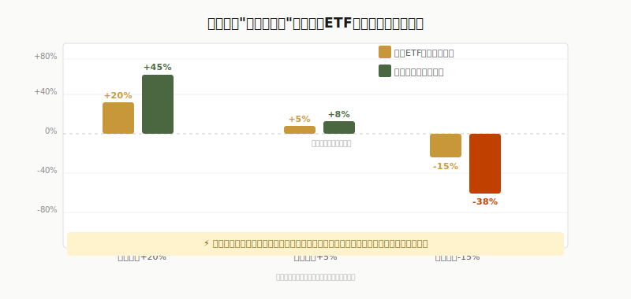
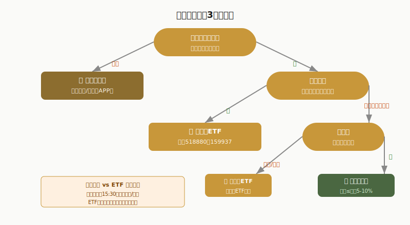

## 散户投资小白金融全品种操盘手册 - 7.5 黄金基金、黄金股、黄金ETF的区别
  
### 作者  
digoal  
  
### 日期  
2026-06-06   
  
### 标签  
金融产品 , 金融工具 , 散户 , 投资小白 , 全品操盘手册  
  
----  
  
## 背景 
    


---

## 先问你一个问题

买了"黄金基金"，金价涨了20%，为什么你的基金只涨了18%？  
买了"黄金股"，金价涨了20%，为什么你的股票涨了80%？  
——同样是"买黄金"，这三种工具是完全不同的东西。

很多人亏钱，不是因为方向看错了，而是买错了工具。金价涨了，结果自己持仓的黄金股票因为矿企经营问题跌了；或者看好黄金短期波动，结果买的是场外基金，当天没法卖出去。

这节课，我们把三件工具摆在一起拆开来看：**黄金ETF、黄金基金（场外联接）、黄金股**，搞清楚你到底买的是什么，该在什么情况下用哪把刀。

---



---

## 第一件：黄金ETF——最透明的工具

### 它到底是什么

黄金ETF（交易型开放式指数基金），在证券账户里像股票一样交易。你买入1手，基金公司背后就持有等值的实物黄金（存在上海黄金交易所认可的金库里）。

你买的不是黄金，而是**代表黄金所有权的基金份额**——但这个份额和黄金价格是高度挂钩的，几乎1:1联动。

### 以最大的两只为例

- **华安黄金ETF（518880）**：规模约940亿元（2025年末数据），费率0.5%/年，流动性好，日均成交6亿元以上，是机构和普通投资者的首选  
- **博时黄金ETF（159937）**：规模约279亿元，费率0.5%/年，历史回撤控制较好  

中国黄金ETF市场整体规模已突破2000亿元，2025年上半年新增资金超793亿元——这个体量说明，这已经是一个流动性充分的成熟市场，不用担心买不到或卖不掉。

### 核心特性

| 维度 | 说明 |
|------|------|
| 最低起投 | 1手（100份）≈ 约十几元，门槛极低 |
| 交易时间 | A股交易时段（9:30-11:30，13:00-15:00）可随时买卖 |
| 价格跟踪 | 高度跟踪上海黄金交易所基准金价 |
| 费率 | 管理费0.5%/年 + 托管费0.1%/年 |
| 分红 | 几乎不分红（黄金本身无利息） |

### 小白视角的一句话理解

> 黄金ETF = 你买了一张"黄金仓单"，金价涨多少你赚多少，金价跌多少你亏多少。不涉及任何矿企经营风险。

---

## 第二件：黄金基金（场外联接）——没有证券账户时的替代方案

### 它到底是什么

黄金基金在这里特指**场外黄金联接基金**——在支付宝、天天基金、微信基金等APP上能买到的那种。

它的运作逻辑是：你把钱给基金公司，基金公司用你的钱去买黄金ETF（比如买518880）。也就是说，**你不是直接持有黄金ETF，而是通过基金间接持有**。

### 和ETF相比有什么区别

**最核心的区别在于交易机制：**

- 黄金ETF：当天交易时间内随时可买卖，实时成交
- 黄金基金（场外）：每个工作日下午15:30截止申购，按当日结束净值确认，次日到账（T+1）

举个例子：周一上午金价大涨，你看到消息想买入——  
- 如果你有证券账户，打开APP买ETF，立即成交，拿到涨价后的份额  
- 如果你只有基金账户，你的申购会按当天15:30后的净值确认，今晚结束价格计入，明天才显示持仓  

这在金价快速波动的行情里，可能造成1-2%的滑点（成交价格和你预期价格的差距）。

### 什么时候用场外黄金基金

只有一种情况：**你没有证券账户，且暂时不想开**。用基金APP做黄金定投，省事、便利，适合长期慢慢买的逻辑。

---

## 第三件：黄金股——和黄金相关，但本质是股票

### 它到底是什么

黄金股是**挖矿、炼金、销售黄金的上市公司股票**，比如山东黄金（600547）、中金黄金（600489）、赤峰黄金（600988）、紫金矿业（601899，综合矿企）。

**你买黄金股，买的不是黄金，而是矿企的股权。**  
你的收益来自：
1. 金价上涨 → 矿企利润增加 → 股价上涨  
2. 矿企自身经营改善 → 产量扩大、成本下降 → 盈利提升  
3. 市场对矿企的估值提升（PE扩张）

这三个因素叠加，才是黄金股表现出来的收益。

### 放大器效应：好时超额跑赢，差时惨烈跑输

这是黄金股最重要的特征，也是很多人不理解的地方。

黄金股对金价的弹性，来自**矿企的经营杠杆**：

- 矿企每年有固定成本（人工、设备、矿权费）。假设开采成本是1500美元/盎司
- 金价1600美元时，利润 = 100美元/盎司
- 金价1800美元时，利润 = 300美元/盎司——金价涨了12.5%，**利润涨了200%**

这就是矿企天然自带的"经营杠杆"。金价涨幅越大，利润放大倍数越高。

**历史数据佐证：**

2025年黄金大牛市中，伦敦金涨幅全年超60%。与此同时，A股黄金股指数整体上涨超过一倍——多个黄金股的涨幅达到2-3倍（招金矿业自2023年黄金牛市启动以来股价累计涨超270%，赤峰黄金、西部黄金等涨幅更是超过200%）。（数据来源：36氪，2026年4月）

但反过来，金价横盘或下跌时，矿企利润被快速压缩，黄金股的跌幅也会比金价更大。金价跌10%，矿企利润可能跌30%，股价可能跌40%。

---



---

### 黄金股有哪些额外风险

黄金股的风险，不只是金价本身的风险，还叠加了：

1. **经营风险**：矿山安全事故、矿权纠纷、环保停产  
2. **管理层风险**：并购决策失误、资本运作踩坑  
3. **成本风险**：能源价格上涨导致开采成本飙升  
4. **信用评级风险**：部分小矿企负债率高，金价下跌时流动性紧张  
5. **个股分化剧烈**：同样是黄金牛市，招金黄金因为非经常性损益甚至出现亏损，而赤峰黄金利润增速高达291%（Wind数据，2022-2024年）

这意味着：**买黄金股，你必须研究公司，不能只看金价**。买错公司，可能金价涨了你却亏钱。

---

## 第一性原理分析：三种工具的核心逻辑差异

```
【前提清单】

支撑"黄金ETF是小白首选黄金工具"成立的前提：

- 前提A：ETF和金价高度联动，买ETF ≈ 买黄金 → 【常量】→ 由持仓为实物金保证，长期稳定
- 前提B：散户不需要研究矿企基本面，降低了认知门槛 → 【常量】→ 只要黄金本身的逻辑成立即可
- 前提C：市场流动性充足，随时可以买卖 → 【变量】→ 极端行情下可能有短暂折溢价

支撑"黄金股可能超额跑赢"的前提：

- 前提A：金价持续上涨，且涨幅足够大（>10%） → 【变量】→ 如果金价涨幅小或横盘，矿企利润弹性消失
- 前提B：具体公司经营稳定，没有重大风险事项 → 【变量】→ 单个公司可能因非市场因素出现亏损
- 前提C：市场给矿企较高的估值（PE扩张） → 【变量】→ 情绪退潮时即便业绩好，估值也可能下滑

【情景推演】

正常情景（金价大涨+企业经营正常）：黄金股超额跑赢 ETF，涨幅1.5x~3x
压力情景（金价横盘+矿企出现经营问题）：黄金股大幅跑输ETF，可能录得亏损
极端情景（金价大跌+矿企高杠杆）：黄金股腰斩甚至更深，ETF跌幅仅=金价跌幅

→ 对应操作调整：一旦金价涨幅明显放缓，黄金股应降低仓位
→ 对应操作调整：任何情景下，ETF都是更安全的黄金敞口工具
```

---

## 实操例子：同样10000元，三种买法

**场景假设**：小明有10000元闲钱，看好2026年黄金继续上涨，想参与黄金行情。

---

**买法一：黄金ETF（推荐）**

第一步：打开证券账户 → 搜索518880或159937  
第二步：查看当前价格（假设10.6元/份），10000元约可买942份≈9手  
第三步：以市价委托或限价委托挂单，当天即时成交  
第四步：设定止损线（比如金价跌破关键支撑位时减仓），定期复盘  

若金价上涨20%：持仓约涨至约11960元，收益约1960元（扣除费率约0.6%/年，实际略低）  
若金价下跌10%：持仓跌至约8960元，亏损约1040元  

**风险提示**：亏损就是亏损，没有神奇的保底。但这个工具本身不会比金价跌更多。

---

**买法二：场外黄金基金（无证券账户时）**

第一步：打开支付宝基金 → 搜索"黄金ETF联接"  
第二步：选择华安黄金ETF联接A（各平台均有）  
第三步：申购10000元，注意：今天下午3:30前申购 → 按今日净值确认 → 明天到账  
第四步：赎回时同样需要T+1，到账后才能使用资金  

注意：**场外基金做定投是合理的，但追短期行情时，时间差是硬伤。**

---

**买法三：黄金股（需做功课）**

第一步：研究个股基本面。看近3年财报：营收、归母净利润、吨金成本、储量、矿权年限  
第二步：评估估值。当前PE是否合理？与历史均值相比高了还是低了？  
第三步：严格设仓位上限。建议单只黄金股仓位不超过总仓位5%  
第四步：金价进入上涨趋势确认后再布局，不在金价高位追买  

若操作错误（只看金价涨就买入，不研究个股）：可能遭遇"金价涨了，手里这只黄金股却跌了"的困境  
如何纠偏：发现公司经营出现异常（利润增速明显低于行业、负债率突然飙升），立即减仓，不要抱侥幸心理

---

## 如何选择：你的决策树



---

## 一个常见的坑：黄金股ETF≠黄金ETF

市场上还有一类产品叫**黄金股ETF**（比如永赢中证沪深港黄金产业ETF），注意和黄金ETF的区别：

- **黄金ETF（518880等）**：持有的是实物黄金，跟踪的是金价本身
- **黄金股ETF**：持有的是一篮子黄金矿企股票（中金黄金、山东黄金等），跟踪的是黄金股指数

黄金股ETF的波动远大于黄金ETF。数据显示，2025年上半年，黄金股ETF的波动率约为28%，远高于黄金ETF的15%左右。高弹性意味着高波动，不是小白稳健参与黄金的首选。（数据来源：中华网黄金ETF专题，2025年11月）

---

## 可复用框架

```
【工具穿透框架】

适用场景：任何投资品"套了一层包装"时，先搞清楚包装里面是什么

核心逻辑：
  任何金融工具都有两层：外壳（产品形式）和内核（实际持仓）
  外壳决定交易规则（什么时候能买卖、怎么计费）
  内核决定收益和风险（真正赚谁的钱、赔谁的钱）

操作步骤：
  1. 问：这个工具背后实际持有的是什么？（实物黄金？ETF份额？公司股权？）
  2. 问：这个工具的交易规则是什么？（可以随时买卖还是有延时？有赎回费吗？）
  3. 问：这个工具的收益来源有哪些？除了金价还叠加了哪些变量？（矿企经营？汇率？）
  4. 确认三层后，再决定是否符合你的需求

举一反三：
  这个框架适用于所有"打了包"的金融产品——
  债券基金（内核是债券）、行业ETF（内核是成分股）、QDII（内核是海外资产）
  任何时候，先穿透到内核，再做决策
```

---

```
【杠杆辨别框架】

适用场景：判断一个工具是否比目标资产本身波动更大

核心逻辑：
  矿企天然自带经营杠杆（固定成本导致利润弹性远大于收入弹性）
  这种杠杆在金价大涨时是礼物，在金价横盘/下跌时是炸弹

操作步骤：
  1. 计算矿企的成本结构：吨金成本是多少？利润率在金价不同位置如何变化？
  2. 历史对比：该股票最近一轮金价大跌时，跌幅是金价跌幅的几倍？
  3. 据此推断当前隐含杠杆倍数，决定是否值得承受

举一反三：
  这个框架同样适用于能源股（油价上涨时炼厂利润爆发）、航运股（运价上涨时利润弹性极大）
  所有有固定成本的周期行业，都有类似的经营杠杆效应
```

---

## 本节行动清单

- [ ] **确认自己的账户类型**：只有基金账户 → 用场外黄金联接基金定投；有证券账户 → 优先用黄金ETF
- [ ] **如果用ETF**：查询518880或159937的最新价格和规模，在证券APP中以限价单买入，避免市价单被高价成交
- [ ] **如果想买黄金股**：先做功课，找1-2只主流黄金股（山东黄金、中金黄金、赤峰黄金），查最近2年的归母净利润增速和吨金成本，再决定是否值得进
- [ ] **明确仓位上限**：单只黄金股不超过总仓位5%；黄金板块整体（含ETF）不超过总仓位20%
- [ ] **设好止损条件**：预先写下"金价跌破____或公司业绩出现____时，我要减仓"，不要等亏了再想

---

## 一句话总结

黄金ETF买的是金价，场外黄金基金是买ETF的间接通道，黄金股买的是矿企+金价的双重杠杆——工具不同，风险和收益的来源完全不一样，先搞清楚你买的是什么，再谈赚不赚钱。

---

> ⚠️ **声明**：本文内容为投资教育目的，所有历史数据、策略框架均为辅助学习工具，不构成证券投资建议。市场有风险，投资需谨慎。实际操作请结合自身风险承受能力，必要时咨询专业投顾。历史数据不代表未来表现。
  
  
#### [PostgreSQL 解决方案集合](../201706/20170601_02.md "40cff096e9ed7122c512b35d8561d9c8")
  
  
#### [德哥 / digoal's Github - 公益是一辈子的事.](https://github.com/digoal/blog/blob/master/README.md "22709685feb7cab07d30f30387f0a9ae")
  
  
#### [About 德哥](https://github.com/digoal/blog/blob/master/me/readme.md "a37735981e7704886ffd590565582dd0")
  
  

  
