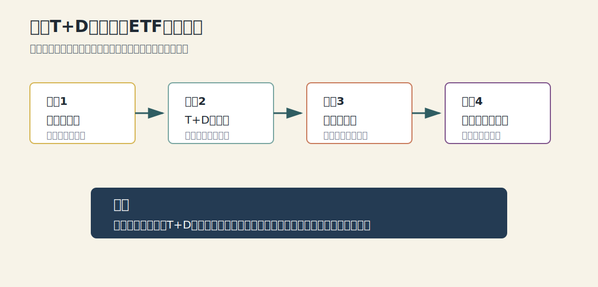
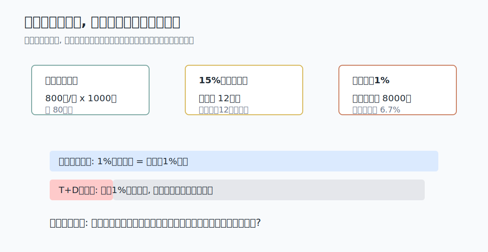
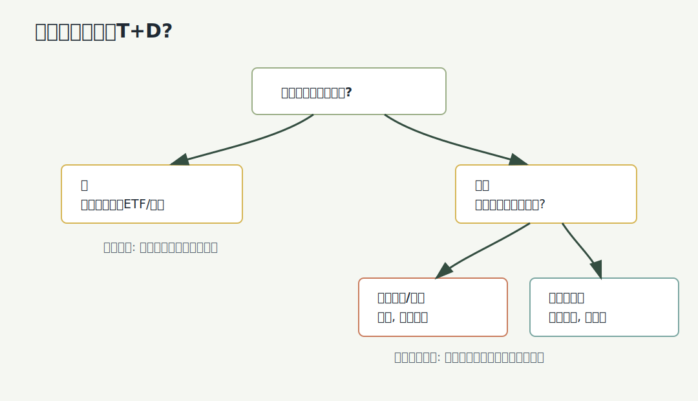
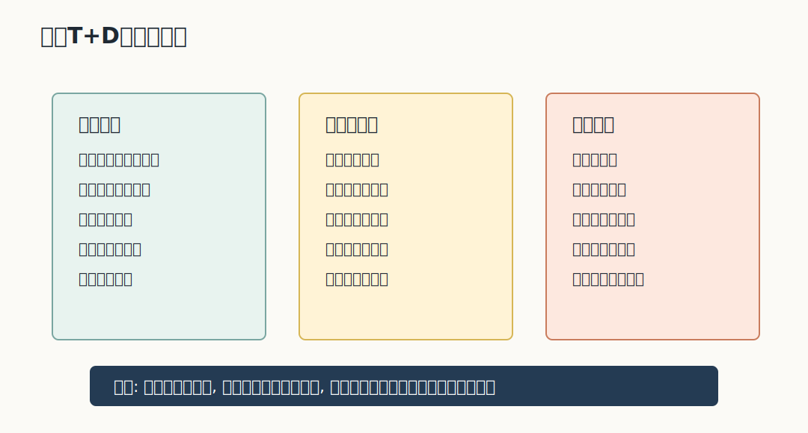

## 散户投资小白金融全品种操盘手册 - 7.6 黄金T+D: 杠杆、保证金、延期费, 为什么不适合作为小白默认工具
  
### 作者  
digoal  
  
### 日期  
2026-06-06   
  
### 标签  
金融产品 , 金融工具 , 散户 , 投资小白 , 全品操盘手册  
  
----  
  
## 背景 
   

> 适用读者: 中国大陆投资小白、散户、已理解实物黄金和黄金ETF, 但对黄金T+D规则不熟的人。
> 本文定位: 投资教育框架, 不构成个性化投资建议。

## 一句话先懂

黄金T+D不是“更高级的黄金投资”, 而是带保证金、延期费、夜盘和强平风险的延期交易工具; 小白默认先学规则, 不把它当黄金配置入口。

## 核心观点

第7章前面几节已经把黄金拆开: 实物黄金解决“拿到金属”的问题, 黄金ETF解决“低摩擦获得金价暴露”的问题。黄金T+D解决的不是配置便利, 而是延期交收和保证金交易。它让你用较少保证金参与较大名义金额的黄金合约, 同时把价格波动、追缴保证金、强行平仓、延期费和夜盘情绪一起带进来。

所以本节的核心判断很硬: 对小白, 黄金T+D不应作为默认工具。你若只是想配置黄金, 先研究黄金ETF、黄金基金和小比例实物; 只有当你能把保证金、延期费、持仓方向、止损和强平规则说清楚时, 才能把黄金T+D当作“风险教育样本”。

## 逻辑推导链

先把词翻译成人话。T+D里的“T”可以理解为交易日,“D”可以理解为延期。黄金T+D是上海黄金交易所的黄金延期合约, 投资者可以当天买卖, 也可以延期交收。保证金, 是你不用一次付出全部合约价值, 只先交一部分钱作为履约担保。延期费, 是多空双方因延期交收产生的补偿费, 不是固定收益, 方向和金额会随规则与市场状态变化。

本节前提分三类: 黄金不生息, 这是常量; 保证金交易会放大盈亏, 这是慢变量; 保证金比例、涨跌停板、延期费率、交易时间和会员风控要求, 是关键变量, 会被交易所、会员或银行调整。

1. 因为黄金本身不产生利息和分红 -> 所以黄金工具的收益主要来自金价变化 -> 因此小白首先要问“我需要的是金价暴露, 还是保证金交易能力”。

如果只是要金价暴露, 这条链在这里就已经给出结论: 黄金ETF通常更直接。若你选择T+D, 说明你不是单纯买黄金, 而是在叠加杠杆和交易规则。

2. 因为T+D采用保证金交易 -> 所以你看到的本金占用小, 不代表真实风险小 -> 因此“买得起一手”不等于“扛得住一手”。

上海黄金交易所Au(T+D)当前合约页面显示, 交易单位为1000克/手, 报价单位为元/克; 交易所2026年5月29日公告显示, Au(T+D)等合约保证金比例调整为15%, 涨跌停板调整为14%。这些数字不是让小白照抄下单, 而是用来说明机制: 如果金价按800元/克举例, 一手名义金额约80万元, 15%保证金约12万元; 金价反向波动1%, 名义亏损约8000元, 对12万元保证金的冲击约6.7%。同样的1%金价波动, 在保证金账户里变得更刺眼。

3. 因为保证金账户要维持履约能力 -> 所以价格反向、保证金比例上调或会员风控收紧时, 你可能需要追加资金 -> 因此小白不能用短期生活钱、借来的钱或满仓思维做T+D。

如果这个前提被推翻, 比如你误以为最大亏损只是已经交的保证金, 重新推导后的结论就是: 你还没理解这个工具, 应停止实盘。保证金不是“便宜买黄金”, 而是“用较少自有资金承担较大名义金额的波动”。

4. 因为T+D可以延期持仓 -> 所以延期费会影响持仓成本 -> 因此你不能只看金价方向, 还要看持仓期间的资金占用和费用方向。

上海黄金交易所现货交易规则说明, 延期补偿费按自然日逐日收付, 可根据市场情况调整合约延期费率。对小白来说, 这条规则支撑的是边界判断: 如果你连“今天延期费由谁付给谁、费率是多少、连续持有会怎样影响成本”都说不清, 就不该把T+D当普通黄金持仓。

5. 因为黄金T+D有日盘和夜盘 -> 所以它更容易让投资者在情绪疲劳时做决定 -> 因此交易纪律比方向判断更重要。

上海黄金交易所当前Au(T+D)页面列明日间和夜间交易时段。夜盘本身不是错误, 但它会放大小白的两个弱点: 一是盯盘上头, 二是亏损后想马上扳回。若你发现夜盘影响睡眠、工作和复盘, 这不是“小问题”, 而是适当性已经不匹配。

最终结论是: 黄金T+D的本质不是“黄金 + 安全”, 而是“黄金价格 + 保证金杠杆 + 延期费用 + 交易纪律”。只有在你能承受合约规则变化、保证金追加、费用不利和价格反向同时出现时, 它才可能成为学习对象; 对多数小白, 它不是配置起点, 更不是重仓工具。

## 适用边界

- 适合: 已系统学习保证金交易、能读懂交易所和会员规则、能预留追加保证金、只用小资金做规则学习的人。
- 不适合: 只想配置黄金、短期要用钱、借钱投资、不能盯风险通知、不懂强平规则、容易在夜盘情绪交易的人。
- 需要重新判断: 保证金比例上调、涨跌停板变化、延期费连续不利、金价与原前提相反、账户资金不足、持仓影响正常生活。

## 操作框架

第一步, 定目的。你若只是想让组合里有黄金, 先比较黄金ETF、黄金基金和实物黄金; 你若想学T+D, 目标应写成“学习保证金规则”, 不是“快速赚钱”。

第二步, 查当天规则。下单前必须查交易所合约参数、保证金比例、涨跌停板、交易时段、延期费率, 还要查你的银行或会员是否有更高保证金和额外风控要求。

第三步, 算最坏情形。不要只算“涨了赚多少”, 要算反向波动1%、3%、5%时保证金还够不够, 是否会触发追加资金, 家庭现金流是否会被影响。

第四步, 写退出条件。提前写清楚价格反向多少减仓、保证金占用达到多少停止、延期费连续不利时是否退出、夜盘影响生活时是否暂停。

第五步, 复盘规则而非情绪。每次交易后记录: 规则是否查清、仓位是否越界、亏损是否来自方向错误还是杠杆过大。先保命, 再赚钱。

## 实操例子

假设小周看好黄金, 看到T+D保证金比例后觉得“同样的钱可以买更大金额”。按本节框架, 他不能把这理解为机会, 要先把它翻译成风险: 如果一手名义金额约80万元, 保证金约12万元, 那么金价反向1%就可能带来约8000元名义亏损, 这不是ETF账户里的普通小波动。

他继续检查延期费和交易时间, 发现自己晚上容易盯盘, 白天还要工作, 也没有预留追加保证金。重新推导后, 更合理的结论是: 若只是配置黄金, 不用T+D; 若只是学习规则, 先用模拟或极小资金理解合约, 并把亏损上限写死。这个例子不推荐任何交易, 只示范如何把“看好黄金”拆成“工具是否适合我”。

## 常见错误

- 把保证金当优惠: 少交钱不是少承担风险, 而是用小本金承受大名义金额波动。
- 只看金价不看延期费: 持仓成本会改变交易结果, 尤其在长期拖延时。
- 不懂强平还实盘: 规则没看懂就交易, 本质是在用本金交学费。
- 用生活钱补保证金: 一旦市场反向, 投资问题会变成现金流问题。
- 夜盘情绪交易: 困倦、焦虑和亏损后的急躁, 都会破坏原计划。

## 执行清单

| 买入前问题 | 判断标准 |
|---|---|
| 我买T+D是为配置黄金还是学习保证金交易? | 配置黄金优先比较ETF/基金; 学规则才继续往下看 |
| 今日合约参数和会员规则查了吗? | 保证金、涨跌停板、延期费、交易时间、强平规则都要有记录 |
| 反向波动后保证金还够吗? | 至少测算1%、3%、5%反向波动, 不用生活钱补仓 |
| 延期费方向和持仓成本清楚吗? | 说不清谁付费、费率多少、连续持有影响, 就不实盘 |
| 退出条件写好了吗? | 价格、保证金占用、延期费、夜盘影响生活都要有停止条件 |

## 本节小结

黄金T+D最值得小白学习的地方, 不是“怎么用杠杆赚钱”, 而是理解杠杆如何把普通金价波动变成账户生存问题。黄金可以做防守资产, 但带保证金的黄金不等于防守。下一节讲白银, 逻辑会继续推进: 当一个品种弹性更大时, 赚钱想象和风险边界会同时放大。

## 参考资料

- 上海黄金交易所: Au(T+D)合约参数, 访问日期 2026-06-06, https://www.sge.com.cn/h5_cpfw/xhsph_xq?cplx=3&parent_cplx=0&pro_id=793739947590758400
- 上海黄金交易所: 《关于调整部分合约保证金比例和涨跌停板的通知》, 2026-05-29, https://www.sge.com.cn/tzgg/1213815
- 上海黄金交易所: 《上海黄金交易所现货交易规则》, 2025-12-31, https://www.sge.com.cn/jysjygz/1212409
- 上海黄金交易所: 《上海黄金交易所竞价交易细则》, 2023-07-24, https://www.sge.com.cn/jysjygz/1068414
- 中国银行: 《上海黄金交易所竞价交易个人业务产品介绍及交易规则》, 2020-12, https://www.boc.cn/pbservice/pb10/202012/P020210520652666638236.pdf
  
#### [PostgreSQL 解决方案集合](../201706/20170601_02.md "40cff096e9ed7122c512b35d8561d9c8")
  
  
#### [德哥 / digoal's Github - 公益是一辈子的事.](https://github.com/digoal/blog/blob/master/README.md "22709685feb7cab07d30f30387f0a9ae")
  
  
#### [About 德哥](https://github.com/digoal/blog/blob/master/me/readme.md "a37735981e7704886ffd590565582dd0")
  
  

  
